# Active Hot Parameters

This application measures the optimum Gamma that provides the maximum
delivered power for nonlinear devices. Unlike classic S-parameters, which
capture only linear device behavior and ignore nonlinear behavior, X-parameter
terms (Xf, Xs, Xt) are used to predict the Gamma that yields the optimum power
delivered to a load from a nearly matched device under large-signal drive and
thus define the nonlinear behavior of the DUT.

The X-parameter terms assume the following:

  * Fundamental frequency (harmonics ignored)
  * Amplifier is nearly matched to 50 ohms. The spectrally linearized X-parameters (Xs and Xt terms) are sufficient for characterizing the effects of incident A2 waves while the nonlinear component is driven with a large A1 signal at the input port.

In this topic:

  * Features and Requirements
  * Measurement Parameters
  * How to Make Active Parameter Measurements
  *     * Create an Active Parameter Channel
    * Active Parameter Sweep tab
    * Active Parameter RF Path tab
    * Active Parameter X-axis tab
    * Active Parameter Analysis dialog
  * Accessing Measurement Parameters
  * Calibrating an Active Parameter Channel
  * Saving Data

### Features and Requirements

#### Features

  * Proper corrections for matched amplifiers operating in nonlinear (Compression, Saturation) region by using fundamental X-Parameters measurements (XS, XT, XF) of the DUT.

  * Ensures system-to-system correlation across different test stands.

  * Provides fast measurements of the Hot S22, Hot S21 of the DUT.

  * Easy calibration and measurement setup. Comb generator is not needed for calibration.

  * Provides measurements of the optimum match for maximum delivered power and the value of the maximum power, as well as, power delivered to 50 ohms.

  * Uses X-parameter technology to solve the non-linear X-parameter equation (restricted to 50 GHz for option S9x111A/B):   
  
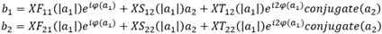  
  
For option S93111A/B, characterization above 50 GHz uses active source
injection at device input and output to solve the traditional linear
S-parameter equation:  
  
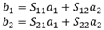

#### Requirements

  * Active Hot Parameter software for “B” model PNA-X (N524xB)

    * S93110A/B, Active Hot Parameters

    * S93111A/B, Active Hot Parameters, restricted to 50 GHz

  * 4-Port PNA-X with 2 sources

## Measurement Parameters

  * **IPwr ,** Input power - incident power (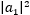).
  * **OPwr ,** Output Power - output power delivered into Z0.
  * **HotS11** , Active input match (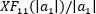).
  * **HotS21 ,** Active Gain – Non-linear gain measured in Z0 (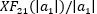).
  * **HotS12 ,** Active Reverse Isolation (XS12).
  * **HotS22 ,** Active Output Match – Conjugate of the optimum load, Gamma.
  * **Gamma** , Optimum load for maximum delivered power**.**
  * **Pmax** , Maximum delivered power.
  * **Xs(2,2) ,** Direct Reflection Coefficient. The fundamental XS22 parameter which is used, in combination with XT22, to describe the change in b2 as a function of a2, the signal reflected from the load.
  * **Xt(2,2) ,** Direct Reflection Coefficient. The fundamental XT22 parameter which is used, in combination with XS22 to describe the change in b2 as a function of a2, the signal reflected from the load.
  * **Xf(2,1) ,** Output Coefficient. The fundamental XF21 parameter.
  * **DeltaOPwr ,** Delta between the output wave and output power to Z0 load.
  * **Option S9x111A/B Only**
    * **HotGain** , Forward Gain using output/input linear S-parameter measurements.
    * **HotMatch ,** Output Match using linear S-parameter measurements.
    * The following traces are restricted to 50 GHz: OPwr, HotS11, HotS21, HotS12, HotS22, Gamma, Pmax , Xs(), Xt(), Xf(), DeltaOPwr.

## How to Make Active Parameter Measurements

### Create an Active Parameter Channel

  1. On the VNA front panel, press Meas > Main > Meas Class....

  2. Select Active Parameters, then either:

     * OK delete the existing measurement, or

     * New Channel to create the measurement in a new channel.

  3. An Active Parameter measurement is displayed.

#### Configure Active Parameter settings  
  
---  
Using Hardkey/SoftTab/Softkey |  Using a mouse  
  
  1. Press Freq > Main > AHP Setup....

|

  1. Click Stimulus
  2. Click Frequency then select ACTS Frequency...

  
  
Active Parameter Sweep tab help |    
---|---  
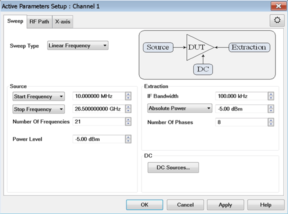 Sweep Type \- Sets the sweep type
to the active channel: Linear Frequency Sets a linear frequency sweep that is
displayed on a standard grid with ten equal horizontal divisions. Log
Frequency The source is stepped in logarithmic increments and the data is
displayed on a logarithmic x-axis. This is usually slower than a continuous
sweep with the same number of points. Power Sweep Activates a power sweep at a
single frequency that you specify. [Learn about power
sweep](../S1_Settings/Sweep.htm#power). Multisweep Selects multiple sweep.
This is also called 3D sweep (power, phase, and frequency). Each sweep can be
set to a different power level. Within each sweep is a 2D sweep of phase and
frequency. With a fixed input power, a frequency-swept trace is useful to
analyze the DUT’s frequency response. With fixed input power and fixed
frequency, offset-phase measurements are performed to get adequate values to
compute the “active S22” and X parameters. Linear/Log Frequency Sweep Type
Source

  * Start Frequency Sets the beginning value of the frequency sweep.
  * Center Frequency Sets the center frequency of the frequency sweep.
  * Stop Frequency Sets the end value of the frequency sweep.
  * Frequency Span Sets the frequency span of the frequency sweep.
  * Number of Frequencies Sets the number of data points that the analyzer measures during a sweep. Range: 2 to 20001.(Default is 201).
  * Power Level Sets the power level of the source. [Learn more](../S1_Settings/Power_Level.md).

Power Sweep Sweep Type Source

  * Start Power Sets the beginning value of the power sweep.
  * Stop Power Sets the end value of the power sweep.
  * Number Of Powers Sets the number of data points that the analyzer measures during a sweep. Range: 2 to 20001. (Default is 201).
  * CW Frequency Sets the single frequency where the analyzer remains during the measurement sweep.

Multisweep Sweep Type Source

  * Start Frequency Sets the start frequency of the frequency sweep.
  * Center Frequency Sets the center frequency of the frequency sweep.
  * Stop Frequency Sets the stop frequency of the frequency sweep.
  * Frequency Span Sets the frequency span of the frequency sweep.
  * Frequency Sweep Sets the sweep type.
  * Number of Frequencies Sets the number of data points that the analyzer measures during a frequency sweep. Range: 2 to 20001. (Default is 201).
  * Start Power Sets the beginning value of the power sweep.
  * Stop Power Sets the end value of the power sweep.
  * Number of Powers Sets the number of data points that the analyzer measures during a power sweep. Range: 2 to 20001. (Default is 201).

Extraction

  * IF Bandwidth Sets the IF (Receiver) bandwidth. [Learn more](../S2_Opt/Trce_Noise.md#IFDiag).
  * Absolute Power  The tone power is an absolute power.
  * Relative to Input Power The tone power is relative to the input power (dBc).

Extraction Tone (ET) Level The level of the extraction tone must be small
enough to ensure a spectrally-linear response, but large enough to ensure that
the response is measurable. A Source Power Cal is performed and both the LSOP
(large signal output power) and Extraction tones power levels are adjusted to
compensate for loss, external amplifiers, and attenuators. **Select the method
used to set the ET Power Level:** The goal of both of the Absolute and
Relative ET Level methods is to set the ET level ~16 dB below the LSOP level
while ensuring a spectrally-linear response from the DUT.

  *     * **Relative to the Input Power**  
For example: At the DUT output you know that the DUT gain at the maximum
stimulus power is 12 dB. The extraction level is set to -4 dBc (DUT Gain – 16
dB).

    * **Absolute Power**  
For example: You know that the DUT gain is 12 dB with the stimulus power at
-10 dBm. Then the DUT Max Output power is +2 dBm. The extraction level is set
to 16 dB below +2, or -14 dBm (Input Stimulus + DUT Gain – 16 dB).

  * Number of Phases Sets the number of phase points. At each point, a phase sweep is performed. Several stimulus states are required to extract the unknown parameters. The following is an example of the output power in Polar format with the number of phases set to 21. Note that the oval shown below is due to the non-linearity of the device. The perfect circle shown below is a linear device.

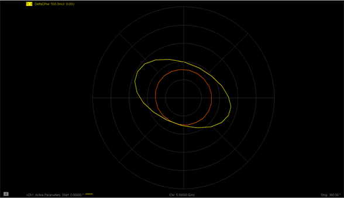 DC

  * [DC Sources...](../System/Configure_a_DC_Device.md)

  
  
Active Parameter RF Path tab help |    
---|---  
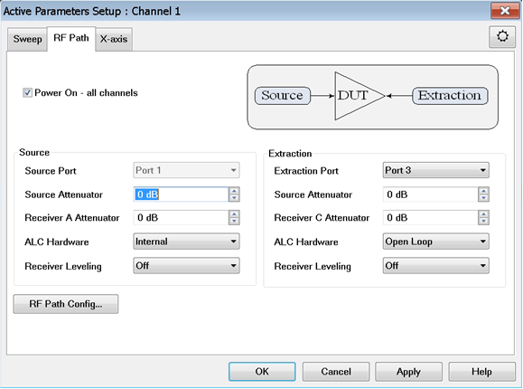 Power On - all channels \- Check
to enable source power for all channels. Source

  * Source Port Selects the port through which an internal source is available.
  * Source Attenuator Sets the attenuation of the source.
  * Receiver A Attenuator Sets the Receiver attenuation.
  * ALC Hardware
  *     * Internal - ALC leveling. Power level within an attenuator setting is limited to the ALC Range. [See Source Unleveled.](../S1_Settings/Power_Level.md#Unleveled)
    * Open Loop \- No ALC and NO Receiver Leveling. [Learn more](../S1_Settings/Power_Level.md#Leveling).
  * Receiver Leveling Turns receiver leveling on/off. This function adjusts the source power until the measured receiver power is equal to the Port Power.

Extraction

  * Extraction Port Selects the port to measure the output of the DUT.
  * Source Attenuator Sets the attenuation of the source.
  * Receiver C Attenuator Sets the Receiver attenuation.
  * ALC Hardware
  *     * Internal - ALC leveling. Power level within an attenuator setting is limited to the ALC Range. [See Source Unleveled.](../S1_Settings/Power_Level.md#Unleveled)
    * Open Loop \- No ALC and NO Receiver Leveling. [Learn more](../S1_Settings/Power_Level.md#Leveling).
  * Receiver Leveling Turns receiver leveling on/off. This function adjusts the source power until the measured receiver power is equal to the Port Power.

[RF Path Config...](../S1_Settings/Path_Configurator.md)  
  
Active Parameter X-axis tab help |    
---|---  
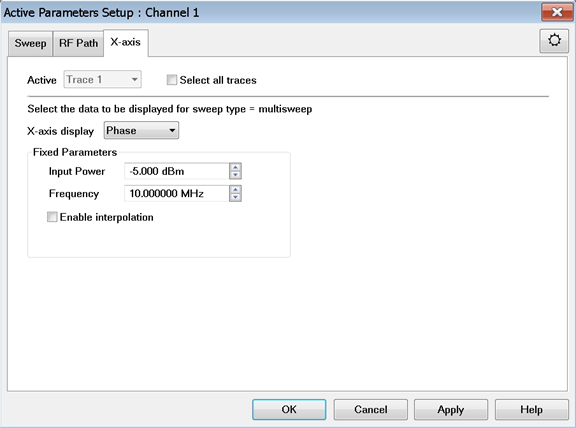 This tab allows the user to
select a subset of the data to be displayed on the screen (frequency, power,
phase) by defining the x-axis and a set of fixed values for the other
parameters. Active Selects a trace to be active. A trace must be active before
its trace settings can be changed. Select all traces Check to select all
traces. X-axis display Sets the x-axis sweep type. Frequency

  1.      * Fixed Parameters
     *        * Input Power Sets a fixed input power level.
       * Enable interpolation Check to enable displayed data to be computed by interpolation.

Power

  1.      * Fixed Parameters
     *        * Frequency Sets a fixed frequency.
       * Enable interpolation Check to enable displayed data to be computed by interpolation.

Phase

  1.      * Fixed Parameters
     *        * Input Power Sets a fixed input power level.
       * Frequency Sets a fixed frequency.
       * Enable interpolation Check to enable displayed data to be computed by interpolation.

DC

  1.      * Fixed Parameters
     *        * Input Power Sets a fixed input power level.
       * Enable interpolation Check to enable displayed data to be computed by interpolation.
     * Name
     *        * AO1 Internal DC source #1.
       * AO2 Internal DC source #2.

  
  
Active Parameter Analysis dialog help |    
---|---  
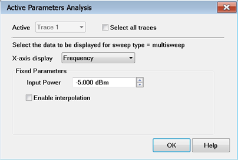 This dialog is identical to
the X-axis tab above. Access this dialog by right-clicking in the [trace
status](../Front_Panel/XScreen.htm) area then selecting Active Parameter
Analysis...: 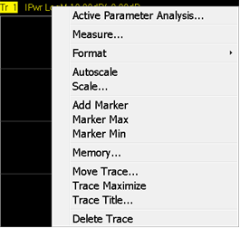  
  
## Accessing Measurement Parameters

#### How to select and configure Measurement Parameters  
  
---  
Using Hardkey/SoftTab/Softkey |  Using a mouse  
  
  1. Select a trace by pressing Trace > Trace N > Trace N.
  2. Press Trace > Trace Setup > Measure....
  3. Select a parameter.

|

  1. Right-click on a trace.
  2. Select Measure Tr N.
  3. Select a parameter.

  
  
Active Hot Parameters help |    
---|---  
Option S9x110A/B Measurement Parameters Note: In the example below, Port 1 is
the Source Port (DUT input) and Port 3 is the Extraction Port (DUT output).
Port 3 or Port 2 can be chosen as the output of the DUT.
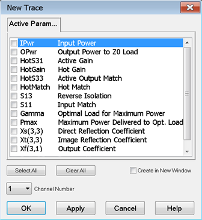 Option S9x111A/B
Measurement Parameters
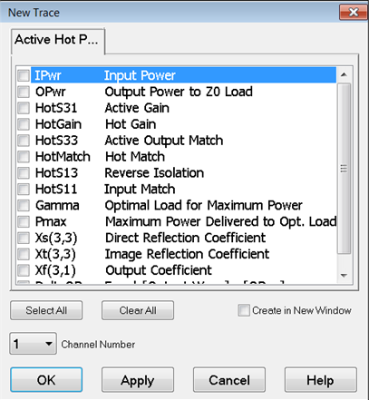 IPwr  Check
to measure input power. OPwr  Check to measure output power. HotS31  Check to
measure Active Gain. HotS33 Check to measure Active Output Match. HotS13
Check to measure Reverse Isolation. HotS11 Check to measure Active Input
Match. Gamma Check to measure optimized Gamma. Pmax Check to measure maximum
delivered power. **Xs(3,3) ,** Direct Reflection Coefficient. The fundamental
XS33 parameter which is used, in combination with XT22, to describe the change
in b2 as a function of a2, the signal reflected from the load. **Xt(3,3) ,**
Direct Reflection Coefficient. The fundamental XT33 parameter which is used,
in combination with XS22 to describe the change in b2 as a function of a2, the
signal reflected from the load. **Xf(3,1) ,** Output Coefficient. The
fundamental XF31 parameter. DeltaOPwr Check to measure the delta between the
output wave and output power to Z0 load. Available for option S9x111A/B only
(the following traces are not restricted to 50 GHz) HotGain Check to measure
forward gain using linear S-parameters output/input. HotMatch Check to measure
active output match using linear S-parameters. Buttons Select All Click to
select all measurement parameters. Clear All Click to deselect all measurement
parameters. Create in New Window Check to create a new trace in a new window
for the measurement. Channel Number Select a channel number for the
measurement.  
  
## Calibrating an Active Parameter Channel

A calibration can be performed on the Active Parameter Channel using the [Cal
All Wizard](../S3_Cals/Calibrate_All_Channels.htm).

## Saving Data

The data can be saved to a *.csv file with a column for each measurement
parameter.

### How to save data  
  
---  
Using Hardkey/SoftTab/Softkey |  Using a mouse  
  
  1. Press Save Recall > Save Other > Save Data....
  2. Save as type = HotS22 Sweep Data (*.csv)

|

  1. Click File
  2. Click Save Data....
  3. Save as type = HotS22 Sweep Data (*.csv)

  
  
  
* * *

