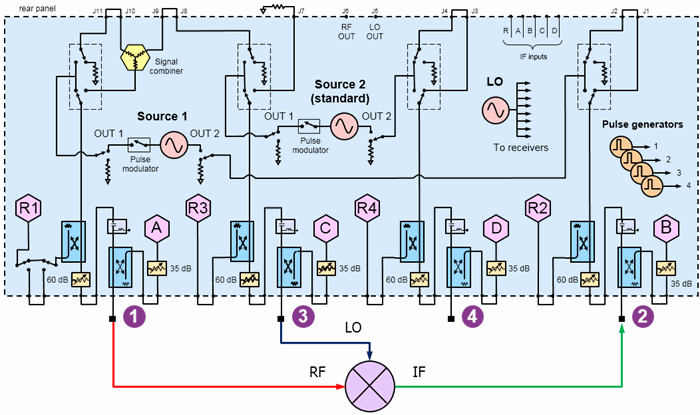
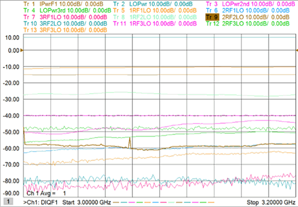
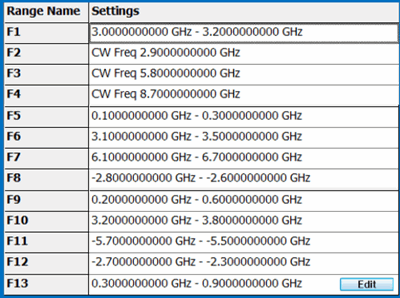
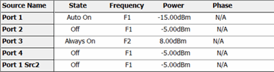
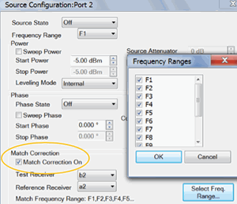
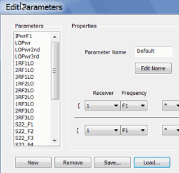
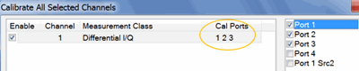

# DIQ Spur Search for Single-ended Mixer

  * Physical Setup

  * Measurement Description

  * Step 1. Create Differential IQ Channel

  * Step 2. Define Frequency Ranges

  * Step 3. Add External Sources

  * Step 4. Define Sources

  * Step 5. Define and Select Trace Parameters

  * Step 6. Define X-Axis for each Parameter

  * Step 7. Calibrate using Cal All Channels

[See All DIQ Examples](Differential_IQ.md)

## Physical Setup

  * Connect the RF input to port 1.

  * Connect the IF output to ports 2.

  * Connect the LO to port 3.

## Measurement Description

Ch1: Sweep input frequency and at output, measure LO fundamental and harmonic
powers, plus spurs (in dBc relative to the input power), of order n*RF - m*LO,
where n and m are integers 1, 2, and 3.

## Step 1. Create a Differential IQ Channel

  1. On the VNA front panel, press Meas > S-Param > Meas Class....

  2. Select Differential I/Q, then either:

     * OK delete the existing measurement, or

     * New Channel to create the measurement in a new channel.

  3. A Differential I/Q measurement is displayed.

## Step 2. Define Frequency Ranges

Channel 1 will have 13 frequency ranges.

  1. Click Stimulus, then DIQ Setup...

  2. Click New 12 times for a total of 13 ranges.

  3. Click Edit in each range, then enter the following:

     1. F1 (RF Input): 3.0 GHz to 3.2 GHz; IFBW 1 kHz; Uncheck Couple

     2. F2 (LO): 2.9 GHz to 2.9 GHz (CW); IFBW 1 kHz; Uncheck Couple.

     3. F3 (2*LO): IFBW 1 kHz; Check Couple; Couple to: F2; Offset: F2; Multiplier: 2. Check UP.

     4. F4 (3*LO): IFBW 1 kHz; Check Couple; Couple to: F2; Offset: F2; Multiplier: 3. Check UP.

     5. F5 (1RF - LO); IFBW 1 kHz; Check Couple; Couple to: F1; Offset: F2; Uncheck UP.

Complete the remaining ranges (F6 to F13) using the above pattern and
following formulas:

Range |  Formula |  Results  
---|---|---  
F6 |  2RF-1LO (2*F1-F2) |   
F7 |  3RF-1LO (3*F1-F2)  
F8 |  1RF-2LO (1*F1-F3)  
F9 |  2RF-2LO (2*F1-F3)  
F10 |  3RF-2LO (3*F1-F3)  
F11 |  1RF-3LO (1*F1-F4)  
F12 |  2RF-3LO (2*F1-F4)  
F13 |  3RF-3LO (3*F1-F4)  
  
## Step 3. Add External Sources

This example does NOT use external sources.

## Step 4. Define Sources

  1. Click Stimulus, then DIQ Setup...

[Learn more about these
settings.](Differential_IQ.htm#SourceConfigurationDiag)

Make the following Source settings:

### Ch 1 (frequency sweep)

This example does NOT use phase control.

### Optional Source Configuration Settings

#### Match Correction ON to improve Power Accuracy

For Port 2 and 4, on the Source Configuration dialog:

  1. Check Match Correction ON.

  2. Then apply Match Correction for all ranges.

  3. "Off+Match" is annotated on the Source setting dialog, although this is NOT shown in the images above.

## Step 5 Define and Select Trace Parameters

Note: Some of the parameters above are NOT displayed. These parameters can be
used as diagnostic or troubleshooting parameters. For example, the “M_” terms
are created when match correction is applied, but they are not usually
displayed directly.

  1. Click Instrument, then Trace, then Add Trace, New Trace..., then Edit Parameters.
  2. Click Load, then navigate to the following VNA folder location to load these parameters:

C:\Program Files\Keysight\Network
Analyzer\DocumentsTemplate\Samples\Setups\DiffIQ\Mixer_spurs.xml

  3. Once these parameters are defined, click Instrument, then Trace, then Add Trace, New Trace...
  4. Then select (check) ALL parameters.

## Step 6. Optional. Define X-Axis For Each Parameter

For each parameter, click Stimulus, then Sweep, then X-axis Type...

## Step 7. Calibrate using Cal All Channels

Click Response, then Cal, then Cal All...

Select ports 1 through 3.

* * *

