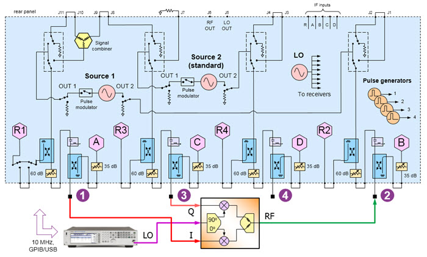
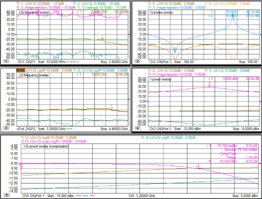
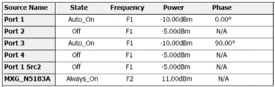
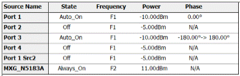
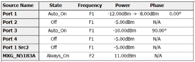
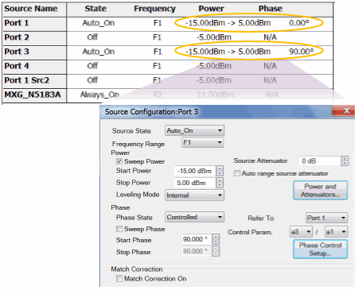
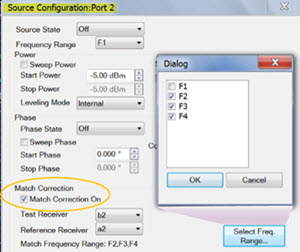
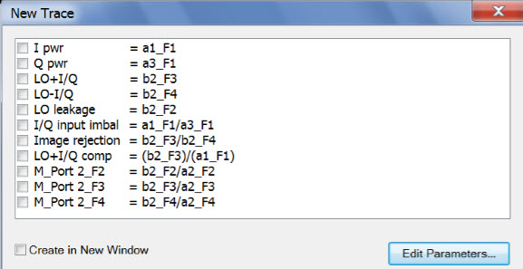
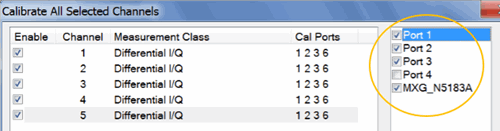

# DIQ Single-Ended IQ Upconverter / Modulator

  * [Physical Setup](DIQ_Single-Ended_IQ_Upconverter.md#Physical_Setup)

  * [Measurement Description](DIQ_Single-Ended_IQ_Upconverter.md#Measurement_Description)

  * [Step 1\. Create 5 Differential IQ Channels](DIQ_Single-Ended_IQ_Upconverter.md#Step_1)

  * [Step 2\. Define Frequency Ranges](DIQ_Single-Ended_IQ_Upconverter.md#Step_2)

  * [Step 3\. Add External Source](DIQ_Single-Ended_IQ_Upconverter.md#Step_3._Add_External_Sources)

  * [Step 4\. Define Sources](DIQ_Single-Ended_IQ_Upconverter.md#Step_4._Define_Sources)

  * [Step 5\. Define and Select Trace Parameters](DIQ_Single-Ended_IQ_Upconverter.md#Step_5_Define_and_Select_Trace_Parameters)

  * [Step 6\. Define X-Axis for each Parameter](DIQ_Single-Ended_IQ_Upconverter.md#Step_6._Define_X-Axis_For_Each_Parameter_)

  * [Step 7\. Calibrate using Cal All Channels](DIQ_Single-Ended_IQ_Upconverter.md#Step_7._Calibrate_using_Cal_All_Channels)

[See All DIQ Examples](Differential_IQ.md)

## Physical Setup

  * I Q signals normally contain digital information, but when tested with a network analyzer, are simple sinusoidal signals.

  * LO is used as the RF carrier signal.

  * RF is the modulated output.

The two VNA internal sources are used as the converter’s quadrature inputs.

  * Connect to ports 1 and 3 using the same frequency range but with a phase offset of 90°.

An external RF Source is connected to the LO input(s).

  * When using a Fixed LO, there is no need to control the source.

Connect the output to port 2.

## Measurement Description

  * Ch1: Sweep I/Q frequencies with fixed LO; at RF output, measure LO+I/Q and LO-I/Q sideband frequency response, image rejection (upper-sideband/lower-sideband), and LO leakage.
  * Ch2: Sweep Q phase at fixed I/Q, LO, and RF frequencies; measure sidebands.
  * Ch3: Sweep I power at fixed I/Q, LO, and RF frequencies; measure sidebands.
  * Ch4: Sweep LO frequency with fixed I/Q input frequencies; measure sidebands.
  * Ch5: Sweep I/Q power at fixed I/Q, LO, and RF frequencies; measure sideband compression.

## Step 1. Create 5 Differential IQ Channels

  1. On the VNA front panel, press Meas > S-Param > Meas Class....

  2. Select Differential I/Q, then either:

     * OK delete the existing measurement, or

     * New Channel to create the measurement in a new channel.

  3. A Differential I/Q measurement is displayed.

TIP: Set up one channel, then use [Copy
Channel](../S1_Settings/CopyChannels.htm) to create additional channels
(Trace/Chan, Channel, Copy Channel)

## Step 2. Define Frequency Ranges

All five channels will have the following ranges:

  * F1: I/Q frequencies
  * F2: LO frequencies
  * F3: Upper sideband frequencies (F2 + F1)
  * F4: Lower sideband frequencies (F2 - F1)

### Ch 1 (Select to make active)

  1. Click Stimulus, then DIQ Setup...

  2. Click New three times for a total of 4 ranges.

  3. Click Edit in each range, then enter the following:

     1. F1: 10 MHz to 2.4 GHz; IFBW 1 kHz; Uncheck Couple

     2. F2: 2.5 GHz to 2.5 GHz (CW); IFBW 1 kHz; Uncheck Couple

     3. F3: IFBW 1 kHz; Check Couple; Couple to: F2; Offset: F1, Check UP

     4. F4: 2.49 GHz to 100 MHz; IFBW 1 kHz; Uncheck Couple

### Ch 2, Ch 3, and Ch 5

TIP: Set up Ch 2, then use [Copy Channel](../S1_Settings/CopyChannels.md) to
overwrite channels 3 and 5.

  1. Click Stimulus, then DIQ Setup...

  2. Click New three times for a total of 4 ranges.

  3. Click Edit in each range, then enter the following:

     1. F1: 1.2 GHz to 1.2 GHz (CW); IFBW 1 kHz; Uncheck Couple

     2. F2: 2.5 GHz to 2.5 GHz (CW); IFBW 1 kHz; Uncheck Couple

     3. F3: 3.7 GHz to 3.7 GHz (CW); IFBW 1 kHz; Uncheck Couple

     4. F4: IFBW 1 kHz; Check Couple; Couple to: F2; Offset: F1, Uncheck UP

### Ch 4

  1. Click Stimulus, then DIQ Setup...

  2. Click New three times for a total of 4 ranges.

  3. Click Edit in each range, then enter the following:

     1. F1: 500 MHz to 500 MHz (CW); IFBW 1 kHz; Uncheck Couple

     2. F2: 1.0 GHz to 4.4 GHz; IFBW 1 kHz; Uncheck Couple

     3. F3: 1.5 GHz to 4.9 GHz; IFBW 1 kHz; Uncheck Couple

     4. F4: 500 MHz to 3.9 GHz; IFBW 1 kHz; Uncheck Couple

## Step 3\. Add External Sources

  1. lick Instrument, then Setup, then External Hardware, then External Device...

  2. Click New, then complete the dialog. [Learn how](../System/Configure_an_External_Source.md).

## Step 4\. Define Sources

  1. Click Stimulus, then DIQ Setup...

[Learn more about these
settings.](Differential_IQ.htm#SourceConfigurationDiag)

Make the following Source settings:

### Ch 1 and 4 (fixed 90° offset)

### Ch2 (Q phase sweep)

### Ch 3 (I power sweep)

### Ch 5 (I/Q power sweep)

Note: Do not attempt to control the phase of port 1. It will automatically get
set to zero degrees when configured as the reference for port 3.

### Optional Source Configuration Settings

#### Match Correction ON to improve Power Accuracy

For ALL channels, on the Port 2 dialog:

  1. Check Match Correction ON.

  2. Then apply Match Correction for measurements of LO and sidebands (F2, F3, F4)

  3. "Off+Match" is annotated on the Source setting dialog, although this is NOT shown in the images above.

#### Decrease Mag/Phase Tolerance and Increase Iterations for Improved
Accuracy

On any source in which a Phase setting is made, click Phase Control Setup.
Decrease the Tolerance and increase the Max Iterations to improve phase
accuracy. [Learn more](../S1_Settings/Phase_Control.md#PhaseSetupDiag).

## Step 5 Define and Select Trace Parameters

Note: Some of the parameters above are NOT displayed. These parameters can be
used as diagnostic or troubleshooting parameters. For example, the “M_” terms
are created when match correction is applied, but they are not usually
displayed directly.

Click Instrument, then Trace, then Add Trace, New Trace..., then Edit
Parameters.

Then do one of the following to create these Diff I/Q measurement parameters:

  * Click Load, then navigate to the following VNA folder location to load these parameters:

C:\Users\Public\Documents\Network
Analyzer\Samples\Setups\DiffIQ\IQ_up_converter.xml

  * Use the Edit Parameters dialog to manually create these parameters.
  * Use a text editor to create an *.xml file. [Learn how](Differential_IQ.md#EditParametersDialog).

Once these parameters are defined, select (check) the parameters for each
channel as follows:

  * Ch1: LO+I/Q, LO-I/Q, Image rejection, LO leakage
  * Ch2: LO+I/Q, LO-I/Q, Image rejection
  * Ch3: LO+I/Q, LO-I/Q, Image rejection
  * Ch4: LO+I/Q, LO-I/Q
  * Ch5: LO+I/Q, LO-I/Q, LO+I/Q com

## Step 6\. Define X-Axis For Each Parameter

For each channel, click Stimulus, then Sweep, then X-axis Type...

Make the following selections:

Channel | X-Axis Domain | X-Axis Source  
---|---|---  
1 | Frequency | F1  
2 | Phase | Port 3  
3 | Power | Port 1  
4 | Frequency | F2  
5 | Power | Port 1  
  
## Step 7\. Calibrate using Cal All Channels

Click Response, then Cal, then Cal All...

Select the ports (in circle) for ALL channels.

* * *

