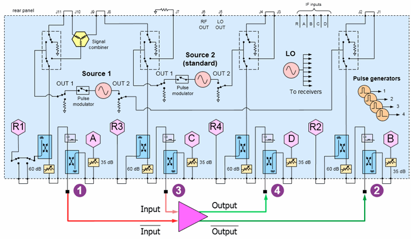
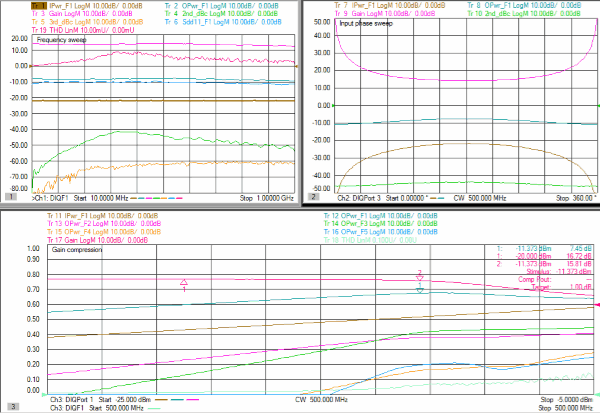
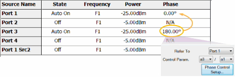
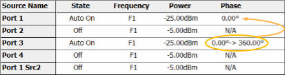
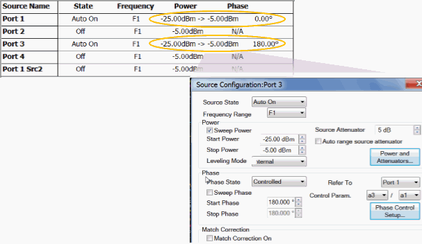
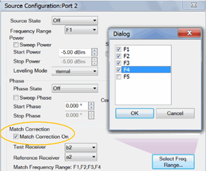
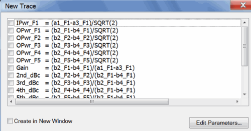
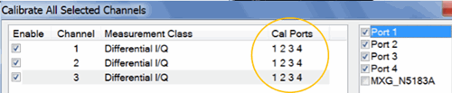

# Differential Amplifier Harmonic Distortion and THD

  * Physical Setup

  * Measurement Description

  * Step 1. Create 5 Differential IQ Channels

  * Step 2. Define Frequency Ranges

  * Step 3\. Add External Source

  * Step 4. Define Sources

  * Step 5\. Define and Select Trace Parameters

  * Step 6\. Define X-Axis for each Parameter

  * Step 7\. Calibrate using Cal All Channels

[See All DIQ Examples](Differential_IQ.md)

## Physical Setup

The two VNA internal sources are used as the differential amplifier inputs.

  * Connect the inputs to ports 1 and 3 using the same frequency range but with a phase offset of 180°.

  * Connect the outputs to ports 2 and 4.

## Measurement Description

Ch1: Sweep differential-input frequency, measure input and output powers,
gain, 2nd and 3rdharmonics (dBc), input match, and total harmonic distortion
(THD).

Ch2: Sweep differential-input phase, measure input and output powers, gain,
and 2nd harmonic (dBc).

Ch3: Sweep differential-input power to measure gain compression, harmonic
powers, and THD.

## Step 1. Create 3 Differential IQ Channels

  1. On the VNA front panel, press Meas > S-Param > Meas Class....

  2. Select Differential I/Q, then either:

     * OK delete the existing measurement, or

     * New Channel to create the measurement in a new channel.

  3. A Differential I/Q measurement is displayed.

TIP: Set up one channel, then use [Copy
Channel](../S1_Settings/CopyChannels.htm) to create additional channels
(Trace/Chan, Channel, Copy Channel)

## Step 2. Define Frequency Ranges

All channels will have five ranges.

### Ch 1 (Select to make active)

Swept Input and harmonic frequencies.

  1. Click Stimulus, then DIQ Setup...

  2. Click New four times for a total of 5 ranges.

  3. Click Edit in each range, then enter the following:

     1. F1: 10 MHz to 1.0 GHz; IFBW 1 kHz; Uncheck Couple

     2. F2: IFBW 1 kHz; Check Couple; Couple to: F1; Check UP; Multiplier: 2

     3. F3: IFBW 1 kHz; Check Couple; Couple to: F1; Check UP; Multiplier: 3

     4. F4: IFBW 1 kHz; Check Couple; Couple to: F1; Check UP; Multiplier: 4

     5. F5: IFBW 1 kHz; Check Couple; Couple to: F1; Check UP; Multiplier: 5

### Ch 2 and Ch 3

Fixed Frequencies.

TIP: Set up Ch 2, then use [Copy Channel](../S1_Settings/CopyChannels.md) to
overwrite channel 3.

  1. Click Stimulus, then DIQ Setup...

  2. Click New four times for a total of 5 ranges.

  3. Click Edit in each range, then enter the following:

     1. F1: 50 MHz to 50 MHz (CW); IFBW 1 kHz; Uncheck Couple

     2. F2: IFBW 1 kHz; Check Couple; Couple to: F1; Check UP; Multiplier: 2

     3. F3: IFBW 1 kHz; Check Couple; Couple to: F1; Check UP; Multiplier: 3

     4. F4: IFBW 1 kHz; Check Couple; Couple to: F1; Check UP; Multiplier: 4

     5. F5: IFBW 1 kHz; Check Couple; Couple to: F1; Check UP; Multiplier: 5

## Step 3\. Add External Sources

External sources are NOT required for this configuration.

## Step 4\. Define Sources

  1. Click Stimulus, then DIQ Setup...

[Learn more about these
settings.](Differential_IQ.htm#SourceConfigurationDiag)

Make the following Source settings:

### Ch 1 (frequency sweep)

### Ch2 (phase sweep)

### Ch 3 (power sweep)

Note: Do not attempt to control the phase of port 1. It will automatically get
set to zero degrees when configured as the reference for port 3.

### Optional Source Configuration Settings

#### Match Correction ON to improve Power Accuracy

For ALL channels, on the Port 2 dialog:

  1. Check Match Correction ON.

  2. Then apply Match Correction for F1, F2, F3, F4.

  3. "Off+Match" is annotated on the Source setting dialog, although this is NOT shown in the images above.

#### Decrease Mag/Phase Tolerance and Increase Iterations for Improved
Accuracy

On any source in which a Phase setting is made, click Phase Control Setup.
Decrease the Tolerance and increase the Max Iterations to improve phase
accuracy. [Learn more](../S1_Settings/Phase_Control.md#PhaseSetupDiag).

## Step 5 Define and Select Trace Parameters

Note: Some of the parameters above are NOT displayed. These parameters can be
used as diagnostic or troubleshooting parameters. For example, the “M_” terms
are created when match correction is applied, but they are not usually
displayed directly.

  1. Click Instrument, then Trace, then Add Trace, New Trace..., then Edit Parameters.
  2. Click Load, then navigate to the following VNA folder location to load these parameters:

C:\Users\Public\Documents\Network
Analyzer\Samples\Setups\DiffIQ\Diff_Harmonics_THD.xml

  3. Once these parameters are defined, select (check) the parameters for each channel as follows:

  * Ch1: Ipwr_F1, Opwr_F1, Gain, 2nd_dBc, 3rd_dBc, Sdd11_F1, THD

  * Ch2: Ipwr_F1, Opwr_F1, Gain, 2nd_dBc

  * Ch3: Ipwr_F1, Opwr_F1, Opwr_F2, Opwr_F3, Opwr_F4, Opwr_F5, Gain, THD

## Step 6\. Define X-Axis For Each Parameter

For each channel, click Stimulus, then Sweep, then X-axis Type...

Make the following selections:

Channel | X-Axis Domain | X-Axis Source  
---|---|---  
1 | Frequency | F1  
2 | Phase | Port 3  
3 | Power | Port 1  
  
## Step 7\. Calibrate using Cal All Channels

Click Response, then Cal, then Cal All...

Select the ports (in circle) for ALL channels.

* * *

