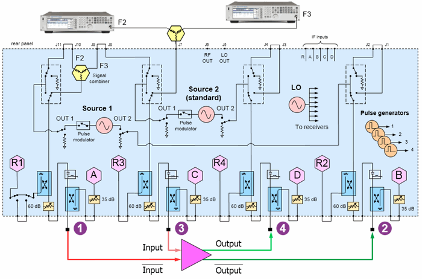
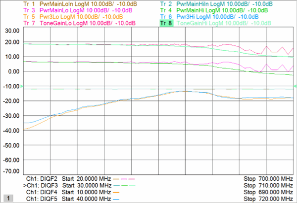
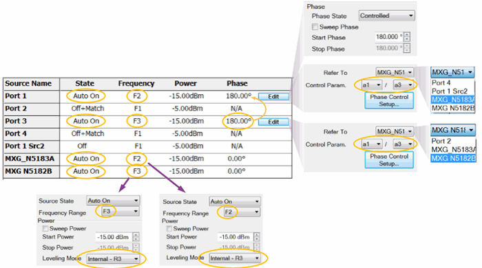
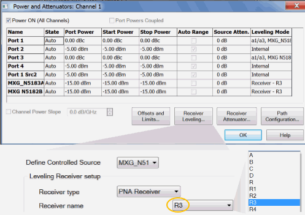
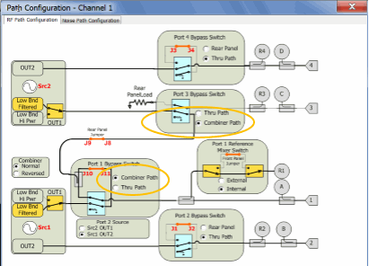
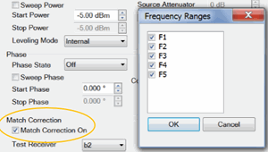
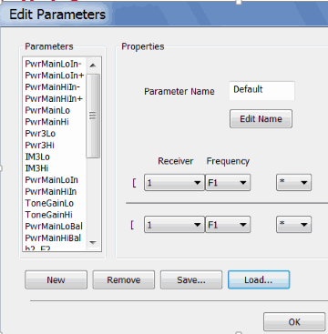
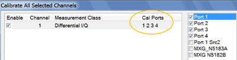

# Differential Amplifier IMD

  * Physical Setup

  * Measurement Description

  * Step 1. Create Differential IQ Channel

  * Step 2. Define Frequency Ranges

  * Step 3. Add External Sources

  * Step 4. Define Sources

  * Step 5. Define and Select Trace Parameters

  * Step 6. Define X-Axis for each Parameter

  * Step 7. Calibrate using Cal All Channels

[See All DIQ Examples](Differential_IQ.md)

## Physical Setup

The two PNA internal sources are combined to create one differential amplifier
input.

Two external sources are combined to create the other differential amplifier
input.

  * Connect the inputs to ports 1 and 3.

  * Connect the outputs to ports 2 and 4.

  * Connect the two external sources to the PNA rear panel as shown above. One external combiner is required.

## Measurement Description

Ch1: Sweep input frequencies of four signals (two pair of differential
signals), measure input and output main-tone powers, third-order lower and
upper IM products, and gain of DUT.

## Step 1. Create a Differential IQ Channel

  1. On the PNA front panel, press Meas, then [Measurement Class]

  2. Select Differential I/Q, then either:

     * OK delete the existing measurement, or

     * New Channel to create the measurement in a new channel.

  3. A Differential I/Q measurement is displayed.

## Step 2. Define Frequency Ranges

Channel 1 will have five frequency ranges.

### Ch 1

Swept Input frequencies.

Use the Couple settings to create the following Tone Spacings:

  1. Click Stimulus, then Frequency, then Differential IQ Setup

  2. Click New four times for a total of 5 ranges.

  3. Click Edit in each range, then enter the following:

     1. F1 (Tone offset): 10 MHz to 10 MHz (CW); IFBW 1 kHz; Uncheck Couple

     2. F2 (Main Lo In): 20 MHz to 7 GHz; IFBW 1 kHz; Uncheck Couple.

     3. F3 (Main Hi In: F2+F1): IFBW 1 kHz; Check Couple; Couple to: F2; Offset: F1; Check UP.

     4. F4 (IM3Lo: F2-F1): IFBW 1 kHz; Check Couple; Couple to: F2; Offset: F1; Uncheck UP.

     5. F5 (IM3Hi: F3+F1): IFBW 1 kHz; Check Couple; Couple to: F3; Offset: F1; Check UP.

## Step 3. Add Two External Sources

  1. Click Utility, then Configure, then External Device Configuration

  2. Click New, then complete the dialog. [Learn how](../System/Configure_an_External_Source.md).

## Step 4. Define Sources

  1. Click Stimulus, then Frequency, then Differential IQ Setup

[Learn more about these
settings.](Differential_IQ.htm#SourceConfigurationDiag)

Make the following Source settings:

### Ch 1 (frequency sweep)

Do NOT manually set the two external sources to zero degrees. They will get
set automatically when configured as reference ports.

Set BOTH external sources to receiver leveling using the R3 receiver as
follows:

  1. On the Source Configuration dialog, click Power and Attenuators, then Receiver Leveling.  

  2. Select the external source (MXG_N51 in this example).
  3. Then select Receiver name: R3.

### Set Path Configuration

These settings route the combined sources to the differential input ports.

  1. On the Source Configuration dialog, click Power and Attenuators (shown above), then Path Configuration.  

  2. Make the two settings in yellow circles (shown above).

### Optional Source Configuration Settings

#### Match Correction ON to improve Power Accuracy

For Ports 2 and 4, on the Source Configuration dialog:

  1. Check Match Correction ON.

  2. Then apply Match Correction for F1, F2, F3, F4, F5

  3. "Off+Match" is annotated on the Source setting dialog, although this is NOT shown in the images above.

#### Decrease Mag/Phase Tolerance and Increase Iterations for Improved
Accuracy

On any source in which a Phase setting is made, click Phase Control Setup.
Decrease the Tolerance and increase the Max Iterations to improve phase
accuracy. [Learn more](../S1_Settings/Phase_Control.md#PhaseSetupDiag).

## Step 5 Define and Select Trace Parameters

Note: Some of the parameters above are NOT displayed. These parameters can be
used as diagnostic or troubleshooting parameters. For example, the “M_” terms
are created when match correction is applied, but they are not usually
displayed directly.

  1. Click Trace/Chan, then Trace, then New Trace, then Edit Parameters.
  2. Click Load, then navigate to the following PNA folder location to load these parameters:

C:\Users\Public\Documents\Network Analyzer\Samples\Setups\DiffIQ\Diff_IMD.xml

  3. Once these parameters are defined, click Trace/Chan, then Trace, then New Trace.
  4. Then select (check) the following parameters:

  * Ch1: PwrMainLoIn, PwrMainHiIn, PwrMainLo, PwrMainHi, Pwr3Lo, Pwr3Hi, ToneGainLo, ToneGainHi

## Step 6. Optional. Define X-Axis For Each Parameter

For each parameter, click Response, then Measure, then Select X-Axis

## Step 7. Calibrate using Cal All Channels

Click Response, then Start Cal, then Cal All Channels

Select ports 1 through 4.

### After Calibration, Turn Off Source Cal

Because the path configuration is different during the measurement as during
Cal All, receiver leveling is used to set the correct port powers of the
external sources. And since the internal sources are controlled, their power
is set relative to the external sources.

Click Response, then Cal, then Power Cal, then Source Correction OFF.

