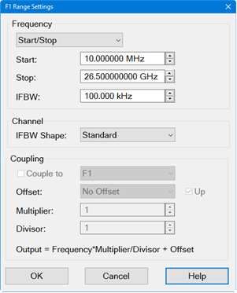
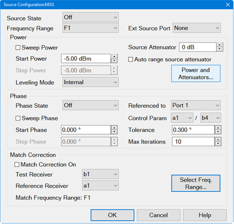
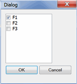
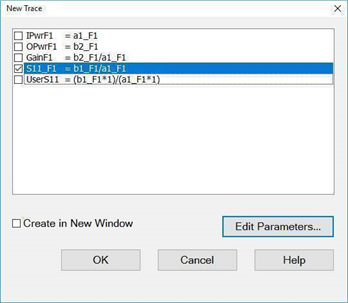

# Differential I/Q Application (Option S9x089A/B)

* * *

Differential I/Q is very flexible, allowing a variety of phase and frequency
settings and measurements.

In this topic:

  * [Features, Requirements, and Limitations](Differential_IQ.md#Features)
  * [Differential I/Q Setup Overview](Differential_IQ.md#Overview)
  * [How to make Differential I/Q Measurements](Differential_IQ.md#HowStart)
  * [Setup Dialog](Differential_IQ.md#SetupDiag)
  * [Frequency Range Settings Dialog](Differential_IQ.md#RangeDiag)
  * [Source Configuration Dialog](Differential_IQ.md#SourceConfigurationDiag)
  * [Define a Measurement Parameter](Differential_IQ.md#DefineParameter)
  * [Measure Dialog](Differential_IQ.md#MeasureDiag)
  * [Edit Parameters Dialog](Differential_IQ.md#EditParametersDialog)
  * [Select X-Axis](Differential_IQ.md#Xaxis)
  * [Calibration](Differential_IQ.md#Calibrating)
  * DIQ Examples (Separate topics)
  *     * [Single-Ended IQ Upconverter / Modulator](DIQ_Single-Ended_IQ_Upconverter.md)

    * [Differential I/Q Upconverter](Differential_IQ_Modulator.md)

    * [Differential Mixer (single-ended LO)](Differential_Mixer.md)

    * [Differential Amplifier Harmonic Distortion and THD](Differential_Amplifier_Harmonic_Distortion_and_THD.md)

    * [Differential Amplifier IMD](Differential_Amplifier_IMD.md)

    * [Mixer Spurs (Single Ended)](DIQ_Mixer_Spurs_SE.md)

    * DIQ trace parameter example *.xml files are stored on the VNA.  
  
  
  
If the VNA is running the Windows 10 operating system, files are stored at:  
D:\Samples\Setups\DiffIQ

#### See Also

[Programming commands](../Programming/MixerTopic.md#DifferentialIQ)

[Other VNA Applications](Applications.md)

### Features, Requirements, and Limitations

#### Features

Combines and extends the capabilities of ALL three of these features:

  * [Source Phase Control](../S1_Settings/Phase_Control.md) (S9x088A/B) is limited to 2-ports, only 4 receivers - Diff IQ can measure ALL receivers.

  * [External sources](../System/Configure_an_External_Source.md) (control at the same time as internal sources).
  * [FOM](../FreqOffset/Frequency_Offset_Mode.md) (Frequency Offset Mode - S9x080A/B)

This allows you to set an internal or external source to any frequency range,
any power level, and any phase relative to a defined reference source. Then,
measure any receiver over any frequency range independent of the source
frequency range(s), with optional match correction. Display the results of any
receiver combination using mathematical expressions available with the
[Equation Editor](../S4_Collect/Equation_Editor.md) feature.

The magnitude and phase of a controlled source is set relative to a reference
source using a pair of receivers (one for the reference source and one for the
controlled source), in an iterative loop. The controlled source is adjusted
within the loop while measuring the ratio of the two receivers. The loop
continues until either the desired magnitude and phase offset is achieved
(within user-settable tolerance values), or the maximum number of iterations
has occurred.

When controlling an external source, a portion of the output signal must be
routed to an internal receiver (usually one of the reference receivers), via a
splitter or directional coupler and one of the front- or rear-panel access
points. The source can be controlled via any of the available remote
interfaces, such as GPIB, USB, or LAN. The 10 MHz frequency reference should
be shared between the source and network analyzer.

#### Requirements

  * Frequency Offset Mode - Opt S9x080A

  * Available ONLY on 4-port N522xB and N524xB (PNA-X) models.

#### Limitations

To enable [Embedded LO](Embedded_LO.md) with DIQ the following conditions are
required:

  * F1 is the input frequency

  * F2 is LO frequency

  * F3 is the output frequency

  * Output signal is measured on Port 2

The following Features are NOT Available in a Differential IQ channel:

  * [ECal User Characterization](../S3_Cals/ECal_User_Characterization.md)

  * [Port Extensions](../S3_Cals/Port_Extensions.md)

  * 4-port Fixturing

  * [Frequency Offset Mode](../FreqOffset/Frequency_Offset_Mode.md)

  * Narrowband Pulse or Pulse Profile measurements using the Integrated Pulse App.

  * [External mmWave Test Head Configuration](../IFAccess/External_Test_Head_Configuration.md)

  * Option [205](../Support/Configurations.md#205) or Option [425](../Support/Configurations.md#425-N5242B)

## Differential I/Q Setup Overview

  1. Define **frequency ranges** for sources and receivers.

     * Ranges can be fixed or swept frequency.

     * To accomplish necessary measurements, receivers can be tuned to an arbitrary list of frequencies independent of those used for the sources.Define **controlled sources** for frequency, power, and phase relationships to other sources, using ranges from

  2. Define **trace parameters.**

     * Parameters can use single receivers or multiple receivers combined with mathematical operators.

     * Parameters can combine receiver measurements made at different frequencies.

  3. Define **x-axis** (can be frequency, power, phase, DC, points).

  4. **Calibrate** all channels using the Cal All wizard, and if needed for additional direct-receiver response calibrations, the Cal Plan Manager wizard.

## How to make Differential I/Q Measurements

#### Create a Differential I/Q Channel

  1. On the VNA, press Meas > S-Param > Meas Class....

  2. Select Differential I/Q, then either:

     * OK delete the existing measurement, or

     * New Channel to create the measurement in a new channel.

  3. A Differential I/Q measurement is displayed.

#### Configure Differential I/Q settings  
  
---  
  
### Using Hardkey/SoftTab/Softkey

|  Using a mouse  
  
  1. Press Setup > Main > DIQ Setup....

|

  1. Click Stimulus.
  2. Select DIQ Setup....

  
  
Differential I/Q Setup Dialog help |   
---|---  
 Frequency Range  (See [Example
configurations](Differential_IQ.htm#ExamplesFreqRng)) Sets the source and
receiver frequency range. Each defined frequency range can be measured by all
of the VNA receivers. The [Define
Parameters](Differential_IQ.htm#DefineParameter) dialog allows you to
configure the measurements to be displayed. Only Linear sweeps are allowed. To
make changes, click the Range Name to be changed, then click Edit to start the
[Frequency Range dialog](Differential_IQ.md#RangeDiag). New \- Creates a new
frequency range. Remove \- Deletes a range. This also removes all measurement
parameters that use the deleted range. Save... \- Saves the measurement setup.
Load... \- Loads a measurement setup. Sources Source Name \- Lists the test
ports through which an internal source is available. If an external source has
been configured, it will appear at the bottom of the list. To make changes,
click the Source Name to be changed, then click Edit to start the [Source
Configuration dialog](Differential_IQ.htm#SourceConfigurationDiag). Add Source
- Starts the [External Source
Configuration](../System/Configure_an_External_Device.htm) dialog. Power ON
(All Channels) \- Turns power on to all channels.  
  
Frequency Range Settings dialog help |    
---|---  
 To start this dialog, click
the range name to be changed, then click Edit, in the above Differential IQ
Setup dialog. Note: The Number of Points is always the same for ALL defined
frequency ranges. Press Sweep, then Number of Points This dialog sets a
frequency range for the source and receiver. The frequency range will be
measured by ALL of the receivers. F1 can NOT be coupled to another range. IFBW
\- Set the IFBW to be used by the receivers for the specified frequency range.
Note: In Diff IQ mode, the IFBW in the VNA status bar may not reflect the
channel’s actual IFBW, which can be set independently for each frequency range
in the Setup dialog. While the user can modify the status bar IFBW from the
status bar, it is not applied to the measurement. Channel IFBW Shape: \- Set
the IFBW digital filter shape to Standard or Gaussian to apply to the time
domain IF signal. [Learn more](../S2_Opt/Trce_Noise.md#IFBW_Shape).

#### Procedure

Either set specific frequencies for the selected range:

  * Enter Start and Stop frequencies or select Center and Span.
  * For a CW frequency, set the Start = Stop or Span = 0.

Or set frequencies that are based on another already-created range:

  1. Check Couple to, then select the range to base the selected range on.
  2. Optionally select any of the following:
  3.      1. Select a predefined Offset frequency range.
     2.         * Check Up to ADD the Offset range to the Couple To range.
        * Clear Up to SUBTRACT the Offset range from the Couple To range.
     3. Select a Multiplier or Divisor value.

#### How the selected range is calculated

For the following frequency ranges (as seen in above dialog):

  * Selected (Output) = F3
  * Couple to = F1
  * Offset = F2

The following formula applies for each data point in each range: F3 = F1 *
Multiplier / Divisor + F2 Note: The Number of Points is always the same for
ALL defined frequency ranges. Press Sweep, then Number of Points

### Examples

For Mixers / Frequency Converters (See above dialogs)

  * F1 = RF or Input Frequencies: Enter Start and Stop Frequency range
  * F2 = LO Frequency: Enter CW Frequency (Start = Stop)
  * F3 = Couple to F1; Offset = F2

For Amplifier Harmonics

  * F1 = Enter fundamental Start and Stop Frequency range
  * F2 = Couple to F1; no Offset; Multiplier= 2 (Measures 2nd Harmonic)
  * F3 = Couple to F1; no Offset; Multiplier= 3 (Measures 3rd Harmonic)

  
  
Source Configuration Dialog help |    
---|---  
 This dialog is started by
clicking the Source Name to be changed, then click Edit, in the Differential
IQ Setup dialog. Configures the source for the specified port. You can set or
sweep Power, Phase, and perform Match Correction for each source port. Source
State: Choose from the following: Auto-on \- Source power is turned ON at the
specified test port when required by the measurement. This is the most common
(default) setting. Auto-on sources are turned OFF when other sources are
performing Match Correction sweeps. Always On \- Source power is ALWAYS ON,
regardless of measurements that are in process. Use this setting to supply
source power to a DUT port that always requires power, such as an LO port.
This could turn OFF power at another test port. [Learn about internal second
source restrictions](../S0_Start/Internal_Second_Source.htm). Off \- Source
power is turned off unless needed for match correction at a given port . Use
this setting to prevent damage to a sensitive DUT test port. Uncontrolled \-
(External Sources ONLY). The source state and other settings are NOT changed.
Match correction can NOT be performed while uncontrolled. Frequency Range \-
Selects a frequency range defined in the Differential IQ Setup dialog.

#### Ext Source Port Selects the source port that the external source is
routed through. Displayed when an external source is selected as the active
port.

#### Power

Sweep Power \- Check to perform a power sweep. Start / Stop Power \- Set both
the Start and Stop power levels for power sweep. Set a single (Start) power
level for the specified source port. Leveling Mode: Choose from the following:

  * Internal \- ALC leveling loop ONLY; NO Receiver Leveling.
  * Internal R<n> \- Both ALC and Receiver Leveling - where <n> is the reference port (not shown in diagram). To change the reference port, click Power and Attenuators, then Receiver Leveling. [Learn more](../S1_Settings/Receiver_Leveling.md).
  * Open Loop \- No ALC and NO Receiver Leveling - Used during pulse conditions with the internal source modulators. No leveling is used in setting the source power. The lowest settable power, without attenuation, is limited to -30dBm. The source power level accuracy is very compromised. Use a source power calibration to make the source power somewhat more accurate.
  * Open Loop R<n> \- No ALC; Receiver Leveling ONLY - where <n> is the reference port. To change the reference port, click Power and Attenuators, then Receiver Leveling. [Learn more](../S1_Settings/Receiver_Leveling.md).

Source Attenuator: Enter source attenuation for the specified port number. Not
available for external sources. Auto range source attenuator: Check to allow
the analyzer to select the optimum attenuation value to achieve the specified
test port power. [Learn more](../S1_Settings/Power_Level.md#Atten_Auto).
Power and Attenuators \- Click to start the [Power and Attenuators
dialog](../S1_Settings/Power_Level.htm#Advanced).

#### Phase

Phase State - Choose from the following: Off \- Phase is NOT set or
controlled. Controlled \- Phase is measured and iterated to within the
specified tolerance. Specify the receivers and iteration properties to use to
control phase. Open Loop \- Phase and power is set, but receivers are NOT used
to measure and iterate the phase or power of the source. Therefore, the
setting of phase is not as accurate or stable. Open Loop mode can be used with
phase sweep (for example, from 0 to 360 degrees). However, each sweep may not
start at 0 degrees. NO settings on the Phase Control Setup dialog are used in
Open Loop. Note: After selecting Open Loop, set each source to ON (not Auto)
using the [Power and Attenuators
dialog](../S1_Settings/Power_Level.htm#Advanced). Sweep Phase Check to sweep
on the specified source port. Start / Stop Phase \- Set both the Start and
Stop power levels for power sweep. Set a single (Start) power level for the
specified source port Referenced To - Select the port to which the controlled
phase port is to be referenced. The two internal VNA sources are available
ONLY at specific ports. These choices are limited for you. For example on a
4-port PNA-X, the possible port pairings are: 1/3, 1/4, 2/3, or 2/4. Port 1
can NOT be paired with Port 2, and Port 3 can NOT be paired with Port 4.
[Learn more about these
limitations.](../S0_Start/Internal_Second_Source.htm#Restrictions) Control
Param. - Select the receivers to be used to measure the phase of the sources.

  * The LEFT receiver (a2 in the above image) measures the controlled source.
  * The RIGHT receiver (a3 in the above image) measures the reference source.

The swept phase or phase offset will be the difference between these two
receivers. [Learn
more](../S1_Settings/Measurement_Parameters.htm#RecNotation). Select the
receivers based on your application. You are responsible to make sure that
your DUT configuration routes the signals of interest to the correct
receivers. Otherwise, the phase will not be properly controlled. Tolerance
When consecutive phase measurements of the same data point are within this
value of each other, then the phase measurement is considered settled. Max
Iterations Sets the maximum number of background phase measurements to perform
in order to achieve settling. If the phase is not sufficiently settled after
these measurements, then the closest value is used. Note: When both Power and
Phase are swept, both are swept SIMULTANEOUSLY in a single sweep.

#### Match Correction

Note: Without match correction, receiver-power measurements use simple
response calibrations, which do not compensate for the mismatch between the
DUT and the match of the test system. This mismatch can appear as ripple in
swept-frequency power measurements. With match correction enabled on a given
port, an extra sweep is taken at that port to measure the match of the DUT
using a 1-port calibration. These data are then used with the port-match data
obtained from the Cal All calibration to correct for the mismatch between the
DUT and the test system, providing more accurate power measurements. Match
Correction On

  * Check to perform Match Correction on the specified source port over the specified frequency range. An extra sweep is performed to measure the match term.
  * Clear this box if the input of your DUT is well-matched to the analyzer source port.

Test Receiver \- Select a test receiver to be used for Match Correction. Only
logical receiver notation (b1, b2 and so forth) is available. [Learn
more](../S1_Settings/Measurement_Parameters.htm#RecNotation). Reference
Receiver \- Select a reference receiver to be used for Match Correction. Only
logical receiver notation (a1, a2 and so forth) is available. [Learn
more](../S1_Settings/Measurement_Parameters.htm#RecNotation). Select Frequency
Range \- Starts the following dialog.  
  
Match Correction Dialog help  
---  
 Select the frequency ranges over
which Match Correction is to be performed. When match-correction is enabled,
extra trace parameters are generated in the channel for the match measurements
(e.g. S22_F1). The number of match parameters generated depends on which ports
enable match correction, and the frequency ranges selected for each port. If
these parameters are deleted, or if a set of trace parameters are loaded from
an .xml file that doesn’t include the match parameters (loading an xml file
overwrites the existing trace definitions), then the match measurements will
not be performed, even if the setup dialog includes them. To regenerate the
match parameters and enable match-corrected power measurements, match
correction must be turned off for a port and then reenabled.  
  
## Define a Measurement Parameter

Four 'default' parameters are offered.

In addition, custom parameters can be defined using the Edit Parameters Dialog

#### How to select and configure Measurement Parameters  
  
---  
  
### Using Hardkey/SoftTab/Softkey

|  Using a mouse  
  
  1. Press Meas > Main > Other....

|

  1. Click Response
  2. Select Meas
  3. Select More Measurements...

  
  
Measure Dialog help |    
---|---  
When match correction is enabled, the firmware automatically generates DUT-
reflection parameters Sxx_Fn (e.g. S11_F1, S11_F2 ) measured with a 1-port
calibration. These are the parameters that should be selected for accurate
reflection measurements of the DUT. A user-defined Sxx (e.g. UserS11 below)
will only be response corrected, and will have considerably more error than
the equivalent firmware-generated reflection parameter, which has a full
1-port calibration. 
Select one of the following 'default' parameters, or click Edit Parameters to
show the following Edit Parameters dialog. Create in New Window \- When
checked, the selected measurements are created in a new window.  
  
Edit Parameters Dialog help |    
---|---  

#### Parameters

Select a predefined parameter from the list. Parameter Name \- Change the
'default' name. Click Edit Name to start the virtual keyboard. Note: Do not
use underscores in the parameter name. For example, b2_f1 cannot be used as a
parameter name. However, b2f1 is a valid parameter name. To edit / create a
parameter: Receiver \- Select a receiver for which to plot measurement
results. Frequency \- Select the frequency range over which the results will
be plotted. * (Operator) \- Select an operator when combining multiple
receivers. For example, when calculating differential or common mode
parameters.

#### Buttons

New \- Click to create a parameter. Remove \- Click to delete the selected parameter. Save \- Click to store the parameter to a *.diq file for later recall. Load \- Click to recall a parameter that you previously defined and saved. The following are the contents from an example *.diq file that contains the above parameters. The file can be created using the above dialog, or edited directly using the format shown below. |  <Source_Phase_Control> <ParameterList> <Param1 ParamName="I pwr" ParamValue="a1_F1"/> <Param2 ParamName="Q pwr" ParamValue="a3_F1"/> <Param3 ParamName="LO+I/Q" ParamValue="b2_F3"/> <Param4 ParamName="LO-I/Q" ParamValue="b2_F4"/> <Param5 ParamName="LO leakage" ParamValue="b2_F2"/> <Param6 ParamName="I/Q input imbal" ParamValue="a1_F1/a3_F1"/> <Param7 ParamName="Image rejection" ParamValue="b2_F3/b2_F4"/> <Param8 ParamName="LO+I/Q comp" ParamValue="(b2_F3)/(a1_F1)"/> <Param9 ParamName="M_Port 2_F2" ParamValue="b2_F2/a2_F2"/> <Param10 ParamName="M_Port 2_F3" ParamValue="b2_F3/a2_F3"/> <Param11 ParamName="M_Port 2_F4" ParamValue="b2_F4/a2_F4"/> </ParameterList> <FrequencyRanges> <Range1 Start="1200000000.000000" Stop="1200000000.000000" IFBW="10000.000000" IsCoupling="false" CoupleId="1" Offset="0" IsUpConvert="true" Multiplier="1" Divisor="1"/> <Range2 Start="2500000000.000000" Stop="2500000000.000000" IFBW="10000.000000" IsCoupling="false" CoupleId="1" Offset="0" IsUpConvert="true" Multiplier="1" Divisor="1"/> <Range3 Start="3700000000.000000" Stop="3700000000.000000" IFBW="10000.000000" IsCoupling="true" CoupleId="2" Offset="1" IsUpConvert="true" Multiplier="1" Divisor="1"/> <Range4 Start="1300000000.000000" Stop="1300000000.000000" IFBW="10000.000000" IsCoupling="true" CoupleId="2" Offset="1" IsUpConvert="false" Multiplier="1" Divisor="1"/> </FrequencyRanges> </Source_Phase_Control>  
---  
  
#### How to Select X-Axis  
  
---  
  
### Using Hardkey/SoftTab/Softkey

|  Using a mouse  
  
  1. Press Sweep > Main > X-Axis Type....

|

  1. Click Stimulus
  2. Select Sweep
  3. Select X-axis Type...

  
Select X-Axis Dialog help |    
---|---  
 Select the domain to display on the X-axis of the window. Markers will be annotated and data files are saved using these choices. Choose from the following: |  X-Axis Domain |  X-Axis Source (choices)  
---|---  
Frequency |  Frequency Range (F1, F2, etc.)  
Power |  Source port (Port 1, Port 2, etc.)  
Phase |  Source port (Port 1, Port 2, etc.)  
DC Value |  DC Source (AO1, AO2, etc.)  
Points |  Points (N/A)  
  
## Calibrating a Differential IQ Channel

Calibration of the Differential IQ Channel is performed using the [Cal All
Calibration Wizard](../S3_Cals/Calibrate_All_Channels.htm).

Cal All should be performed with all of the front panel jumpers in place and
all of the path switches in the normal configuration. After the cal has been
performed, the path switches can be set to the rear panel position if external
sources are routed from the rear panel to the test ports.

This calibration appears as an S-parameter calibration in the Cal All Wizard.

### Direct Access Receiver Calibration

When all four test ports are being used, but at least one port uses ONLY the
source and its reference receiver, you can use the test port receiver for that
port accessed through the front-panel jumper ports.

This measurement is calibrated by first performing the Cal All Calibration.

Then use the Cal Plane Manager - Direct Receiver Calibration to remove the
effects of the transmission line that is used to connect the DUT to the
receiver through the front-panel jumper port. [See the detailed
procedure](../S3_Cals/CPM_Direct_Receiver_Calibration.htm).

Note: Only corrected scalar magnitude measurements are possible at the direct-
access receiver. The phase information from the Cal All calibration is
preserved in the Cal Set and is NOT modified by the Direct Access Receiver
Cal.

* * *

