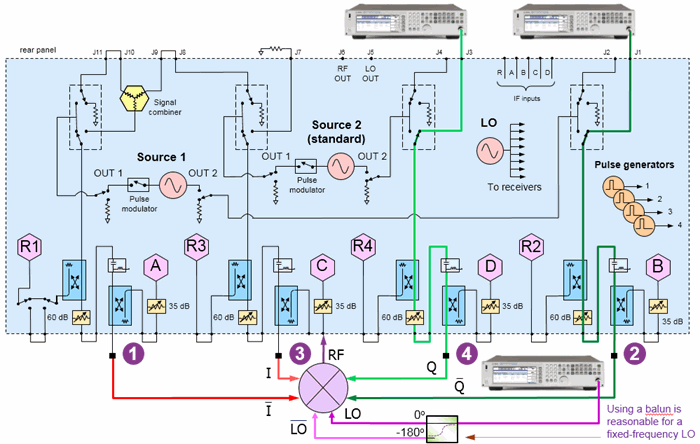

# Differential I/Q Modulator

The upconverter has differential IQ, balanced inputs.

Three external generators are required.

The two VNA internal sources are used as the differential I inputs.

  * Connect to ports 1 and 3 using the same frequency range.

  * Set the phase of port 3 to 180° relative to port 1.

Two external sources are used as the differential Q inputs.

  * Connect to ports 2 and 4 using the same frequency range as ports 1 and 3.

  * Set the phase of port 2 to +90° relative to port 1.

  * Set the phase of port 4 to -90° relative to port 1.

An external RF Source is connected to the LO input. If the LO port is
balanced, a balun or 180° hybrid coupler may be used as shown in the example.

  * When using a Fixed LO, there is no need to control the source.

  * Otherwise, first configure the source in the [External Source configuration](../System/Configure_an_External_Source.md) dialog.

Remove the port 3 front-panel jumper and connect the mixer output to the C
receiver input.

This receiver is calibrated using the CPM - Direct Access Receiver
Calibration. [Learn
more](Differential_IQ.htm#Direct_Access_Receiver_Calibration.).

* * *

