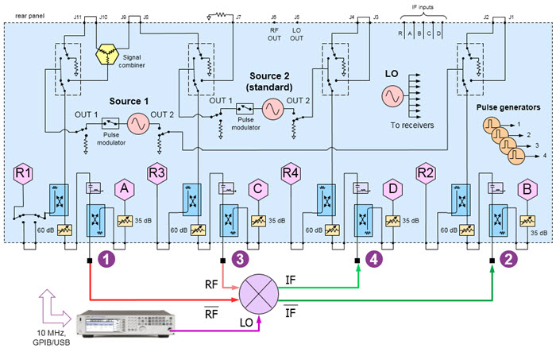
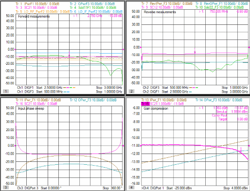
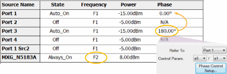
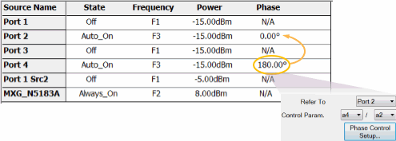
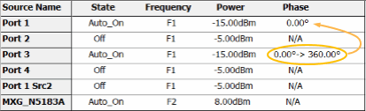
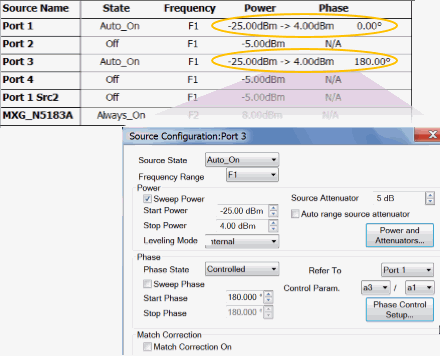
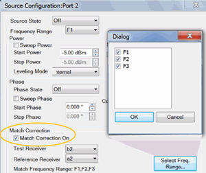
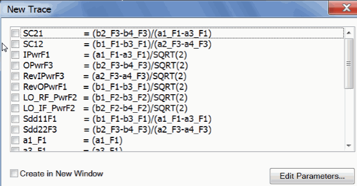
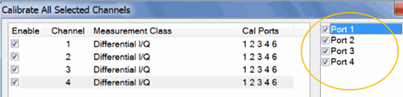

# Differential Mixer (single-ended LO)

  * Physical Setup

  * Measurement Description

  * Step 1. Create 5 Differential IQ Channels

  * Step 2. Define Frequency Ranges

  * Step 3\. Add External Source

  * Step 4. Define Sources

  * Step 5\. Define and Select Trace Parameters

  * Step 6\. Define X-Axis for each Parameter

  * Step 7\. Calibrate using Cal All Channels

[See All DIQ Examples](Differential_IQ.md)

## Physical Setup

The two VNA internal sources are used as the mixer differential RF inputs.

  * Connect to Ports 1 and 3 using the same frequency range but with a phase offset of 180o.

An external RF Source is connected to the LO input.

  * When using a Fixed LO, there is no need to control the source.

Connect the two IF outputs to Ports 4 and 2.

## Measurement Description

Ch1: Sweep differential-RF frequency with fixed LO, measure forward input and
output powers, forward conversion loss (SC21), differential input match
(Sdd11) and LO-to-RF and LO-to-IF feed-through.

Ch2: Sweep differential-IF frequency with fixed LO, measure reverse input and
output powers, reverse conversion loss (SC12), differential output match
(Sdd22)

Ch3: Sweep differential-RF phase, measure input and output powers and forward
conversion loss

Ch4: Sweep differential-RF input power to measure gain compression

## Step 1. Create 4 Differential IQ Channels

  1. On the VNA front panel, press Meas > S-Param > Meas Class....

  2. Select Differential I/Q, then either:

     * OK delete the existing measurement, or

     * New Channel to create the measurement in a new channel.

  3. A Differential I/Q measurement is displayed.

TIP: Set up one channel, then use [Copy
Channel](../S1_Settings/CopyChannels.htm) to create additional channels
(Trace/Chan, Channel, Copy Channel)

## Step 2. Define Frequency Ranges

All channels will have the following ranges:

  * F1: RF frequencies
  * F2: LO frequencies
  * F3: IF frequencies

### Ch 1 and Ch2 (Select to make active)

Swept RF and IF; Fixed LO.

TIP: Set up Ch 1, then use [Copy Channel](../S1_Settings/CopyChannels.md) to
overwrite channel 2.

  1. Click Stimulus, then DIQ Setup...

  2. Click New two times for a total of 3 ranges.

  3. Click Edit in each range, then enter the following:

     1. F1: 2.5 GHz to 3.0 GHz; IFBW 1 kHz; Uncheck Couple

     2. F2: 2.0 GHz to 2.0 GHz (CW); IFBW 1 kHz; Uncheck Couple

     3. F3: IFBW 1 kHz; Check Couple; Couple to: F1; Offset: F2, Uncheck UP

### Ch 3 and Ch 4

Fixed RF, IF; and LO.

TIP: Set up Ch 3, then use [Copy Channel](../S1_Settings/CopyChannels.md) to
overwrite channel 4.

  1. Click Stimulus, then DIQ Setup...

  2. Click New two times for a total of 3 ranges.

  3. Click Edit in each range, then enter the following:

     1. F1: 2.75 GHz to 2.75 GHz (CW); IFBW 1 kHz; Uncheck Couple

     2. F2: 2.0 GHz to 2.0 GHz (CW); IFBW 1 kHz; Uncheck Couple

     3. F3: IFBW 1 kHz; Check Couple; Couple to: F1; Offset: F2, Uncheck UP

## Step 3\. Add One External Source

  1. Click Instrument, then Setup, then External Hardware, then External Device...

  2. Click New, then complete the dialog. [Learn how](../System/Configure_an_External_Source.md).

## Step 4\. Define Sources

  1. Click Stimulus, then DIQ Setup...

[Learn more about these
settings.](Differential_IQ.htm#SourceConfigurationDiag)

Make the following Source settings:

### Ch 1 (fwd. sweep, fixed 180o offset)

### Ch2 (rev. sweep, fixed 180o offset)

### Ch 3 (RF phase sweep)

### Ch 4 (I/Q power sweep)

Note: Do not attempt to control the phase of port 1. It will automatically get
set to zero degrees when configured as the reference for port 3.

### Optional Source Configuration Settings

#### Match Correction ON to improve Power Accuracy

For ALL channels, on the Port 2 dialog:

  1. Check Match Correction ON.

  2. Then apply Match Correction for ranges (F1, F2, F3)

  3. "Off+Match" is annotated on the Source setting dialog, although this is NOT shown in the images above.

#### Decrease Mag/Phase Tolerance and Increase Iterations for Improved
Accuracy

On any source in which a Phase setting is made, click Phase Control Setup.
Decrease the Tolerance and increase the Max Iterations to improve phase
accuracy. [Learn more](../S1_Settings/Phase_Control.md#PhaseSetupDiag).

## Step 5 Define and Select Trace Parameters

Note: Some of the parameters above are NOT displayed. These parameters can be
used as diagnostic or troubleshooting parameters. For example, the “M_” terms
are created when match correction is applied, but they are not usually
displayed directly.

  1. Click Instrument, then Trace, then Add Trace, New Trace..., then Edit Parameters.
  2. Click Load, then navigate to the following VNA folder location to load these parameters:

C:\Users\Public\Documents\Network
Analyzer\Samples\Setups\DiffIQ\Diff_mixer.xml

  3. Once these parameters are defined, select (check) the parameters for each channel as follows:

  * Ch1:
  * Ch2:
  * Ch3:
  * Ch4:
  * Ch5:

## Step 6\. Define X-Axis For Each Parameter

For each channel, click Stimulus, then Sweep, then X-axis Type...

Make the following selections:

Channel | X-Axis Domain | X-Axis Source  
---|---|---  
1, 2 | Frequency | F1, F3  
3 | Phase | Port 3  
4 | Power | Port 1  
  
## Step 7\. Calibrate using Cal All Channels

Click Response, then Cal, then Cal All...

Select the ports (in circle) for ALL channels.

See [Cal All](../S3_Cals/Calibrate_All_Channels.md) for more information.

* * *

