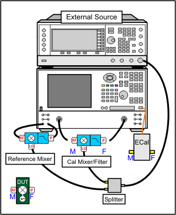
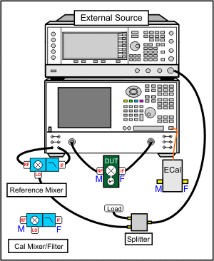
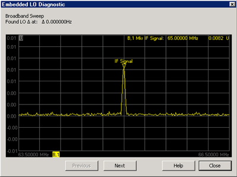

# Embedded LO Measurements

* * *

The Embedded LO feature allows you to make
[VMC](../FreqOffset/VMC_Measurements.md),
[SMC](../FreqOffset/SMC_Measurements.md), [IMDx](Swept_IMDx.md),
[GCX](Gain_Compression_for_Converters.md),
[MODX](Modulation_Distortion/Overview.md) and
[NFX](Noise_Figure_on_Converters.md) measurements of mixers that have a FIXED
LO inside the DUT. Learn how to make [IMX
Spectrum](IM_Spectrum_for_Converters.htm) measurements on converters with an
Embedded LO.

Note: This feature is available as Opt S9x084A/B, and must be
[enabled](../Support/Option_Enable.md).

In this topic:

  * [Overview - How the VNA measures the embedded LO](Embedded_LO.md#Overview)

  * [To measure a DUT with an Embedded LO (Procedure)](Embedded_LO.md#How)

  * [How to Launch the Embedded LO Mode dialog box](Embedded_LO.md#launchDiag)

  * [Embedded LO dialog box help](Embedded_LO.md#EmbeddedDiag)

  * [Embedded LO Diagnostic dialog box help](Embedded_LO.md#diagnostic)

### Overview - How the VNA measures the embedded LO

Measurements of these devices are challenging for a couple of reasons:

  1. The VMC measurement process requires the use of a [reference mixer](../FreqOffset/VMC_Measurements.md#HardwareSetup) that has the same LO frequency as the DUT. A separate internal or external source must be used for the reference mixer LO. A VNA with an internal second source is much faster. This source (Internal or External) MUST be controlled by the VNA! [Learn how.](Embedded_LO.md#How)

  2. All Embedded LO measurements require the VNA receivers to be tuned to the correct frequency to measure the mixer output, which is highly dependent on the exact LO frequency.

The nominal frequency of the embedded LO is input into the [Mixer Setup
dialog.](MixerConverter_Setup.htm#Configure) This is used as a starting point
for the measurement.

Before each DUT measurement sweep, background sweeps are made to determine the
frequency of the embedded LO to a configurable degree of accuracy.

Background sweeps...

  * Broadband Sweep - rough measurement of the embedded LO frequency, made around a selectable data point over a selectable frequency span. The input signal to the DUT is tuned to a selectable CW frequency. The B receiver is swept across a selectable span around the anticipated output frequency. The difference between the frequency of the found signal and the desired output frequency is then applied as an adjustment.

  * Precise Sweep The B receiver is measured at the selectable data point. Measurements of phase versus time are made, from which the exact offset frequency is computed, until either the tolerance value or maximum iterations are met.

  * For VMC measurements, the reference mixer frequency is updated as the embedded LO frequency is determined.

#### To measure a DUT with an Embedded LO:

  1. Create a [VMC](../FreqOffset/FCA_Use.md#Create), [SMC](../FreqOffset/FCA_Use.md#Create), [IMDx](Swept_IMDx.md#Create), [IMx Spectrum](IM_Spectrum_for_Converters.md), [GCX](Gain_Compression_for_Converters.md), or [NFX](Noise_Figure_on_Converters.md#Create) measurement.
  2. In the mixer setup dialog, enter the nominal frequency of the embedded LO as the LO frequency.
  3. Perform a calibration as usual.
  4. Launch and complete the Embedded LO Mode dialog box (below)

|

### For VMC with Embedded LO:

(The other mixer applications do NOT require a reference mixer.) The LO source
for the Reference Mixer can be either:

  * An Internal source when using a [PNA-X that has two sources](../S0_Start/Internal_Second_Source.md). 
  * An External source:
  *     * Must be configured as an External Device. [Learn how.](../System/Configure_an_External_Device.md)
    * Must be locked to the VNA using the [10 MHz reference](../Rear_Panel/XRtour.md#10M).

This source (Internal or External) MUST be controlled by the VNA. To control
the source, set the LO1 source in the [Mixer Setup
tab](MixerConverter_Setup.htm#MixerSetupTab) to whichever source (external,
port 3, or port 4) that is driving the reference mixer. During Calibration \-
The LO source is shared between the Reference Mixer and the Calibration
Mixer/Filter. This requires a splitter when using an external source, as shown
in the following image.  During
the Measurement \- Only the Reference Mixer uses the LO source. Terminate the
LO source port that is no longer used by the Calibration Mixer/Filter to
ensure that the match seen by the Reference Mixer LO port does not change
after the calibration, as shown in the following image. This precaution is not
necessary when using the internal second source (ports 3 and 4) of the PNA-X.

### For SMC, IMDx, IMxSpectrum, and NFX measurements:

No unique setup is required for embedded LO measurements.  
---  
  
#### How to Launch the Embedded LO Mode dialog box  
  
Using Hardkey/SoftTab/Softkey | Using a mouse  
  
  1. Press Sweep > Source Control > Embedded LO....

|

  1. Click Stimulus
  2. Select Sweep
  3. Select Source Control
  4. Select Embedded LO...

  
  
  
Embedded LO dialog box help  
---  
 The Tuning Settings balance LO
measurement speed versus accuracy. You can see that accuracy is becoming
compromised when noise starts to appear on the measurement trace. [Scroll
up](Embedded_LO.htm) to learn more about the Embedded LO measurement process.
Enable Embedded LO Check to enable measurement of the Embedded LO. Tuning
Method These settings determine the amount of time spent versus the degree of
accuracy to which the LO Frequency is measured. You can see that accuracy is
becoming compromised when noise starts to appear on the measurement trace.
Broadband and Precise Does the entire tuning process for each background
sweep. See the [Overview](Embedded_LO.md#Overview) for more information.
Precise only Does NOT perform broadband tuning on each sweep. Use this setting
when the embedded LO is stable. The signal (after broadband) must be within ½
the tuning IFBW. If the signal will always be within ½ the IFBW, broadband
tuning is not needed. Most satellite components are within 3 kHz absolute so
might not need broadband tuning. Disable tuning Only the previously measured
LO Frequency Delta is applied to the reference mixer LO and VNA receivers.
Tuning Point Select, or specify, the data point in the mixer sweep that will
be used to find the embedded LO frequency. If a marker is enabled, that data
point can be used. For broadband and Precise sweeps, choose a point in the
mixer sweep where noise is least likely to be found, such as the point of
highest gain. This is generally the center of a sweep or the center of a
filter if used. Tune every Set the interval at which tuning is performed
before a measurement sweep. 'Tune every 3 sweeps' means that every third
measurement sweep is preceded by tuning sweeps. If the embedded LO drifts, or
if regularly changing DUTs, use 'Tune every 1 sweep'. Broadband Search \- Set
the frequency span over which to measure the embedded LO frequency. IFBW IF
Bandwidth used for Broadband and Precise tuning sweeps. This sets the
resolution in the Broadband sweeps and sets the max error (1/2 IFBW) for
precise tuning. The larger the IFBW, the faster the sweep, but the signal may
not be found. Max Iterations The maximum number of Precise sweeps to make.
When this number is reached, the final measurement is used. Tolerance When two
consecutive Precise measurements are made within this value, the final
measurement is used. If this is not achieved within the Max Iterations value,
then the last measurement is used. This is the best of the 'Tunings settings'
to change to improve accuracy. LO Frequency Delta The absolute difference
between the measured embedded LO frequency and the LO setting that is entered
in the [Mixer Setup dialog.](MixerConverter_Setup.md#Configure) This value is
updated each time the embedded LO frequency is measured. Entering a value is a
way to change the LO frequency on the mixer setup without invalidating the
calibration. Find Now The VNA finds and measures the actual LO frequency using
the current dialog settings. This data is displayed in the Status box. Status
window Displays textual and graphical representation of the Embedded LO
measurement sweeps. Default Resets the LO Frequency Delta and Tuning
parameters to their default settings. Graph... Launches the graphical
(spectrum analyzer type) display sweeps of the latest embedded LO measurement.  
  
Embedded LO Diagnostic dialog box help  
---  
 This dialog appears when Graph is clicked on
the [Embedded LO](Embedded_LO.md#EmbeddedDiag) dialog. Presents a graphical
(spectrum analyzer type) display of the latest embedded LO measurement. Click
Previous and Next to view available Broadband and Precise sweeps. The LO
Frequency is displayed in the Marker annotation.  
  
* * *

