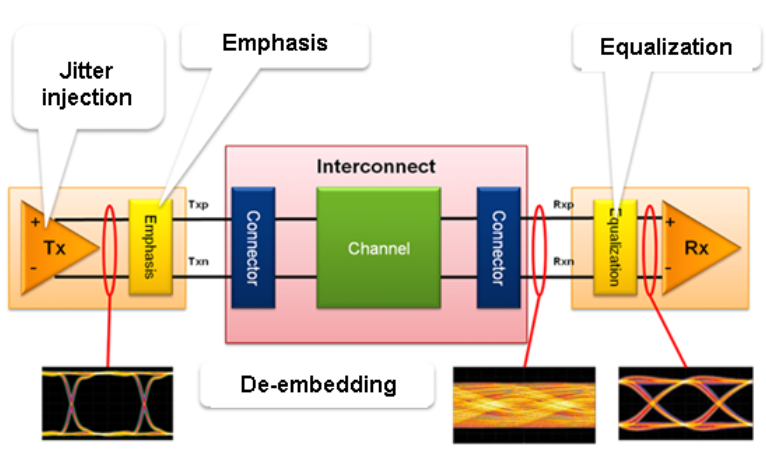
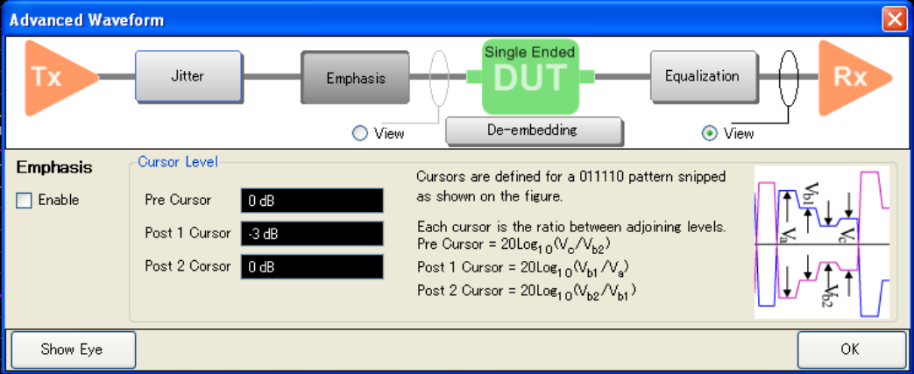

# Overview

In Advanced Waveform Analysis, emphasis and equalization helps to improve the
quality of the waveform and subsequently the quality of the eye diagram.

There are two options to display the advance waveform window:

  * Click on the Adv Waveform tab under the Setup tab and click one of these buttons: Emphasis, De-embedding, Equalization.

  * Click on Advanced Waveform button under the Eye/Mask tab

View radio button allows you to select the observation point for TDR/TDT or
Eye, according to your selection. Changing View also affects the trigger mode:

  * View before the DUT shows the Stimulus View. At this view, trigger mode at the [tool bar](../Overview/TDR_Screen_Area.md#Tool_Bar) changes to "STOP".

  * View after the DUT shows the Response View. At this view, trigger mode changes to "RUN". 

  *     * When Stimulus View is selected and the trigger mode "RUN/Single" is selected, the view changes to Response View.

[Other topics about Advanced Waveform
Analysis](Advanced_Waveform_Analysis.htm)

