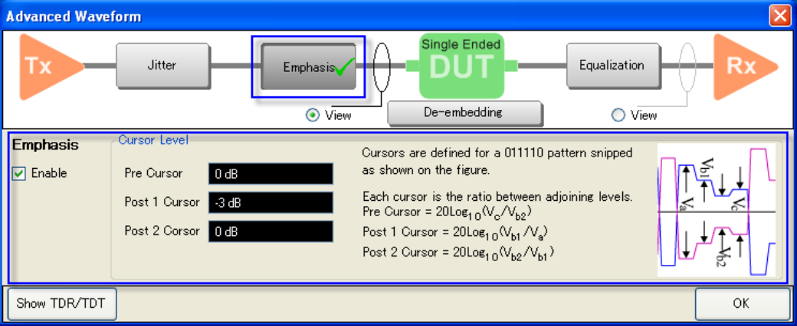

# Using Emphasis

  1. To execute emphasis, click on Emphasis button and check Enable.

  2. Cursor Level:

     * Pre cursor is the ratio between Vc and Vb2:

Pre Cursor = 20 Log10 (Vc/Vb2)

  1.      * Post 1 cursor is the ratio between Vb1 and Va:

Post 1 Cursor = 20 Log10 (Vb1/Va)

  1.      * Post 2 cursor is the ratio between Vb2 and Vb1:

Post 2 Cursor = 20 Log10 (Vb2/Vb1)

  3. When the emphasis is turned on, the [DUT length](../Setting_Up_the_Measurement/Performing_Manual_Setup.md#Setting_DUT_Length) should be larger than (1/Data Rate) × 3.

[Other topics about Advanced Waveform
Analysis](Advanced_Waveform_Analysis.htm)

