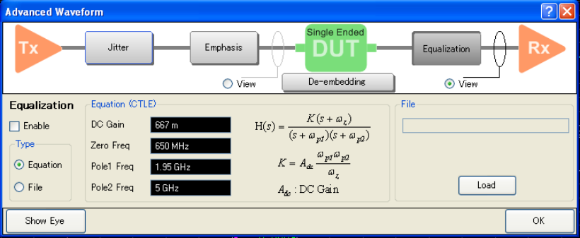

# Using Equalization

To execute equalization, click on Equalization button and check Enable.

You can either select to use the equation by specifying the variables or
equation file.

You must specify four variables in this equation in order to generate the
filter. These variables are:

  * DC Gain

  * Zero Frequency

  * Pole 1

  * Pole 2

Example of Equalization File

!Keysight Technologies !VNA-TDR Equalization File # Hz dB
1000000000,-1.53E+01,-3.27E-01 2000000000,-1.52E+01,-7.34E+01
3000000000,-1.03E+01,-8.63E+01 4000000000,-9.88E+00,-1.00E+02
\------------------------------------- ! Comment # Hz MA or DB or RI Freq1,
Data1a, Data1b Freq2, Data2a. Data2b Freq3, Data3a, Data3b . .  
---  
  
Where

MA: Dataxa = Magnitude (Linear), Dataxb = Phase

DB: Dataxa = Magnitude (dB), Dataxb = Phase

RI: Dataxa = Real, Dataxb = Image

  * If there is no Dataxb, Dataxb is taken as 0.

  * If there is no MA/DB/RI, MA is selected.

  * ! (comment) can be place at any lines (Not only top lines but also in the middle).

  * If Freq n > Freq (n+1), then the data at freq (n+1) is ignored.

  * If frequency span of setting on the VNA is wider than frequency range of data, the extrapolation is applied.

#### Error Messages

  * File Name Error: is the same as VNA error. This message appears when an error exists in the file name and hence a command is not executed correctly.

  * Failed To Read Error. This message appears when the file cannot be opened or if the file does not exist. It also occurs when the format of the file is incorrect or the number of data line is less than 2 or more than 10001.

[Other topics about Advanced Waveform
Analysis](Advanced_Waveform_Analysis.htm)

