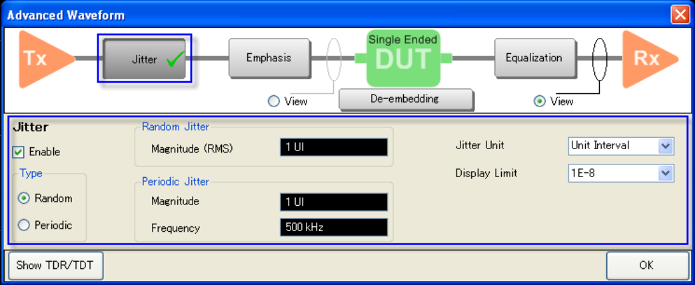
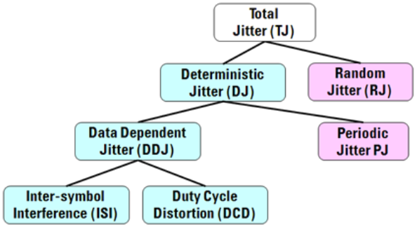

# Using Jitter Injection

  * To execute jitter injection, click on Jitter button and check Enable.

  * When Jitter Injection is turned ON, a check mark appears on the Jitter button. The Stimulus Type (under Eye/Mask tab) is automatically changed to Statistical.

See also [Bit Pattern
Type](../Eye_Diagram_and_Mask_Test/Selecting_Bit_Pattern.htm#Bit_Pattern_Type).

There are two types of jitter injection available to choose from:

  * Random Jitter - follows the Gaussian distribution and is represented by the rms value of the Random Jitter distribution.

  * Periodic Jitter - represented by peak-to-peak value.

In general, Deterministic Jitter and Random Jitter totals up to Total Jitter
(TJ). Deterministic Jitter is bounded by a finite magnitude. It can be broken
into jitter which is correlated to the data sequence and jitter that occurs
independent of data. Periodic Jitter is data independent.

Jitter Unit: You can select from Unit Interval (UI) or Second. Second = Unit
Interval / Data Rate

Display Limit: This is a probability density limit. Normally, it is not
necessary to change this from default setting. This function allows you to
execute a fine tuning of skirt of eye diagram. This applied to eye mask
result. So that, you can have the same result on the mask test by adjusting
this value. This is not applied to the eye result.

[Other topics about Advanced Waveform
Analysis](Advanced_Waveform_Analysis.htm)

