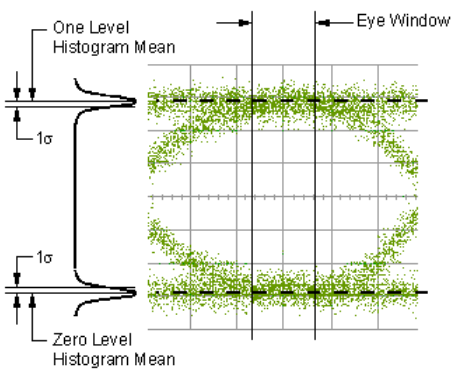
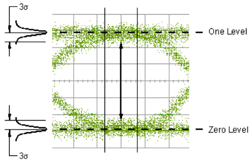

# Performing Eye Diagram Measurements

  * Overview

  * Showing Eye Diagram

  * Displaying Results

  * Scaling the Eye Diagram

  * Injecting Jitter

[Other topics about Eye Diagram and Mask Test](Eye_Diagram_and_Mask_Test.md)

## Overview

In the oscilloscope, an eye diagram is often used to analyze signal quality.
You can diagnose problems, such as attenuation, noise, jitter, and dispersion
that arise or characterize specific parts of the system with one display.

The VNA option TDR provides simulated eye diagram analysis capability,
eliminating the need for a hardware pulse pattern generator. The virtual bit
pattern generator is used to define a virtual bit pattern. The defined bit
pattern is then convolved with the device impulse response to create an
extremely accurate measurement based eye diagram.

## Showing Eye Diagram

  1. [Select the trace number](../Making_Measurements/Setting_Up_Parameters_on_Each_Trace.md#Selecting_Trace) which you want to observe the eye diagram.

  2. Click the Eye/Mask tab.

  3. Click Draw Eye to display the eye diagram.

  4. Whenever you change the setting of data pattern, it is required to click Draw Eye to reflect the setting on the waveform.

## Displaying Results

  1. Select Rise Time Def in the Results tab.

  2. Click Draw Eye to display the result.  
Whenever you change the setting of Rise Time Def, it is required to click Draw
Eye to reflect on the result.

The following results are displayed on the table under Results.

Name | Unit | Description  
---|---|---  
Rise Time | Second | Rise Time Def=10%-90%: Time at 90% level - Time at 10% level Rise Time Def=20%-80%: Time at 80% level - Time at 20% level  
Fall Time | Second | Rise Time Def=10%-90%: Time at 90% level - Time at 10% level Rise Time Def=20%-80%: Time at 80% level - Time at 20% level  
Jitter RMS | Second | 1σ width of the histogram at the eye crossing point  
Jitter p-p | Second | Full width of histogram at the eye crossing point  
Crossing Percentage | % | Crossing Height / Amplitude × 100  
Opening Factor | None | (Level One - σ one) - (Level Zero + σ zero) / Amplitude  
Signal/Noise Ratio | None | (Level One - Level Zero)/( σ one\+  σ zero)   
Duty Cycle Distortion | Second | |T rise middle \- T fall middle|  
Duty Cycle Distortion (%) | % | Duty Cycle Distortion (s)/ Bit period × 100  
Level Zero | Voltage | Histogram mean for level zero  
Level One | Voltage | Histogram mean for level one  
Level Mean | Voltage | (Level Zero + Level One) / 2  
Amplitude | Voltage | Level One - Level Zero  
Height | Voltage | (Level One - 3 σ one) - (Level Zero + 3 σ zero)   
Width | Second | Bit Period - 2 × 3 × Jitter RMS  
  
  * Bit Period = 1/Bit Rate
  * Input Amplitude = [Setting of Level One \- Setting of Level Zero](Selecting_Bit_Pattern.md)
  * T rise middle = The time at which the rising edge cross the middle threshold (50%)
  * T fall middle = The time at which the falling edge cross the middle threshold (50%)

  
  
### Overlaying the results on the waveform

  1. Select the Overlay check box in the Results tab.

  2. The following results are displayed on the screen.

     * Jitter p-p, Level Zero, Level One, Amplitude, Height (V), Width

### Saving Results into File

You can save the results as a text file.

  1. Click Export button in the Results tab. The Save Eye Result dialog box is displayed.

  2. Type your desired file name, then click Save.

Example of Result

# Option VNA-TDR Simulated Eye Results # 7/1/2010 3:10:06 PM # Level Zero,
0.00337131636124 Level One, 0.392246236818 Level Mean, 0.19780877659
Amplitude, 0.388874920457 Height, 0.372870737968 Width, 9.94598885146E-10
Opening Factor, 0.986281636548 Signal / Noise, 72.894992429 Duty Cycle
Distortion, 6.12868274149E-14 Duty Cycle Distortion (%), 0.00612868274149 Rise
Time, 4.69421997336E-11 Fall Time, 4.69412762334E-11 Jitter (PP), 6.25E-12
Jitter (RMS), 9.00185809062E-13 Cross Point (%), 49.9268781576  
---  
  
## Scaling The Eye Diagram

By default, the eye diagram is set to Auto Scale. You can also set the scale
manually.

  1. Click on the Scale/Mask tab.

  2. Select the Manual radio button. This will activate the Scale / Div and Offset options.

  3. Click in the Scale / Div text box and input the Y axis scale value.

  4. Click in the Offset text box and input the Y axis offset value.

### Mask Pattern

See [Using Mask Test](Using_Mask_Test.md) for more information.

## Injecting Jitter

See [Using Jitter
Injection](../Advanced_Waveform_Analysis/Using_Jitter_Injection.htm) for more
information.

