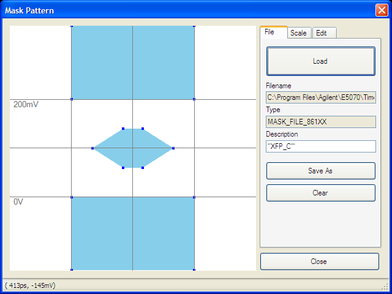
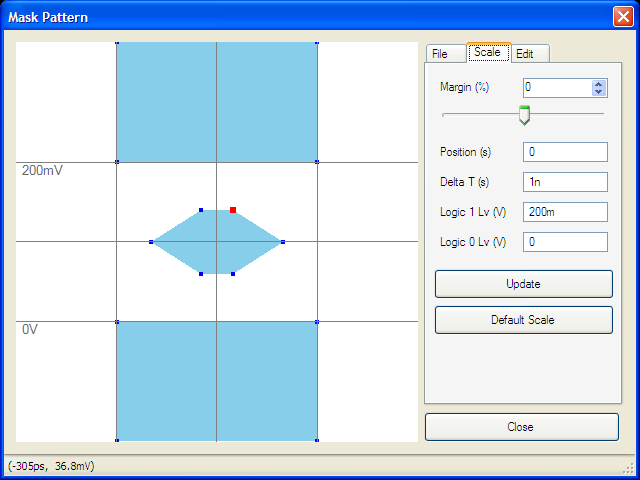
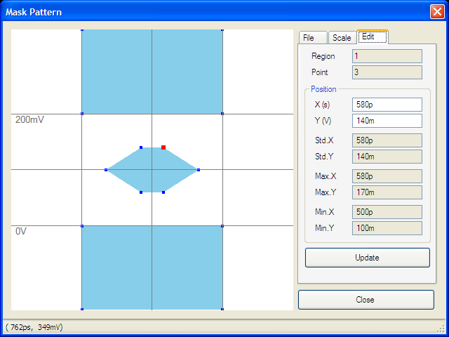

# Using Mask Test

  * Overview

  * Defining Mask

  * Executing Mask Test

[Other topics about Eye Diagram and Mask Test](Eye_Diagram_and_Mask_Test.md)

## Overview

The mask test allows you to verify that a displayed waveform complies with
industry-standards definitions for electrical waveforms. To comply with the
industry standard, the input waveform must remain outside the shaded mask
regions. The mask testing is available in Scale/Mask under the Eye/Mask tab.
The TDR uses the same format as Infiniium DCA (86100C), therefore, you can use
the MASK file (.msk) stored by DCA (86100C).

The [some masks with industry-standards definitions](Available_Masks.md) are
available in the VNA directories.

## Defining Mask

### Opening Mask File

Items |  Description  
---|---  
File Name |  Shows the file name and location which is currently selected. The [pre-defined files](Available_Masks.md) and templates files are available under C:\Program Files (x86)\Keysight\Network Analyzer\masks.  
Type |  Shows the Mask File Identifier. In case of Infiniium DCA, this identifier should be "MASK_FILE_861XX". However, the VNA does not care about the identifier. The VNA will accept it even if this is other than "MASK_FILE_861XX".  
As the pre-installed MASK files are compatible with Infiniium DCA,
"MASK_FILE_861XX" is displayed when you use pre-installed MASK files. It is
not possible to change this in the Mask Pattern Dialog box.  
Description |  Shows the description of MASK file. You can change this in the Mask Pattern Dialog box.  
  
####

#### Loading Mask File

  1. Select the Eye/Mask tab.

  2. Click the Mask Pattern button in the Scale/Mask tab, then the Mask Pattern dialog is displayed.

  3. Select the File tab.

  4. Click Load , then the Load Mask Pattern dialog is displayed.

  5. Select your desired mask file, then click Open.

     * If the message prompting you to include absolute values for zero/one level is displayed, define the values of the logic 1 and logic 0 levels in the Logic 1 Lv (V) and Logic 0 Lv (V) in the Scale tab then save the file.

  6. Click Close to exit the Mask Pattern dialog box.

The pre-defined files are read-only file. As you cannot overwrite on them,
save the file by clicking Save As.

### Scaling Mask

Parameters |  Description  
---|---  
Margin (%) |  Set the size of the mask margin. Mask margins are used to determine the margin of compliance for a standard or scaled mask  
Position (s) |  Move X-axis location of mask  
Delta T (s) |  Change X-axis width of mask  
Logic 1 Lv (V) |  Change voltage of logical 1.  
Logic 0 Lv (V) |  Change voltage of logical 0  
  
####

#### Changing Margin, Position, Delta T and Logic 0/1 Lv

  1. Load the Mask Pattern. 

  2. Select the Scale tab.

  3. Change the margin number using slider, or typing number.

  4. Click the box at your desired parameter of position, delta T and logic 0/1 level.

  5. Type the number you want to set.

  6. Click Update to apply the entered number.

  7. Click Close > Yes to save the modified scale.

#### Set Value at Default

Click Default Scale to set the parameter at default.

### Editing Mask

Parameter |  Description  
---|---  
Region |  The currently selected region number. The region number defines a mask violation area (or polygon).  
Point |  The currently selected point number. The point number defines a point in the region.  
X (s) and Y (V) |  The X and positions for the selected point. You can enter the number to change the selected position location.  
Std.X and Std.Y |  The X and Y positions when Margin in Scale Tab is selected at 0%. This shows the positions of STD in the .msk file.  
Max.X and Max.Y |  The X and Y positions when Margin in Scale Tab is selected at 100%. This shows the positions of MARGIN_MAX in the .msk file.  
Min.X and Min.Y |  The X and Y positions when Margin in Scale Tab is selected at -100%. This shows the positions of MARGIN_MIN in the .msk file.  
  
  1. Load the Mask Pattern. 

  2. Select the Edit tab.

  3. Move the position of points by either way.

  * Using Mouse

  1.      1.         1. Click the desired point on the figure of mask, then the point is selected (the point color becomes red).

        2. Move the point with drag and drop on the mouse to your desired position.

  * Entering Position

  1.      1.         1. Click desired point on the figure of mask, then the point is selected.

        2. Click entry box of X(s) under position, then type number for X axis.

        3. Click entry box of Y(V) under position, then type number for Y axis.

        4. Click Update to apply the entered number on the selected point.

  4. Click Close > Yes to save the modified pattern.

## Executing Mask Test

  1. Select the Mask Test check box in the Scale/Mask tab.

  2. Click Draw Eye to redraw eye pattern and mask.

  3. The mask and pass/fail result is displayed on the screen

