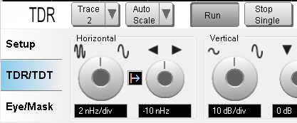

# Controlling Trigger

## Making Single/Continuous measurement

### Single measurement

  * Click on the Stop Single button to enable single measurement.

### Continuous measurement

  * Click on the Run button to enable continuous measurement.

[Other topics about Making Measurement](Making_Measurements.md)

