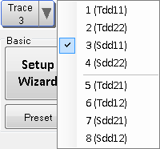
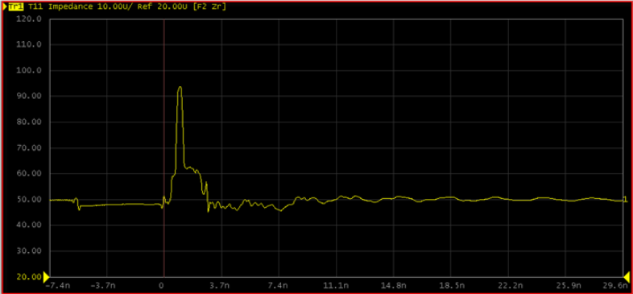
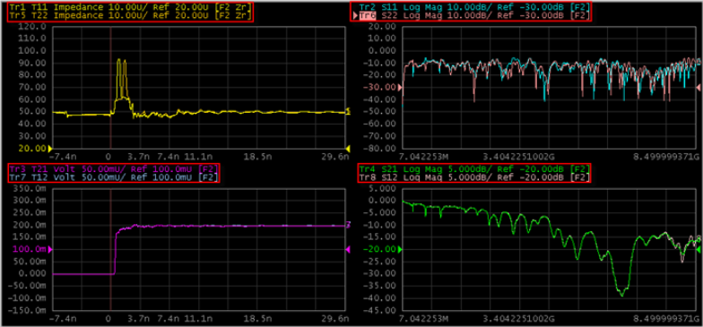
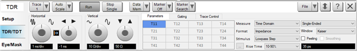

# Setting Up Parameters on Each Trace

  * Selecting Trace

  * Changing Displayed Trace

  * Selecting Parameters

  * Defining the Stimulus

  * Peeling

  * Smoothing

[Other topics about Making Measurement](Making_Measurements.md)

## Selecting Trace

#### Using Mouse

  * Double-click on any area of the graph plot to exit from full view.

  * Click on the desired trace to select the trace.

#### Using Hardkey/SoftTab/Softkey

  * Press the Prev or Next hardkey.

#### Using Softkey in TDR GUI

Click on the Trace button and select the trace number from the list as shown
below.

Note: The number of traces is changeable and up to 16 traces can be displayed
in this option. 16 traces are displayed when Differential 2-port DUT topology,
and all time domain (T) and all S-parameter (S) traces are selected.

## Changing Displayed Trace

### Changing Displayed Trace

#### Using Mouse

  1. Double-click on the single trace graph window to exit from full view of active trace as shown below.

  2. Double-click on the desired trace for full view.

## Selecting Parameters

Click on the TDR/TDT tab in order to get to the Parameters tab selection as
shown below.

The table below shows the Measurement and Format available under the Parameter
setting:

Measure | Format  
---|---  
S-Parameter | Log Mag  
Linear  
Real  
Imaginary  
Group Delay  
SWR  
Phase  
Expand Phase  
Positive Phase  
Smith (Re/Im)  
Smith (G + jB)  
Polar (Re/Im)  
Time Domain | Impedance  
Volt  
Log Mag  
Linear  
Real  
  

The table in the Parameter area changes as the selection of Measure changes.
The changes can be referred as below:

Measure | Table Content starts with  
---|---  
S-Parameter | Single-Ended | S  
| Differential | Sc, Sd  
Time Domain | Single-Ended | T  
| Differential | Tc, Td  
  
## Defining the Stimulus

There are two options to choose from under the Stimulus:

  * Lowpass Step

  * Lowpass Impulse

The selection for Rise Time is active in the Lowpass Step with Kaiser Window
Type only. The two options for Rise Time are:

  * 10-90%

  * 20-80%

The rise time settings in TDR/TDT mode and Eye/Mask mode are independent.

## Window

Note: TD Transform Window is a Licensed Feature. Learn more about [Licensed
Features](../../../Support/Software_Support.htm).

The window type selects the window for time domain transform. This is a
licensed feature requires the subscription.

  * Kaiser window has relatively high dynamic range.

  * Rectangle window has unity amplitude for all time samples and has the same effect as not applying a window. 

  * Hamming window does not attenuate signal at both ends to zero and will have slight discontinuity.

  * Hann (Hanning) window attenuates signal at both ends to zero and removes any discontinuity.

  * Bohman window is a product of a triangle window with a single cycle of a cosine with the same period. A corrective term is added that sets the first derivative to zero at the ends.

## Peeling

When a device has two or more impedance discontinuities, reflections from the
second discontinuity reflects off the first discontinuity. This complex
interaction of secondary reflections from the stimulus pulse compromises the
measured impedance profile and decreases the measurement performance.

TDR peeling compensates for the complicated interaction between the
discontinuities. TDR peeling analysis reflects the signals at the source and
de-convolves the time domain reflections to create an impedance profile of the
device being tested. This option is available when the measurement parameter
is set to time domain reflection and the format is impedance.

### Limitation

  * TDR peeling does not account for frequency response losses (for example, PC board transmission lines are lossy devices). The sum of the waves that are incident on a node are assumed to be equivalent to those exiting the node.

  * TDR peeling assumes a lossless transmission line (resistance of 0). Any actual resistance (which causes loss, even at DC) degrades the accuracy of peeling.

  * Initial impedance mismatch is the most accurate; as distance increases from initial impedance mismatch down the transmission line, the impedance accuracy decreases.

  * TDR peeling cannot be used on TDT responses, because the lack of reflections invalidates the algorithm.

### How to set Peeling

  1. Click TDR/TDT tab.

  2. Select the Peeling check box in the Parameter tab.

## Smoothing

Smoothing is only available when S-Parameter is measured and only applicable
to reflection coefficient only (S11, S22, S33, S44).

### How to set Smoothing

  1. Click TDR/TDT tab.

  2. Select the Smoothing check box in the Parameter tab.

