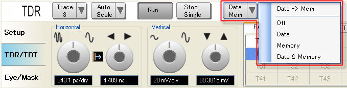

# Using Data and Memory

  * [Storing Data Traces to Memory](Using_Data_and_Memory.md#Storing_Data_Traces_to_Memory)

  * [Display the Memory Traces](Using_Data_and_Memory.md#Display_the_Memory_Traces)

[Other topics about Making Measurement](Making_Measurements.md)

Data displayed on the graph plot can be stored in the memory and recalled for
later use. Data traces stored in the memory will be deleted once TDR option
restarts.

## Storing Data Traces to Memory

  1. Click on the Data Mem button.

  2. Select Data -> Mem from the list.

## Display the Memory Traces

  1. Click on the Data Mem button.

  2. Select Memory from the list.

Table below explains other functions in the Data Mem list:

Function | Details  
---|---  
Data -> Mem | Save Data traces to Memory  
Off | Display off  
Data | Display Data traces only  
Memory | Display Memory traces only  
Data & Memory | Display Data and Memory traces

