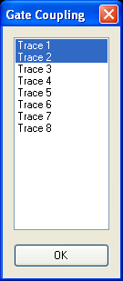
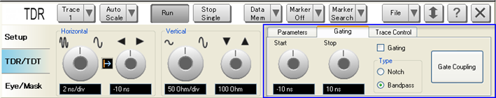
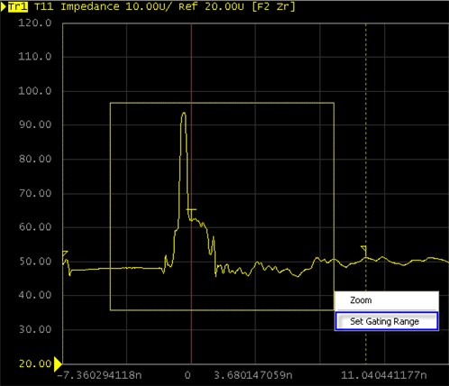

# Using Gating

  * Overview

  * Coupling Gate on Several Traces

  * Setting Start/Stop Points

  * Selecting Gating Type

  * Activating Gate

[Other topics about Making Measurement](Making_Measurements.md)

## Overview

Gating provides the ability to observe the effect of a particular circuit
element on frequency domain response by virtually removing undesired
responses. When you define a gate on time domain plot, the gated section is
removed and replaced mathematically with an ideal transmission line having the
same electrical delay as the removed section. Gating is applied to time plots
of individual parameters. While gating the time domain plot of a parameter,
you can observe the effect that gating has on the frequency domain of the same
parameter by coupling the relevant traces using the gate coupling feature. By
observing the original frequency domain response and the transformed frequency
domain response, the effect of the gating operation on the S-parameter data
can be seen.

When a discontinuity in a test device reflects energy, that energy will not
reach subsequent discontinuities. This can "MASK", or hide, the true response
which would have occurred if the previous discontinuity were not present. The
Gating feature does NOT compensate for this.

## Coupling Gate on Several Traces

Gate Coupling allows two or more traces to share the same gating values. The
gating value of the active trace is coupled to other trace(s).

It is used to observe the gated frequency response while setting a gate on
time response.

### Operational procedure

  1. Click the TDR/TDT tab.

  2. Under TDR/TDT, click the Gating tab. 

  3. Under Gating, click the Gate Coupling button.

  4. The Gate Coupling dialog box appears.

  5. Select the time domain trace and the associated S-Parameter trace. For example, trace of T11 and trace of S11.

  6. Click OK.

The gate coupling should not be applied to unrelated responses. For example,
TDR (T11) and Insertion Loss (S21).

Selecting a lot of traces the gate coupling makes the response of virtual
knobs slow. Type your desired value instead of rotating virtual knobs to
specify the value.

## Setting Start/Stop Points

Gating is set on the active trace. There are several methods to set the start
and stop points of the gate:

### Setting points at gating tab

  1. Click the TDR/TDT tab.

  2. Under TDR/TDT, click the Gating tab.

  3. Click on the Start or Stop virtual knob.

  4. The knob is highlighted in blue once its enabled.

  5. Click on the virtual several times clockwise to increase the value and anti-clockwise to decrease the value.

  6. You can observe the start or stop time in the text box below the virtual knob and gate markers on the active trace. 

  7. Optionally, you can click the text box under the Start or Stop virtual knob.

  8. An Entry dialog box appears.

  9. Type the start or stop time and click OK.

  10. The new value will be displayed at text box and x-axis of the active trace. 

The Start virtual knob and text box sets the start time and the Stop sets the
stop time.

The start time and stop time should be set at a point on which the impedance
is close to the reference impedance.

### Setting points at active trace graph plot

  1. On the time domain active trace, drag your mouse across the area to set the gating.

  2. Select Set Gating Range.

  3. You can observe two dashed lines indicating the gate on the graph plot. These are gate markers.

  4. You can also observe the time value in the text box below the virtual knob under the Gating tab in the TDR/TDT area.

## Selecting Gating Type

The Enhanced Time Domain Analysis module allows you to choose from the
following two gate types:

Gate type | Description  
---|---  
Band pass | Removes response outside the gate range  
Notch | Removes response inside the gate range  
  
### Operational procedure

  1. Click the TDR/TDT tab.

  2. Under TDR/TDT, click the Gating tab. 

  3. Under Gating, select one of the gating types from the Type area.

## Activating Gate

Ensure that you have set the start and stop time. Then follow the following
procedure:

  1. Click the TDR/TDT tab.

  2. Under TDR/TDT, click the Gating tab. 

  3. Under Gating, select the Gating check box.

### Switch Gating State

  1. Right-click on the time domain active trace.

  2. Select Switch Gating State.

  3. If gating was turned ON earlier, this step will turn it OFF and vise versa. You can observe the changes in the Gating check box.

