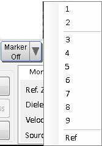
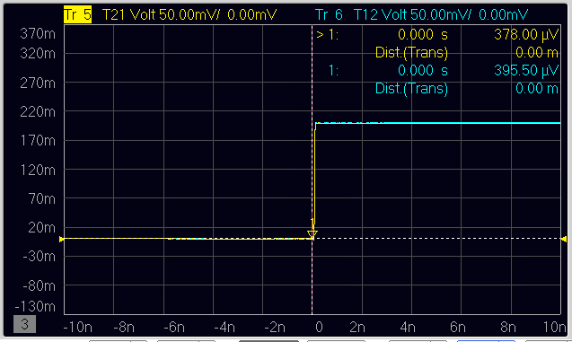

# Using Marker and Marker Search

  * Activating Marker

  * Moving Marker

  * Using Reference Marker

  * Searching Max/Min Points on Trace

  * Measuring Rise Time

  * Measuring Delta Time

[Other topics about Making Measurement](Making_Measurements.md)

## Activating Marker

  1. Click on the Marker Off button.

  2. Select 1 from the list to activate Marker 1.

  3. The marker button shows Marker Off when there is no active markers. The marker button shows Marker Ref when reference marker is active. This applies to all markers. Active marker has an arrow head pointing down. Inactive markers have an arrow head pointing up. Only markers 1 and 2 have vertical dotted lines. All marker values are displayed at the upper right corner of the graph view. There are a maximum of 9 markers that can be activated.

## Moving Marker

  * Click and hold on the marker, drag the marker to the desired point and release the mouse button.

## Using Reference Marker

When reference marker is used, all 9 markers use reference marker as reference
point.

  1. Click on the Marker Off button.

  2. Select Ref from the list.

Moving reference marker is similar to moving marker. Simply choose the
reference marker instead of the marker number.

## Searching Max/Min Points on Trace

### Searching Max point on trace

  1. Click on the desire trace.

  2. Click on the Marker Search button.

  3. Select Max from the list.

### Searching Min point on trace

  1. Click on the desire trace.

  2. Click on the Marker Search button.

  3. Select Min from the pull down menu.

  4. The marker is constantly on tracking mode when Max or Min is selected. Even moving the marker with the mouse, the marker tracks the Max or Min of the trace and points to it.

## Measuring Rise Time

  1. Click on the desire trace.

  2. Click on the Marker Search button.

  3. Select Rise Time (10-90%) or Rise Time (20-80%) from the list.

The data is displayed at the top right corner of the graph plot.

## Measuring Delta Time

Delta Time measurement available for Time Domain. Traces other than time
domain are not able to use for delta time measurement. Delta time is compared
with trace save in memory, if available, else it is compared with the trace
selected.

  1. Click on the trace that is the starting point for the Delta Time.

  2. Click on the Marker Search button.

  3. Select Δ Time from the list and select the Δ Time checkbox.

  4. Select the trace that will be the stopping point.

  5. The trace of the starting point can not be changed, therefore it is selected at the beginning. You can compare Data with Memory, by selecting the same trace. (only if Data & Memory is selected using the Data Mem button)

  5. Select the Position to be measured.

  6. Click on the OK button.

The data is displayed at the top right corner of the graph plot.

