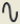
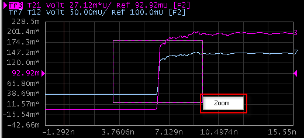

# Using Scale/Zooming

  * Using Autoscale

  * Changing Scale Manually

  * Zooming

[Other topics about Making Measurement](Making_Measurements.md)

## Using Autoscale

  1. Select the trace which you want to change the scale.

  2. Click on the Auto Scale button on the tool bar or right-click in the graph plot area.

  3. Select the desired scale. Refer to the table below for the details of each selection.

Scale |  Details  
---|---  
Auto Scale X |  Auto scaling X axis only, on the active trace  
Auto Scale Y |  Auto scaling Y axis only, on the active trace  
Auto Scale X & Y |  Auto scaling both X & Y axis, on the active trace  
Auto Scale All |  Auto scaling both X & Y axis, on all traces  
  
## Changing Scale Manually

### Changing Horizontal Scale

  1. Select the trace which you want to change the scale.

  2. Click the TDR/TDT tab.

  * Using Virtual knob

  1.      1. Click the left knob under Horizontal. The center of the knob turns blue.
     2. Scroll up or down the wheel mouse button to change the scale.

  * Type in Entry box

  1.      1. Click in the box below the left knob under Horizontal. An Entry dialog box appears.

     2. Type the precise value.

  * Clicking Wave icons

  *     1. Click the wave icons above the left knob under Horizontal. Details are as table below:

Function Icon |  Details  
---|---  
 |  Click to increase the scale in a 1-2-5 sequence. The width of the waveform compresses. The default value for basic time units is 1.0 ns/div  
 |  Click to decrease the scale in a 1-2-5 sequence. The width of the waveform expands.  
  
####

#### Reference Position for Horizontal Axis

The reference point of horizontal axis can be selected from the center line or
left edge of the displayed graticule.

Click the icon as shown in table below under Horizontal to change the
reference point:

Function Icon |  Details  
---|---  
 |  Reference point of the display graticule to the left edge. The position of left edge is not changed even if you change the scale.  
 |  Reference point of the display graticule to the center. The position of center is not changed even if you change the scale.  
  
### Changing Horizontal position

  1. Select the trace which you want to change the horizontal position.

  2. Click the TDR/TDT tab.

  * Using Virtual knob

  1.      1. Click the right knob under Horizontal. The center of the knob turns blue.
     2. Scroll up or down the wheel mouse button to change the position.

  * Type in Entry box

  1.      1. Click the box below the right knob under Horizontal. An Entry dialog box appears.
     2. Type the precise value.

  * Clicking Arrow icons

  *     1. Click the arrow icons above the right knob under Horizontal. Details are shown in the table below:

Function Icon |  Details  
---|---  
 |  Click to increase the delay from trigger; the waveform moves to the left of the display.  
 |  Click to decrease the delay from trigger; the waveform moves to the right of the display.  
  
### Changing Vertical Scale

  1. Select the trace which you want to change the scale.

  2. Click the TDR/TDT tab.

  * Using Virtual knob

  1.      1. Click the left knob under Vertical. The center of the knob turns blue.
     2. Scroll up or down the wheel mouse button to change the scale.

  * Type in Entry box

  1.      1. Click the box below the left knob under Vertical. An Entry dialog box appears.
     2. Type the precise value.

  * Clicking Wave icons

  *     1. Click the wave icons above the left knob under Vertical. Details are as table below:

Function Icon |  Details  
---|---  
 |  Click to increase the scale in a 1-2-5 sequence; the waveform height compress.  
 |  Click to decrease the scale in a 1-2-5 sequence; the waveform height will expand.  
  
### Changing Vertical Position

  1. Select the trace which you want to change the vertical position.

  2. Click the TDR/TDT tab.

  * Using Virtual knob

  1.      1. Click the right knob under Vertical. The center of the knob turns blue.
     2. Scroll up or down the wheel mouse button to change the position.

  * Type in Entry box

  1.      1. Click the box below the right knob under Vertical. An Entry dialog box appears.
     2. Type the precise value.

  * Clicking the Arrow icons

  1.      1. Click the arrow icons above the right knob under Vertical. Details are as table below:

Function Icon |  Details  
---|---  
 |  Click to increase the offset value; the waveform shift downward.  
 |  Click to decrease the offset value; the waveform shift upward.  
  
  * Drag and drop

  1. Click and hold the y-axis of the graph plot.
  2. Drag up or down to the desired position and release the button.

## Zooming

To zoom in the graph plot:

  1. Left-click and hold the mouse button.

  2. Drag the area you would like zoom and release the mouse button.

  3. Select zoom as shown below.

