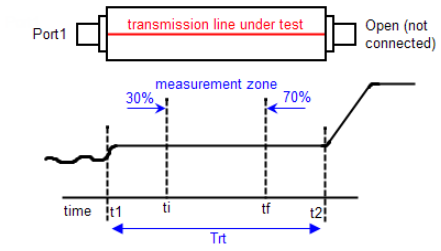
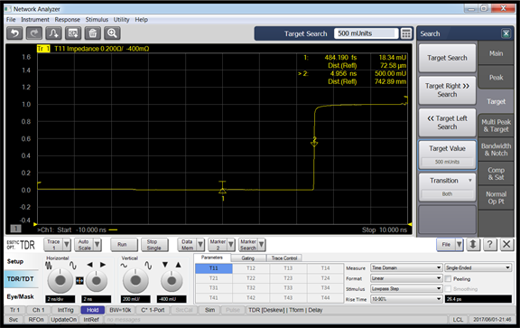
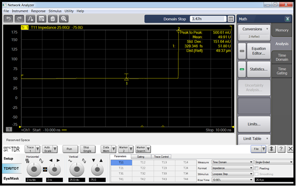

# TDR - PCB Impedance Measurement Example

This measurement example describes how to measure the characteristic impedance
of a single-ended transmission line within a defined zone.

Ensure that the VNA-TDR application is in [Advanced
Mode](../Advanced_Mode/Activating_and_Deactivating_Advanced_Mode.htm) in order
to follow this example.

Before beginning the PCB impedance measurement, we need:

  * Set Measurement Conditions

  * Define Measurement Zone

  * Set Measurement Zone and Measure Characteristic Impedance

[Other topics about Measurement Examples](Measurement_Examples.md)

## Set Measurement Conditions

  1. Click Setup > Setup Wizard.

  2. Select Deskew then click Next.

  3. Select Single Ended 1-Port and click Next.

  4. Follow the instructions then click Deskew. When finished, click Next.

  5. Follow the instructions then click Measure. When finished, click Next.

  6. Click Finish.

## Define Measurement Zone

Using VNA-TDR application GUI:

  1. Disconnect the DUT.

  2. Click Trace > 1 and double-click on the trace.

  3. Click TDR/TDT > Parameters > Linear (under Format).

  4. Click AutoScale > X & Y to adjust timebase for the entire response of the DUT is visible.

  5. Click Marker > 1.

Using Hardkey/SoftTab/Softkey (on the right side of the screen):

  6. Click Search > Target > Target Value.

  7. Type 0.5 target value into the Target Search entry box then click Target Search. These steps locate the instant t1 on the TDR waveform where the open discontinuity occurs.

  8. Connect the DUT.

Using VNA-TDR application GUI,

  9. Click Marker > 2.

Using Hardkey/SoftTab/Softkey (on the right side of the screen),

  10. Click Search > Target > Target Value.

  11. Type 0.5 target value into the Target Search entry box then click Target Search. These steps locate the instant t2 on the TDR waveform where the open discontinuity occurs.

Calculate the measurement zone using the formulas below.

Compute the round trip propagation time of the transmission line:

Trt = t2 -t1 = 4.96 ns - 0 = 4.96 ns (refer to the figure below)

Determine the initial instant, ti, of the measurement zone:

ti = t1 + 30%Trt = 0 + (0.3)×4.96 ns = 1.49 ns

Determine the final instant, tf, of the measurement zone:

tf = t1 + 70%Trt = 0 + (0.7)×4.96 ns = 3.47 ns

## Set Measurement Zone and Measure Characteristic Impedance

  1. Click TDR/TDT > Parameters > Impedance (under Format).

  2. Click TDR/TDT. Type in 25 into scale/div (left) entry box under Vertical.

  3. Click TDR/TDT. Type in -75 into position (right) entry box under Vertical.

Using Hardkey/SoftTab/Softkey (on the right side of the screen):

  4. Click Search > Main > Domain then select User 1.

  5. Click Search > Main > Domain Start. Type in 1.49 ns in the entry box.

  6. Click Search > Main > Domain Stop. Type in 3.47 ns in the entry box.

  7. Click Math > Analysis > Statistics.... The Trace Statistics dialog is displayed.

  8. In the Trace Statistics dialog, select User 1 from the drop down menu then click OK.

  9. Click the left side (small button) of Math > Analysis > Statistics... to enable statistics and measure the characteristic impedance.

The characteristic impedance is the mean value, 49.91 U.

