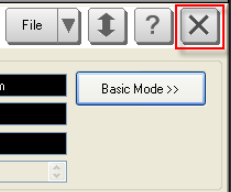

# Starting and Exiting TDR Application

  * Starting TDR Application

  * Exiting TDR Application

[Other topics about Overview](Overview.md)

## Starting TDR Application

  1. On the VNA, press Meas > S-Param > Meas Class....

  2. Select TDR, then click OK.

  3. In the Confirm Measurement Class Change dialog, click OK to proceed or Cancel to exit.

  4. The TDR application is displayed.

Starting TDR application remotely

  * [SYST:TDR:PRESet](../../../Programming/GP-IB_Command_Finder/TDR_System.md#SYSTem:TDR:PRESet) launches TDR application without VNA-TDR GUI.

## Exiting TDR Application

There are two ways to exit the TDR application.

  1. Select a different Measurement Class for the currently active channel.

  2. Select the Exit button in the TDR Setup dialog.

Exiting TDR application remotely

  * [SYST:PRESet](../../../Programming/GP-IB_Command_Finder/System.md#pre) quits TDR application (VNA-TDR GUI is closed if exists.)

