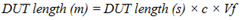

# TDR Measurement Considerations

  * Channel and Trace Concepts

  * Device Under Test (DUT) Considerations

  * Test Cable and Connector Considerations

[Other topics about Overview](Overview.md)

## Channel and Trace Concepts

It is important for oscilloscope users to note the difference in the concept
of channel in oscilloscope and network analyzer.

In network analyzer, channel is referred to the window for displaying traces.
Because a channel corresponds to a window, it is called a channel window.

On the other hand, the points on the front panel of the network analyzer where
cables and DUTs are connected are called test ports. These test ports are not
channels and do not directly associate with channel windows.

The VNA, for example allows you to use up to 150 channels to perform
measurements under 150 different stimulus conditions. All traces that are
assigned to a channel share the same channel settings.

To learn more about setting the channel and traces, refer to [Traces,
Channels, Windows, and
Sheets](../../../S0_Start/Traces_Channels_and_Windows.htm).

Enhanced Time Domain Analysis option allows you to use channel 1 only. Up to
16 traces can be displayed in this option (when Differential 2-Port DUT
topology and all T or all S traces are selected).

## Device Under Test (DUT) Considerations

### Maximum DUT Lengths

To convert from DUT length in seconds to distance in free space, multiply the
value in time by c, the speed of light in free space. To calculate the actual
physical length, multiply this value in free space by Vf, the relative
velocity of propagation in the transmission medium. (Most cables have a
relative velocity of 0.66 for a polyethylene dielectric or 0.7 for a PTFE
dielectric.)

### AC coupled (DC cut) DUTs

Caution is required when measuring AC coupled (DC cut) DUTs.

The response after the capacitor cannot be measured correctly, because the
capacitor response overlaps the response from the input and may cause
measurement errors.

When measuring AC coupled devices, make sure that the following two conditions
are satisfied for proper measurements.

  * Capacitance should be equal to or greater than 10 nF

  * DUT length should be equal to or less than 6.25 nsec (1.25 meters at ε=2.25)  
  
DUT length is the actual length of the DUT, not DUT Length in the Setup tab in
the TDR GUI.

When the above conditions are not satisfied, either:

  * Short circuit the capacitor

  * Provide open termination at one end of the capacitor and measure from the opposite side. 

## Test Cable and Connector Considerations

Using high quality cables to connect the DUT is recommended in order to
minimize measurement degradation. The cables should have low loss, low
reflections, and minimum performance variation when flexed.

Note: When performing deskew and loss compensation, the same type of cable
must be used for all test ports, but they do not necessarily have to be of the
same length.  
  
When performing deskew or deskew and loss compensation, use a single connector
interface type, such as SMA, or Type-N, for all of the ports to obtain the
best results.

