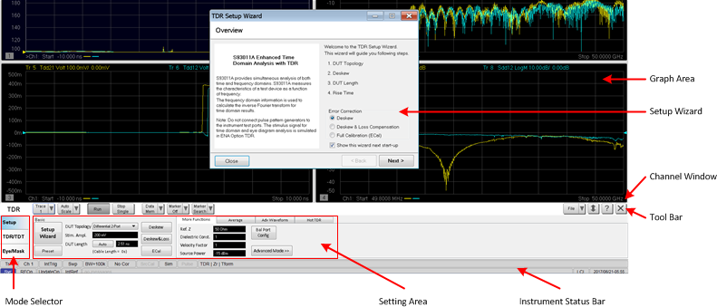
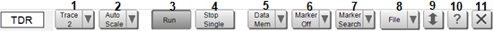

# TDR Screen Area

TDR screen area appears at the bottom of the standard screen.

## Graph Area

The results of measurements such as Time Domain, S-Parameter, and Eye are
displayed here. Operation with mouse is accepted.

## Setup Wizard

[Using Setup Wizard](../Setting_Up_the_Measurement/Using_Setup_Wizard.md)

## Instrument Status Bar

[Instrument Status Bar](../../../Front_Panel/XScreen.md#Status)

## Channel Window

In addition to the standard status bar, there is a TDR indicator at the right
corner of the channel window. This indicator is turned ON only when the TDR
option is turned ON. The TDR indicator is blue in basic mode and changes to
yellow when advanced mode is turned ON. This indicator also changes according
to the Cal status, as shown in the following table:

Cal | Indicator  
---|---  
Off | TDR  
Deskew | TDR [Deskew]  
DLC | TDR [DLC]  
ECal | TDR [Full]  
ECal&Deskew | TDR [Full+]  
  
Others | Indicator  
---|---  
Hot TDR Mode | TDR ?  
  
## Tool Bar

Frequently used standard functions are displayed here. These functions are
synchronized with TDR options and modes.

No. | Functions | Details  
---|---|---  
1 | Active Trace | [Setting up Parameters on Each Traces](../Making_Measurements/Setting_Up_Parameters_on_Each_Trace.md)  
2 | Auto Scale | [Using Scale/Zooming](../Making_Measurements/Using_Scale_Zooming.md)  
3 | Run | [Controlling Trigger](../Making_Measurements/Controlling_Trigger.md)  
4 | Stop/Single | [Controlling Trigger](../Making_Measurements/Controlling_Trigger.md)  
5 | Data Mem | [Using Data/Memory](../Making_Measurements/Using_Data_and_Memory.md)  
6 | Marker | [Using Marker/Marker Search](../Making_Measurements/Using_Marker_and_Marker_Search.md)  
7 | Marker Search | [Using Marker/Marker Search](../Making_Measurements/Using_Marker_and_Marker_Search.md)  
8 | File | [Storing Data and Setting](../Storing_Data_and_Setting/Storing_Data_and_Setting.md)  
9 | Minimize | Minimizes the Setting Area. Only tool bar is displayed.  
10 | Help | Executes TDR Online Help  
11 | Exit | [Exiting TDR application GUI](Starting_and_Exiting_TDR_Application.md)  
  
Note: Buttons 1 to 5 and 9 to 12 are always displayed regardless of the
selected mode. Buttons 6 to 8 do not appear in the Eye mode, and the
measurement parameter is displayed on the surface of Button 3 (instead of Auto
Scale).

## Mode Selector

You can selected one of the three available TDR modes:

  * [Setup](../Setting_Up_the_Measurement/Setting_Up_the_Measurement.md)

  * [TDR/TDT](../Making_Measurements/Making_Measurements.md)

  * [Eye Mask](../Eye_Diagram_and_Mask_Test/Eye_Diagram_and_Mask_Test.md)

The mode changes when one of these tabs are selected. Once selected, the mode
is highlighted. The displayed setting area changes corresponding to the
selected mode.

## Setting Area

The setting area changes and is displayed according to the selected mode.

[Other topics about Overview](Overview.md)

