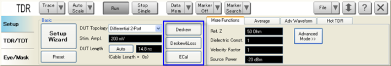
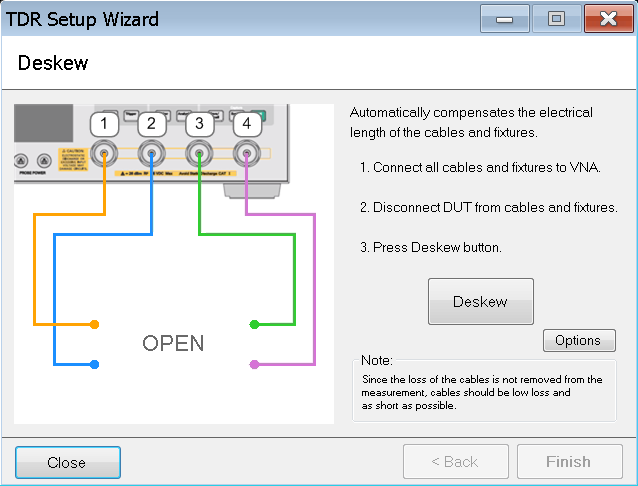
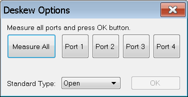
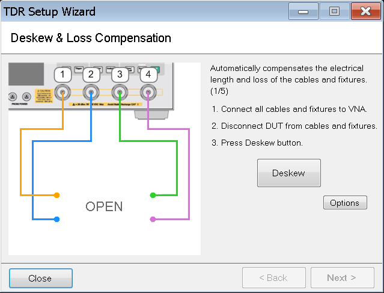
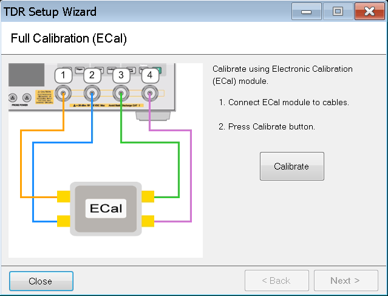
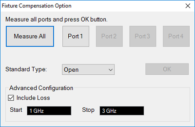

# Performing Error Corrections

  * Overview

  * Deskew

  * Deskew and Loss Compensation

  * Full Calibration (ECal)

[Other topics about Setting Up Measurement](Setting_Up_the_Measurement.md)

## Overview

There are many different approaches of removing the effects of the test
fixture and cables from the measurement. The level of difficulty for each
error correction technique is related to the accuracy of each method. As such,
TDR gives you the flexibility of selecting the desired error correction.

There are three error correction options available, as stated below:

  * Deskew

  * Deskew and Loss Compensation

  * Full Calibration (ECal)

If you [use the Setup Wizard](Using_Setup_Wizard.md), you will be guided
though step-by-step to perform the Enhanced Time Domain Analysis measurement
setup. This includes performing the error correction. Optionally, you can
perform the error correction manually using the Setup tab.

Note: The TDR indicator at the [channel
window](../Overview/TDR_Screen_Area.htm#Channel_Window) also shows the TDR
deskew and calibration status.

## Deskew

Deskew automatically compensates the electrical length of the cables and
fixtures. Deskew mathematically extends the calibration reference plane to the
DUT, hence removes the delay from the test setup effectively. This error
correction technique provides good results if the cable and fixture are very
well designed.

As deskew does not compensate the loss of cables in the measurement, cables
should be low loss and as reasonably short as possible.

  1. Click the Deskew button under Basic.

  2. The Deskew dialog box of the Setup Wizard appears.

  3. Follow the instructions on the wizard and click the Deskew button in the dialog box.

  5. Deskew is performed and a check mark appears beside the Deskew button.

  6. Alternatively, you can deskew one port at a time. To perform this, instead of clicking the Deskew button, click the Options button in the dialog box.

  7. At the Deskew Options dialog box, you can click one port at a time to deskew it.

  8. Click Measure All to perform deskew on all the ports. This action is the same as clicking the Deskew button. You must deskew all the active ports.

  9. At Standard Type, select either Open or Short deskew.

  10. Click OK to close the Deskew Options dialog box.

  11. Once complete, click Finish on the dialog box.

## Deskew and Loss Compensation

Deskew and loss compensation mathematically extends the calibration reference
plane to the DUT, hence removes the delay and loss from the test setup
effectively. This error correction technique is a good compromise between
level of difficulty and accuracy.

The same type of cable must be used for all test ports. However, they do not
necessarily have to be of the same length.

  1. Click the Deskew & Loss button under Basic.

  2. The Deskew & Loss Compensation dialog box of the Setup Wizard appears.

  3. The Deskew & Loss Compensation is a three-step process.

  4. Follow the instructions on the wizard and click the Deskew button in the dialog box.

  5. Alternatively, you can deskew one port at a time, just as in Deskew. To perform this, instead of clicking the Deskew button, click the Options button in the dialog box.

  6. At the Deskew Options dialog box, you can click one port at a time to deskew it.

  7. Clicking Measure All performs deskew on all the ports at the same time. This action is the same as clicking the Deskew button. You must deskew all the active ports.

  8. At Standard Type, select either Open or Short deskew.

  9. Click OK to close the Deskew Options dialog box.

  10. At Step 2, connect a thru between the ports as per the instruction on the dialog box then click Measure.

     * Use thru with a short and low loss.

  11. At Step 3, connect a load to the ports one by one then click the associate button accordingly. Once complete, click Apply to save the measurement.

  12. Click Finish on the dialog box.

## Full Calibration (ECal)

Full Calibration refers to calibration using the Electronic Calbration (ECal)
module. It is a complete solid-state calibration solution, which makes
calibration fast and easy.

### ECAL Minimum Frequency Check

The performance of ECal modules with a start frequency of 10 MHz affects time
domain accuracy. The firmware will issue the following warning:

The selected ECal does not have optimum low frequency performance. For higher
accuracy, use either the DC version of the ECal, or perform mechanical
calibration in Advanced Mode.

Also, some ECal modules have a low maximum power limit that would degrade time
domain performance. Hence, these ECal modules are not recommended for
calibration. In this case, the firmware will issue the following warning:

The selected ECal does not have optimum performance. For higher accuracy, use
either the DC version of the N4690 Series ECal, or perform mechanical
calibration.

If you use the N755xA or N756xA ECal, it is necessary to set a lower source
power level than the maximum input power level to the ECal modules. Refer to
[ECal Technical Overview
(5963-3743)](https://www.keysight.com/us/en/assets/7018-06783/technical-
overviews/5963-3743.pdf) for the maximum input power level of the ECal
modules.

Note: These warning messages are TDR mode only.

  1. Click the ECal button under Basic.

  2. The Full Calibration (ECal) dialog box of the Setup Wizard appears.

  3. Follow the instructions on the wizard then click the Calibrate button in the dialog box.

  4. Follow the instructions in the dialogs that will guide you through the calibration.

  5. Click Next >.

  6. Fixture Compensation is an optional process.

  7. If you choose to perform fixture compensation, follow the instructions on the wizard then click the Fixture Comp button in the dialog box. This automatically compensates the electrical length of the cables and fixtures of all the ports.

  8. Alternatively, you can compensate one port at a time. To perform this, instead of clicking the Fixture Comp button, click the Options button in the dialog.

  9. At the Fixture Compensation Option dialog box, you can click one port at a time.  

     * Clicking Measure All compensates all the ports at the same time. This action is the same as clicking the Fixture Comp button. You must compensate all the active ports.

     * At Standard Type, select either Open or Short compensation.

     * Advanced Configuration is displayed in Advanced mode only. Check "Include Loss" to automatically measure the loss in the additional transmission line and apply compensation. Start/Stop values define the frequency range in the Fixture Compensation measurement.

  10. Click OK to close the Fixture Compensation dialog box.

  11. Once complete, click Finish on the dialog box.

