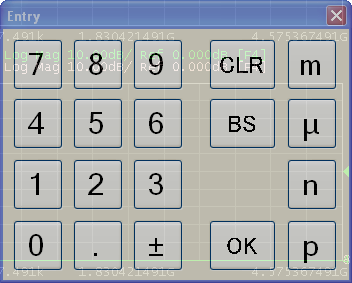
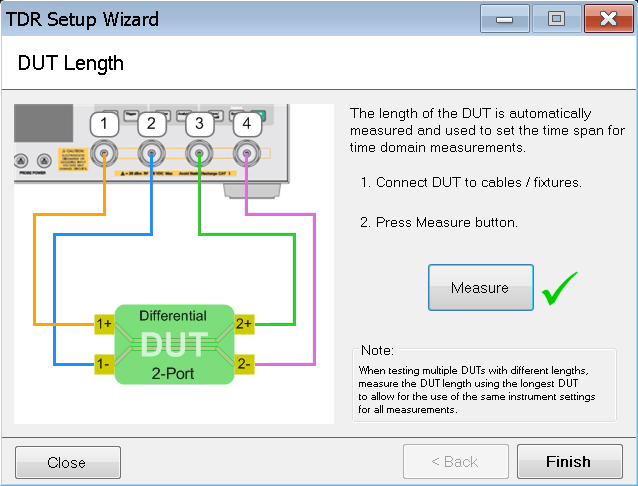
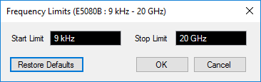

# Performing Manual Setup

Besides [Using the Setup Wizard](Using_Setup_Wizard.md), you can also perform
the Enhanced Time Domain Analysis measurement setup manually. The manual setup
is performed at the Setup tab.

  * Preset

  * Setting DUT Topology

  * Setting Stimulus Amplitude Level

  * Setting DUT Length

  * Performing Error Correction

  * More Functions

  * Average

  * Advanced Waveform

  * Hot TDR

  * External Switch Matrix

[Other topics about Setting Up the
Measurement](Setting_Up_the_Measurement.htm)

## Preset

  1. Click Preset under Basic to preset the VNA.

  2. A dialog box appears requesting confirmation. Click OK to proceed.

  3. All the settings shown in the Basic area are changed to default except for the DUT Topology.

  4. When you click Preset, the calibration and deskew data is deleted. Preset sets all of the settings at default except for the DUT Type.

## Setting DUT Topology

  1. At the DUT Topology under Basic, select one of the available options from the drop-down list box. This is the same function as Step 1/4: DUT Topology in the Setup Wizard.

  2. A dialog box appears requesting confirmation. Click OK to proceed.

Selecting the DUT topology executes the preset of the VNA. Therefore, when you
change from one DUT topology to another, the calibration and deskew data is
deleted.

## Setting Stimulus Amplitude Level

Note: Stimulus Amplitude Level is the value for scaling the time domain
measurement result.

  1. Stimulus Amplitude Level is not related to the actual applied voltage.

  2. Click in the text box of Stim. Ampl. (Stimulus Amplitude) under Basic. An Entry dialog box appears. Type the stimulus amplitude level value then click OK. The new value is displayed at Stim. Ampl. text box.

## Setting DUT Length

The DUT length setting is used to set the time span for time domain
measurements. Measurements can be made on longer DUTs, but minimum rise time
values may be limited.

### Automatic measurement - recommended

  1. Click Auto next to DUT Length under Basic. The DUT Length dialog box of the Setup Wizard appears.

  2. Click Measure.

  3. The length of the DUT is measured automatically and used to set the time base.

  4. Once complete, a check mark appears beside the Measure button.

  

The automatic measurement feature is available as one of the steps in the
Setup Wizard.

### Manual entry

If the length of the DUT is known, the DUT length can be set manually.

  1. Enter the DUT length in the DUT Length text box under Basic.

Any DUT shorter than the DUT length setting can be measured. Therefore, when
testing multiple DUTs with different lengths, set the DUT length using the
longest DUT to allow for the use of the same instrument settings for all
measurements.

## Performing Error Correction

There are three error correction options available, as stated below. Refer to
[Performing Error Correction](Performing_Error_Corrections.md) for more
information.

  * Deskew

  * Deskew and Loss Compensation

  * Full Calibration (ECal)

## More Functions

### Ref. Z

  1. At the Ref. Z (Port Reference Impedance) text box in the More Functions tab, left-click once. An Entry dialog box appears. Type the post reference impedance value then click OK. The new value is displayed in the Ref. Z text box.

### Dielectric Const. and Velocity Factor

Velocity Factor = 1 / sqrt(Dielectric Constant).

As such, when you change either one, the value of the other changes
automatically.

  1. To change the value of the dielectric constant, at the Dielectric Const. text box in the More Functions tab, left-click once. An Entry dialog box appears. Type the Dielectric Constant value then click OK. The new value is displayed in the Dielectric Const. text box. 

  2. The value of the velocity factor is changed in a similar way at Velocity Factor text box in the More Functions tab.

### Source Power

The signal source level is changed during [HOT TDR
measurement](../Making_Measurements/Hot_TDR_Measurement.htm) to avoid device
malfunction:

  1. At the Source Power text box in the More Functions tab, left-click once. An Entry dialog box appears. Type the source power value then click OK. The new value is displayed in the Source Power text box.

### Bal Port Config

This button opens the balanced source setting dialog.

The default port allocation is different between PNA/ENA VNAs and PXI/USB
VNAs. In PXI/USB VNAs, the left hand DUT ports are odd and the right hand DUT
ports are even.

True Mode is not supported.

### Freq Limits Config

The Enhanced Time Domain Analysis measurement start and stop frequencies can
be specified directly using the Frequency Limits dialog. This feature allows
the Enhanced Time Domain Analysis measurement frequency range to be set
narrower than the hardware's frequency range. For example, when using an ECal
with a narrower frequency range than the hardware.

  1. Click on the Freq Limits Config button. The Frequency Limits dialog is displayed.  
  

  2. Specify the start frequency in the Start Limit field.
  3. Specify the stop frequency in the Stop Limit field.
  4. Click the Restore Defaults button to set the start/stop limits back to the default values.
  5. Clicking the OK button will apply changes and close the dialog. This causes a TDR preset.
  6. Clicking the Cancel button will cancel any changes and close the dialog.

### Advanced Mode

Refer to [Advanced Mode](../Advanced_Mode/Overview.md).

## Average

The averaging function allows you to reduce the trace noise. It executes the
sweep the number of times specified by the averaging factor when the sweep
averaging function is turned ON. To activate the averaging option, go to
Average.

  1. To turn ON the averaging factor, select the Averaging check box in the Average tab.

  2. Type the averaging factor (number of times the sweep needs to be executed).

  3. To turn ON the averaging trigger, select the Average Trigger check box.

  4. At the IF Bandwidth text box, left-click once. An Entry dialog box appears. Type the IF bandwidth value then click OK. The new value is displayed in the IF Bandwidth text box. Reducing IF bandwidth increases the dynamic range.

## Advanced Waveform

Refer to [Advanced Waveform
Analysis](../Advanced_Waveform_Analysis/Advanced_Waveform_Analysis.htm).

## Hot TDR

Refer to [HOT TDR
measurement](../Making_Measurements/Hot_TDR_Measurement.htm).

## Switch Matrix

Refer to [External Switch Matrix](../Switch_Matrix/Switch_Matrix.md)

