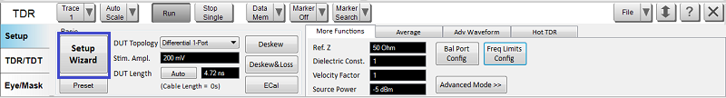
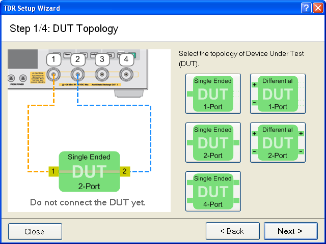

# Using Setup Wizard

Setup Wizard guides you to perform the Enhanced Time Domain Analysis
measurement setup step-by-step. The wizard appears automatically the first
time you execute the Enhanced Time Domain Analysis option. If you check the
Show this wizard next start-up option, the setup wizard will appear
automatically in the next start-up as well.

Another option to start up the Setup Wizard is from the Setup tab:

  1. Click the Setup tab.

  2. Click the Setup Wizard button under Basic, as shown below.

  3. If you do not want to perform the Enhanced Time Domain Analysis setup by using the wizard, click Close to close the Setup Wizard.

  4. Otherwise, select the type of Error Correction among the available options:

     * Deskew

     * Deskew & Loss Compensation

     * Full Calibration (ECal)

  5. If you check the Show this wizard next start-up option, the setup wizard will appear automatically in the next start-up.

  6. Click Next > to start the setup process.

  7. Select the topology of the device under test (DUT).

  8. Click Next >.

  9. The next screen of the wizard varies depending on the selection of Error Correction option and topology of the DUT.

  10. Follow the instructions on the wizard to complete the setup.

[Other topics about Setting Up the
Measurement](Setting_Up_the_Measurement.htm)

