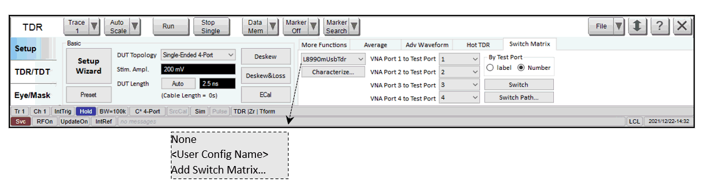
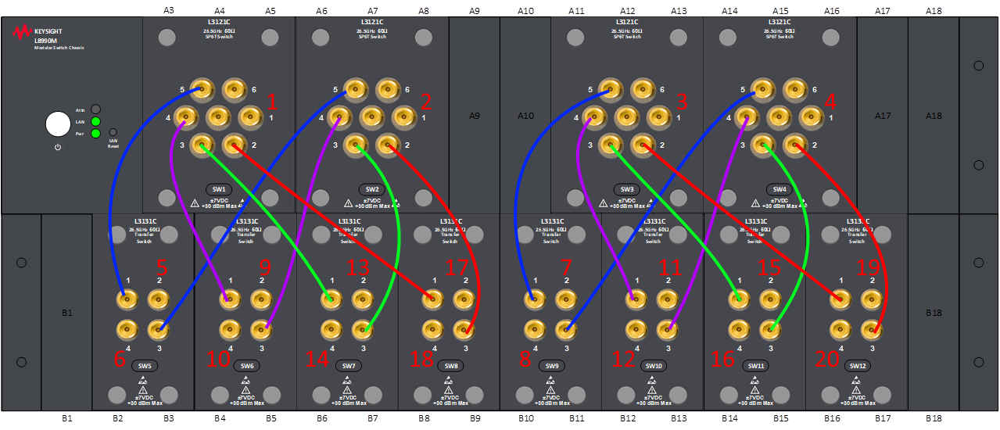
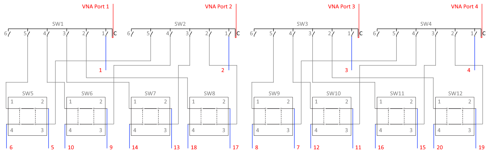

# Overview

This feature is a licenced feature which requires the subscription.

**Add Switch Matrix -** select to open the External Device Configuration
dialog, user can configure a new switch matrix

**< User Config Name> –** existing configurations that user can select.

**None** – when first open this application, “None” is display to indicate
switch matrix is not selected. “None” will always appear in the pulldown as a
valid selection. If “None” is selected, all other controls on this tab will be
gray-out.

**Characterize -** Open [Characterize Switch
Matrix](Characterize_Switch_Matrix.htm) wizard

**VNA Port n to Test Port** – Select test ports. Note: the path will not be
switched until clicking the “Switch” button, in order to save the switch
matrix service life.

**By Test Port** \- Fill in the test port combo-boxes by port numbers or port
labels

**Switch** – Do switching path

**Switch Path -** Open [Switch Path](Switch_Path.md) dialog.

### **_Save/Load_**

TDR state is on top of VNA state. So, “.tdr” file includes:

  * “VNA state file” items as in [Save_Load](Save_Load.md).

  * Selected switch matrix configuration name 

## **_L 8990M-0LZ Switch Matrix_**

L8990M-0LZ is the model number of custom switch matrix for HSD cable
compliance test solution. A pre-defined switch profile file will be
distributed along with VNA FW installation, user may find it at “C:\Program
Files\Keysight\Network
Analyzer\DocumentsTemplate\Drivers\L8990M_0LZ_SwitchMatrix.swp”.

### Physical Configuration

· 4U Frame

· 4x SP6T, 8x transfer switches, 16x semi-rigid cables for connecting switch
module to module

### **_Physical Configuration with Flexible Cables_**

In the “External Switch Matrix” properties dialog, switch matrix configuration
follow the physical configuration, which is illustrated as below:

· 16 gray cables

o Semi-rigid cables dedicate to switch-to-switch connections, which are also
illustrated in section above (physical configuration)

· 4 red cables

o VNA ports connect to the 4x SP6T Com ports.

· 20 blue cables

o These are test port cables. So, this is a 20-port test system.

