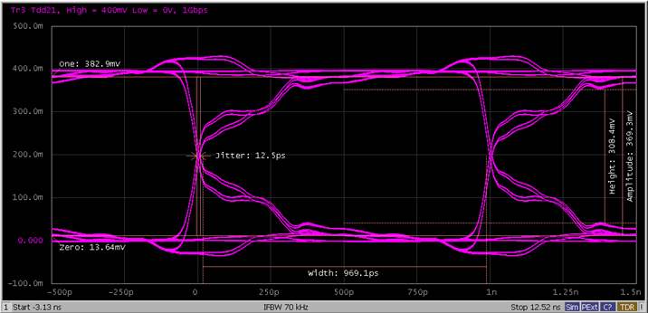

# Simulated Eye Diagram

This section describes the procedure of simulated eye diagram using the VNA
with TDR option.

### Operation procedure

  1. Connect cables to all test ports.

  2. Click the Setup tab.

  3. Click the Setup Wizard (under Basic).

  4. Set the measurement condition using the Setup Wizard:

     1. Select Deskew & Loss Compensation (under Error Correction) then click Next >.

     2. Click the Differential 2-Port button, then click Next >.

     3. Click the Deskew button, then click Next >.

     4. Connect the DUT to cables. Click the Measure button, then click Next >.

     5. Set the Rise Time to 35 ps and select 10-90% from the Definition drop-down list. When finished, click Apply to save the settings.

     6. Click the Finish button.

  5. Click Trace button on the tool bar and select 3 to activate Trace 3.

  6. Click Eye/Mask tab.

  7. Under Stimulus:

     1. Select PRBS from the Type drop-down list.

     2. Select 2^7-1 bits from the Length drop-down list.

     3. Set the One Lv. (amplitude) to 200 mV.

     4. Set the Data Rate to 1 Gb/s.

  8. Click the Draw Eye button under Trigger.

### Expected result

The eye diagram (Trace 3) similar to the one shown below is displayed.

[Other topics about TDR Quick Start](TDR_Quick_Start.md)

