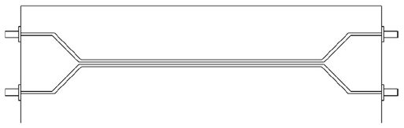
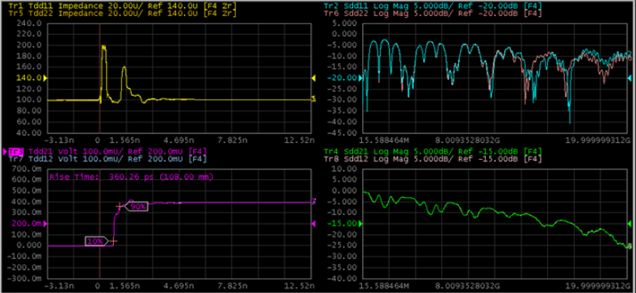

# TDR/TDT Measurement

To better understanding how to use the TDR option, this section describes the
basic TDR/TDT measurement procedure using the VNA.

### Operation procedure

  1. Connect cables to all test ports.

  2. Click the Setup tab.

  3. Click the Setup Wizard (under Basic).

  4. Set the measurement condition using the Setup Wizard:

     1. Select Deskew & Loss Compensation (under Error Correction) then click Next >.

     2. Click the Differential 2-Port button, then click Next >.

     3. Click the Deskew button, then click Next >.

     4. Connect a Thru between Port 1 and Port 3. Click the Measure button, and click Next >.

     5. Connect a Thru between Port 2 and Port 4. Click the Measure button, and click Next >.

     6. Connect a Load to Port 1 and click the Port 1 button to measure the Load. Repeat this step for Port 2, Port 3 and Port 4. When finished, click Apply to save the measurement.

     7. Click Next >.

     8. Connect the DUT to cables. Click the Measure button, then click Next >.

  1.      8. Set the Rise Time to "35 ps" and select "10-90%" from the Definition drop-down list. When finish, click Apply to save the settings.

     9. Click the Finish button.

  5. Click the Auto Scale then All Traces from the drop-down list.
  6. Select Trace 3.
  7. Click the Marker Search button.
  8. Select Rise Time (10-90%) from the drop-down list.

### Expected result

Trace 1 shows the TDR measurement in terms of impedance and Trace 3 shows TDT
measurement in terms of voltage. The rise time of Trace 3 will be shown.

[Other topics about TDR Quick Start](TDR_Quick_Start.md)

