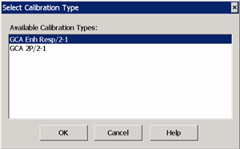
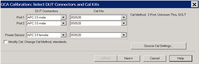
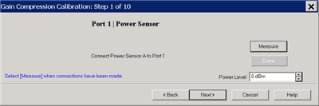

# Gain Compression Calibration

* * *

The GCA Calibration Wizard guides you through a calibration of GCA or GCX
channel. The procedure is the same regardless of the Gain Compression
Settings. Option 086 or S9x086A/B is required.

  * A [Source Power Calibration](GCA_Cal.md#SourceCal) is performed first.

  * Then, [your choice of a Full 2-port Cal or an Enhanced Response Cal](GCA_Cal.md#Downgrade).

### See Also

[Gain Compression Application](Gain_Compression_Application.md)

[Gain Compression for Converters](Gain_Compression_for_Converters.md)

[Calibration Programming commands](../Programming/MixerTopic.md#GCACal)

#### How to start a GCA Calibration  
  
---  
Using Hardkey/SoftTab/Softkey | Using a mouse  
  
  1. Press CAL > Main > Smart Cal....

|

  1. Click Response
  2. Select Cal
  3. Select Smart Cal...

  
  
  
### Overview - GCA Source Power Cal

The GCA Calibration Wizard first performs a Source Power Cal. The GCA Source
Power Cal is a little different from a standard Source Power Cal. Although GCA
measurements are performed at many power levels, the GCA source power cal is
performed at a [single power level](GCA_Cal.md#Step1) over the specified
frequency span of your GCA measurement. The required source correction from
that single power level is applied to ALL power levels. This method ensures
that the 'absolute' power level being applied to the DUT is within the PNA-X
source power linearity specification.

Although it is important for GCA to be able to set the absolute power level to
the DUT, it is MOST important to be able to exactly measure the actual
incident power. Therefore, during the GCA Source Power Cal, a receiver
calibration is applied to the port 1 reference receiver, and indirectly to
both test port receivers during the S-parameter calibration, correcting for
impedance mismatch between the power meter and the VNA source, and the DUT and
the VNA source.

Although the cal process is also at a single power level, the dynamic accuracy
of the PNA-X receivers is typically about +/- .05 dB, which is comparable to
the accuracy of Keysight's best power sensors. This allows GCA to very
accurately measure and report ALL power levels that are actually applied to
the DUT.

### Full 2-port or Enhanced Response (ER) Cal

By default, a full 2-port calibration is performed as part of a GCA and GCX
calibration. However, you can change to an [Enhanced
Response](../S3_Cals/Select_Cal.htm#Enhanced) Cal. The following issues may
help you decide between these two Cal types:

  * Accuracy A full 2-port correction is more accurate than ER when GCA measures linear gain. However, for non-linear measurements, ER yields identical compression values as a full 2-port cal, so this may not be a significant factor.

  * Measurement speed An ER correction only requires measurements in the forward direction. The reverse parameters (usually S22 and S12) are not measured unless requested. With a full 2-port cal applied, all four S-parameters are measured, which requires an additional reverse sweep. [Learn more.](../S2_Opt/Fast_Swp.md#cal)

  * Ease A full 2-port cal is easiest with an ECal module. An ER Cal requires a [Defined Thru](../S3_Cals/Calibration_THRU_Methods.md#Defined) or a [Flush Thru Cal](../S3_Cals/Calibration_THRU_Methods.md#Flush) method. If these are possible, then an ER cal is easiest when using a mechanical Cal Kit.

  * High power The test port damage level of a standard PNA-X is +30 dBm. Therefore, external attenuation may be required on the output of high power amplifiers, which degrades calibration accuracy for reverse (full 2-port) measurements. In addition, the external attenuation improves the DUT output / load match error, which allows a better uncorrected response and makes an Enhanced Response Cal the better choice.

  * DUT limitations With an ER Cal applied, reverse measurements on the DUT are not performed unless requested.

How to select Enhanced Response Cal

At the [Select DUT Connectors](GCA_Cal.md#SelectDUTDiag) page of the GCA Cal
Wizard:

  1. Check Modify Cal, then click Next.

  2. A [Defined Thru](../S3_Cals/Calibration_THRU_Methods.md#Defined) or a [Flush Thru Cal](../S3_Cals/Calibration_THRU_Methods.md#Flush) method must be selected.

  3. Click Cal Type/Stds

  4. Under Calibration type, select EnhResp (2 <= 1 refers to the receive port 2 and source port 1).

Downgrade a Full 2-port Cal to Enhanced Response Cal if you prefer to perform
a Full 2-port cal, but not perform reverse sweeps on the DUT.

To change the correction on the channel from Full 2-port to Enhanced Response:

  1. Press CAL > Main > Correction Methods.

  2. Select GCA EnhResp, then OK.

### GCA Cal Wizard

Select DUT Connectors and Cal Kits - GCA Cal dialog box help  
---  
This is a [standard Cal Wizard](../S3_Cals/Calibration_Wizard.md) page except
for the following: Power Sensor Specify the connector type and gender of the
power sensor. When the power sensor connector is not the same type and gender
as the DUT Port 1 connector, then an adapter is required to connect the power
sensor to the port 1 reference plane during the Source Power Cal. An extra
1-port cal is performed to measure and correct for the adapter. No
characterization S2P files are required.

  * Select Ignored (at the bottom of the DUT Connectors list) to NOT compensate for the adapter.
  * Select the Cal Kit that will be used for that process.

Modify Cal Check, then click Next, to Modify Cal (Standards AND Thru Method).
Source Cal Settings Click to launch the [Source Cal
Settings](../S3_Cals/Power_Cal_for_Apps.htm#SourceCalApps) dialog. [Learn more
about GCA Source Power Calibration](GCA_Cal.htm#SourceCal)  
  

Gain Compression Calibration Step 1 dialog box help  
---  
Power Level at which to perform the Source Power Cal. It is usually best to
perform the Source Power Cal at 0 dBm because the power sensor is calibrated
at that level. However, if the Gain Compression measurement is performed
entirely below or above 0 dBm, then perform the Source Power Cal at the Stop
power which probably has the lowest level of measurement noise. [Learn more
about GCA Source Power Calibration](GCA_Cal.htm#SourceCal)  
  
The remaining Gain Compression Cal dialogs are the same as the standard
[SmartCal dialogs.](../S3_Cals/Calibration_Wizard.md#GuidConnKit)

Return to [Gain Compression Application](Gain_Compression_Application.md).

* * *

