# Gain Compression for Amplifiers GCA (Opt S9x086A 086)

  * [Features, Requirements, and Limitations](Gain_Compression_Application.md#Features)

  * [Gain Compression Concepts](Gain_Compression_Application.md#Concepts)

  * [Understanding the GCA Displayed Traces](Gain_Compression_Application.md#DisplayTraces)

  * [Gain Compression Parameters](Gain_Compression_Application.md#Parameters)

  * [Compression Methods](Gain_Compression_Application.md#CompressionMethods)

  * [Acquisition Modes](Gain_Compression_Application.md#Acquisition)

  * [Using Gain Compression App](Gain_Compression_Application.md#Using)

  *     * [Frequency tab](Gain_Compression_Application.md#FreqTabDiag)

    * [Power tab](Gain_Compression_Application.md#PowerTabDiag)

    * [Compression tab](Gain_Compression_Application.md#CompressionTab)

    * [Safe Sweep Mode dialog](Gain_Compression_Application.md#Safe)

  * [Compression Analysis](Gain_Compression_Application.md#Analysis)

  * [Saving GCA Data](Gain_Compression_Application.md#Saving)

  * [GCA Measurement Tips](Gain_Compression_Application.md#tips)

  * [Macros](Gain_Compression_Application.md#Macro)

  * 

See Also

  * [Gain Compression for Converters](Gain_Compression_for_Converters.md)

  * [GCA Calibration](GCA_Cal.md)

  * [Programming commands](../Programming/MixerTopic.md#Gainsetup)

  * App Note [Amplifier Linear and Gain Compression Measurements](http://literature.cdn.Keysight.com/litweb/pdf/5988-8644EN.pdf)

[Other VNA Applications](Applications.md)

## Features, Requirements, and Limitations

### Features

  * Fast, easy, and complete Gain Compression measurements for amplifiers.

  * Many [compression parameters](Gain_Compression_Application.md#Parameters) to choose from, including gain, input power at compression, output power at compression, input match, and compression level.

  * Several [compression methods](Gain_Compression_Application.md#CompressionMethods) to choose from, including deviation from linear gain, deviation from max gain, back-off, and X/Y, and compression from saturation.

  * Three [acquisition methods](Gain_Compression_Application.md#Acquisition) to choose from: Power per Freq, Freq per Power, and SMART Sweep

  * [SMARTCal Calibration Wizard](GCA_Cal.md) to guide you through Full 2-Port or Enhanced Response calibration, plus Source Power calibration.

  * [Compression Analysis](Gain_Compression_Application.md#Analysis) allows traditional power sweep view at a selected frequency.

  * [Receiver Leveling](../S1_Settings/Receiver_Leveling.md) provides continuous source power accuracy.

  * Supports Wideband (NOT Narrowband) Pulse measurements using the new integrated Pulse setup dialogs.

  * 

### Requirements

  * Option S9x086A (software option only) [must be enabled](../Support/Option_Enable.md).

  * When performing an optional calibration:

  *     * ECal module or Calibration Kit

    * Power meter/sensor

### Limitations with GCA

  * Number of points limited to 100,001 for two-dimensional acquisitions, 50,000 points for SMART Sweep.

  * Standard CW power sweep is NOT supported in a Gain Compression channel.

  * Independent IFBW, Power Levels, Shift LO, or Sweep Time in a [segment table](../S1_Settings/Sweep.md#SegmentDiag) is NOT supported.

  * Stepped sweep mode only.

  * Linear, Log, and Segment frequency sweep modes only.

The following VNA Features are NOT Available in a Gain Compression channel:

  * [Unratioed receiver measurements](../S1_Settings/Measurement_Parameters.md#Unratioed_Power) (A, B, R)

  * [ECal User Characterization](../S3_Cals/ECal_User_Characterization.md)

  * Some Fixturing Features

  * [FOM](../FreqOffset/Frequency_Offset_Mode.md) or [FCA](../FreqOffset/FCA_Use.md)

  * [External Test Set Control](../System/External_Testset_Control.md) (Option S93551A/B)

  * [CW Time](../S1_Settings/Sweep.md#cw_time) sweep

  * [Balanced measurements](../S1_Settings/Balanced_Measurements.md)

  * Save [Auto Formatted Citifile](../S5_Output/SaveRecall.md#cti) data.

  * Narrowband Pulse measurements using the Integrated Pulse App

## Gain Compression Application Concepts

### What is Gain Compression

An amplifier has a region of linear gain, where the gain is independent of the
input power level. This gain is commonly referred to as small signal gain. As
the input power is increased to a level that causes the amplifier to approach
saturation, the gain will decrease. The 1 dB gain compression is defined as
the input power level that causes amplifier gain to drop 1 dB relative to the
linear gain.

You can quickly measure the gain compression using a [compression
marker](../S4_Collect/Markers.htm#Compression) on a power sweep trace.

### Terms used in GCA

Linear Power Level The specified input power that yields linear gain (also
known as 'small-signal gain') in the amplifier.

Reference gain  The measured gain that is used as a reference for determining
compression level. The [Compression
Method](Gain_Compression_Application.htm#CompressionMethods) that is used
could cause this value to be different.

Compression level The specified amount of gain reduction from the reference
gain.

Target gain The gain at the specified compression level. Although this term
does not appear in GCA, it is important to understand when discussing the
various compression parameters.

For example, when using [Compression from Linear
Gain](Gain_Compression_Application.htm#CompressionMethods) method with the
following settings:

  * Linear gain (measured at Linear Input power) = 10.2 dB

  * Compression level (specified) = 1 dB

  * Target gain = 9.2 dB

This is called 'Target' gain because GCA will search for the closest measured
gain to 9.2000 dB. It may not measure this gain exactly.

Compression point The operating point at which the measured gain is closest to
the Target Gain. All [compression
parameters](Gain_Compression_Application.htm#Parameters) report data for this
operating point.

## Understanding the GCA Displayed Traces

One of the most important concepts to remember with GCA is that, each
frequency data point represents many measurements using different input power
levels.

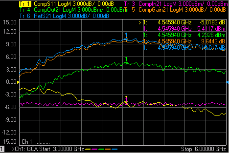

Some things to notice about how GCA displays compression data:

  1. The X-axis values are ALWAYS frequency. Imagine behind each frequency data point, a traditional power sweep curve with corresponding measurements and calculations to find the specified compression point.

  2. The Y-axis values are always reported at the [compression point](Gain_Compression_Application.md#Terms). The value that is displayed depends on the compression parameter that you choose. The [S-parameters](Gain_Compression_Application.md#s-params) that are displayed in a GCA channel are always measured at the [linear and reverse](Gain_Compression_Application.md#PowerTabDiag) power level.

Example: Five of the six GCA [compression
parameters](Gain_Compression_Application.htm#Parameters) are displayed in the
above image. The missing trace,
[DeltaGain21](Gain_Compression_Application.md#DeltaGain21) is discussed
below.

  * Markers are placed at 4.549 GHz for all of the parameters.

  * Tr 3 CompIn21 (Input power at the compression point) shows the marker value to be -5.4117 dBm. This is the power into the DUT that was required to achieve the compression point Notice that this is about the same input power required to achieve the specified compression at ALL frequencies.

  * Tr 5 CompGain21 (Gain at the compression point) shows the marker value  9..6443 dB . This is the measured gain at the compression point.

  * To see the gain at a different input power at this frequency, use the [Compression Analysis](Gain_Compression_Application.md#Analysis) feature.

## Create a GCA Measurement

  1. Press Meas > S-Param > Meas Class....

  2. Select Gain Compression, then either:

     * OK delete the existing measurement, or

     * New Channel to create the measurement in a new channel.

## Gain Compression Parameters

There are several Gain Compression parameters, as well as standard
S-parameters and ADC parameters, that can be measured in a GCA channel.

#### How to add GCA Parameters  
  
---  
Using Hardkey/SoftTab/Softkey |  Using a mouse  
  
  1. Press Trace, then select trace.
  2. Press Meas, then select a parameter.

|

  1. Click Instrument, Trace, Add Trace.
  2. Click Response, Meas, then select a parameter.

  
  
  
### Linear S-Parameters

For convenience, the standard S-parameters are offered in a GCA channel. S11
and S21 are measured at the specified Linear Input level. S22 and S12 are
measured at the specified Reverse power level.

Note: When a [DC meter](../System/Configure_a_DC_Device.md#DCMeterProps) is
added, it will be displayed in the New Trace dialog and SMART Sweep Safe Mode
dialog (in DC Parameters pull down menu).

Parameter |  Description |  When Measured  
---|---|---  
S11 |  Input Match |  Always  
S21 |  Gain |  Always  
S22 |  Output Match |  See [Reverse](Gain_Compression_Application.md#Output)  
S12 |  Reverse Isolation |  See [Reverse](Gain_Compression_Application.md#Output)  
AI1 |  Linear AI1 |   
AI2 |  Linear AI2 |   
  
### ADC Parameters

Four ADC analog-to-digital converter measurements are offered in a GCA
channel:

  * AI1 and AI2 are measured at the specified Linear Input level.

  * CompAI1 and CompAI2 are measured at the specified compression point.

These DC measurements, along with [Equation
Editor](../S4_Collect/Equation_Editor.htm#PAE), allow you to make PAE
measurements at the Linear Input level and compression point.

These measurements are made at pins 7 and 8 of the VNA [Power IO
connector](../Rear_Panel/XPwrIO.htm).

### Compression Parameters

Note: The following table assumes: DUT Input = VNA port 1 and DUT Output = VNA
port 2. When the Port mapping is different, the parameters in GCA are updated
accordingly. For example, with Input = port 2 and Output = port 1, then
"CompIn12" would be displayed.  
---  
  
The raw data for these parameters are always measured.

Parameter |  Description  
---|---  
CompIn21 |  Input power at the compression point.  
CompOut21 |  Output power at the compression point.  
CompGain21 |  Gain at the compression point.  
CompS11 |  Input Match at the compression point.  
RefS21 |  Linear Gain value used to calculate the compression level. This is calculated differently depending on the compression method.  
DeltaGain21 |  CompGain21 MINUS Linear Gain (in Log Mag format). This trace can be used to learn a lot about the DUT compression point. [Learn more.](Gain_Compression_Application.md#DeltaGain21)  
  
## Compression Methods

GCA offers the following methods to find the compression point of an amplifier
using GCA:

### Compression from Linear Gain

The Reference Gain is measured using the specified Linear (Input) Power Level.
The Target Gain is calculated as the Linear Gain minus the specified
Compression Level. For example 8.3 dB - 1 dB = 7.3 dB.

### Compression from Max Gain

The linear region of an amplifier gain may not be perfectly linear. The
highest gain value that is found at each frequency is used as the Reference
(S21) Gain. The [Target Gain](Gain_Compression_Application.md#Target) is
found in the same way as Compression from Linear Gain.

### Compression from Saturation

This method is used to better find the compression point when measuring
amplifiers with non-linear gain as shown in the following image:

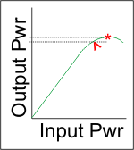

The Max power out value * is found at each frequency. Then input power is
lowered until the output power decreases by the specified 'From Max Pout'
value. This is the compression point.^

### Backoff and X/Y method

These two compression methods are very similar.

  * Both methods specify a difference in input power (X axis) between the linear region and compression point.

  * For the Y-axis difference:

  *     * Backoff method specifies Compression Level which is a difference in Gain.

    * X/Y method specifies Delta Y which is a difference in Output Power.

GCA searches for these points differently for [2D
sweeps](Gain_Compression_Application.htm#2D) and [SMART
sweep](Gain_Compression_Application.htm#SmartBO).

The following images show how Backoff and X/Y method is calculated at ONE
frequency.

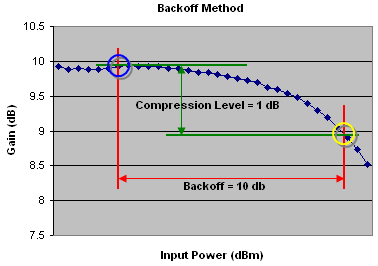  
---  
The compression point (yellow circle) is where 10 dB more input power yields 1
dB less gain than at the reference point (blue circle).  
  
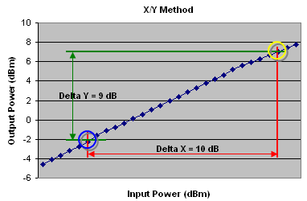  
---  
The compression point (yellow circle) is where 10 dB more input power yields
only 9 dB more output power than at the reference point (blue circle).  
  
## Acquisition Modes

The GCA offers three modes for data acquisition: Two 2D sweep modes, and
[SMART sweep](Gain_Compression_Application.md#SMART).

To see a traditional power sweep at a single frequency, use the Compression
Analysis feature. Learn more.

### 2D (two-dimensional) Sweeps

This is the easiest method to understand, and the least efficient for finding
the compression point. Both 2D sweep modes work as follows:

  1. All GCA measurements begin by measuring S-parameters at the specified Linear Power level. Reverse parameters are measured ONLY if Full 2-port calibration is applied or if a reverse parameter is displayed. [Learn more about Cal choices.](GCA_Cal.md)

  2. Gain measurements are then made at ALL of the specified frequency and power values. Although these are conceptually 2-Dimensional sweeps, a single sweep is constructed in firmware. [See Data Points Limit](Gain_Compression_Application.md#PointsLimit).

  3. After data has been measured, a search is performed to find the compression point. You can choose to interpolate between the two measured points closest to the target gain. [Learn more.](Gain_Compression_Application.md#CompressionTab)

As each sweep is performed, dots are plotted next to the Ch indicator in the
lower left corner of the display to indicate progress for the current sweep.

Note: For [Backoff and X/Y compression
method](Gain_Compression_Application.htm#BackoffXY), GCA does not verify that
the specified Start - Stop power range is at least the size of the specified
Backoff or X value. The closest compression point is always reported.

Note: [SMU Hardware List](../System/Configure_an_External_SMU.md) trigger
mode is NOT supported in GCA 2D sweeps.

### 2D Sweep Modes

  * 2D Sweep Power per Frequency - Input power is stepped from [Start to Stop](Gain_Compression_Application.md#PowerSetting) at each specified frequency. From the following example you can see that the device is exposed to the highest power level (p3) at the first frequency (f1). This could heat the device early in the measurement and affect compression results.

The following examples show (frequency, power) values for three frequency
points and three power points, resulting in a total of 9 measurements:

1 |  2 |  3 |  4 |  5 |  6 |  7 |  8 |  9  
---|---|---|---|---|---|---|---|---  
f1,p1 |  f1,p2 |  f1,p3 |  f2,p1 |  f2,p2 |  f2,p3 |  f3,p1 |  f3,p2 |  f3,p3  
  
  * 2D Sweep Frequency per Power - Frequency is swept from start to stop at each specified power level as follows:

1 |  2 |  3 |  4 |  5 |  6 |  7 |  8 |  9  
---|---|---|---|---|---|---|---|---  
f1,p1 |  f2,p1 |  f3,p1 |  f1,p2 |  f2,p2 |  f3,p2 |  f1,p3 |  f2,p3 |  f3,p3  
  
### Viewing and Saving 2D Data

It is NOT possible to plot ALL of the 2D measurement data on the VNA display.
However, it can be saved to a *.csv file and then read into an Excel
spreadsheet. The initial S-parameter measurement data is not saved to this
file. [Learn more.](Gain_Compression_Application.md#Saving)

You can also view on the VNA all power sweep information at a selected
frequency using the [Compression
Analysis](Gain_Compression_Application.htm#Analysis) feature.

### SMART Sweep

SMART Sweep is usually the fastest and most accurate method to measure Gain
Compression. Unlike the 2D acquisition modes which measure all of the
specified frequency / power points, SMART Sweep performs a series of power
search iterations. At each frequency, an 'intelligent guess' of input power is
made to find the compression level that is within tolerance. This guess is
further refined with each successive power search iteration sweep.

SMART Sweep continues to iterate until one of the following conditions occur:

  1. ALL data points are within tolerance. When the compression level for a data point achieves the specified tolerance, it continues to be measured and input power changed to improve the measurement within tolerance.

  2. The specified compression level can NOT be achieved for the remaining frequencies that are not in tolerance. Either the Start power is too high or the Stop power is too low.

  3. Maximum iterations have been achieved. If a measured gain is not within the specified tolerance before the specified Max number of Iterations has been reached, then the last power reading is used as the compression point.

The Iteration Counter, Dots, and Bangs(!) Next to the Ch indicator, in the
lower left corner of a GCA window, the following annotation appears:

  * An iteration counter is incremented each time input power is adjusted.
  * A dot appears when another 10% of the frequency points are within tolerance.
  * ! (bangs) are displayed after the last iteration. Each bang represents 10% of the data points that are NOT within tolerance.

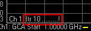  
---  
  
### SMART Sweep and Compression Method

The intelligent guess process works differently depending on the compression
method. This is important because Backoff and X/Y compression methods subject
the DUT to significant changes in input power during an iteration sweep. This
can affect the DUT and the measurement results.

[Learn all about Backoff and X/Y compression
methods.](Gain_Compression_Application.htm#BackoffXY)

ALL GCA measurements begin by measuring S-parameters at the specified Linear
Power level. Reverse parameters are measured ONLY if Full 2-port calibration
is applied or if a reverse parameter is displayed. [Learn more about Cal
choices.](GCA_Cal.htm)

  * Backoff and XY Because both compression methods specify the separation between the 'linear" region and the "compressed" region, each iteration requires a single sweep at two dramatically different power levels over the same frequency range. The first half of the sweep measures the DUT at the Backoff or X power level. The second half of the sweep measures the DUT at the compressed power level, specified by the [Start and Stop](Gain_Compression_Application.md#PowerSetting) power range. At the beginning of the second half, the power level rises by the Backoff or X value. The specified [Settling Time](Gain_Compression_Application.md#Settling) is applied at this point to allow the DUT time to react to this significant change in power level. [Safe Sweep](Gain_Compression_Application.md#Safe) does NOT minimize this change in input power. However, Safe Sweep with Backoff and XY methods DOES prevent the DUT from being exposed to too much input power.

  * Compression From Linear Gain After the reference gain is measured at the linear input power, the next iteration measures the DUT at a higher power level which attempts to push the DUT well into compression. Subsequent sweeps, depending upon the compression level of the DUT, either increases or decreases the power in order to reach the desired compression level. Usually, by the third iteration sweep, a curve-fit algorithm is utilized to precisely find the compression point.

Note: The DUT can be subject to significant changes in power from one
iteration sweep to the next. This can be minimized by the use of [SAFE
Sweep](Gain_Compression_Application.htm#Safe) and careful selection of the
corresponding settings.

  * Compression from Max Gain  The maximum gain that is found at each frequency is stored and used to calculate the compression point. SMART Sweep does NOT perform extra iterations to search for the maximum possible gain of the amplifier at each frequency.

  * Compression from Saturation  The maximum power out that is found at each frequency is stored and used to calculate the compression point. SMART Sweep does NOT perform extra iterations to search for the maximum possible power out of the amplifier at each frequency.

## Using the Gain Compression Application

The following is a general procedure for performing a GCA measurement. The
challenge with GCA is configuring a measurement that yields the true
compression performance of YOUR DUT. This requires knowledge of the Gain
Compression settings and knowledge of the DUT.

See specific dialog boxes below.

  1. Disconnect the DUT if preset or default power levels may damage the VNA or DUT.

  2. [Preset](../S1_Settings/Preset_the_Analyzer.md) the VNA, or configure a suitable [User Preset](../S1_Settings/Preset_the_Analyzer.md#UserDiag) that will be safe in case the DUT is connected.

  3. Create a GCA channel. [Learn how](../S1_Settings/Measurement_Classes.md#How to). The default trace is S21.

  4. Start [GCA Setup dialog](Gain_Compression_Application.md#start) and configure the measurement settings based on the DUT, adapters, attenuators, booster amplifiers, and fixtures to be used in the measurement.

  5. Save the [instrument state](../S5_Output/SaveRecall.md#file_save) (optional).

  6. Connect DUT and apply bias and RF power as appropriate. The default measurement for a GCA channel is S21 (amplifier gain). Inspect the gain measurement to ensure the DUT is operating as expected.

  7. Add GCA compression parameter traces. [Learn how.](../S1_Settings/Measurement_Parameters.md#NewTraceDiag)

  8. Adjust the measurement settings to yield satisfactory compression parameters. [See GCA Measurement Tips.](Gain_Compression_Application.md#tips)

  9. Start and complete the [GCA Calibration wizard](GCA_Cal.md).

#### How to start the Gain Compression Setup dialog  
  
---  
Using Hardkey/SoftTab/Softkey |  Using a mouse  
  
  1. Press Freq > Main > GCA Setup....

|

  1. Click Stimulus
  2. Select GCA Setup...

  
  
  
Frequency tab - Gain Compression -dialog box help  
---  
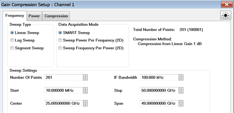 Configures the frequency settings over
which Gain compression is to be measured, as well as the measurement method.

### Sweep Type

Choose a method in which to sweep frequency: Linear, Log, and Segment Sweeps. This setting applies to all data acquisition modes. |  Notes

  * Log and Segment Sweep are NOT available on [GCX](Gain_Compression_for_Converters.md).
  * CW Sweep is NOT available in GCA. However, to see a traditional power sweep at a single frequency, use the [Compression Analysis](Gain_Compression_Application.md#Analysis) feature.
  * To use CW Sweep in GCX, set all ranges to Fixed on the [Mixer Frequency tab](MixerConverter_Setup.md#MixerFreqTab). This has the same effect as setting all ranges to Start = Stop Frequency.

Segment Sweep Notes (GCA ONLY)

  * The segment table shown on the dialog is 'READ-ONLY'.
  * Learn how to [Create and edit the Segment Sweep table](../S1_Settings/Sweep.md#segment).
  * Independent IFBW and Power are NOT available.
  * [X-axis point spacing](../S1_Settings/Sweep.md#X-AxisPoint) is available beginning with A.09.10.

  
---  
  
### Data Acquisition Mode

Specifies HOW the gain compression data is collected.

SMART Sweep

  * At each frequency, input power is 'intelligently' adjusted to find a measured gain equal to the target gain.

  * Faster and more accurate than 2D sweeps to measure Gain Compression point at a number of frequencies.

  * [Learn ALL about SMART Sweep](Gain_Compression_Application.md#SMART)

2D (two-dimensional) Sweeps

  * Sweep Power per Frequency Performs a series of power sweeps at each successive frequency.

  * Sweep Frequency per Power Performs a series of frequency sweeps at each successive power level.

  * [Learn ALL about 2D sweeps](Gain_Compression_Application.md#2D)

### Sweep Settings

Click each to learn more about these settings.

  * [Number of points](../S1_Settings/DPoints.md) Number of frequency points to measure. The Frequency points may be limited due to the number of specified Power points. [See Data Points Limit](Gain_Compression_Application.md#PointsLimit).

  * [IF Bandwidth](../S2_Opt/Trce_Noise.md#Variable_IF_Bandwidth) Set this value to yield acceptable trace noise when measuring gain at the linear power level. This level of noise contributes directly to the accuracy of compression point. A lower value (narrower IFBW) allows for more accurate, but slower, measurements. [See GCA Measurement Tips](Gain_Compression_Application.md#tips) to see how to best set IFBW.

  * [Start / Stop](../S1_Settings/Frequency_Range.md#StartDiag), [Center / Span](../S1_Settings/Frequency_Range.md#CentDiag) frequencies. Set the frequency range over which to measure Gain compression.

### Data Points Limit

The maximum number of measurement data points depends on Acquisition method
and Compression method as follows:

|  SMART sweep |  2D sweep  
---|---|---  
Compression method |  Number of frequency points is reduced to ensure the total number of data points does not exceed the specified limit. Frequency points = maxpoints/2. |  Number of power points is reduced to ensure the total number of data points does not exceed the specified limit.  
  
  * Compression from linear gain

|  Data points = freq points Max = 100,001 |  Data points = (freq. points) * (power points) Max power points = 2,001 Max data points = 100,000  
  
  * Compression from max gain

|  Data points = freq points Max = 100,001  
  
  * X/Y and Backoff

|  Data points = 2 * freq points Max = 100,001  
  
  * Compression from Saturation

|  Data points = freq points Max = 100,001  
  
Note: Although the dialog box will allow you to enter any number of frequency
or power points, the values are checked when OK or Apply is pressed. If a
limit is exceeded, the relevant data points are reduced to the maximum
allowable number without warning.  
  
Power tab - Gain Compression dialog box help  
---  
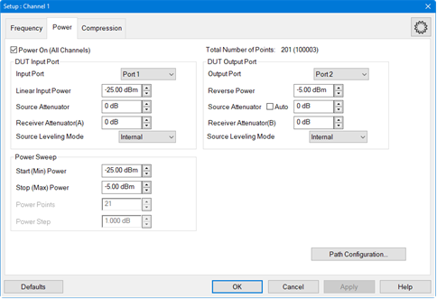 Configures RF power and Power Sweep
settings for Gain Compression measurement. Power ON (All channels) Check to
turn RF Power ON or clear to turn power OFF for all channels.

### Input Port

Select the VNA port that is connected to the DUT Input. Linear Power Level The
input power that yields the linear gain of the DUT. The linear gain is used as
the reference gain when calculating the Compression from Linear Gain. Input
match is also measured at this power level. Source Attenuator Specifies the
attenuator setting associated with the port connected to the input of the DUT.
This attenuator will affect the range of available power into the DUT [Learn
more about Source Attenuation.](../S1_Settings/Power_Level.htm#Source_Atten)
All VNA channels in continuous sweep must have the same attenuation value.
[Learn more.](../S1_Settings/Power_Level.md#Atten_Uncpld_Ports)

### Output Port

Select the VNA port that is connected to the DUT Output. Reverse Output Power
Sets power level into the output of the DUT for reverse sweeps. Port power is
automatically uncoupled. Reverse power is applied to the DUT ONLY under the
following conditions. Otherwise, this setting is ignored.

  * When Linear Output Match or Linear Reverse Isolation parameters are requested.
  * When Full 2-port correction is used. You can perform a full 2-port cal and downgrade to an Enhanced Response Cal to prevent reverse power from being applied to the DUT. [Learn more.](GCA_Cal.md#Downgrade)

Source Attenuator Specifies the attenuator setting for the port connected to
the DUT output. This setting will affect the range of available power at the
DUT output port. Auto \- Selects the proper attenuation setting automatically.

### Power Sweep

Power Points Number of power points to measure for 2D acquisition modes. The
Power Points may be limited due to the number of frequency data points. [See
Data Points Limit](Gain_Compression_Application.htm#PointsLimit). This setting
is NOT available in SMART Sweep, which uses only enough power points to find
the specified compression level. Start and Stop Power

  * 2D sweep  In Backoff, X/Y, and Compression from Max Gain methods, sets the range of power levels that are applied to the DUT to find BOTH the [Reference Gain](Gain_Compression_Application.md#Terms) and [Compression point](Gain_Compression_Application.md#Terms). Make sure this range is wide enough to include both. For example, if the Backoff level is 10 dB, then the power range must be greater than 10dB. Otherwise, GCA will report a compression value using the closest reference gain and compression point, which may be inaccurate. In Compression from Linear Gain, the reference gain is measured at the Linear Power Level, so the Start and Stop power levels are used to find the compression point.
  * SMART sweep Sets the range of power over which GCA will search for the compression point. The reference gain is found using the Linear Power Level, Backoff, and X values, depending on the Compression Method. To reduce the number of iterations that are required to find the compression point, limit the Start / Stop power range to the input levels that will achieve compression. Do not include the linear region.

Note: If your DUT requires more input power to achieve compression below 3.2
GHz, use the PNA-X Hi-power mode, available from the [RF Path
Configuration](../S1_Settings/Path_Configurator.htm) dialog. The disadvantage
to this is higher harmonic content. Power Step (Size) Calculated value from
current Start, Stop, and Points settings. This setting can NOT be changed
directly. Path Configuration click to launch the [RF Path
Configuration](../S1_Settings/Path_Configurator.htm) dialog.  
  
Compression tab - Gain Compression dialog box help  
---  
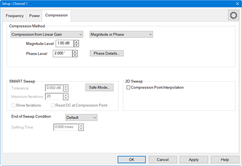

### Compression Method

[Learn ALL about these Compression
Methods](Gain_Compression_Application.htm#CompressionMethods)

  * Compression from Linear Gain The specified compression Magnitude Level is measured from the linear gain. The linear gain is measured using the Linear Input Power that is specified on the [Power tab](Gain_Compression_Application.md#PowerTabDiag).
  * Compression from Max Gain The specified compression level is measured from the maximum gain level. In SMART sweep, the Max Gain value is updated as each iteration occurs. To increase the chances of measuring the actual maximum gain of the amplifier, [Safe Sweep](Gain_Compression_Application.md#Safe) should be invoked using low Coarse and Fine increments.
  * Compression from Back Off This compression method uses the Compression Level and Back Off values for finding the compression point.
  * X/Y Compression This compression method uses the specified parameters (X and Y) as the criterion for finding the compression point.
  * Compression from Saturation Similar to Compression from Max Gain, except the specified compression level is measured from the maximum power out level. Use this method to better find the compression point when measuring amplifiers with non-monotonic gain. In SMART sweep, the Max power out value is updated as each iteration occurs. To increase the chances of measuring the actual maximum power out of the amplifier, [Safe Sweep](Gain_Compression_Application.md#Safe) should be invoked using low Coarse and Fine increments

#### Phase

Note: Gain Compression Phase is a Licensed Feature. Learn more about [Licensed
Features](../Support/Software_Support.htm). When Compression from Linear Gain
is selected and the Data Acquisition Mode in the Frequency tab is set to Sweep
Power Per Frequency (2D) or Sweep Frequency Per Power (2D), the following
Phase functions are enabled. Magnitude Only Measures compression against
magnitude. Phase Only Measures compression against phase. Magnitude or Phase
Measures compression against magnitude or phase. Phase Level Specifies the
phase to interpolate compression point. Phase Details... Accesses the Advanced
Phase Settings dialog. Gain Compression Measurement Class Dialog
 Gain
Compression Converters Measurement Class Dialog
 Compute
Linear Power from Percent of Span Specifies the aperture as a percentage of
span to compute linear input power. Smooth Power Sweep Using Enables the power
sweep to be smoothed. Aperture Aperture used for smoothing the power sweep.
Use Reference Mixer Enables a reference mixer. To improve the noise of the
phase measurements in Gain Compression Converters (GCX), an optional user
supplied external reference can be added to the R1 loop. The LO for the
reference mixer should be common with the LO for the DUT mixer. After this
hardware is added, and this function is enabled, the GCX application will use
the reference mixer to improve the phase measurements. Force Source Power Out
Port 1 This function is used when GCX channels with a reference mixer and one
GCA channel without a reference mixer are set up simultaneously and you want
to use the same path configuration for all channels. This remaps the source
port to Port 1.

### SMART Sweep

[Learn ALL about Smart Sweep.](Gain_Compression_Application.md#SMART)
Tolerance Specifies an acceptable range for measuring the compression level.
Reducing this value can significantly increase the number of iterations that
are required to find the compression point. Maximum Iterations Specifies the
maximum number of power search iterations SMART Sweep is allowed. Reducing
this value can cause SMART sweep to terminate before all compression levels
are found to within the specified tolerance. Show Iterations When checked, the
compression parameter traces are updated at the completion of each power
search iteration. When cleared, compression parameter traces are updated when
SMART Sweep completes the power search iteration process. Read DC at
Compression Point When checked, only the DC readings at the compression point
in the last iteration of a smart sweep will be taken. By default, the DC
traces are read at each point in the sweep. In some cases, the user may only
want to read the DC meter at the compression point to improve measurement
speed.

### 2D Sweep - Compression Point Interpolation

When a 2D Sweep is selected (on the [Frequency
tab](Gain_Compression_Application.htm#FreqTabDiag)), check this box to
calculate and display interpolated compression traces. The [Target
gain](Gain_Compression_Application.htm#Target) is calculated using a complex
linear ratio between the two closest measured values. All compression
parameters are then interpolated using this same ratio. Clear the box to
display compression parameters for the closest compression point, either high
or low, to the level specified in the Compression Method setting. End of Sweep
Condition Specifies the power level applied to the DUT at the completion of a
GCA measurement. GCA performs numerous power and frequency sweeps on the DUT
during the overall measurement process. This setting has no affect on these
intermediate sweeps. This setting only applies at the end of the very last
sweep in the GCA channel. In addition, this setting applies ONLY to the GCA
channel. All other channels operate independently of this setting. Therefore,
the power applied to the DUT after all channels have been measured may be
different from this setting. Choose from:

  * Default Use the default VNA method. [Learn more.](../S1_Settings/Power_Level.md#PowerONOFF)
  * RF OFF RF power is turned off when GCA completes a measurement cycle.
  * Start Power RF power is set to the start power level.
  * Stop Power RF power stays at the stop power level.

### Settling Time

Used ONLY in SMART Sweep when Back Off or X/Y compression algorithms are
selected. This setting allows additional dwell time when the input power
changes from the back-off level to the compression level. [Learn
more.](Gain_Compression_Application.htm#SmartBO)  
  
SMART Sweep Safe Mode dialog box help  
---  
 For use with SMART Sweep ONLY. When
enabled, Safe Sweep increases the input power to the DUT by the specified
amounts, allowing the compression point to be achieved gradually. While this
will increase the number of iterations required to achieve compression, it
also minimizes the possibility of driving the DUT too far into compression.
Note: Safe Sweep does NOT minimize the dramatic change in input power with
Backoff and XY method. However, Safe Sweep with Backoff and XY methods DOES
prevent the DUT from being exposed to too much input power. [Learn
more.](Gain_Compression_Application.htm#SmartBO) Safe Mode (Enable) Check to
enable Safe Sweep. Coarse Increment Sets the maximum change in input power, up
or down, which will be applied to the DUT from one iteration to the next.
Default = 3.0 dB. Without Safe Sweep, the maximum change in input power can be
the entire Backoff or X value when using these compression methods. Fine
Increment  Once the Fine Threshold has been achieved, this becomes the maximum
change in input power, up or down, which will be applied to the DUT. Default =
1.00 dB Fine Threshold Specifies the compression level in which Safe Sweep
changes from the COARSE to the FINE increment. Default = 0.5 dB. This means
that, by default, the VNA uses the Fine Increment adjustment when compression
reaches 0.5 dB. Max Output Power To protect the VNA from damage, when the VNA
port that is connected to the DUT Output measures the specified value, the
input power to the DUT is no longer incremented at that frequency. In these
cases, the compression point would probably not be achieved. DC Parameters
Select a DC device from the pulldown list. (Modification Distortion Only)
Note: When a [DC meter](../System/Configure_a_DC_Device.md#DCMeterProps) is
added, it will be displayed in the New Trace dialog and SMART Sweep Safe Mode
dialog (in DC Parameters pull down menu). Max DC Power Enter the limit value
of the DC device. When the Max DC Power is above the limit value, the power
sweep is clipped and returns to the previous safe value. The units are changed
automatically per the Type setting in the [DC
meter](../System/Configure_a_DC_Device.htm#DCMeterProps) dialog. (Modification
Distortion Only)  
  
## Compression Analysis

Compression Analysis changes the current trace into a power sweep trace at a
specified CW frequency . The current parameter and acquisition method is
unchanged. For example, with a CompGain21 trace displayed and SMART Sweep
selected, enable Compression Analysis. The trace becomes a power sweep trace
at the specified CW frequency. The Y-axis displays S21 Gain at each X-axis
power point.

When Smart sweep is used, a complete power sweep is not performed, but only
the data points that are required to find the compression point. To see a
traditional power IN vs power OUT compression sweep, use one of the [2-D
acquisition methods](Gain_Compression_Application.htm#2D).

You can create PNOP or PSAT markers on a CompOut trace with Compression
Analysis mode ON. [Learn more.](../S4_Collect/Markers.md#AboutPSATnPNOP)

### How to perform Compression Analysis

With any [compression
parameter](Gain_Compression_Application.htm#CompressionParams) (such as
CompGainS21) displayed:  
---  
Using Hardkey/SoftTab/Softkey |  Using a mouse  
  
  1. Click Math > Analysis > Compression Analysis....

|

  1. Click Response
  2. Select Math
  3. Select Compression Analysis

  
  
  
Compression Analysis dialog box help  
---  
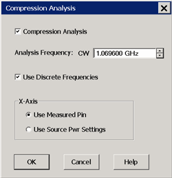 Notes: When an S21 or S11 trace
is active, any [compression
parameter](Gain_Compression_Application.htm#CompressionParams) (such as
CompGainS21) must also be displayed. Compression Analysis is NOT allowed for
S12 or S22 traces. Scroll up to [learn more about Compression
Analysis](Gain_Compression_Application.htm#Analysis). Analysis Frequency: CW
Enter a frequency to use for the compression analysis trace. Compression
Analysis Check to perform compression analysis. A compression trace is
displayed at the Analysis (CW) Frequency. Use Discrete Frequencies Check to
allow Analysis Frequencies at only the discrete points where data is measured.
Clear to allow Analysis CW Frequencies that are interpolated from the data
points. Then select ANY CW frequency between the start and stop frequencies of
the GCA channel.

### X-Axis

  * Use Measured Pin The X-axis displays the actual power that is applied to the DUT after match correction and R-channel drift correction.
  * Use Source Pwr Settings The X-axis displays the power level of the stimulus.

  
  
## Saving GCA Data

Beginning with VNA release A.08.20, GCA data can be saved to a *.csv file in
both 2D and SMART Sweep modes (previously only 2D modes). Also, a Delta Gain,
AI1, and AI2 columns have been added to the data. [Learn about ADC
parameters.](Gain_Compression_Application.htm#ADC)

### How to save GCA data

With a GCA [Compression](Gain_Compression_Application.md#CompressionParams)
trace active:  
---  
Using Hardkey/SoftTab/Softkey |  Using a mouse  
  
  1. Press Save Recall > Save Other > Save Data....
  2. File Type= CSV Formatted Data (*.csv)  
or  
GCA Sweep Data (*.csv).

|

  1. Click File
  2. Select Save Data
  3. File Type= CSV Formatted Data (*.csv)  
or  
GCA Sweep Data (*.csv).

  
  
  
Notes

  * This data type can be read by spreadsheet programs, such as Microsoft Excel.

  * Data from the last complete sweep is saved to the specified *.csv file.

  * If calibration is turned ON when the file is saved, then all data is calibrated. Otherwise, raw data is saved.

  * All *.csv data saves include a reference power level sweep at the beginning of each frequency data.

  * GCA Sweep Data (*.csv) includes sweep data.

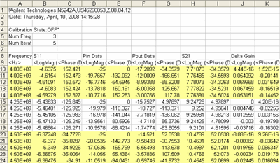

SMART Sweep data with 5 iterations and 3 frequency points. The yellow
highlight is added here for readability.

### When saving or recalling 2D data:

  * When Linear Input Power EQUALS Start Power, then the number of data points (rows)/ freq = num power points.

  * When Linear Input Power does NOT EQUAL Start Power, the number of data points (rows)/ freq = num power points \+ 1.

  * Make these selections on the GCA/GCX [Power tab](Gain_Compression_Application.md#PowerTabDiag) dialog.

## GCA Measurement Tips

There are many settings in the Gain Compression Application. Here are a few
tips when using GCA to learn as much as possible about the compression
characteristics of your DUT in the most efficient manner.

### DUT Compression Characteristics and GCA

Although GCA provides excellent results with a wide variety of amplifiers, it
works best with amplifiers which have a monotonic compression curve. In some
cases where the compression curve is not monotonic, for example if the
amplifier gain expands before it compresses, the correct compression level may
not be found.

To help a SMART sweep find the correct compression point, limit the Start and
Stop power levels around the anticipated compression point. [Learn
more.](Gain_Compression_Application.htm#PowerSetting)

The following two power-sweep traces are examples of non-monotonic gain:

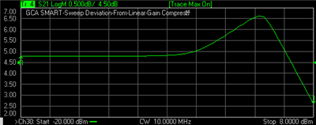

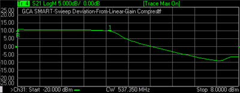

### DeltaGain

A DeltaGain trace is the best way to see how closely GCA is actually measuring
to the desired compression level. In addition, you can view the phase of
DeltaGain to see the phase deviation between the [compressed
gain](Gain_Compression_Application.htm#Terms) and the [reference
gain](Gain_Compression_Application.htm#Terms). DeltaGain is calculated as:

  * DeltaGain = Measured Gain (watts) / Ref Gain (watts)

  * In LogMag format: DeltaGain = (Measured Gain) - (Ref Gain)

With SMART Sweep, DeltaGain (in LogMag format) shows how soon certain
frequencies achieve the specified tolerance. [Learn
more.](Gain_Compression_Application.htm#DeltaGain21)

Some other settings which may be helpful:

  * Trigger source: Manual allows you to analyze data and make adjustments while allowing the device to cool. 

  * Construct Limit Lines around the compression point at the tolerance level.

The following image shows a DeltaGain21 trace using SMART Sweep. The Limit
Lines were added manually.

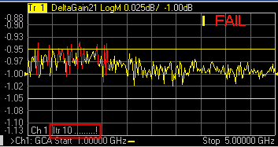

In the above image:

Relevant Settings |  Method = Compression From Linear Gain Compression level = 1 Iteration Tolerance = 0.05 dB. Maximum Iterations = 10  
---|---  
Displayed Results |  A data point on -1.00 indicates that, at that frequency, the exact compression level (1 dB) was measured. Several frequencies did not achieve the specified tolerance (0.05 dB) before the Max Iterations (10) was reached.

  * FAIL and red data points outside the limit lines.
  * Nine dots (....) indicate that 90% of the data points achieved the specified compression level.
  * one ! indicates that 10% of the data points did not achieve compression.
  * [Learn more about the Iteration Counter and annotation.](Gain_Compression_Application.md#IterCounter)

  
  
### SMART Sweep Tips

  * Compression from Linear Gain is the easiest compression method to understand and control in SMART Sweep. [Learn more.](Gain_Compression_Application.md#CompressionMethods)

  * If SMART Sweep requires more than twenty iterations, this is an indication that something is wrong. Try changing the Tolerance setting, Frequency Range, Start / Stop power range, IF bandwidth, or [Dwell Time](../S1_Settings/Sweep.md#Dwell).

  * If the number of iterations required to achieve the desired compression level changes significantly from one set of measurements to the next, this could be due to other effects, such as heating. Try increasing the dwell time or using a wideband pulse measurement configuration.

  * If the DUT should not be significantly overdriven into compression, or the changes in the input power should be limited, use [Safe Sweep](Gain_Compression_Application.md#Safe) mode with Deviation from Linear Gain compression method.

### Single Frequency Macros

Note: Beginning with VNA rev. A.09.00, the [Compression
Analysis](Gain_Compression_Application.htm#Analysis) feature provides an
easier method of viewing a traditional power sweep at a single frequency than
the GCA macros. However, the Macros are still maintained on the VNA hard
drive.

The macros perform a single power sweep on the DUT using a standard channel
with corresponding stimulus settings. The macro can show measurement
differences from the compression analysis traces due to bias/thermal/settling
effects of the DUT. So, the macro can help confirm a DUT is exhibiting some
type of settling behavior which will need to be handled in some way.

Also, the macro is a great GCA programming example.

With a 2D sweep (NOT SMART Sweep) a script that is stored on the VNA hard
drive automatically creates a traditional power sweep measurement in a
standard channel using the same stimulus setting as the GCA channel. Use a
marker in the GCA channel to specify the frequency for the measurement.

The script has two modes of operation:

  1. View Mode displays all of the previous 2D sweep data at that frequency.

  2. Measure Mode performs a new measurement at that frequency.

Both modes create a new S-Parameter channel using the same stimulus settings
as the GCA channel, including port power, attenuator, IF Bandwidth, and dwell
settings. The new channel does not support calibration or pulse
characteristics.

To see noise on a measurement, use the Measure macro in continuous sweep.
Adjust the IFBW and averaging until the noise versus sweep speed meets your
needs.

To see other effects of your DUT at a specific frequency, use the View macro
and the Measure macro with 2D sweep mode. Both macros present data using a
standard channel. The View macro shows 2D data at a specific frequency, while
the Measure macro shows freshly-measured data at the same frequency. Ideally,
the data from these two would be identical. However, changes in your DUT
behavior due to heating or other effects can cause these to be different. If
significant differences exist, try:

  * Using the 2D Frequency per Power setting rather than Power per Frequency

  * Adjusting the dwell time

  * Adjusting IFBW

  * Use a wideband pulse configuration

### How to setup the Macros

Each macro must be setup separately.

  1. Press Macro > Key Setup > Macro Setup....

  2. Select a blank line, then click Edit.

  3. In Macro Title, type a short description such as Meas GCA or View GCA.

  4. Click Browse, then navigate to C:\Program Files(x86)\Keysight\Network Analyzer\Applications\GCA\GCA.vbs

  5. In Macro run string parameters:

     1. Type M for the Measure macro or V for View macro.

     2. Optional: Supply the following additional parameters in any order:

  1.      * To run the program from a remote computer, specify the full computer name of the VNA .

     * Channel in which to create the measurement. If not specified, Measure is created in Ch30 and View is created in Ch31.

     * Example: Run string parameters for the Measure macro run from a remote computer in Channel 5.---- M MyVNA 5.

  6. Click OK.

### How to run the Macros

On a GCA channel:

  1. Create a 2D sweep. Either Power per Freq or Freq per Power. Both macros always create a power sweep at the frequency of interest.

  2. Create a CompIn trace.

  3. On the CompIn trace, right-click and select Add Marker. Drag the marker to the frequency of interest.

  4. Press Macro, then select either by the short description your provided in Step 3.

* * *

