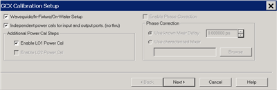
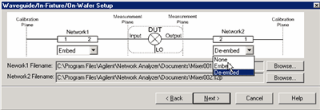
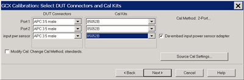
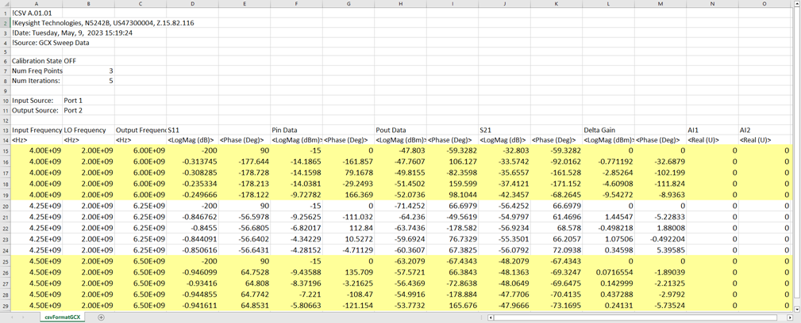

# Gain Compression for Converters (GCX)

* * *

Gain Compression is measured on Converters in the same manner as it is
measured in Amplifiers. Also, the Mixer/Converter setup is very similar to
that of [SMC](../FreqOffset/SMC_Measurements.md) (Scalar Mixer Converter
application).

In this topic (unique for GCX):

  * [Requirements and Limitations](Gain_Compression_for_Converters.md#Limitations)

  * [Using GCX](Gain_Compression_for_Converters.md#UsingGCX)

  * [Create a GCX Measurement](Gain_Compression_for_Converters.md#Create)

  * [Valid Mixer Configuration / Sweep Type Combinations](Gain_Compression_for_Converters.md#ValidSweepType)

  * [Measurement Parameters offered in GCX](Gain_Compression_for_Converters.md#MeasParams)

  * GCX Setup Dialogs

  * [GCX Calibration](Gain_Compression_for_Converters.md#GCXCal)

  * Saving GCX Data

The following Gain Compression for Amplifiers information is relevant for
learning about GCX:

  * [Gain Compression Concepts](Gain_Compression_Application.md#Concepts)

  * [Understanding the GCA Displayed Traces](Gain_Compression_Application.md#DisplayTraces)

  * [Compression Methods](Gain_Compression_Application.md#CompressionMethods)

  * [Acquisition Modes](Gain_Compression_Application.md#Acquisition)

  * [Compression Analysis](Gain_Compression_Application.md#Analysis)

  * [Saving GCA Data](Gain_Compression_Application.md#Saving)

  * [GCA Measurement Tips](Gain_Compression_Application.md#tips)

The following dialog setup tabs are shared with other applications:

  * [Frequency tab](Gain_Compression_Application.md#FreqTabDiag) (GCA topic)

  * [Power tab](Gain_Compression_Application.md#PowerTabDiag) (GCA topic)

  * [Compression tab](Gain_Compression_Application.md#CompressionTab) (GCA topic)

  *     * [Safe Sweep Mode dialog](Gain_Compression_Application.md#Safe) (GCA topic)

  * [Mixer Frequency tab](MixerConverter_Setup.md#MixerFreqTab) (separate topic)

  * [Mixer Setup tab](MixerConverter_Setup.md#MixerSetupTab) (separate topic)

  * [Mixer (LO) Power tab](MixerConverter_Setup.md#MixerPowerTab) (separate topic)

[Other Applications Topics](Applications.md)

## Requirements and Limitations

GCX requires Option S93086A/B (Gain Compression).

Limitations:

  * Number of points limited to 100,001 for two-dimensional acquisitions, 50,000 points for SMART Sweep.

  * Linear and CW sweep ONLY - No Power, Log, or Segment sweep. [Learn more.](Gain_Compression_Application.md#FreqTabDiag)

  * GCX does NOT provide any built-in image rejection techniques. You should provide image rejection hardware if necessary.

  * Stepped sweep mode only.

  * Does NOT support Narrowband Pulse measurements using the integrated Pulse setup dialogs.

The following VNA features are NOT available with Gain Compression on
Converters:

  * [ECal User Characterization](../S3_Cals/ECal_User_Characterization.md)

  * [Time Domain](../Time/TimeDomain.md)

  * [Balanced measurements](../S1_Settings/Balanced_Measurements.md)

  * Save [Formatted Citifile](../S5_Output/SaveRecall.md#cti) data.

  * [Save SnP data](../S5_Output/SaveRecall.md#An *.s3p).

  * [Port extensions](../S3_Cals/Port_Extensions.md)

  * Some Fixturing Features

  * [External Test Set Control](../System/External_Testset_Control.md) (Option S93551A/B)

  * Integrated Narrowband or [Narowband Pulse App](Narrowband_Pulsed_Application.md)

  * Independent IFBW, Power Levels, or Sweep Time in a [segment table](../S1_Settings/Sweep.md#SegmentDiag) is NOT supported.

## Using GCX

The following is a general procedure for performing a GCX measurement. The
challenge with GCX is configuring a measurement that yields the true
compression performance of YOUR DUT. This requires knowledge of the Gain
Compression and Mixer settings, and knowledge of the DUT.

See specific dialog boxes below for details.

  1. Disconnect the DUT if preset or default power levels may damage the VNA or DUT.

  2. [Preset](../S1_Settings/Preset_the_Analyzer.md) the VNA, or configure a suitable [User Preset](../S1_Settings/Preset_the_Analyzer.md#UserDiag) that will be safe in case the DUT is connected.

  3. Create a GCX channel. [Learn how](../S1_Settings/Measurement_Classes.md#How to). The default trace is SC21.

  4. Start the GCX Setup dialog and configure the measurement settings based on the DUT, adapters, attenuators, booster amplifiers, and fixtures to be used in the measurement. To start the dialog, click Stimulus, then Frequency, then GCX Setup. [Learn about the setup dialogs.](Gain_Compression_for_Converters.md#SetupDialogs)

  5. Save the [instrument state](../S5_Output/SaveRecall.md#file_save) (optional).

  6. Connect the DUT. Inspect the measurement to ensure the DUT is operating as expected.

  7. Add GCX compression and mixer parameter traces. [Learn more.](Gain_Compression_for_Converters.md#MeasParams)

  8. Adjust the measurement settings to yield satisfactory compression results. [See GCA Measurement Tips.](Gain_Compression_Application.md#tips)

  9. Start and complete the [GCX Calibration wizard](Gain_Compression_for_Converters.md#GCXCal).

## Create a GCX Measurement

  1. Press Meas > S-Param > Meas Class....

  2. Select Gain Compression Converters, then either:

     * OK delete the existing measurement, or

     * New Channel to create the measurement in a new channel.

  3. A default SC21 measurement is displayed. To select additional parameters to display, press Trace, select a trace, press Meas, then select a parameter. [Learn more about GCX Parameters.](Gain_Compression_for_Converters.md#MeasParams)

#### How to start the Gain Compression for Converters Setup dialog  
  
---  
Using Hardkey/SoftTab/Softkey | Using a mouse  
  
  1. Press Freq > Main > GCX Setup....

|

  1. Click Stimulus
  2. Select GCX Setup...

  
  
  
## Valid Mixer Configuration / Sweep Type Combinations

The following are the Valid Sweep Type / Mixer Configurations.

Sweep Type | Input | LO | Output  
---|---|---|---  
Linear | Swept | Fixed | Swept  
Swept | Swept | Fixed  
CW | Fixed | Fixed | Fixed  
Fixed | Swept | Swept  
  
For determining a valid mixer configuration with 2 LOs, one Fixed LO and one
Swept is equivalent to having a single-stage Swept LO.

If you create an invalid Sweep Type / Mixer Configuration, a red message
appears like the following:

If this occurs, change the Sweep Type on the [Frequency
tab](Gain_Compression_Application.htm#FreqTabDiag).

[See other rules for configuring a mixer](MixerConverter_Setup.md#Rules).

## GCX Measurement Parameters

Note: The following table assumes: DUT Input = VNA port 1 and DUT Output = VNA
port 2. When the Port mapping is different, the parameters in GCX are updated
accordingly. For example, with Input = port 2 and Output = port 1, then
"CompIn12" would be displayed.  
---  
  
Parameter | Description  
---|---  
Mixer Parameters  
SC21 | Linear Conversion Gain  
SC12 | Reverse Conversion Gain  
S11 | Input Match  
S22 | Output Match  
Compression Parameters  
CompIn21 | Input power at the compression point.  
CompOut21 | Output power at the compression point.  
CompGain21 | Gain at the compression point.  
CompS11 | Input Match at the compression point.  
RefS21 | Linear Gain value used to calculate the compression level. This is calculated differently depending on the compression method.  
DeltaGain21 | CompGain21 MINUS Linear Gain (in Log Mag format). This trace can be used to learn a lot about the DUT compression point. [Learn more.](Gain_Compression_Application.md#DeltaGain21)  
Unratioed \- Absolute test port receiver measurements. [Learn
more.](../FreqOffset/SMC_Measurements.htm#offered)  
IPwr | Input power measured at DUT-IN @ Input frequency  
OPwr | Output power measured at DUT-OUT @ Output frequency  
RevIPwr | Input power measured at DUT-OUT @ Output frequency  
RevOPwr | Output power measured at DUT-IN @ Input frequency  
ADC Parameters \- [Learn more](../S1_Settings/ADC_Measurements.md).  
AI1 | Measured at the specified Linear Input level.  
AI2 | Measured at the specified Linear Input level.  
CompAI1 | AI1 at Compression  
CompAI2 | AI2 at Compression  
  
## GCX Setup Dialogs

All of the GCX Setup tabs are shared with other applications.

  * [Frequency tab](Gain_Compression_Application.md#FreqTabDiag)

  * [Power tab](Gain_Compression_Application.md#PowerTabDiag)

  * [Compression tab](Gain_Compression_Application.md#CompressionTab)

  *     * [Safe Sweep Mode dialog](Gain_Compression_Application.md#Safe)

  * [Mixer Frequency tab](MixerConverter_Setup.md#MixerFreqTab)

  * [Mixer Setup tab](MixerConverter_Setup.md#MixerSetupTab)

  * [Mixer (LO) Power tab](MixerConverter_Setup.md#MixerPowerTab)

## GCX Calibration

A GCX Cal is conceptually the same as a [Gain Compression
Calibration](GCA_Cal.htm). This includes the ability to perform or downgrade
to an Enhanced Response Cal. [Learn how.](GCA_Cal.md#Full)

The following Guided Cal Wizard pages are unique to GCX:

GCX Calibration Setup dialog box help  
---  
Waveguide/In-fixture/On-Wafer Setup Starts the following dialog box.
Independent power cals for input and output ports (no thru) Check if a Thru
standard is NOT available. During the power cal, you will be prompted to
connect the power sensor to the Input, then the Output port.

### Additional Power Cal Steps

Enable LO1 / LO2 Power Cal Check when LO1 / LO2 is controlled (on the [Mixer
Setup](MixerConverter_Setup.htm#MixerSetupTab) tab) to perform a Power Cal on
the source. Note: Phase Correction is NOT allowed for GCX measurements.  
  

Waveguide/In-fixture/On-Wafer Setup dialog box help  
---  
This dialog box appears ONLY if you checked the Waveguide/In-fixture/On-Wafer
Setup box in the previous [Cal
Setup](Gain_Compression_for_Converters.htm#CalSetupDiag) dialog. Allows you to
embed or de-embed circuit networks on the input and output of your mixer under
test. For Network1 (Input) and Network2 (Output) select Embed, De-embed, or
None. Browse Click to navigate to the .S2P file that models the network to
embed or de-embed.

### To Embed or De-embed

  * De-Embed when there is a 2-port network that needs to be connected during the measurement, but it is NOT present during the calibration. An example might be when you do not have standards for a characterized test fixture, so you calibrate without the fixture, and make measurements with the DUT in the fixture. De-Embedding during the calibration extends the calibration reference plane to include the 2-port network.
  * Embed when there is a 2-port network that to be disconnected during the measurement, but is present during the calibration. An example might be when a characterized adapter is required during the calibration but NOT present during measurements of the DUT. Embedding during the calibration retracts the calibration reference plane to exclude the 2-port network during the measurement.

| Notes

  * The S2P file for Network1 (on the input of the mixer), must cover the Input frequency range.  
The S2P file for Network2 (on the output of the mixer), must cover the Output
frequency range.

  * The frequency range of the S2P file must be the same, or larger than, the frequency range of the measurement. If more frequencies are included in the file, and the data points do not exactly match those of the measurement, interpolation will be performed.
  * As in the image on the dialog (above), in all cases:

  1.      * Port 1 of each network is assumed to be connected to the VNA.
     * Port 2 of each network is assumed to be connected to the DUT.

  
---  
  

Select DUT Connectors and Cal Kits dialog box help  
---  
Allows you to specify the connector type and Cal Kit for each DUT port. Port n
For each listed VNA port, specify the DUT connector type and gender, and the
Cal Kit to use. input pwr sensor  Specify the connector type of the power
sensor. Select Ignored to not compensate for the effects of the adapter that
may be necessary to connect the power sensor to the input reference plane.
output pwr sensor  Available when Independent power cals for input and output
ports is checked on the [GCX Calibration
Setup](Gain_Compression_for_Converters.htm#CalSetupDiag) dialog. Specify the
connector type of the power sensor. Select Ignored to NOT compensate for the
effects of an adapter that may be necessary to connect the power sensor to the
output reference plane. De-embed input power sensor adapter Check to measure,
then remove the effects of the adapter that is used to connect the power
sensor to the calibration reference plane. Source Cal Settings Click to start
the [Source Cal Settings](../S3_Cals/Power_Cal_for_Apps.md#SourceCalApps)
dialog. These settings allow you change ALL Source Cal and Power Meter
settings. Note: If your DUT connectors are:

  * Waveguide Change the system impedance to 1 ohm before performing a calibration. See [Setting System Impedance](../System/System_Impedance.md).
  * Not listed (male and female) Select Type A as the connector type. Type A requires a calibration kit file containing the electrical properties of the standards used for calibration (see [Calibration kits](../S3_Cals/ModifyCalKits.md#CalKitManager)).
  * Unspecified (like a packaged device) Select Type B as the connector type. Type B requires a calibration kit file containing the electrical properties of the standards used for calibration (see [Calibration kits](../S3_Cals/ModifyCalKits.md#CalKitManager)).

Modify Cal Check, then click Next, to start the [Modify Frequency Cal
dialog](../S3_Cals/Calibration_Wizard.htm#ModifyThru).  
  
## Saving GCX Data

### How to save GCX data

With a GCX [Compression](Gain_Compression_Application.md#CompressionParams)
trace active:  
---  
Using Hardkey/SoftTab/Softkey | Using a mouse  
  
  1. Press Save Recall > Save Other > Save Data....
  2. File Type= GCX Sweep Data (*.csv)

|

  1. Click File
  2. Select Save Data
  3. File Type= GCX Sweep Data (*.csv)

  
  
  
Notes

  * This data type can be read by spreadsheet programs, such as Microsoft Excel.

  * Data from the last complete sweep is saved to the specified *.csv file.

  * If calibration is turned ON when the file is saved, then all data is calibrated. Otherwise, raw data is saved.

  * All *.csv data saves include a reference power level sweep at the beginning of each frequency data.

  * GCX Sweep Data (*.csv) includes sweep data.

SMART Sweep data with 5 iterations and 3 frequency points. The yellow
highlight is added here for readability.

### When saving or recalling 2D data:

  * When Linear Input Power EQUALS Start Power, then the number of data points (rows)/ freq = num power points.

  * When Linear Input Power does NOT EQUAL Start Power, the number of data points (rows)/ freq = num power points \+ 1.

  * Make these selections on the GCA/GCX [Power tab](Gain_Compression_Application.md#PowerTabDiag) dialog.

* * *

