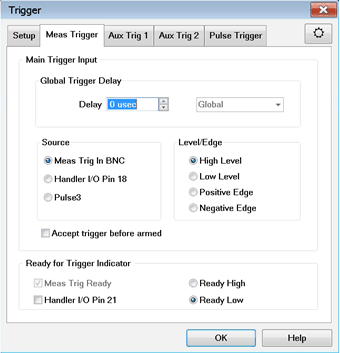
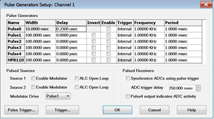

# Gated Measurement

  * Measurement Description
  * Quick Setup
  * Complete Measurement Setup

[See All Spectrum Analyzer
Examples](Spectrum_Analyzer.htm#Spectrum_Analyzer_Measurement_topics_)

## Measurement Description

Gated spectrum analyzer (SA) measurements (requires option S93090xA) use
triggering to capture data during the active trigger state only and thus
ensure that the response more closely represents the device response. [Learn
more](Spectrum_Analyzer.htm#Gated_SA).

This example shows how to set up a gated SA measurement using an external or
internal pulse to trigger the receiver measurement and an internal pulse to
trigger the RF source. In order to pulse the VNA RF source with an internal
pulse, option S93025A/B is required. This option is not required in the case
of an external RF source with pulsed capabilities.

Note: Internal Pulse0 pulse generator is not suitable for gated SA because the
pulse width cannot be set. Instead, use Pulse3 as shown in this topic (pulse 1
to pulse 4 would work too, but without the direct Trigger source to Pulse3
internal connection).

## Quick Setup

Many of the setup steps can be performed automatically if option S93026A/B is
installed. The quick setup will configure a gated SA measurement using
internal pulse generators and modulators. The RBW will be set to the maximum
setting that is compatible with the pulse width. If minor adjustments are
required after performing the quick setup, refer to the Complete Measurement
Setup.

  1. Press Meas > S-Param > Meas Class....
  2. Select Spectrum Analyzer, then either:

     * OK delete the existing measurement, or

     * New Channel to create the measurement in a new channel.

  3. Press Freq > Main > SA Setup... and set the frequency of the VNA source.
  4. Set the source Power to the desired level.
  5. Click on the Pulse Setup... button, select Standard Pulse, then ensure that the Pulse Width is much smaller than the Pulse Period then click OK.

## Complete Measurement Setup

  1. If using an external pulse generator, connect a cable from the pulse generator output to the Meas Trig In BNC on the rear panel of the VNA.
  2. On the VNA front panel, press Meas > S-Param > Meas Class....
  3. Select Spectrum Analysis, then either:

     * OK delete the existing measurement, or

     * New Channel to create the measurement in a new channel.

  4. Press Freq > Main > SA Setup... and set the frequency of the VNA source.
  5. Click on the Advanced tab then click on the Advanced >> button.
  6. Click on the Trigger tab then click on the Trigger button.
  7. Click on the Meas Trigger tab and select Meas Trig In BNC (if using an external pulse generator) or Pulse3 (if using internal pulse3 to Meas Trig In bypass) under Source and High Level under Level/Edge.

Selecting High Level (or Low Level) under Level/Edge triggers LO acquisitions
and continues to acquire data while the pulse trigger remains high (or low).

Note: Edge triggering does not perform gated measurements.

  7. Click on the Setup tab and select External (uses Pulse3) (if using internal pulse3 to Meas Trig In bypass) or External (uses MEAS TRIG IN) (if using an external pulse generator),
  8. Select Channel under Trigger Scope, Point for the Trigger Mode, then click OK.

For gated SA measurements, Point does not refer to a data point or display
point. Instead, it refers to the next LO acquisition. For SA, each time the LO
is shifted an acquisition is captured. The time for each LO acquisition is
based on the [ADC Record Size](Spectrum_Analyzer.md#Force_ADC_Record_Size)
times the ADC Sampling Frequency (10 nsec). The number of LO acquisitions is
determined by the [Image Reject](Spectrum_Analyzer.md#Image_Reject) setting.
This information is displayed in the SA Setup dialog in the Advanced tab.

  9. Click on the Source tab and set the source Power to the desired level.
  10. Click on the Power and Attenuator... button, set the Leveling Mode to Open Loop, then click OK.

Open Loop leveling is used during pulse conditions with the internal source
modulator. No leveling is used in setting the source power. [Learn
more](../S1_Settings/Power_Level.htm#Leveling).

  11. In the Trigger tab, click on the Pulse Gen Config button.

  12. If using an internal pulse generator and an internal RF source, perform the following steps: 
     1. Set the pulse Frequency.
     2. Enable Pulse1 and set the Width greater than the acquisition time (displayed in the Advanced tab). Pulse1 is the RF source trigger.
     3. Ensure that Enable Source 1 Modulator is checked, and that Pulse1 is enabled and selected as the Modulator Drive.
     4. If using the internal Pulse3 bypass, enable Pulse3 and set the Width greater than the acquisition time per LO (displayed in the Advanced tab).
     5. Click OK.
  13. If using an external pulsed generator as the measurement trigger, perform the following steps:
     1. Ensure that the pulse width is greater than the acquisition time per LO (displayed in the Advanced tab).
     2. Connect the RF source pulse trigger output to the VNA Meas Trig In BNC connector on the rear panel.

* * *

