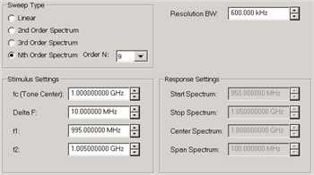
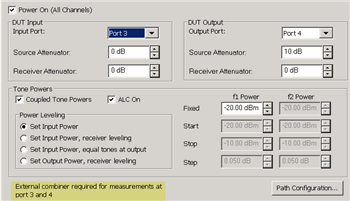
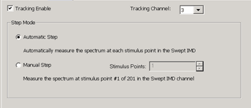
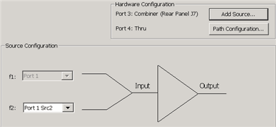

# IM Spectrum for Amplifiers (Opt S93087A/B)

* * *

Intermodulation Spectrum measurements can be made independently, or coupled
with Swept IMD measurements. They are a distinct measurement class. Therefore,
IM Spectrum measurements are always made in a separate channel.

  * [Limitations](IMSpectrum.md#Limitations)

  * [Create an IM Spectrum Channel](IMSpectrum.md#Create)

  * [Select IM Spectrum Parameters](IMSpectrum.md#Parameters)

  * [Start the IM Spectrum Setup dialog](IMSpectrum.md#HowStartdiag)

  *     * [Frequency tab](IMSpectrum.md#FreqTabDiag)

    * [Power tab](IMSpectrum.md#PowerTab)

    * [Tracking tab](IMSpectrum.md#Tracking)

    * [Configure tab](IMSpectrum.md#ConfigureDiag)

  * [Calibration](IMSpectrum.md#Calibration)

### See Also

  * [IM Spectrum Concepts](Swept_IMD_and_IM_Spectrum_Concepts.md#HowIMSpectrum)

  * [IMx Spectrum for Converters](IM_Spectrum_for_Converters.md)

  * [Swept IMD Measurements](Swept_IMD.md)

  * [Programming commands](../Programming/MixerTopic.md#IMS)

* * *

### Limitations with IM Spectrum

The following VNA features are NOT available in an IM Spectrum channel:

  * [Unratioed receiver measurements](../S1_Settings/Measurement_Parameters.md#Unratioed_Power) (A, B, R)

  * [ECal User Characterization](../S3_Cals/ECal_User_Characterization.md)

  * [FOM](../FreqOffset/Frequency_Offset_Mode.md) or [FCA](../FreqOffset/FCA_Use.md)

  * [Time Domain](../Time/TimeDomain.md)

  * [Balanced measurements](../S1_Settings/Balanced_Measurements.md)

  * Save [Formatted Citifile](../S5_Output/SaveRecall.md#cti) data.

  * [Save SnP data](../S5_Output/SaveRecall.md#An *.s3p).

  * [External sources](../System/Configure_an_External_Device.md)

  * [External Test Set Control](../System/External_Testset_Control.md) (Option S93551A/B)

  * [Port Extensions](../S3_Cals/Port_Extensions.md)

  * Integrated Narrowband or [Narowband Pulse App](Narrowband_Pulsed_Application.md)

  * [DC Meter parameters](../System/Configure_a_DC_Device.md)

  * Option [205](../Support/Configurations.md#205) or Option [425](../Support/Configurations.md#425-N5242B)

## Create an IM Spectrum Channel

An IM Spectrum channel can be created independently from a Swept IMD channel
or coupled with the stimulus settings of an existing Swept IMD measurement.

### To create an independent IM Spectrum channel

  1. Press Meas > S-Param > Meas Class....

  2. Select IM Spectrum, then either:

     * OK delete the existing measurement, or

     * New Channel to create the measurement in a new channel.

### To create an IM Spectrum channel from an existing Swept IMD channel

  1. With a Swept IMD channel active, press Marker on the front panel.

  2. Move the marker to the data point of interest. It can be moved later.

  3. Press Marker > Marker Functions > Marker -> IM Spectrum.

This creates or configures an existing IM Spectrum channel based upon the
configuration of the Swept IMD channel.

### To perform this function remotely:

Execute the VBScript file located on the VNA.

  1. Create a macro. Either send this command or it can be done manually:  
SYST:SHOR10:PATH “C:\Program Files (x86)\Keysight\Network
Analyzer\Applications\IMD\imd.vbs”

  2. Execute the macro using: [SYST:SHOR10:EXEC](../Programming/GP-IB_Command_Finder/System.md#MacroExecute) or the equivalent COM command: [Execute Shortcut Method](../Programming/COM_Reference/Methods/Execute_Shortcut_Method.md)

Notes:

  * 10 is the macro number. If you are already using this number for a macro, it will be overwritten.
  * The marker must already be on the IMD trace and be the active marker.
  * The path name to imd.vbs may be different on your VNA.

  
---  
  
## Select IM Spectrum Parameters

How to add IM Spectrum traces With the IM Spectrum channel active and a Tr1
Output trace displayed:  
---  
Using Hardkey/SoftTab/Softkey | Using a mouse  
  
  1. Press Trace, then select trace.
  2. Press Meas, then select a parameter.

|

  1. Click Instrument, Trace, Add Trace.
  2. Click Response, Meas, then select a parameter.

  
  
New Trace - IM Spectrum -dialog box help  
---  
Choose from:

  * Output Spectrum View signals OUT of the DUT and into VNA port 2 (B receiver).
  * Input Spectrum View signals IN to the DUT (R1 receiver). Use this when measuring IM product frequencies to determine the power level of spurious signals into the DUT at those frequencies.
  * Reflection Spectrum View signals reflected off the DUT input and back into VNA port 1 (A receiver)

  
  
## IM Spectrum Setup Dialog

#### How to start the IM Spectrum Setup dialog

With an IM Spectrum measurement active:  
---  
Using Hardkey/SoftTab/Softkey | Using a mouse  
  
  1. Press Sweep > Main > IMS Setup....

|

  1. Click Stimulus
  2. Select IMS Setup...

  
  
Frequency tab - IM Spectrum -dialog box help  
---  
 Note: The number of data points in
an IM Spectrum channel = 3 * SPAN / ResBW. This can NOT be changed directly.
Configures the Sweep Type and frequency range for IM Spectrum measurements.

### Sweep Type

Provides several methods to tune the IM Spectrum receivers (NOT stimulus) to
view the power spectrum of arbitrary frequency ranges or various distortion
products. Linear  Allows the start/stop or center/span receiver frequencies to
be set arbitrarily for f1 and f2. Enter the Response Settings below. 2nd Order
Couples the receiver frequency range to f1 and f2 to provide a convenient
means of observing the spectrum surrounding ONLY the high-side 2nd order
harmonic where Center = (f1 + f2), Span = 3 * (f2 – f1). Note: The center
frequency is NOT set on the main tones. 3rd Order Couples receiver frequency
range to f1 and f2 to provide a convenient means of observing the spectrum
surround the main-tones including the 3rd Order products where Center = (f1 +
f2) / 2, Span = 4 * (f2 – f1). Nth Order Couples receiver frequency range to
f1 and f2, providing a convenient means of observing the spectrum surrounding
the main-tones for an arbitrary span where Center = (f1 + f2) / 2, and Span =
N * (f2 – f1). This allows you to set the span arbitrarily, but have the
center frequency track the main tone frequencies.

### Resolution BW

The IM Spectrum channel utilizes a set of Gaussian filters instead of the
standard VNA IF filters in order to provide similar behavior to traditional
spectrum analyzers. The comprehensive list of filters that are available for
IM spectrum are: 3 MHz, 1 MHz, 600 kHz, 300 kHz, 150 kHz, 100 kHz, 60 kHz, 10
kHz, 3 kHz, and 1 kHz. Note: The 10 kHz Res BW filter can generate image
signals which are not a product of the DUT. You can verify the integrity of a
questionable signal by switching to the 3 kHz or 60 kHz filter and looking for
the image signal in the same location. Not all of these filters are available
for all measurements. Narrower filters are available for use with narrower
frequency spans, and wider filters are available for wider spans.

### Stimulus Settings

Allows configuration of the main-tone frequencies. Available ONLY when
Tracking is OFF.

  * fc (main-tone center frequency) = (f1 + f2) / 2
  * DeltaF (main-tone frequency separation) = (f2 – f1).
  * f1 = Low-side main-tone frequency
  * f2 = High-side main-tone frequency

### Response Settings

Allows configuration of the frequency range to sweep the receivers in terms of
start/stop or center/span. Available for Linear sweep types ONLY.

  * Start Spectrum = first frequency point of the power spectrum sweep

Note: The minimum Start Spectrum frequency that can be set is 40 MHz.

  * Stop Spectrum = last frequency point of the power spectrum sweep
  * Center Spectrum = (Start Spectrum + Stop Spectrum) / 2
  * Span Spectrum = (Stop Spectrum – Start Spectrum)

  
  
Power tab - IM Spectrum -dialog box help  
---  
 [Learn about this
dialog](Swept_IMD.htm#PowerTabDiag)  
  
Tracking tab - IM Spectrum -dialog box help  
---  
 These selections are NOT available when there is no Swept IMD channel. Allows the IM Spectrum channel to use (track) the stimulus (Main Tone) settings of an existing Swept IMD channel. Tracking Enable Check to use the frequency and power stimulus settings from the specified IMD channel. When enabled, stimulus settings on the Frequency Tab are disabled and ALL stimulus settings, such as frequencies, power and attenuator settings, and calibration, are copied from the Swept IMD channel to the IM Spectrum channel. |   
---  
IM Spectrum trace (bottom) tracking with Swept IMD traces (top)  
  
  * In the top Swept IMD window the main tones are swept from 4 GHz to 6 GHz with some specified delta F tone separation. The marker is on the center data point at 5 GHz.

  * The bottom IM Spectrum window center frequency is the same as the above marker: 5 GHz, but it has a much narrower frequency range of +/- 500 kHz. The IM Spectrum channel sets the receiver to see the two main tones, plus the third, fifth, and seventh-order products.

### Step Mode

When tracking is enabled, set the method by which the IM spectrum measurement
tracks the IMD channel.

Manual Step When selected, IM Spectrum measurements occur at only the
specified IMD channel data point. Stimulus Point specifies the data point, by
number, in the Swept IMD channel which has the stimulus settings to use for
the IM Spectrum sweep.

Automatic Step When selected, causes the IM Spectrum channel to sequentially
setup each of the stimulus conditions through which the Swept IMD channel
sweeps the DUT. Each sweep of IM Spectrum is performed using the next set of
stimulus conditions.

For example, in the above image, the first Swept IMD data point is at 4 GHz.
The first IM Spectrum sweep uses a center frequency of 4 GHz. The following IM
Spectrum sweep would be at the second Swept IMD data point or 4.01 GHz, and so
forth. After the last data point in the sweep is reached, the IM Spectrum
channel begins again at the first Swept IMD data point. The only indication
that Tracking is enabled is in Automatic mode, you can see the center
frequency increment with each IM Spectrum sweep.  
  
Configure tab- IM Spectrum Setup -dialog box help  
---  
 To accommodate single-source
VNA models, an external source can be used for the RF2 tone. Learn how to
[configure an external source and
combiner](Swept_IMD_Configure_External_Source_and_Combiner.htm) to make Swept
IMD, IMDx, IM Spectrum, and IM Spectrum for Converters measurements. RF1
Always uses VNA internal source 1. RF2 Available for selection when an
external source is configured and Active. Add Source Click to configure an
external source using the [External Source Configuration
dialog.](../System/Configure_an_External_Device.htm) Path Configuration Click
to launch the [Path Configuration
dialog](../S1_Settings/Path_Configurator.htm) (PNA-X models only).  
  
## Calibration

A calibration corrects the IM Spectrum source and receiver power level
accuracy of the displayed Tones.

A calibration of the IM Spectrum channel is NOT performed using the
Calibration wizard. An IM Spectrum channel is calibrated by applying a Cal Set
in one of the following ways:

  * A cal that was used on a Swept IMD channel. The Cal Set can be applied to the IM Spectrum channel using the Manage Cal Sets dialog ([Learn how](../S3_Cals/Cal_Sets.md#HowApply)) or from the Marker =>IM Spectrum softkey ([Learn how](IMSpectrum.md#Create)). However, a Swept IMD channel with [Sweep Type = Power Sweep](Swept_IMDx.md#FreqTabDiag) can NOT be applied to a IM Spectrum channel. This is because a Cal Set for power sweep contains only a CW frequency and the IM Spectrum channel requires a swept frequency range. Zero Span is not supported in an IM Spectrum channel.

  * A Source Power and Receiver Cal Set from a standard channel calibration. This can be a full calibration, but must include a source power cal for the source port (1) and receiver cal for the B receiver. Only one source can be corrected. [Learn how to apply a standard Cal Set.](../S3_Cals/Cal_Sets.md#ApplyingCalSet)

[See Swept IMD Calibration](Swept_IMD.md#CalOverview)

* * *

