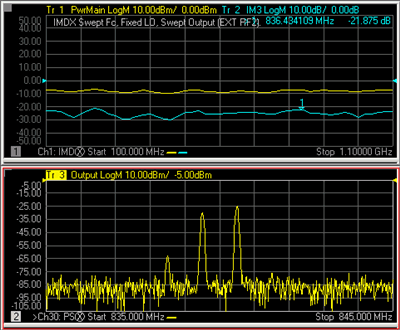

# IMx Spectrum for Converters

* * *

IMx Spectrum measurements are a distinct measurement class and therefore
always made in a separate channel. This topic discusses all aspects of an IMx
Spectrum measurement.

  * [Limitations](IM_Spectrum_for_Converters.md#Limitations)

  * [How an IMx Spectrum Channel Works](IM_Spectrum_for_Converters.md#How)

  * [Create an IMx Spectrum Channel](IM_Spectrum_for_Converters.md#Create)

  * [Select IMx Spectrum Parameters](IM_Spectrum_for_Converters.md#Parameters)

  * [Start the IMx Spectrum Setup dialog](IM_Spectrum_for_Converters.md#HowStartdiag)

  *     * [Frequency tab](IM_Spectrum_for_Converters.md#FreqTabDiag)

    * [Tone Power tab](IM_Spectrum_for_Converters.md#PowerTab)

    * [Mixer Frequency tab](MixerConverter_Setup.md#MixerFreqTab) (separate topic)

    * [Mixer Power tab](MixerConverter_Setup.md#MixerPowerTab) (separate topic)

    * Mixer Setup tab

  * [Calibration](IM_Spectrum_for_Converters.md#Calibration)

### See Also

  * [Swept IMD Measurements](Swept_IMD.md)

  * [Programming commands](../Programming/MixerTopic.md#IMxSpectrum)

* * *

## Limitations

IMx Spectrum requires IMD (Opt S93087A/B).

Note: The minimum frequency of this application is 40 MHz.(10 MHz plus 30
MHz). The maximum frequency of this application is the MAX frequency of the
VNA MINUS 30 MHz. This is due to the use of the various IF frequencies.  
---  
  
The following VNA features are NOT available in an IMx Spectrum channel:

  * [Unratioed receiver measurements](../S1_Settings/Measurement_Parameters.md#Unratioed_Power) (A, B, R)

  * [ECal User Characterization](../S3_Cals/ECal_User_Characterization.md)

  * [FOM](../FreqOffset/Frequency_Offset_Mode.md) or [FCA](../FreqOffset/FCA_Use.md)

  * [Time Domain](../Time/TimeDomain.md)

  * [Balanced measurements](../S1_Settings/Balanced_Measurements.md)

  * Save [Formatted Citifile](../S5_Output/SaveRecall.md#cti) data.

  * [Save SnP data](../S5_Output/SaveRecall.md#An *.s3p).

  * [External sources](../System/Configure_an_External_Device.md)

  * [External Test Set Control](../System/External_Testset_Control.md) (Option S93551A/B)

  * [Interface Control](../System/Interface_Control.md)

  * [Port Extensions](../S3_Cals/Port_Extensions.md)

  * Fixturing Simulator

  * Integrated Narrowband or [Narowband Pulse App](Narrowband_Pulsed_Application.md)

  * Option [205](../Support/Configurations.md#205) or Option [425](../Support/Configurations.md#425-N5242B)

Note: Opt S93084A/B ([Embedded LO measurements](Embedded_LO.md)) is NOT
necessary to make an IMx Spectrum measurement on converters with an embedded
LO. This is because the embedded LO can be slightly off-frequency and the
output tones will still be visible on the IMxSpectrum display. You may have to
select Linear sweep type, then set the response frequency span wide enough to
allow for a more off-frequency embedded LO. [Learn
how](IMSpectrum.htm#FreqTabDiag).

## How an IMx Spectrum for Converters Channel Works

Before reading this topic, you should become familiar with [IMD
Concepts](Swept_IMD_and_IM_Spectrum_Concepts.htm#Concepts).

The IMx Spectrum channel provides a traditional Spectrum Analyzer view of the
intermodulation distortion behavior of a converter output. Unlike the Swept
IMDx channel, the main tones (F1 and F2) are fixed while the receiver is swept
over a frequency range of interest in order to generate a display as shown
below.

  
---  
IMx Spectrum trace (bottom) with Swept IMDx traces (top)  
  
A typical Spectrum Analyzer does NOT have a signal source. This one does. The
signal source, or stimulus, settings for the F1 and F2 main tones can be set
in either the IMx Spectrum channel or the Swept IMDx channel. These settings
include the frequencies and power levels of the main tones.

### Receiver Settings

Although the stimulus settings can be set in either the IMx Spectrum channel
or the Swept IMDx channel, the receiver settings are set ONLY in the Frequency
tab of the [IMx Spectrum dialog](IM_Spectrum_for_Converters.md#FreqTabDiag).
These settings include how many tone products to view, which determines the
center and frequency span and the resolution bandwidth. You can also set a
Linear sweep type, then enter an arbitrary receiver frequency range.

You can choose from several resolution bandwidths which also determines the
number of data points used in the channel. The higher the Res BW, the fewer
the number of data points.

The IMx Spectrum channel performs multiple measurements for each data point in
order to reject unwanted images which are generated by the VNA internally.
This provides a high degree of confidence that signals captured in a trace are
real and are not spurious responses generated in the measurement process.

### Differences from IM Spectrum for Amplifiers

An IMx Spectrum for Converters channel has the following important differences
from an [IM Spectrum channel for Amplifiers](IMSpectrum.md).

  * In an IMx Spectrum channel, all converter frequencies are fixed. (Input, Output, LO, Tone Spacing, and Tone Power).

  * The IMx Spectrum channel CANNOT track with the IMDx channel, as it can in IMD for Amplifiers.

## Create an IMx Spectrum Channel

An IMx Spectrum channel can be created independently, or from an existing
Swept IMDx channel.

### To create an independent IMx Spectrum channel

  1. Press Meas > S-Param > Meas Class....

  2. Select IMx Spectrum, then either:

     * OK delete the existing measurement, or

     * New Channel to create the measurement in a new channel.

### To create an IMx Spectrum channel from an existing Swept IMD channel

This creates or configures an existing IMx Spectrum channel based upon the
configuration of the Swept IMD channel at the Marker frequency.

  1. With a Swept IMD channel active, press the Marker key on the front panel.

  2. Move the marker to the data point of interest. It can be moved again later.

  3. Press [Marker Functions] then [Marker -> IMx Spectrum]

## Select IMx Spectrum Parameters

How to add IMx Spectrum traces With the IMx Spectrum channel active and a Tr1
Output trace displayed:  
---  
Using Hardkey/SoftTab/Softkey | Using a mouse  
  
  1. Press Trace, then select trace.
  2. Press Meas, then select a parameter.

|

  1. Click Instrument, Trace, Add Trace.
  2. Click Response, Meas, then select a parameter.

  
  
New Trace - IMx Spectrum -dialog box help  
---  
Output Port 2, Incident View signals OUT of the DUT and into VNA port 2 (B
receiver). Note: Only viewing the OUTPUT tones is supported.  
  
## IMx Spectrum Setup Dialog

#### How to start the IMx Spectrum Setup dialog

With an IMx Spectrum measurement active:  
---  
Using Hardkey/SoftTab/Softkey | Using a mouse  
  
  1. Press Sweep > Main > IMSX Setup....

|

  1. Click Stimulus
  2. Select Sweep
  3. Select IMSX Setup...

  
  
  
Frequency tab - IMx Spectrum -dialog box help  
---  
 [Learn about this
dialog](IMSpectrum.htm#FreqTabDiag) and [about *.mxr
files.](MixerConverter_Setup.htm#AboutMxr)  
  
Tone Power tab - IMxSpectrum -dialog box help  
---  
 [Learn about this
dialog](Swept_IMD.htm#PowerTabDiag) and [about *.mxr
files.](MixerConverter_Setup.htm#AboutMxr)  
  
Mixer Frequency tab - IMx Spectrum -dialog box help  
---  
 [Learn about this
dialog](MixerConverter_Setup.htm#MixerFreqTab) and [about *.mxr
files.](MixerConverter_Setup.htm#AboutMxr)  
  
Mixer (LO) Power tab - IMx Spectrum -dialog box help  
---  
 [Learn more about this
dialog](MixerConverter_Setup.htm#MixerPowerTab) and [about *.mxr
files.](MixerConverter_Setup.htm#AboutMxr)  
  
Mixer Setup tab - IMx Spectrum -dialog box help  
---  
 To accommodate single-source VNA
models, an external source can be used for the RF2 tone. Learn how to
[configure an external source and
combiner](Swept_IMD_Configure_External_Source_and_Combiner.htm) to make Swept
IMD and IMDx measurements. Converter Stages Choose from 1 or 2 stage DUT (# of
LOs).

### Converter Model

f1 Always uses VNA internal source 1. (DUT Input) Port N Available for
selection on 4-port VNA models. Select the VNA port (1 or 3) to connect to the
DUT Input. f2 Available for selection when an external source is configured
and Active. LO1 (and LO2 for 2-stage DUTs) Select the source to use for the
specified LO. Available for selection when an external source is configured
and Active. (DUT Output) Port N Available for selection on 4-port VNA models.
Select the VNA port to connect to the DUT Output.

### Hardware Configuration

Add Source Click to configure an external source using the [External Source
Configuration dialog.](../System/Configure_an_External_Device.htm) Path
Configuration Click to launch the [Path Configuration
dialog](../S1_Settings/Path_Configurator.htm) (PNA-X models only).  
  
## Calibration

A calibration of the IMx Spectrum channel is NOT performed using a calibration
wizard.

An IMx Spectrum channel is calibrated from a Cal Set that is used on a Swept
IMDx channel. The Cal Set can be applied to the IMx Spectrum channel using the
Manage Cal Sets dialog ([Learn how](../S3_Cals/Cal_Sets.md#HowApply)) or from
the Marker =>IMx Spectrum softkey ([Learn
how).](IM_Spectrum_for_Converters.htm#Create)

However, a Swept IMDx channel with [Sweep Type = Power
Sweep](Swept_IMDx.htm#FreqTabDiag) can NOT be applied to a IMx Spectrum
channel. This is because a Cal Set for power sweep contains only a CW
frequency and the IMx Spectrum channel requires a swept frequency range. Zero
Span is not supported in an IMx Spectrum channel.

A calibrated IMx Spectrum trace corrects the source and receiver power level
accuracy of the displayed Tones.

[See Swept IMD Calibration](Swept_IMD.md#CalOverview)

[Learn how to apply a Cal Set to the IMx Spectrum
channel](../S3_Cals/Cal_Sets.htm#HowApply)

* * *

