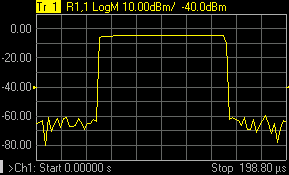
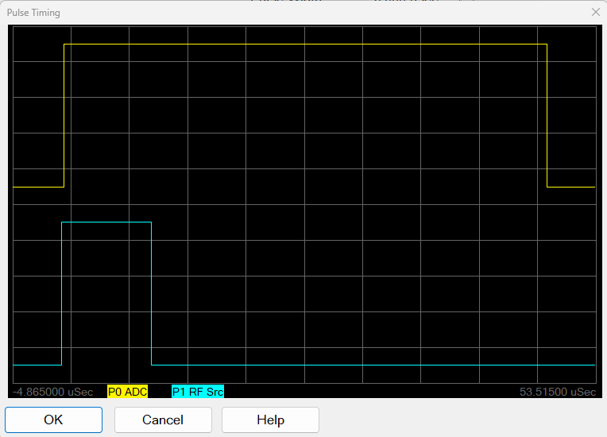
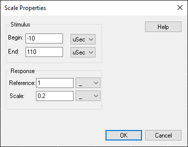
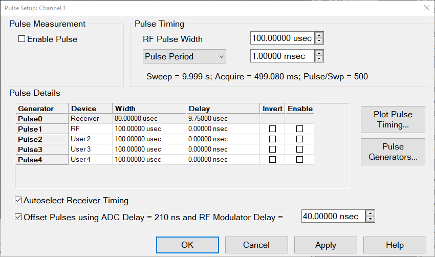
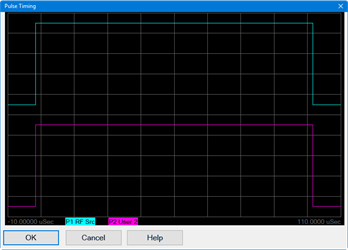
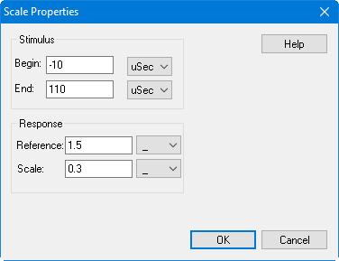
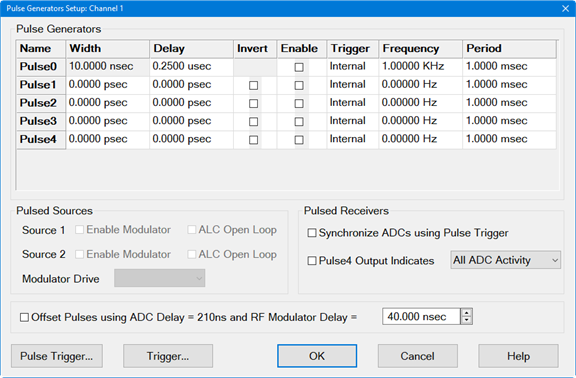
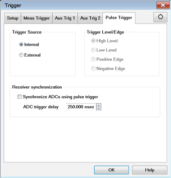

# Integrated Pulse Measurements

* * *

The Pulse Setup dialogs shown in this topic are now integrated in the VNA
firmware and are available with S9x026A/B or Opt H08 .

Note: For information about pulsed measurements using a PNA-X, refer to
[Active-Device Characterization in Pulsed Operation Using the
PNA-X](https://www.keysight.com/us/en/assets/7018-02951/application-
notes/5990-7781.pdf?success=true).

Previously, setup was performed with the
[Narrowband](Narrowband_Pulsed_Application.md) or Wideband pulse programs.
With the appropriate hardware/software options (Opt 021, 022, S93025A/B) these
commands are still available without Opt S93026A/B or H08. [Learn more about
VNA Options.](../Support/Configurations.htm)

External pulse generators can be used along with the VNA internal pulse
generators. [Learn more](../System/Configure_an_External_Pulse_Generator.md).

In this topic

  * [Pulse Setup](Integrated_Pulse_Application.md#PulseSetupDiag)

  * Pulse Setup (Modulation Distortion Channel)

  * [Pulse Generator Setup](Integrated_Pulse_Application.md#PulseGenSetupDiag)

  * [Pulse Trigger Tab](Integrated_Pulse_Application.md#PulseTriggerTabDiag)

  * [Pulse Gens and IF Block Diagram](Integrated_Pulse_Application.md#BlockDiagram)

  * [Calibration in Pulse](Integrated_Pulse_Application.md#Calibration)

### See Also (separate topics)

  * [Configure and Use External Pulse Generators](../System/Configure_an_External_Pulse_Generator.md)

  * [IF Path Configuration](../IFAccess/IF_Path_Configuration.md)

  * [Programming commands](../Programming/XStimulusTopic.md#Pulse)

  * [Narrowband Pulsed Application](Narrowband_Pulsed_Application.md) (Opt H08)

  * WB Pulsed App

  * [See Swept IMD note](Swept_IMD.md#Features) regarding IF Filter setting

App Note: [Active-Device Characterization in Pulsed Operation Using the PNA-X
(1408-21)](http://literature.cdn.Keysight.com/litweb/pdf/5990-7781EN.pdf)

#### How to start the Pulse Setup dialog  
  
---  
Using Hardkey/SoftTab/Softkey |  Using a mouse  
  
  1. Press Sweep > Source Control > Pulse Setup....

|

  1. Click Stimulus
  2. Select Sweep
  3. Select Sweep Control
  4. Select Pulse Setup...

  
  
  
Pulse Setup dialog box help  
---  
 Note: The M937xA does not support
this function. The Basic controls allow simple pulse measurements using the
default (Autoselect) settings in the Advanced section of the dialog. Pulsed
measurements are performed in a Standard channel. [See Measurement
Class](../S1_Settings/Measurement_Classes.htm). However, Several VNA
measurement settings are controlled by the Pulse setup, such as sweep type,
number of points, and so forth.

### Pulse Measurement

Off \- Source and Receivers are NOT pulsed Standard Pulse \- With pulsed RF,
the VNA can be configured to sweep in frequency, power sweep, and CW time.

  * To make 'Point-in-Pulse' measurements, narrow the receiver pulse width and enter delay.
  * To make 'Pulse-to-Pulse' measurements, disable Autoselect Pulse Detection Method, then select Wideband. select Stimulus, then Sweep, then Sweep type = CW in the VNA menu.

Pulse Profile \- Pulse profile measurements provides a time domain (CW
frequency) view of the pulse envelope. Profiling is performed using a
measurement technique that "walks" a narrow receiver "snapshot" across the
width of the pulse. This is analogous to using a camera to take many small
snapshots of a wide image, then piecing them together to form a single,
panoramic view.   Pulse Profile
measurement using default settings and R1 receiver.

  * Pulse Profiling can be performed using ratioed or unratioed measurements. You can preview the pulse on port 1 by using an R1 receiver measurement.
  * Pulse Profiling is performed at a single CW frequency in either Narrowband or Wideband mode.
  * To select the CW Frequency, click Stimulus, then Sweep Type.
  * In Narrowband mode, the delay increment value, which is responsible for "walking" the receiver snapshot across the pulse, is selected by the VNA and is accessible only with a [programming command](../Programming/XStimulusTopic.md#PulseGens).
  * In Wideband mode, the receiver is walked across the pulse by making a sequence of closely-spaced measurements in real-time.
  * In SW Gating mode, software gating sensitivity is improved. When unchecked, all data outside the measurement band is zeroed. SW Gating mode is used for troubleshooting purposes.

### Pulse Timing

Pulse Width \- Sets the width of the source pulse. See [measurement
timing](Integrated_Pulse_Application.htm#timing) to learn how to control the
receiver width and delay. Pulse Period The time to make one complete pulse.
Pulse Frequency (PRF) The reciprocal of Period (1/ Period). See [Internal
Pulse Generators](Integrated_Pulse_Application.htm#PulseGenSetupDiag) to learn
more. By default, these settings configure Pulse Gen 1 to drive Source
Modulators 1 and 2. This can be changed from the Advanced Settings [Pulse
Generator Setup](Integrated_Pulse_Application.htm#PulseGenSetupDiag) dialog.

### \-------- Advanced Settings ----------

The following settings allow maximum control of a Pulse measurement. Note:
When the "Auto" check boxes are cleared, it is possible to configure settings
to make an invalid measurement.

### Properties

Autoselect pulse detection method \- check to automatically switch between
Narrowband and Wideband based on the Pulse Width. . In Standard Pulse:

  * Wideband \- used when the (source) Pulse Width is WIDER than the fastest receiver acquisition time. This allows the receiver to measure all pulse ON time - no pulse OFF time. The VNA will select Wideband whenever possible.
  * Narrowband \- used when the (source) Pulse Width is NARROWER than the fastest receiver acquisition time (267 ns). This measurement requires a spectral nulling technique to measure the pulse response through the DUT.

In Pulse Profile:

  * Wideband \- used when the (source) Pulse Width is greater than 1.600 us. This allows the receiver make several sequential measurements to measure the entire pulse.
  * Narrowband \- used when the (source) Pulse Width is less than or equal to 1.600 us.

Autoselect IF Path Gain and Loss \- For future use. IF Path \- Click to launch
the [IF Path dialog](../IFAccess/IF_Path_Configuration.md#IFPathConfigDiag).
Optimize Pulse Frequency \- Automatically selects the Pulse Frequency and
Pulse Period.

  * In Narrowband, the pulse frequency is adjusted slightly to get the best spectral-nulling filtering possible.
  * In Wideband, this checkbox is ignored.

Autoselect Profile Sweep Time \- In Pulse Profile mode, adjusts the default
X-axis start time to zero and the stop time double the Pulse Width. This
allows you to see one complete pulse. If unchecked, the Sweep Time will not be
changed. To adjust the X-axis manually, click OK to close the dialog. Then
press Sweep > Main, then change the Start Time and Stop Time. Sweep Time \-
Sets the time the analyzer takes to complete one sweep. Number of Points \-
Sets the number of data points for the measurement. IFBW \- Select the IFBW
for the measurement.

  * In Narrowband, an IFBW as close as possible to the entered value will be used.
  * In Wideband, this setting determines the receiver acquisition time - approximately 1/ IFBW.

### Measurement Timing

Port n, Rcvr \- Used as RF Source Modulation Drive.

  * Width \- source pulse width.
  * Delay \- source pulse delay relative to the pulse generator clock.
  * Pulse Gen \- Pulse generator used to modulate the source. Select CW to have NO source modulation.

The receiver settings in this table change depending on whether the VNA is in
Narrowband or Wideband mode.

  * In Narrowband, for each IF receiver path, configure the Pulse Width, Delay, and Pulse Generator to be used to drive the receiver gate.
  * In Wideband, all receiver paths are the same.

Primary Clock The Primary Clock is controlled by the internal or external pulse generator and is the primary pulse clock. The Internal and External selections are not the same as the Trigger Source Internal and External selections found in the Pulse Trigger tab of the Trigger dialog. However, they are inter-related as follows: |  |  Primary Clock |  Trigger Source (from Pulse Trigger tab of Trigger dialog)  
---|---|---  
|  Primary pulse clock controlled by selected pulse generator. |  Trigger source for the internal pulse generator.  
Internal | 

  * Primary pulse clock is controlled by the internal pulse generator.
  * PRF setting is applied to the internal pulse generator.

|

  * Trigger is self-generated in the internal pulse generator.
  * The trigger source for the internal pulse generator trigger is set to Internal and is reflected in the Trigger Source selection in the Pulse Trigger tab of the Trigger dialog.

  
External | 

  * The primary pulse clock is an uncontrolled external pulse generator.
  * PRF settings are determined by the external pulse generator, which the VNA firmware does not control. The user must set up the external system clock. Entries for frequency and period in the VNA GUI dialogs will have no effect.

|

  * Trigger comes from the PULSE I/O connector (PulseSyncIn) on the rear panel.
  * The trigger source for the internal pulse generator trigger is set to External and is reflected in the Trigger Source selection in the Pulse Trigger tab of the Trigger dialog.

  
Other selections |  If there is a defined pulse generator in the external devices list, its name will be displayed in the Pulse Setup dialog Primary Clock control and it will also be an accepted choice for the [SENSe:SWEep:PULSe:PRIMary:CLOCk](../Programming/GP-IB_Command_Finder/Sense/SweepPulse.md#SENSe:SWEep:PULSe:PRIMary:CLOCk) SCPI command. |   
  
Autoselect Width and Delay \- When checked, for Wideband mode and Pulse Gen =
Pulse Trigger, the default setting for the receiver is adjusted to
approximately 75% of the source pulse width, with 20% delay. This leaves
approximately 5% of the source pulse ON after acquisition is complete.

When checked for Narrowband mode and Pulse Gen <> CW, then Delay and Width
matches the RF Source.

Autoselect Pulse Generators \- When checked:

  * Pulse1 is selected for Modulator Drive.

  * Pulse2 is CW (OFF).

  * For Wideband, Pulse Trigger is selected to gate the ADC.

  * For Narrowband, Pulse2 is selected.

Pulse Generators... Click to launch the [Pulse Generators
Setup](Integrated_Pulse_Application.htm#PulseGenSetupDiag) dialog.

Plot Pulse... Accesses the Pulse Timing dialog, which displays an interactive
screen for evaluating the pulse timing setup.

Plot Pulse is enabled for Pulse Profile measurements in N524xB and N522xB
models, but disabled in all other models.

Plot Pulse is disabled for all NarrowBand pulse measurements.

Right-click in the display area to access the following menu:

Autoscale \- Automatically scales the data to fit vertically within the
display grid area.

Display marker annotation \- Select to display marker annotation in the top-
right of the display.

Show graticule \- Select to display graticules.

Add marker to: \- Select to add a marker to a displayed pulse trace. When a
selection is made, the mouse pointer changes to a "+". Click in the display
area and the marker will appear. Drag the marker to the desired position. Each
time this selection is made, a new marker will be added.

Copy to Clipboard \- Copies a bitmap of the trace control (Display) to the
clipboard. It can then be pasted into any document that accepts bitmaps.

Print... \- Prints the displayed data.

Scale properties... \- Accesses the following dialog:

Stimulus \- Sets the Begin and End displayed on the X-axis in seconds.

Response \- Sets the Reference level in the center of the Y-axis and sets the
scale per division.  
  
Pulse Setup (Modulation Distortion Channel) dialog box help  
---  
 Note: The does not
support this function.

### Pulse Measurement

Off \- Source and Receivers are NOT pulsed Standard Pulse \- With pulsed RF,
the VNA can be configured to sweep in frequency, power sweep, and CW time.

### Pulse Timing

RF Pulse Width \- Sets the width of the RF Source pulse. Pulse Period
pulldown- Allows the selection of the following: Pulse Period - The time to
make one complete pulse. Pulse Frequency \- The reciprocal of Period (1/
Period). Pulse Duty Cycle \- Pulse Width divided by the Pulse Period. Labels

  * Sweep \- Complete cycle time of measurement including background sweeps.
  * Acquire \- The ADC acquisition time required to measure the data for a single FFT.
  * Pulse/Swp \- Number of pulses which will occur during the sweep, including pulses used for background sweeps.

### Pulse Details

Generator \- Pulse generator outputs in numerical order. Device \- Indicates
the device being controlled by the pulse generator output.

  * Pulse0 \- Always set to Receiver. Sets the amount of time to wait before triggering the ADC to begin acquisition and is always selected for Pulse0 and cannot be changed. Pulse0 adds (ADC Delay) + (Modulator Delay). The ADC will begin measuring data 250 ns before the rising edge of Pulse0. This delay is indicated in the Fixed ADC Delay = 250 ns annotation.
  * Pulse1 through Pulse4 \- Pulse outputs can be set to the following:
    * RF \- Selecting RF indicates that the pulse signal is used to drive the RF modulator. Only one pulse generator output can be used to drive an RF source. If you try to set more than one pulse generator output to RF, then the other one will be set to User N (where "N" is the pulse generator number).
    * User 1, User 2, User 3, User 4 - Labels for user convenience. These labels do not connect the pulse generator to any specific hardware. These selections may be used to control a DUT, DC biases, or other signals.
    * Pulse4 ADC Activity \- (Pulse4 only) Pulse4 can also be set to ADC. This selection outputs a signal on Pulse4 when the ADC is active. This is the same as Pulse4 Output Indicates ADC Activity on the Pulse Generators Setup dialog. If ADC is selected for Pulse4, then the pulse width and delay entries are grayed out because Pulse4 is no longer a pulse output.

Width \- RF Source pulse width. This setting is the same as Pulse Width under
RF Pulse. Delay \- If the Offset Pulses using ADC Delay check box is disabled,
then the delays are the pulse delays relative to the trigger. If the Offset
Pulses using ADC Delay check box is enabled, then the delays are defined for
the pulses relative to each other. In this case, you can enter negative
delays, and the delay from the trigger will be adjusted to correct for these
values. Invert \- Check to cause the pulse ON time to be active low and OFF be
active high. Enable Check to enable individual pulse generators. Autoselect
Receiver Timing - Computes the width to 80% of the RF Source Width and the
delay will be 10% of the RF Source Width. With this setting selected, the
Width and Delay columns in the table are grayed out. Offset Pulses using ADC
Delay Check Box

  * If checked (default), adds delays to the Pulse Generator:
    * Pulse0 adds (ADC Delay) + (Modulator Delay).
    * Pulse Output used as the Modulator Drive adds no delay.
    * All other Pulse Outputs add Modulator Delay.
  * RF Modulator Delay
    * Defines the RF delay of the source modulator. This is the time lag between the pulse drive signal and the actual RF output. This may indicate the lag for either an internal or external source.
    * The default is 40 ns, which is the average delay of the internal RF modulators. The internal modulator below 3.2 GHz is slower than the internal modulator above 3.2 GHz. Therefore, the average value is chosen.
  * ADC Delay
    * The ADC starts on the rising edge of Pulse0. Due to the data pipeline, the ADC begins measuring data 210 ns before the rising edge of Pulse0 occurred. Since the ADC measurement leads Pulse0, Pulse0 is delayed by this amount of time. This value cannot be changed.

Timing Example Assume Pulse1 is used to modulate the RF signal, all Pulse
outputs are enabled, all are set to zero delay, and all are set to the same
width. The first timing diagram below is with offset off and the second timing
diagram is with offset on. 

### Buttons

Plot Pulse Timing \- Accesses the Pulse Timing dialog, which displays an
interactive screen for evaluating the pulse timing setup.
 Right-click in the
display area to access the following menu:

Autoscale \- Automatically scales the data to fit vertically within the
display grid area. Display marker annotation \- Select to display marker
annotation in the top-right of the display. Show graticule \- Select to
display graticules. Add marker to: \- Select to add a marker to a displayed
pulse trace. When a selection is made, the mouse pointer changes to a "+".
Click in the display area and the marker will appear. Drag the marker to the
desired position. Each time this selection is made, a new marker will be
added. Copy to Clipboard \- Copies a bitmap of the trace control (Display) to
the clipboard. It can then be pasted into any document that accepts bitmaps.
Print... \- Prints the displayed data. Scale properties... \- Accesses the
following dialog:
 Stimulus \- Sets
the Begin and End displayed on the X-axis in seconds. Response \- Sets the
Reference level in the center of the Y-axis and sets the scale per division.
Pulse Generators \- Accesses the Pulse Generators Setup dialog. See below.  
  
Pulse Generators Setup dialog box help  
---  
 This dialog is available with
Option S9x025A/B and S9x024B (pulse generators). To see this dialog, click
Pulse Generators... on the [Pulse Setup
dialog](Integrated_Pulse_Application.htm#PulseSetupDiag).

### Pulse Generators

Configure the Pulse Generators to be used for your measurement. The pulse 0 is
for the receiver. The pulse 1 is for source and P1 output and pulse 2 to 4 are
for P2 to P4 output signal, receptively.

  * D = Delay; the time before each pulse begins
  * W = Width; the time the pulse is ON
  * Duty Cycle = W/P
  * P = Period; one complete pulse cycle
  * Pulse Frequency (PRF) = 1 / Period

Important: If D + W is greater than P, then undefined VNA behavior results.
There is NO error message or warning.  Invert Check to cause the pulse ON time
to be active low and OFF be active high. Enable Check to enable individual
pulse generators. Trigger Choose from: (When ONE of these is changed, they ALL
change. The internal Pulse Generators can NOT be triggered individually).

  * Internal - Pulse generators are triggered by the internal pulse clock.
  * External - Pulse generators are triggered by an external pulse generator though Pulse Sync IN.

Frequency \- Set the pulse frequency of each generator.

  * Pulse Frequency (PRF) = 1 / Period
  * P = Period; one complete pulse cycle

Period \- Set the period of each generator. [Learn more about the Pulse
Generators.](../IFAccess/IF_Path_Configuration.htm#PulseGens)

### Pulsed Sources

Check to enable the required internal source ports. These are switches 8 and 9
in the [Block Diagram](Integrated_Pulse_Application.md#BlockDiagram)
Important: When internally modulating the sources, [source leveling is
automatically set to Open-loop](../S1_Settings/Power_Level.htm#Leveling) (ALC
Open Loop box will be checked automatically). Modulator Drive \- Choose the
pulse generator to modulate the specified source. Choose from CW (NO pulse),
Pulse 1, 2, 3, 4, External.  This is switch 7 [Block
Diagram](Integrated_Pulse_Application.htm#BlockDiagram).

### Offset Pulses

Offset Pulses using ADC Delay Check Box

  * If checked (default), adds delays to the Pulse Generator:
    * Pulse0 adds (ADC Delay) + (Modulator Delay).
    * Pulse Output used as the Modulator Drive adds no delay.
    * All other Pulse Outputs add Modulator Delay.
  * RF Modulator Delay
    * Defines the RF delay of the source modulator. This is the time lag between the pulse drive signal and the actual RF output. This may indicate the lag for either an internal or external source.
    * The default is 40 ns, which is the average delay of the internal RF modulators. The internal modulator below 3.2 GHz is slower than the internal modulator above 3.2 GHz. Therefore, the average value is chosen.
  * ADC Delay
    * The ADC starts on the rising edge of Pulse0. Due to the data pipeline, the ADC begins measuring data 210 ns before the rising edge of Pulse0 occurred. Since the ADC measurement leads Pulse0, Pulse0 is delayed by this amount of time. This value cannot be changed.

Offset Pulse Example Assume Pulse1 is used to modulate the RF signal, all
Pulse outputs are enabled, all are set to zero delay, and all are set to the
same width. The first timing diagram below is with offsets off and the second
timing diagram is with offsets on.

### Pulsed Receivers

Synchronize ADCs using Pulse Trigger - Check to enable triggering used to gate
the ADC for wideband receiver measurements. This is the same as Pulse0 Enable.
The Width can NOT be configured. Pulse4 Output Indicates - Check to use an
oscilloscope connected to the pulse 4 (pin 13 of the [PULSE I/O
connector](../Rear_Panel/XPulseIO.htm) on the rear panel of the VNA) to
display when the ADC is making measurements. There are two selections: All ADC
Activity \- When selected, all ADC activity can be monitored, including ADC
activity that may not be displayed on a trace. An example is background
measurements that are used for receiver leveling, but are not actually
displayed on a trace. Trace ADC Activity \- When selected, Pulse4 will be
active only during measurements that will be displayed on a trace. Pulse
Trigger.. \- Click to start the Pulse Trigger dialog. Trigger... \- Accesses
the Trigger dialog for setting up triggering. [Learn
more](../S1_Settings/Trigger.htm#TriggerDiag).  
  
Pulse Trigger Tab - Trigger dialog box help  
---  
 To see this dialog, press Pulse
Trigger on the [Pulse Generator Setup
dialog](Integrated_Pulse_Application.htm#PulseGenSetupDiag) or select
Stimulus, then Trigger from the VNA Menu.

### Trigger Source

Select Internal or External to provide sync capability for the internal pulse
generators.

  * Internal \- The pulse generator is internally triggered and puts out a periodic pulse train with a period defined by the [Pulse Generator Setup dialog](Integrated_Pulse_Application.md#PulseGenSetupDiag).
  * External \- The internal pulse generator puts out one set of pulses (P0-P4) per external trigger (Pulse Sync In). All five pulse outputs have unique delay and pulse width settings.

The external trigger input is on the [Pulse I/O
connector](../Rear_Panel/XPulseIO.htm) pin 7 (PulseSyncIn). The PulseSyncIn
line provides a configurable trigger signal into the Pulse Generators. If the
trigger mode is set to "level", and if the trigger is still valid when the
first pulse set is finished, another set will be generated. Only one set of
pulses is emitted when edge triggering is used.

### Trigger Level/Edge

Sets the edge or level of the trigger signal to which the internal pulse
generators will respond when being externally triggered at the PulseSyncIn
pin. . Positive = rising edge; Negative = falling edge. These selections are
available ONLY with DSP version: 4.0 FPGA: 34 or higher. [Learn
more](../S0_Start/HelpAbout.htm). Otherwise, the pulse generators respond only
to positive, level input trigger signals.

### Receiver synchronization

Synchronize ADCs using pulse trigger - Check to enable triggering used to gate
the ADC for wideband receiver measurements. The Width can NOT be configured.
ADC trigger delay \- Set the amount of time to wait before triggering the ADC
to begin acquisition.  
  
### Pulse Trigger Block Diagram

[See complete description at IF Path
Configuration](../IFAccess/IF_Path_Configuration.htm)

See also [Using External Pulse
Generators](../System/Configure_an_External_Pulse_Generator.htm#Using)

Using External Pulse Generators

[Setup the External Pulse Generator as an External
Device.](../System/Configure_an_External_Device.htm)

Calibration in Pulse Mode

To perform a calibration in pulse mode, first configure and apply the pulse
parameters (PRF, Pulse Width, Delays, IF gating, and so forth) before
calibrating the system. This will ensure the VNA is configured properly during
the calibration and measurement.

* * *

