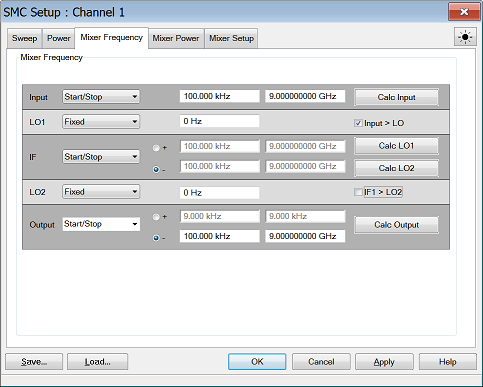
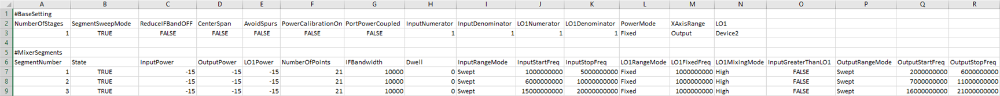
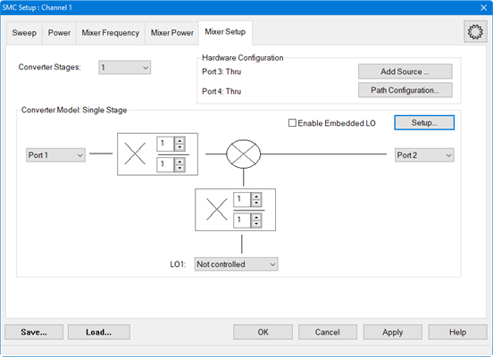
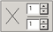
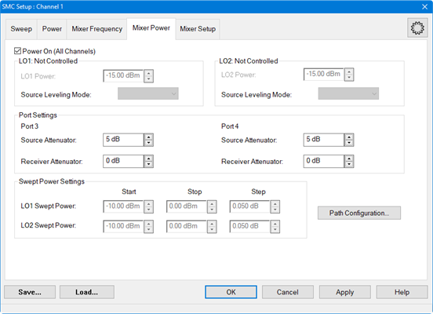
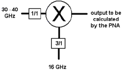
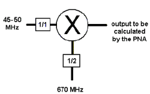

# Mixer/Converter Setup

* * *

The following dialogs are common to all Converter Apps:
[FCA](../FreqOffset/FCA_Use.md), [Swept IMDx](Swept_IMDx.md), [IMx
Spectrum](IM_Spectrum_for_Converters.htm),
[NFx](Noise_Figure_on_Converters.md), and
[GCx](Gain_Compression_for_Converters.md) applications.

Note: Swept IMDx, IMx Spectrum, NFx are supported by PNA only. GCx is
currently not supported on the M9370A/71A/72A/73A/74A/75A.

  * Mixer Frequency tab

  * Mixer Setup tab

  * [Mixer (LO) Power tab](MixerConverter_Setup.md#MixerPowerTab)

  * Fractional Multiplier Examples

Important Note: Connecting your Mixer/Converter DUT to the VNA. RF and IF
terminology is NOT used in this topic because the VNA does not know how your
DUT is labeled or how it will be used. Instead, the general terms INPUT and
OUTPUT are used to describe the following VNA behavior:

  * INPUT - the stimulus frequencies BEFORE conversion by your DUT.
  * OUTPUT - the response frequencies, AFTER conversion (either UP or DOWN) by your DUT. Specify UP or DOWN conversion using the + or - symbol for each output.

  
---  
  
Mixer Frequency tab help  
---  
 

### Settings

Frequency Format Select Start/Stop (Swept) or Fixed. For Linear sweep type, at least one of these must be fixed. For CW or Power, ALL must be Fixed. Frequencies Enter the frequency values for each of the Mixer/Converter ports. |   |  Mixer-Product Selector Determines whether the receivers will tune to the Sum (+) or the Difference ( - ) of the Input and LO frequencies.  
---|---  
  
Calc buttons Calculates frequency settings based on your other mixer settings.
For example, enter the Input frequency range and LO1 frequency range, then
press Calc Output. The VNA will calculate and display the Output frequencies.

Input > LO or IF1>LO2 Removes ambiguity when using a Calc button to determine
the INPUT frequency.

These check boxes are used ONLY when all 3 of the following conditions are
TRUE:  
(If ALL 3 are NOT true, the VNA does not read these check boxes).

  1. Difference (Low) sideband  is selected for the corresponding Calculate button AND

  2. Output frequency is less than the LO frequency AND

  3. One of the Calculate buttons are used to calculate the Input frequency.

### Rules for Configuring a Mixer

A Red message across the bottom of the dialog indicates that one or more of
the following settings are invalid:

  * Either ALL ranges (Input, LO, Output) must be Fixed, or ONE Range fixed. TWO ranges can NOT be Fixed or THREE ranges can NOT be Swept.

  * For determining a valid mixer configuration with 2 LOs, one Fixed LO and one Swept is equivalent to having a single-stage Swept LO. To configure a 2-stage LO, select Converter Stages: 2 on the Mixer Setup tab.

  * INPUT or OUTPUT frequencies cannot be outside the range of the VNA.

  * Any combination of INPUT and LO which results in an OUTPUT that sweeps through Zero Hz is NOT allowed.

### About Mixer Configuration Files (*.mxr, *.mxrx, or *.csv)

Save Saves SOME of the mixer settings to a *.mxr, *.mxrx, or *.csv file. Load Recalls a previously-configured mixer *.mxr, *.mxrx, or *.csv file. |  Note: By default, mixer configurations are saved to a *.mxrX file. Previously, they were saved to a *.mxr file. ONLY *.mxrx and *.csv files allow saving [segmented sweep](../FreqOffset/FCA_Use.md#SegmentSweep) mixer setups. Currently, only [FCA](../FreqOffset/FCA_Use.md) allows segmented sweeps. In all other respects, these new file types are completely backward compatible with *.mxr files.  
---  
  
What Mixer Settings are Saved?

  * Sweep Type, frequency, and power settings.

  * With Segment Sweep Type, all segment settings are saved.

Converter App Compatibility

The mixer setup files that are used with FCA, NFx, and GCx for PNA ARE
compatible. However, *.mxr(x) files created in IMDx contain information that
is NOT included with other *.mxr(x) files.

  * When *.mxr(x) files created in other apps files are recalled into IMDx, the VNA attempts a 'best guess' at missing information.

  * When IMDx *.mxr(x) files are recalled into other apps, the extra information is ignored.

  * When *.mxr(x) files are recalled into an IMx Spectrum channel with any range being swept, the recall is ignored and an error message appears.

External Sources

A *.mxr(x) file includes an LO source name. However, It does NOT include the
LO Source configuration. Therefore, when using a *.mxr(x) file that was
created on a different VNA, the VNA will display an error if does not find the
LO Source configuration using EXACTLY the same LO source name.

CSV Files

Note: Mixer CSV Format is a Licensed Feature. Learn more about [Licensed
Features](../Support/Software_Support.htm).

Mixer configuration files can be saved as a *.csv file. This format was
implemented to be used for setting up mixer segments. Start with the GUI to
set up mixer settings and to create the first segment then save it as a *.csv
file. The GUI can be used to set up multiple segments but is not as convenient
as editing an existing Excel *.csv file directly.

The *.csv file has two main categories:

  * #BaseSetting
  * #MixerSegments

Note: The CSV file also supports adding comments. All comments must be added
before the #BaseSetting row in the CSV file.

#BaseSetting captures the following fields:

Default Columns1  
---  
NumberOfStages2 |  PortPowerCoupled |  OutputNumerator  
SegmentSweepMode |  InputNumerator |  OutputDenominator  
ReduceIFBandOFF |  InputDenominator |  PowerMode3  
CenterSpan |  LO1Numerator |  XAxisRange  
AvoidSpurs |  LO1Denominator |  LO1 _(auxiliary setting)_  
PowerCalibrationOn |  |   
Conditional Columns (auxiliary setting): Swept IMD Converter  
IMDXSweepType |  |  RF2TonePower  
IMDXVersion |  |  RF2StartPower  
RF2 |  |  RF2StopPower  
Conditional Columns: Dual Converter Stage  
|  LO2Numerator |   
|  LO2Denominator |   
|  LO2 _(auxiliary setting)_ |   
Conditional Columns: PowerMode is Swept, and Converter is not IMDX4  
InputStartPower |  |  LO1PowerMode  
InputStopPower |  |  LO1StartPower  
OutputStartPower |  |  LO2PowerMode _(in dual converter stage)_  
OutputStopPower |  |  LO2StartPower _(in dual converter stage)_  
Conditional Columns: IMDX Converter5  
InputStartPower |  |  LO1PowerMode  
InputStopPower |  |  LO1StartPower  
OutputStartPower |  |  LO2PowerMode _(in dual converter stage)_  
OutputStopPower |  |  LO2StartPower _(in dual converter stage)_  
  
1 Default columns are always included in the csv.

2 NumberOfStages (previously IsSingleStage) has been moved under
‘#BaseSettings’ and will be used to set converter stage value for each
segment.

3 InputPowerMode, OutputPowerMode, LO1PowerMode, and LO2PowerMode (in dual
converter stage) have been consolidated into PowerMode in the CSV.

4 Start and Stop powers for Input, Output, LO1, and LO2 (in dual converter
stage) are included in the CSV when PowerMode is Swept. When PowerMode is
Fixed,  
these values will be based on the power values from the segments.

5 For IMDX converter, Start and Stop powers for Input, Output, LO1, and LO2
are included regardless of value in PowerMode column.

* * *

#MixerSegments captures the following fields:

Default Columns  
---  
SegmentNumber |  Dwell |  LO1MixingMode  
State |  InputRangeMode |  InputGreaterThanLO1  
IFBandwidth |  LO1RangeMode |  OutputRangeMode  
Conditional Columns: Segment Sweep Mode  
|  NumberOfPoints |   
Conditional Columns: PowerMode in Base Setting is Fixed  
|  InputPower |   
|  LO1Power |   
|  OutputPower |   
Conditional Columns: Dual Converter Stage  
LO2Power |  |  LO2RangeMode  
IFRangeMode |  |  LO2MixingMode  
|  |  InputGreaterThanLO2  
Conditional Columns: Based on InputRangeMode Value  
Value |  Columns  
Fixed (for all Segments)1 |  InputFixedFreq  
Swept (for all Segments)2 |  InputStartFreq InputStopFreq  
Fixed/Swept (for all Segments)3 |  InputFixedFreq InputStartFreq InputStopFreq  
Conditional Columns: Based on LO1RangeMode Value  
Value |  Columns  
Fixed (for all Segments) |  LO1FixedFreq  
Swept (for all Segments) |  LO1StartFreq LO1StopFreq  
Fixed/Swept (for all Segments) |  LO1FixedFreq LO1StartFreq LO1StopFreq  
Conditional Columns: Based on OutputRangeMode Value  
Fixed (for all Segments) |  OutputFixedFreq  
Swept (for all Segments) |  OutputStartFreq OutputStopFreq  
Fixed/Swept (for all Segments) |  OutputFixedFreq OutputStartFreq OutputStopFreq  
Conditional Columns: Based on IFRangeMode Value (dual stage only)  
Fixed (for all Segments) |  IFFixedFreq  
Swept (for all Segments) |  IFStartFreq IFStopFreq  
Fixed/Swept (for all Segments) |  IFFixedFreq IFStartFreq IFStopFreq  
Conditional Columns: Based on LO2RangeMode Value (dual stage only)  
Fixed (for all Segments) |  LO2FixedFreq  
Swept (for all Segments) |  LO2StartFreq LO2StopFreq  
Fixed/Swept (for all Segments) |  LO2FixedFreq LO2StartFreq LO2StopFreq  
  
1 If SegmentSweepMode is true and all the segments have InputRangeMode set to
Fixed, then only InputFixedFreq column will be displayed in the CSV.  
If SegmentSweepMode is false and the non-segment configuration’s
InputRangeMode is Fixed, the behavior will be the same. This behavior will be
true for  
Output, LO1, IF and LO2 as well.

2 If SegmentSweepMode is true and all the segments have InputRangeMode set to
Swept, then only InputStartFreq and InputStopFreq columns will be displayed.  
If SegmentSweepMode is false and the non-segment configuration’s
InputRangeMode is Swept, the behavior will be the same. This behavior will be
true for Output, LO1,  
IF and LO2 as well.

3 If SegmentSweepMode is true and the segments have a mix InputRangeMode, i.e.
segment #1 has Fixed and segment #2 has Swept, then InputFixedFreq,
InputStartFreq  
and InputStopFreq columns will be displayed in the csv. This will be true for
Output, LO1, IF and LO2 as well.

* * *

The following is an example of an SMC segment sweep csv file:

For a procedure, refer to [How to configure multiple segments using the GUI
and Excel *.csv
file](../FreqOffset/FCA_Use.htm#How_to_configure_a_segment_using_the_GUI_and_Excel_csv_file).  
  
Apply Applies the settings for your mixer/converter test setup to the
measurement. The mixer setup dialog box remains OPEN.

OK Applies the settings for your mixer/converter test setup to the
measurement. The mixer setup dialog box CLOSES.

Cancel Closes the mixer setup dialog box and does NOT apply the settings.

### See Also

[How to measure a DUT with an Embedded LO](Embedded_LO.md#How)  
  
Mixer Setup tab help  
---  
  Note: A
variation of this dialog is used in the Swept IMDx application. [Learn
more.](Swept_IMDx.htm#MixerSetupTab) Converter Stages Select either 1 or
2-stage converters.

### Hardware Configuration

Shows the path configuration for Port 3 and Port 4 switches. See [Hardware
Configurations.](Swept_IMDx.htm#Hardwareconfig) Add Source Click to start the
[External Device Configuration
dialog.](../System/Configure_an_External_Device.htm#ExtDevConfig) Path
Configuration (PNA Only) Click to start the [Path Configuration
dialog.](../S1_Settings/Path_Configurator.htm)

### DUT Ports

VMC ONLY \- select the VNA port to connect to the DUT output. The DUT input
must always be connected to VNA port 1 because of the need for a [reference
mixer](../FreqOffset/VMC_Measurements.htm#calibrationMixer) on port 1. All
other converter applications - select VNA ports to connect to the DUT input
and output.

###  Fractional Multipliers

The combination of (numerator /
denominator) forms a fractional value that is multiplied by the input and LO
frequency ranges. These values are used to calculate the response frequency of
the VNA receiver for the converter output. Use the fractional multipliers to:

  * simulate the action of harmonic mixers
  * simulate the action of multipliers and dividers that may exist in your test setup
  * tune the VNA receiver frequency to a harmonic of the mixer/converter

The range for the numerator and denominator of a fractional multiplier is from
+1 to +10. Negative values are NOT allowed. See Fractional Multiplier
examples.

### LO1 and LO2

Select Not controlled to allow an external source to provide a Fixed LO
Frequency at all times. Otherwise, select an internal VNA source or External
source to be used as the LO. Learn how to [Configure an External
Device](../System/Configure_an_External_Device.htm) (Source). If the VNA has
the Option XSB rear-panel source (Source3), then Source3 can be selected as
the LO.

### Embedded LO

The Embedded LO feature allows you to make measurements of mixers that have a
FIXED LO inside the DUT. Enable Embedded LO Check to enable measurement of the
Embedded LO. Setup... button Accesses the Embedded LO dialog. See [Embedded LO
dialog box help](Embedded_LO.htm#EmbeddedDiag) for descriptions of the
settings.

### See Also

[How to measure a DUT with an Embedded LO](Embedded_LO.md#How)
 [Learn about these
buttons.](MixerConverter_Setup.htm#AboutMxr)  
  
Mixer (LO) Power tab help  
---  
 
Configures LO Power settings. Power ON (All channels) Check to immediately
turn ON or OFF ALL VNA internal RF Sources for all channels. LO1 Power Sets
the power level for LO1. Source Leveling When using internal source for LO1,
always set to Internal. LO2 Power Sets the power level for LO2. Source
Leveling When using internal source for LO2, always set to Internal.

### Port Settings

Port 3 Used when an LO is supplied through the rear panel and out port 3. Source Attenuator Specifies the port 3 attenuator. This attenuator affects the range of available power into the LO port of the DUT [Learn more about Source Attenuation.](../S1_Settings/Power_Level.md#Source_Atten) Receiver Attenuator Set the attenuation for the Port 3 receiver. Learn more about [Receiver Attenuation](../S1_Settings/Power_Level.md#Receiver_Atten). Port 4 Used when an LO is supplied through the rear panel and out port 4. Source Attenuator Specifies the port 4 attenuator. This attenuator affects the range of available power into the LO port of the DUT [Learn more about Source Attenuation.](../S1_Settings/Power_Level.md#Source_Atten) Receiver Attenuator Set the attenuation for the Port 4 receiver. Learn more about [Receiver Attenuation](../S1_Settings/Power_Level.md#Receiver_Atten). Swept Power Settings Set the power sweep setting. Path Configuration (PNA only) Click to launch the [RF Path Configuration](../S1_Settings/Path_Configurator.md) dialog. |  Note: VMC measurements using a VNA with [Internal Second Source](../S0_Start/Internal_Second_Source.md) Source 2 is automatically configured to supply power to BOTH available ports simultaneously. This setting can NOT be changed. In addition, [power can be uncoupled](../FreqOffset/FCA_Use.md#PowerDiag) to provide different power levels at each port This feature allows power to be delivered to both the DUT LO and Reference Mixer LO without use of a splitter. [See VMC setup.](../FreqOffset/VMC_Measurements.md#VMCSetup)  
---  
  
### See Also

[How to measure a DUT with an Embedded LO](Embedded_LO.md)

 [Learn about these
buttons.](MixerConverter_Setup.htm#AboutMxr)  
  
## Fractional Multiplier Examples

### Example 1

Use the LO fractional multiplier to replicate the action of the third-harmonic
mixer so the VNA can accurately calculate the receiver frequency. The input
and LO frequencies are known.

Enter these settings in the Mixer Setup dialog box:

  * Input Start Freq: 30 GHz

  * Input Stop Freq: 40 GHz

  * LO Fixed Freq: 16 GHz

  * Mixer-Product Selector: - (difference)

  * LOs: 1

  * LO fractional multiplier: 3/1

  * INPUT fractional multiplier: 1/1

Click Calculate Output

Results:

  * Output Start Freq: 18 GHz

  * Output Stop Freq: 8 GHz

* * *

### Example 2

Use the fractional multipliers to tune the VNA receiver frequency to the
second harmonic of the mixer's 14 GHz fundamental output. The input, LO, and
output frequencies are known.

Enter these settings in the Mixer Setup dialog box:

  * Input Start Freq: 4 GHz

  * Input Stop Freq: 4 GHz

  * LO Fixed Freq: 10 GHz

  * Mixer-Product Selector: + (Sum) of the input and LO signals

  * LOs: 1

  * INPUT fractional multiplier = 2/1

  * LO fractional multiplier = 2/1

Click Calculate Output

Results:

  * Output Start Freq: 28 GHz

  * Output Stop Freq: 28 GHz

* * *

### Example 3

Use the LO fractional multiplier to replicate the action of the divide-by-two
mechanism inside the mixer package. Having done this, the VNA can accurately
calculate the receiver frequency. The input and LO frequencies are known.

Enter these settings in the Mixer Setup dialog box:

  * Input Start Freq: 45 MHz

  * Input Stop Freq: 50 MHz

  * LO Fixed Freq: 670 MHz

  * Mixer-Product Selector: + (Sum) of the input and LO signals

  * LOs: 1

  * INPUT fractional multiplier = 1/1

  * LO fractional multiplier = 1/2

Click Calculate Output

Results:

  * Output Start Freq: 380 MHz

  * Output Stop Freq: 385 MHz

* * *

