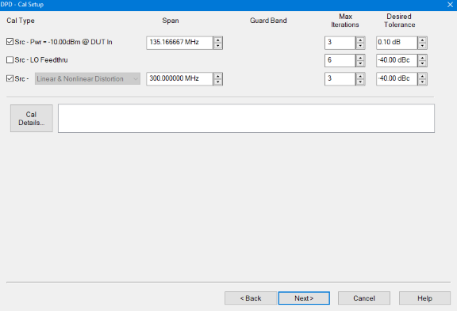

# Apply DPD Model From File

The following DPD Modeling example creates a memory polynomial model from a
pre-existing DPD Model file (*.mdpd).

The following is an example of an input signal and output signal without DPD:

  * Yellow trace: PIn Ideal Waveform
  * Blue trace: POut without DPD showing distortion in the ACP region

  1. On the VNA front panel, press Meas > S-Param > Meas Class....

  2. Select Modulation Distortion or Modulation Distortion Converters, then either:

     * OK delete the existing measurement, or

     * New Channel to create the measurement in a new channel.

  3. The Modulation Distortion or Modulation Distortion Converters dialog is displayed.  
  
  

  4. Select the Modulate tab.  
  
  

  5. In the Source pull down menu, select an existing source from the list or add a source. For information on adding an external source, refer to [Set Up the External Source](Set_Up_the_External_Source.md).

  6. Click on the Load File... button to load an existing modulation file. This is the Ideal Waveform. [Learn more](DPD_Overview.md#DPD_Waveforms).

  7. Click on the Create DPD... button to open the DPD Select Procedure dialog.  
  
  

  8. In the Procedure pull down menu, select Apply DPD Model From File.  
  
  

  9. The Select Ideal Waveform field displays the path and modulation file name currently selected in the Modulate tab of the Modulation Distortion Setup dialog. To change to a different file, select the "..." button.

  10. Use the "..." button for the Select DPD Model field to select a pre-existing DPD Model file (*.mdpd).

  11. The Save DPD As field displays the path and name of the DPD file that will be created (*.mdpd). The file name is based on the name of the ideal waveform displayed in the Select Ideal Waveform field. To change to another file, select the "..." button. Edit the displayed file name in the Save DPD As field to create a new file.

  12. Click on the Next> button to access the Cal Setup dialog.  
  
  

  13. For purposes of this example, default settings/values will be used. [Learn more](Create_DPD.md#Cal_Setup_dialog_help).

  14. Click on the Next> button to access the Modeling dialog. The settings under Main Equations are greyed out and cannot be changed when the DPD Model is from a user-supplied file.

  15. Click on the Apply Model button. The Modeled DPD Waveform from a user-supplied Ideal Waveform file and a DPD Model file are created. [Learn more](Create_DPD.md#Apply_Cal_Model).

  16. Click on the Cal Model button.  
  
  

  17. When completed, click on the Finish button.

  18. The following display shows the [~Ideal DPD](DPD_Overview.md#DPD_Waveforms) waveform (yellow) at the DUT input and the improved ACP region of the [~Ideal](DPD_Overview.md#DPD_Waveforms) waveform (teal) at the DUT output.   
  
  

