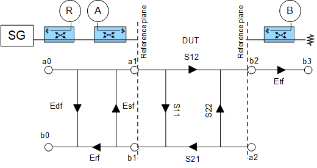
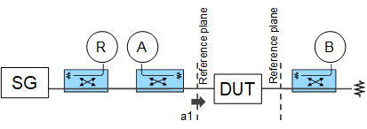

# Calibration Overview

Calibrating a Modulation Distortion channel requires the following types of
calibrations:

  * [S-Parameter Calibration](S-Parameter_Calibration.md)

  * [Source Modulation Calibration](Modulation_Flatness_and_Power_Calibration.md)

Optional calibrations:

  * Phase Reference Wizard

See Also:

  * [Phase Reference Wizard](../../FreqOffset/Phase_Reference_Calibration.md) (separate topic)
  * [S-Parameter Calibration](S-Parameter_Calibration.md) (separate topic)
  * [LO Feedthru Monitor](Modulation_Distortion_Settings.md#LOFeedthuMonitordialog) (separate topic)
  * [Source Modulation Calibration](Modulation_Flatness_and_Power_Calibration.md) (separate topic)

## Phase Reference Wizard

A Phase Reference Cal is performed, saved, and later recalled during a
S-parameter calibration. This is sometimes referred to as a 'tier 1"
calibration. Due to stability of the VNA, the Phase Reference Cal can be
performed infrequently. It is typically performed over the full frequency
range of the VNA or Phase Reference so that it can be applied to all
modulation distortion calibrations that will be needed in the future.

## S-Parameter Calibration

The S-parameter calibration with power correction is the traditional method
used to compute linear error terms. Enhanced response terms are applied for
correction since only the forward direction is measured. The a1, b1, and b2
waves for each tone are accurately measured with enhanced response correction.
The calibration frequency range should cover all of the analysis bandwidth
required for the Modulation Distortion channel.

## Source Modulation Calibration

The source modulation calibration compensates the IQ data to achieve a flat
frequency response in gain and phase at the reference plane. Before this
calibration, the receivers must be calibrated by performing the S-parameter
calibration. The DUT is connected at the reference plane when performing the
source modulation calibration to achieve the best accuracy.

