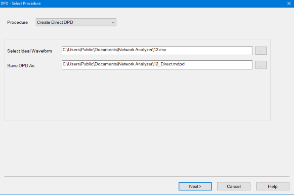
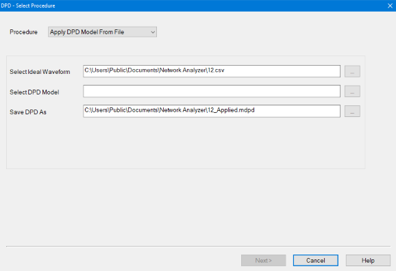
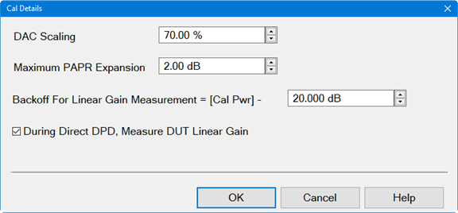
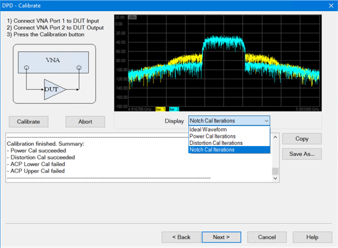
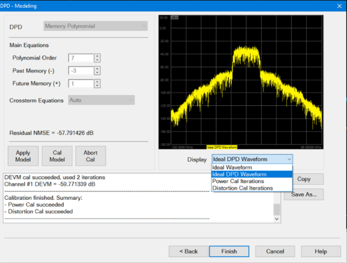
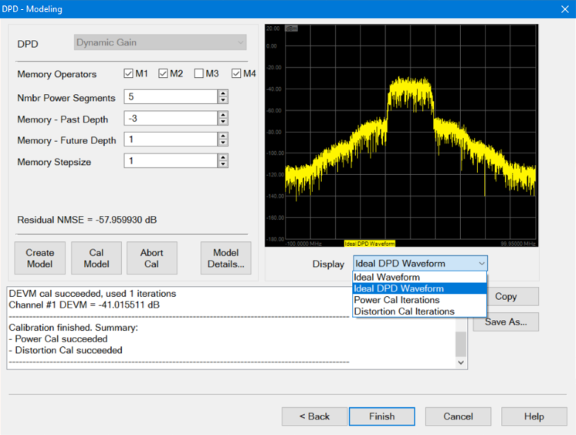

# DPD Wizard

The DPD Wizard is used to set up and create a DPD waveform.

In this topic:

  * Create a Modulation Distortion Channel
  * Open the DPD Wizard
    * DPD Select Procedure dialog help
    * Cal Setup dialog help
    * Cal Details dialog help
    * DPD \- Calibrate dialog help
    * Modeling dialog help
    * Model Details dialog help

#### See Also

Programming Examples:

  * [Direct DPD](../../Programming/GPIB_Example_Programs/Direct_DPD.md)

  * [DPD Modeling](../../Programming/GPIB_Example_Programs/DPD_Modeling.md)

  * [DPD Model From File](../../Programming/GPIB_Example_Programs/DPD_Model_From_File.md)

## Create a Modulation Distortion Channel

  1. On the VNA front panel, press Meas > S-Param > Meas Class....

  2. Select Modulation Distortion or Modulation Distortion Converters, then either:

     * OK delete the existing measurement, or

     * New Channel to create the measurement in a new channel.

  3. The Modulation Distortion or Modulation Distortion Converters dialog is displayed.

## Open the DPD Wizard

#### Accessing DPD Settings  
  
---  
Using Hardkey/SoftTab/Softkey | Using a mouse  
  
  1. Press Setup > Main > MOD Setup... Setup....
  2. Select the Modulate tab.
  3. Click on the Create DPD... button.

|

  1. Click Response.
  2. Select Cal.
  3. Select Other Cals.
  4. Select Create DPD....

  
  
DPD Select Procedure dialog help |   
---|---  
Dialog for Create Direct DPD  Dialog for Create Modeled DPD  Dialog for Apply DPD Model From File  Procedure Create Direct DPD \- Creates a Direct DPD waveform used to determine the maximum possible improvement in EVM using DPD. Create Modeled DPD \- Creates a DPD model and a Modeled DPD waveform used to test the DUT performance when using the DPD model. Apply DPD Model From File \- The user will supply an Ideal Waveform file and a DPD Model file. The Model will be applied to the Ideal Waveform to create a Modeled DPD Waveform. This allows a user-supplied model to be tested on multiple waveforms. Select Ideal Waveform \- User selects the ideal modulation waveform file name. The default file is the modulation file currently selected in the Modulate tab of the Modulation Distortion Setup dialog.  Select DPD Model \- Selects a DPD Model from a pre-existing file (*.mdpd). Save DPD As \- Saves the DPD Model as a *.mdpd file type (zipped file) containing the following files: | Filename | File Description  
---|---  
MyDPD_Ideal.csv | This is the original Ideal Waveform.  
MyDPD_IdealDPD.csv | DPD waveform without source correction applied.  
MyDPD_CorrDPD.csv | DPD waveform with source correction applied.   
DUTIn.csv | Waveform measured at the DUT input which is used to create the DPD Model.  
DUTOut.csv | Waveform measured ta the DUT output which is used to create the DPD Model.  
DPDModel.csv | Contains the DPD model parameters. This file is created if Create Modeled DPD or Apply Model DPD From File is the selected Procedure. Format is *.csv.  
mod.manifest | File containing setup information. The format is *.manifest.  
DUTLinearGain.csv  | The linear gain of the DUT. Format is *.csv.  
  
DPD Model \- User Selects the DPD model. Only visible when Create Modeled DPD
is the selected Procedure.

Memory Polynomial \- DPD model that uses the memory polynomial algorithm to
create the model.

Dynamic Gain \- DPD model that uses both the gain and the memory operators to
generate the dynamic gain algorithm.

Note: Dynamic Gain of measurements above 50 GHz requires the S93110B Active
Hot Parameters license

Create Model Using \- Only visible when Create Modeled DPD is the selected
Procedure.

Direct DPD Measurement \- The DPD model is fit to the Direct DPD measurement.

Direct DPD From File \- The Direct DPD waveform from the file is used to fit
the model. This choice is only available if the Ideal Waveform file contains a
Direct DPD waveform.

Next > button - Accesses the Cal Setup dialog.  
  
---  
  
Cal Setup dialog help |   
---|---  
 DUT - EVM \- Value used to
optimize distortion at the DUT output relative to the Ideal Waveform. DUT -
ACP \- Value used to optimize the upper and lower ACP bands at the DUT output.
Src - Power = -10.00dBm@DUT In \- Calibrates the source power level at the
-10dBm DUT input. Src - LO Feedthru \- Calibrates the source LO feedthru at
the DUT input.  Src - Linear & NonLinear Distortion \- Corrects linear and
nonlinear distortion of the source at the DUT input. Span - Sets the span of
the modulated signal or can be defined to also include upper and lower ACP
bands.  Guard Band \- (DUT - ACP only) Sets the frequency delta from the edge
of the carrier to the beginning of the ACP Span. The default is set to zero.
This value is positive for both ACP Lower and ACP Upper. Max Iterations \- The
calibration routine uses successive approximation. This value sets the maximum
number of iterations used by the calibration routine. Desired Tolerance \-
Sets the desired tolerance for each calibration. Cal Details - Accesses the
Cal Details dialog < Back button - Accesses the DPD Select Procedure dialog.
Next > button - Accesses the Calibrate dialog.  
  
Cal Details dialog help |   
---|---  
 DAC Scaling \- Sets the
Scale value used in the modulated source. This ensures that the DAC filter
does not output a signal that is larger than the DAC's maximum output level,
which can cause distortion in the system. Setting the scaling factor to 100%
will usually cause excessive distortion. The default value is equal to the
value in the Ideal Waveform file. If no value exists, the default value is
70%. Limit PAPR Expansion To \- Limits the peak-to-average power ratio (PAPR)
expansion allowed in the DPD waveform. The DPD process will hard limit the
sampled time-domain DPD waveform so that the PAPR is always less than the
Ideal Waveform PAPR plus the Max PAPR Expansion  If the Ideal Waveform PAPR =
XdB, then the DPD Waveform PAPR £ Xdb + (PAPR Expansion). The default value of
PAPR Expansion is 2 dB. Backoff For Linear Gain Measurement = [Cal Pwr]  \-
This defines the power level used during the linear S21 measurement for the
DPD Dynamic Gain model. The default value is 20 dB. During Direct DPD, Measure
DUT Linear Gain - By default is set to ON. If ON, the DirectDPD process will
measure and save the DUTLinearGain.csv in the output file. This linear gain
may be used later if the user creates the Dynamic Gain model using DirectDPD
From File.  
---  
  
DPD - Calibrate dialog help |   
---|---  
 Note: This dialog does not
apply to the Apply DPD Model From File procedure. The modulation source
calibration will be performed at the DUT Output by iterating until the DUT
Output signal matches the Ideal Waveform. Next will measure Direct DPD
waveform at DUT Input. Calibrate button - Starts the calibration. Abort button
- Aborts the measurement in process. Display \- Choose from the following
display selections: Ideal Waveform is the original waveform selected in the
DPD Select Procedure dialog. Power Cal Iterations displays traces used during
the power calibration. Distortion Cal Iterations displays traces used during
the distortion calibration. Notch Cal Iterations displays traces used during
the DUT-ACP calibration. Copy button - Copies information displayed in the
status window to the clipboard. Save As... button - Saves the information
displayed in the status window to a *.txt file. < Back button - Accesses the
Cal Setup dialog. Finish button (Create Direct DPD only) - When completed,
click on the Finish button to perform the following:

  * Save the MyDPD_CorrDPD.wfm, MyDPD_IdealDPD.wfm, and the mod.manifest files into the *.mdpd file.
  * Load the *.mdpd file into the source modulation file.
  * Enable source correction.
  * Do not change the state of the Pulse Enable selection in the Modulate tab of the Modulation Distortion Setup dialog.
  * Close the DPD Wizard.

Next button - Accesses the Modeling dialog to set up and create the DPD model.  
  
Modeling dialog help |   
---|---  
Create Modeled DPD procedure with Memory Polynomial DPD model.
 Apply Modeled DPD procedure
with Memory Polynomial DPD model.
 DPD Model - Displays the DPD
model. The DPD model selection must be done on the first page of the wizard,
see the Dialog for Create Modeled DPD. Main Equations Polynomial Order \-
Defines the order of the polynomial equation used to model the DUT
nonlinearity.  Past and Future Memory The memory polynomial converts the input
Ideal Waveform into the DPD Modeled Waveform. These waveforms are a series of
samples versus time. At a given time T, the DPD Modeled Waveform sample is
calculated from past (T-1, T-2, etc.), present (T), and future (T+1, T+2,
etc.) samples of the Ideal Waveform. A memory polynomial uses past and future
samples of the input waveform to calculate the present value of the output
waveform. Past Memory (-) \- Defines the number of input past time samples to
use for calculating the current output sample. This is an integer less than or
equal to zero. If set to zero, then there is no past memory and past samples
will not affect the model. Future Memory (+) \- Defines the number of input
future time samples to use for calculating the current output sample. This is
an integer greater than or equal to zero. If set to zero, then there is no
future memory and future samples will not affect the model. Crossterm
Equations The crossterm equations combine samples measured at different times,
providing more complex memory equations than the main Memory Polynomial memory
equations. Auto \- Perform crossterm calculations using default values for the
crossterm equation. The Crossterm Order is set equal to the Main Equation
Order. The Crossterm Memory is set equal to the Main Equation Memory. The
Crossterm Past Delay is set to -1 and the Future Delay is set to +1. Off \- Do
not use crossterm calculations. Create Model button - Creates the DPD Model
file from the settings in the Modeling dialog and creates the "MyDPD_IdealDPD"
waveform. Apply Model button - Creates the Modeled DPD Waveform from a user-
supplied Ideal Waveform file and a DPD Model file. The DPD Model will be
applied to the Ideal Waveform to create the Modeled DPD Waveform.  Cal Model
\- If requested , will calibrate source power level at DUT input, source LO
Feedthru, and linear and nonlinear distortion of the source at the DUT input.
Abort button - Aborts both the create model and cal model processes. Display
\- Choose from the following display selections: Ideal Waveform displays the
original waveform selected in the DPD Select Procedure dialog. Ideal Modeled
DPD displays the DPD waveform calculated by applying the model to the Ideal
Waveform. Power Cal Iterations displays traces used during the power
calibration. Distortion Cal Iterations displays traces used during the
distortion calibration. Create Modeled DPD procedure with Dynamic Gain DPD
model. Note: License S94802B "Millimeter-wave component modeling" is required
for the use of DPD with Dynamic Gain above 50 GHz.
 Apply Modeled DPD procedure
with Dynamic Gain DPD model. Note: License S94802B "Millimeter-wave component
modeling" is required for the use of DPD with Dynamic Gain above 50 GHz.
 DPD Model - Displays the DPD
model. The DPD model selection must be done on the first page of the wizard,
see the Dialog for Create Modeled DPD. Memory Operators - Selects the memory
operators used for characterizing the device. By default, operators M1,M2 and
M4 were selected. Nmbr Power Segments - Specifies the number of power
segments. The input power range is split into separate segments, where each
segment has its own look-up-table. Memory - Past Depth - Defines the memory
depth for past samples used with the memory operators. This is an integer less
than or equal to zero. Memory - Future Depth - Defines the memory depth for
future samples used with the memory operators. This is an integer more than or
equal to zero. Memory Stepsize - Defines the step size between samples used. A
Memory Stepsize of 2 means every other sample will be used. If (Future Memory
- Past Memory)/(Memory Stepsize) is not an integer, then (Future Memory) will
be increased to make it an integer.  Create Model - See above. Apply Model -
See above Cal Model - See above. Abort - See above. Model Details - Accesses
the Model Details dialog. Display \- See above. Buttons Copy button - Copies
information displayed in the status window to the clipboard. Save As... button
- Saves the information displayed in the status window to a *.txt file. < Back
button - Accesses the Modulation Cal dialog. Finish button - When completed,
click on the Finish button.  
  
Model Details dialog help |   
---|---  
 Interpolation Type \-
Selects the interpolation type used in the AM/AM and AM/PM segments. Choose
Spline, Cubic or Linear, default is Cubic. Min Points Per Power Segment \-
Sets the min points used in the AM/AM and AM/PM segments. The default is 100.
If the user select too many segments, then the number of segments will be
reduced until each segment has at least " min points". Optimize DPD Model \-
If selected, DPD will iterate over the Past Memory, Future Memory and Number
of Power Segments to find the lowest NMSE. Use Waveform Compacted By \-
Compacting the waveform enables faster optimization.

  * "Auto" is on by default. Selecting Auto will gray out the compacting value and will compact the signal to 3000 tones.
  * Default compaction value displayed in the box is 10.
  * Compact by 1 is equivalent to no compacting. This is not recommended because it may result in over-fitting the equations, so the model will fit the current waveform but will poorly fit other waveforms.
  * The waveform will not be compacted to have less than 3000 tones. If the user chooses a sufficiently large compaction value then the number of tones will be 3000 but the compaction value shown in the entry box will not be changed. In this way, the user may set compaction to a big value (1e6) and be assured that the waveform will have 3000 tones.

NMSE Optimization Goal \- If enabled, the optimizer attempts to minimize
parameters while still resulting in an NMSE less than the value entered.

  * Algorithm starts with the least complex model, then tries more complex models until the NMSE value is below the goal value.
  * If the goal cannot be achieved, then the model with the lowest NMSE is chosen and an error message will be displayed indicating that the goal was not achieved.

Optimize Memory Operators \- If both the Include Memory Operators and the
Optimized DPD Model are selected, then DPD will iterate the Past Memory,
Future Memory, Number of Power Segments, and combination of memory operators
M1/M2/M3/M4.  
---

