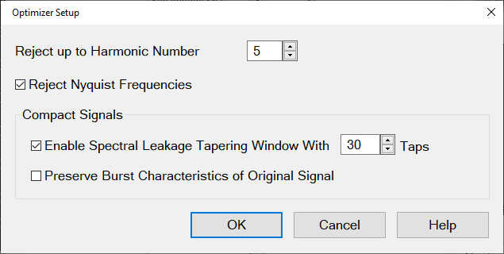
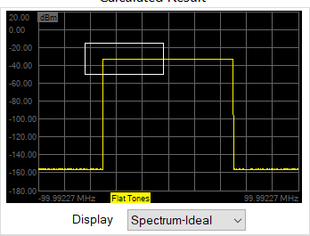
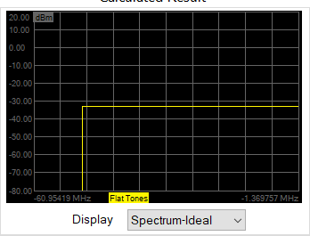
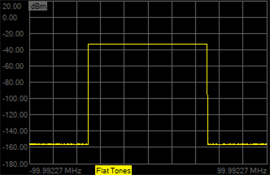
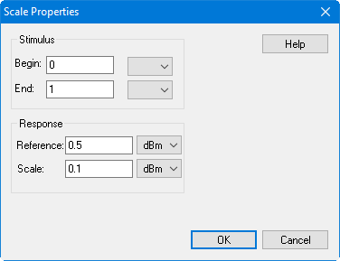
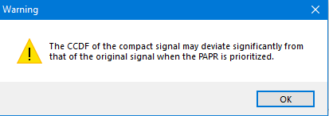
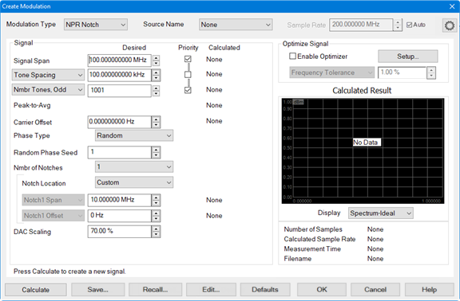

# Creating Modulation Files

The Create Modulation dialog is used to create modulation files which can then
be loaded into the source. The types of modulation files that can be created
include Digital Modulation, NPR Notch, Flat Tones, and a shortened version of
a modulation file called Compact.

Create Modulation dialog help |    
---|---  
  
### Original (Parent) Waveform

Note: The first line of a modulation file must be the sample rate. In
addition, never use a comma within a text comment. Commas are used as data
separators only. Keysight Signal Studio Waveform (.wfm) Use a .wfm file, which
is created using the Keysight Signal Studio Software. In order to use a
compact file (.mdx) which is created from .wfm, the corresponding license is
required on the Signal Generator to play the .mdx. When the waveform pack
license is used, the original waveform file must be assigned / locked to the
signal generator in order to use the .mdx created from the original waveform
file. Note: Encrypted .wfm files created using the N5182B MXG RF Vector Signal
Generator are not supported. **IQ file (.csv)** Use a .csv file format that
has a timestamp, I, and Q that uses a comma to separate the values. No license
is required on the signal generator to play the .mdx created from the .csv.

* * *

Modulation Type - Selects the modulation type (note that these define signals,
not measurements): Digital Mod \- Creates an I/Q modulation waveform. Compact
\- Compact signals cut a slice of the IQ data from an original waveform.  Flat
Tones \- This signal is a set of constant amplitude tones over a defined
signal span. NPR Notch \- This signal is a set of constant amplitude tones
over a defined signal span where a subset of those tones are set to zero over
a notch span. Digital Modulation Type Note: Create Digital Modulation is a
Licensed Feature and only available on PNA/PNA-X instruments. Learn more about
[Licensed Features](../../Support/Software_Support.md).
 Source
Name - Selects the modulation source. [Learn
more](Modulation_Distortion_Settings.htm#Source). Sample Rate - Sets the
source sample rate. Auto - Automatically selects a sample rate for the active
source depending on the modulation requested. If the modulation is invalid
(for example, 0 Hz span), then Auto will default the sample rate to 100 MHz.
Nmbr of Symbols - Specifies the number of symbols in the waveform. Symbol Rate
- Specifies the rate, or frequency, at which symbols occur. Modulation Type -
Selects a modulation type: QPSK 8-PSK 16-QAM 64-QAM 256-QAM 1024-QAM BPSK
8-APSK 16-APSK CR 9/10 32-APSK CR 9/10 IQ File - If selected, enter a filename
of an existing IQ file in the field. IQ Filename \- If Modulation Type is set
to IQ File, then this file defines the IQ constellation. The symbols will be
pseudo-randomly chosen from these constellation values. The file is a *.csv
with the following format: I_1,Q_1 I_2,Q_2 I_3,Q_3 ... I_N,Q_N Filter Type -
Specifies the filter to apply to the time data. Alpha/BT - Selects the
Alpha/BT characteristics of the selected filter. Quadrature Error - Indicates
the orthogonal error between the I and Q signals. The ideal orthogonal between
I and Q signals is 90 degrees. An error of 3 degrees indicates that the I and
Q are 93 degrees apart. Random Seed \- The waveform is created using a pseudo-
random number generator. The number generator starts at a value determined by
the Random Seed. For a given Random Seed, the number generator will always
create the same pseudo-random sequence of values. Changing the Random Seed
will change the pseudo-random sequence. The Random Seed may be set to an
integer between 1 and 1,000,000. Carrier Offset \- Sets the carrier offset
value relative to the carrier LO frequency. Nmbr of Carriers - Allows
selection of multiple carriers for multi-carrier modulated signals. The
default is 1. Carrier Spacing - Specifies the space between carriers when
setting up multi-carrier signals. DAC Scaling \- Sets the scaling factor used
for the waveform (full scale = 100%). This ensures that the DAC filter does
not output a signal that is larger than the DAC's maximum output level, which
can cause distortion in the system. Setting the scaling factor to 100% will
usually cause excessive distortion. Calculated \- Displays the settings that
were used to create the modulated signal. Enable Optimizer \- When enabled,
the calculated modulated signal will be optimized according to the constraints
defined in this group box. If Enable Optimizer is disabled:

  * Always creates a signal that can be measured by the PNA.
  * If the Priority box for Waveform Period or Tone Spacing is checked, then this will attempt to create the exact desired period if possible.
  * If the Priority box for Number of Tones is checked, then this will attempt to create the exact desired number of tones if possible.
  * In some cases, the resulting file will be too large, or the frequencies will be inconsistent with the ADC frequencies. In these cases, the desired values will not be used.

Setup... button - Accesses the Optimizer Setup dialog.
 Note: These
settings only apply if "Enable Optimizer" has been selected in the "Create
Modulation" dialog. Reject up to Harmonic Number \- Rejects images up to the
defined harmonic number.  
Default: 5  
Minimum value is 1, which rejects the first image at negative frequency.  
More rejection requires longer measurement time to create longer filters
having more nulls to cancel the images. Reject Nyquist Frequencies \- The PNA
38-MHz anti-alias filter has poor Nyquist rejection. This should be enabled
when using that AAF. This is not true for the 11MHz AAF in the PNA, or for any
other AAF filters in other platforms.  
Default: ON  
Selecting this ensures that the tone spacing is not equal to Fadc/N, where
Fadc is the ADC clock frequency. Avoiding these tone spacings will allow the
filter to null the 2nd Nyquist leakage. Compact Signals: Enable Spectral
Leakage Tapering WIndow With [n] Taps \- This is only applied to Compact
Signals.  
Defaults: ON, Taps = 30.  
The Compact Signal is generated from a time slice of the Original Signal. This
time slice is repeated. The Tapering Window is used to smooth the ends of the
time slice to minimize spectral splatter caused by a sharp transition at the
boundary. If you have enabled "Pteserve Burst Characteristics of Original
Signal", then the Tapering Window is used to smooth the edges of the burst to
avoid spectral splatter.. Preserve Burst Characteristics of Original Signal \-
This is only applied to Compact Signals.  
Default: OFF  
If turned ON, then the code will determine if the Original Signal is a Burst
Signal and ensure that the Compact Signal will be a burst with the same duty
cycle. Optimize Signal pull-down menu: Frequency Tolerance \- Set the allowed
tolerance for tone spacing when calculating the modulation signal. Wider
tolerance results in selection of tone spacing which require smaller files and
less measurement time. If the tolerance to too small to provide a solution,
then a solution is calculated with the minimum possible tolerance and the
tolerance value will be changed. Min Waveform Period \- Minimizes the period
of the waveform greater than or equal to the value (seconds). Min Number of
Tones \- Minimizes the number of tones greater than or equal to the value.
This will ignore the Number of Tones selection. Max Tone Spacing \- Maximizes
the tone spacing less than or equal to the value (Hz). This will ignore the
Tone Spacing selection. Display \- Select from the following: Spectrum-Ideal
\- Displays the spectrum represented by floating point numbers, which results
in a very low noise floor. Spectrum-16bit \- Displays the spectrum represented
by 16-bit numbers, which results in more distortion. Time \- Displays the
signal in the time domain. CCDF \- Displays the complementary cumulative
distribution function. CCDF Error \- (Compact Modulation Type only) Displays
the difference between the parent signal and created signal. The Y-axis is
displayed in linear %. Number of Samples \- Displays the calculated file size.
If there are no calculated results, None is displayed. Calculated Sample Rate
\- Displays the calculated sample rate. If there are no calculated results,
None is displayed. Measurement Time \- Displays the minimum measurement time
for the calculated signal. If there are no calculated results, None is
displayed. Filename \- Displays the name of the modulation file. If the
calculated result has not been saved, None is displayed. Display Data Features
Click-and-drag over a part of the display to zoom in on data.

 Right-click in the display
area to access the following menu:

Autoscale \- Automatically scales the data to fit vertically within the
display grid area. Display marker annotation \- Select to display marker
annotation in the top-right of the display. Show graticule \- Select to
display graticules. Add marker to: \- Select to add a marker to the displayed
data trace. When a selection is made, the mouse pointer changes to a "+".
Click in the display area and the marker will appear. Drag the marker to the
desired position. Each time this selection is made, a new marker will be added
to the data. Choose from: Original/Compact \- Add marker to the original data
and/or the calculated compact data when the Modulation Type selection is
Compact. Flat Tones \- Add marker to flat tone data when the Modulation Type
selection is Flat Tones. NPR Notch \- Add marker to notch data when the
Modulation Type selection is NPR Notch. Copy to Clipboard \- Copies a bitmap
of the trace control (Display) to the clipboard. It can then be pasted into
any document that accepts bitmaps.
 Print... \- Prints
the displayed data. Scale properties... \- Accesses the following dialog:
 Stimulus \- Sets
the Begin and End frequency displayed on the X-axis. Response \- Sets the
Reference level in the center of the Y-axis and sets the scale per division.
Compact Modulation Type
 Compact
signals cut a slice of the IQ data from an original waveform. The slice of IQ
data is chosen that best fits in terms of statistical distribution (CCDF),
then conditions the waveform so that it has the same spectrum signature as the
original signal. Original signal:
 Compact signal:
 Source Name - See
above. Sample Rate - See above. Filename \- Select the filename of the
original (parent) modulation file to be compacted. Sample Rate \- Displays the
sample rate of the original modulation file. Number of Samples \- Displays the
number of samples in the original modulation file. Tone Spacing \- Displays
the tone spacing of the original modulation file. Waveform Period \- Displays
the waveform period of the original modulation file. Signal Span - Displays
the signal span value of the original modulation file. Carrier Offset \-
Displays the carrier offset value of the original modulation file. Signal Span
\- Sets the frequency span of the modulated carrier. Tone Spacing/Waveform
Period \- Sets the desired tone spacing or waveform period and shows the
calculated tone spacing or waveform period. Number of Tones \- Sets the
desired number of tones. This setting is related to the span and tone spacing:
(Number of Tones) = (Signal Span)/(Tone Spacing) +1. PAPR (continuous)  \-
Displays the peak-to-average value of the continuous signal rather than the
sampled signal. When checking the Priority box, the compact signal will
include the maximum peak of the original signal.  By default this is OFF.
Setting this as a priority may cause problems with the signal statistics; a
warning dialog shown below will be displayed if this checkbox is selected.
 Carrier Offset \- See
above. Nmbr of Subcarriers \- Allows selection of multiple carriers when
defining a multicarrier signal. Select None, 2, 3, 4, 5, 6, 7, 8, or 9 from
the pull-down menu. The default is None. Sub1 Span \- Sets the span of the
subcarrier selected from the pull-down menu. Sub1 Offset \- Sets the offset of
the subcarrier selected from the pull-down menu. DAC Scaling \- See above.
Signal Start Time \- Sets where to start the compact signal within the
original signal. The compact signal is a slice of the original signal.  Note:
The Priority checkbox must be checked to use this value. Number of Files \-
Sets the number of modulation files to create. This function is useful to
create several signals, compare them, then save the best signal. Priority \-
Check to attempt to calculate values closer to the desired values. Calculated
\- See above. Enable Optimizer \- See above. Optimize Signal pull-down menu -
See above. Display \- See above. File \- Allows you to switch between multiple
created signals for comparison, then save the best signal. Use Number of Files
to specify the number of files to create for comparison. Flat Tones Modulation
Type 
Source Name - See above. Sample Rate - See above. Signal Span \- See above.
Tone Spacing/Waveform Period \- See above. Number of Tones \- Select between
odd or even number of tones and sets the desired number of tones. This setting
is related to the span and tone spacing: (Number of Tones) = (Signal
Span)/(Tone Spacing) +1.  Nmbr Tones, Odd \- This forces the optimizer to
choose an odd number of tones. The optimizer will also choose an offset such
that the carrier lands on one of the tones. Nmbr Tones, Even \- This forces
the optimizer to choose an even number of tones. The optimizer will also
choose an offset such that the carrier either lands on one of the tones, or
exactly halfway between the tones. Peak-to-Avg \- See above. Carrier Offset \-
See above. Phase Type \- Select Random, Fixed, or Parabolic.

#### Random Phase Seed \- Sets the phase seed when Random phase is the Phase
Type.

DAC Scaling \- See above. Priority \- See above. Calculated \- See above.
Enable Optimizer \- See above. Optimize Signal pull-down menu - See above.
Display \- See above. NPR Notch Modulation Type
 Source
Name - See above. Sample Rate - See above. Signal Span \- See above. Tone
Spacing/Waveform Period \- See above. Number of Tones \- See above. Peak-to-
Avg \- See above. Carrier Offset \- See above. Phase Type \- See above.

#### Random Phase Seed \- See above.

#### Nmbr of Notches \- Sets the number of notches in the modulated signal.

Notch Location \- Select from the following: Symmetric \- Locates the notch in
the center of the signal span. Avoid Carrier \- Locates the notch near the
center of the signal span but will be shifted to avoid the LO carrier
feedthrough. Custom - Allows the user to define the offset of the notch. Notch
N Span \- Sets the span of the selected notch. The notch can be up to 10% of
the Signal Span. Notch N Offset \- The offset frequency is the center
frequency of the selected notch relative to the LO carrier frequency.
Typically, the notch will have a 0 Hz offset, meaning it is centered on the LO
carrier. If you have more than one notch, you can offset some of the notches
from the carrier. For example, if you have three notches 1 MHz wide, you might
set their offsets to -10 MHz, 0 MHz and +10 MHz so that they are spaced across
the wideband carrier. DAC Scaling \- See above. Priority \- See above.
Calculated \- See above. Enable Optimizer \- See above. Optimize Signal pull-
down menu - See above. Display \- See above. Buttons Calculate button-
Calculates the result from the current settings. If calculated results exist
then data is plotted on the display. If there are no calculated results then
there is no plotted data and No Data is displayed. The calculated result is
erased if you click on the Defaults button or Recall... button and recall a
previously saved file. Save... button - Saves the current modulation settings.
Recall... button - Recalls a previously saved modulation file. Edit... button
- Accesses the Edit Multitone dialog:
 Tone \- Tone number
from 1 to N. Cannot be edited. Frequency \- Frequency of tone in Hz relative
to the carrier. Cannot be edited. Power (dBm) \- Tone power in dBm. Click in
the cell to edit. Phase (deg) \- Tone phase in degrees. Click in the cell to
edit. State \- Click in the cell to turn the tone on or off. Set All Tones \-
Set all tone states to on or off. Display \- Select which tones to display in
the table (All Tones, On-Tones, or Off-Tones). Go To Row \- Jumps to the
specified row. Enter the row number then press Enter. Save... button - Saves
the current multitone settings as a .csv file. Load... button - Loads a
previously saved multitone .csv file. Defaults button - Restores default
modulation settings for the current Modulation Type.

####

