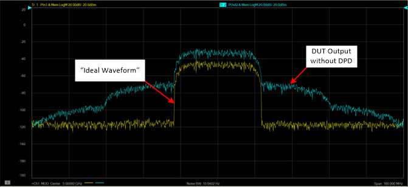
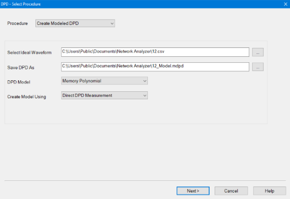
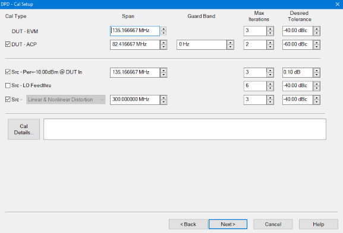
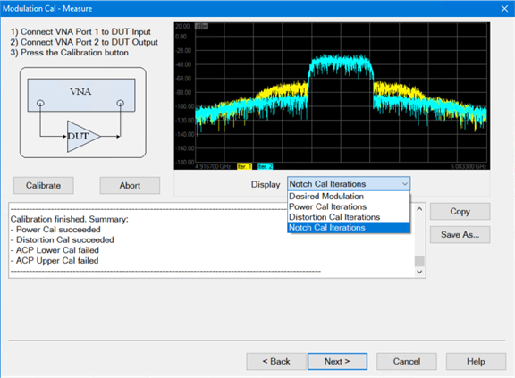
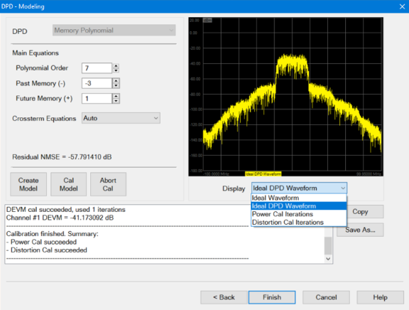
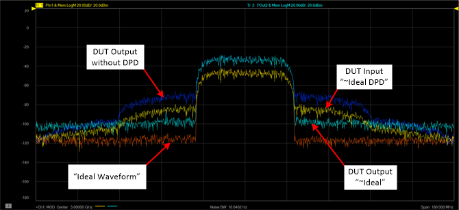

# DPD Modeling

The following DPD Modeling example creates a memory polynomial model that
depends on past and future input values to account for memory effects.

The following is an example of an input signal and output signal without DPD:

  * Yellow trace: PIn Ideal Waveform
  * Blue trace: POut without DPD showing distortion in the ACP region

  1. On the VNA front panel, press Meas > S-Param > Meas Class....

  2. Select Modulation Distortion or Modulation Distortion Converters, then either:

     * OK delete the existing measurement, or

     * New Channel to create the measurement in a new channel.

  3. The Modulation Distortion or Modulation Distortion Converters dialog is displayed.  
  
  

  4. Select the Modulate tab.  
  
  

  5. In the Source pull down menu, select an existing source from the list or add a source. For information on adding an external source, refer to [Set Up the External Source](Set_Up_the_External_Source.md).

  6. Click on the Load File... button to load an existing modulation file. This is the Ideal Waveform. [Learn more](DPD_Overview.md#DPD_Waveforms).

  7. Click on the Create DPD... button to open the DPD Select Procedure dialog.  
  
  

  8. In the Procedure pull down menu, select Create Modeled DPD.

  9. The Select Ideal Waveform field displays the path and modulation file name currently selected in the Modulate tab of the Modulation Distortion Setup dialog. To change to a different file, select the "..." button.

  10. The Save DPD As field displays the path and name of the DPD file that will be created (*.mdpd). The file name is based on the name of the ideal waveform displayed in the Select Ideal Waveform field. To change to another file, select the "..." button. Edit the displayed file name in the Save DPD As field to create a new file.

  11. In the DPD Model pull down memu, select the Memory Polynomial.

  12. For purposes of this example, in the Create Model Using select Direct DPD Measurement. [Learn more](Create_DPD.md#Create_Model_Using_dialog_help).

  13. Click on the Next> button to access the Cal Setup dialog.  
  
  

  14. Click on the Cal Details... button to change PAPR and DAC Scaling settings. [Learn more](Create_DPD.md#Cal_Details_dialog_help).

  15. For purposes of this example, default settings/values will be used. [Learn more](Create_DPD.md#Cal_Setup_dialog_help).

  16. Click on the Next> button to access the Modulation Cal - Measure dialog.

  17. Ensure that the DUT is connected to the VNA as described/shown in the dialog then click on the Calibrate button. [Learn more](Create_DPD.md#Calibrate_dialog_help).  
  
  

  18. When completed, click on the Next> button to access the Modeling dialog.

  19. For purposes of this example, default settings/values will be used. [Learn more](Create_DPD.md#Memory_Polynomial_Modeling_dialog_help).

  20. Click on the Create Model button. Creates the DPD Model file from the settings in the Modeling dialog and creates the "MyDPD_IdealDPD" waveform.

  21. Click on the Cal Model button.  
  

  22. When completed, click on the Finish button.

  23. The following display shows the [~Ideal DPD](DPD_Overview.md#DPD_Waveforms) waveform (yellow) at the DUT input and the improved ACP region of the [~Ideal](DPD_Overview.md#DPD_Waveforms) waveform (teal) at the DUT output.   
  
  

