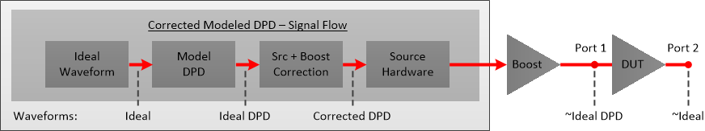
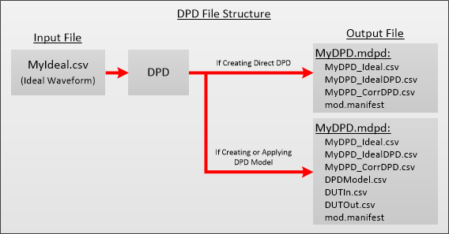
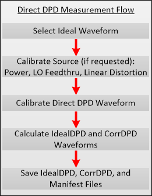
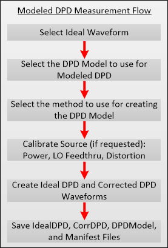

# DPD Overview

The Digital Predistortion (DPD) feature in the VNA characterizes and then
creates a model of the non-linear distortions of power amplifiers caused when
operating in the amplifier's compression region. DPD then creates a DPD
waveform (inverse distortion) so that the DUT output will approximate the
desired ideal waveform. DPD provides improved linearity to allow transmission
of signals at lower distortion levels.

Note: Digital Predistortion is a Licensed Feature. Learn more about [Licensed
Features](../../Support/Software_Support.htm).

In this topic:

  * Features and Requirements
  * DPD Waveforms
  * DPD File Structure
  * Direct DPD
  * Modeled DPD

#### See Also

  * [DPD Wizard](Create_DPD.md)
  * Programming Examples: 
    * [Direct DPD](../../Programming/GPIB_Example_Programs/Direct_DPD.md)

    * [DPD Modeling](../../Programming/GPIB_Example_Programs/DPD_Modeling.md)

    * [DPD Model From File](../../Programming/GPIB_Example_Programs/DPD_Model_From_File.md)

## Features and Requirements

#### Features

  * Creates DPD model

  * Validates DPD model (evaluate improvement that is possible using particular model)

  * Measures spectral regrowth (quantified as ACPR)

  * Measures in-band distortion (quantified as EVM or NPR)

#### Requirements

  * Modulation Distortion Option S93070xB

  * Requires a configurable test set (it does not work with N522xB-200/210/400/410)

  * 2-Port or 4-Port E5081A VNA

  * M983xA PXIe VNA (single module)

  * Supported external sources:

    * E8267D PSG Vector Signal Generator
    * M8190A with E8267D PSG Vector Signal Generator

    * M9383A/B, M9384B (wideband vector, 44 GHz, with enhanced phase noise)

    * N5182B MXG RF Vector Signal Generator

    * N5192A and N5194A UXG Vector Adapter

Note: When setting up an M9383A, M9383B, or M9384B source in the [External
Device
Configuration](../../System/Configure_an_External_Device.htm#ExtDevConfig)
dialog, select MXG_Vector as the driver (they are code compatible).

  * Windows 10 operating system

## DPD Waveforms

The diagram shows the signal flow and waveforms through the VNA to the DUT
input and output.

Waveform |  Description  
---|---  
Ideal |  This is the desired Ideal waveform, which is the default modulation file currently selected in the Modulate tab of the [Modulation Distortion Setup](Modulation_Distortion_Settings.md#Modulate_settings) dialog.  
Ideal DPD |  The model is applied to the Ideal waveform to create the Ideal DPD waveform. This waveform does not have source correction applied.  
Corrected DPD |  Ideal DPD waveform with source correction applied.  
~Ideal DPD |  DUT input signal with DPD and source correction applied. This approximates the Ideal DPD waveform.  
~Ideal |  The DUT output signal with DPD and source correction applied. This approximates the Ideal waveform. Most of the distortion from the DUT is tuned out of the signal at this point.  
  
The following example shows a typical Ideal Waveform and DUT Output without
DPD applied.

After applying DPD, the following shows typical ~Ideal DPD and ~Ideal
waveforms.

## DPD File Structure

The following table describes the files in the DPD file structure:

Filename |  File Description  
---|---  
MyDPD_Ideal.csv |  This is the original Ideal Waveform.  
MyDPD_IdealDPD.csv |  Ideal DPD waveform without source correction applied.  
MyDPD_CorrDPD.csv |  Ideal DPD waveform with source correction applied.  
DUTIn.csv |  Waveform measured at the DUT input which is used to create the DPD Model.  
DUTOut.csv |  Waveform measured at the DUT output which is used to create the DPD Model.  
DUTLinearGain.csv |  Contains the linear gain of the DUT if the DPD model is Dynamic Gain.  
mod.manifest |  File containing setup information.  
DPDModel.csv |  Contains the DPD model parameters.  
  
## Direct DPD

Direct DPD determines the maximum possible improvement to in-band EVM. This
method generates a predistorted signal and does not use a model.

## Modeled DPD

The following diagram shows the measurement flow for modeling.

### Memory Polynomial Modeling

Memory Polynomial Modeling is a technique that uses a memory polynomial
algorithm to create the model. This model depends on past and future input
values to account for memory effects. The past/future input values define the
number of input past/future time samples to use for calculating the current
output sample.

### Dynamic Gain Modeling

Note: Dynamic Gain of measurements above 50 GHz requires the S93110B Active
Hot Parameters license

Dynamic Gain Modelling is a technique that uses dynamic gain algorithm to
create the model. The gain is characterized by the AM-AM (magnitude ) and AM-
PM ( phase) functions, which are associated with the memory operators. There
are a total of four memory operators that users can choose from to include in
the gain algorithm.

