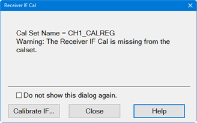
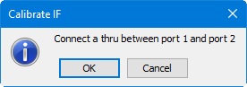

# Receiver IF Cal

Receiver IF Calibration is an additional process for S-parameter calibration
in a Modulation Distortion channel to improve the error term of the IF chain
of the VNA. Receiver IF Cal measures the S21 of the thru device at different
IF frequencies to compute the correction coefficient. The S-parameter [Cal
Set](../../S3_Cals/Cal_Sets.htm) contains all of these error terms. The point
count used for the receiver IF cal is determined by the **tone spacing** of
the modulated signal and the user’s measurement span.

The receiver IF calibration uses the internal PNA CW source to make the
measurement.

## Receiver IF Cal Procedure

Perform the Receiver IF Cal if it is inaccurate or missing. This will be
indicated in the Receiver IF Cal dialog as a warning message. An inaccurate
Receiver IF Cal occurs when the Start, Stop, Center, or Span setting
frequencies do not match the active S-parameter Cal Set.

Note: The following procedure assumes the Receiver IF Cal has never been
performed and is therefore not part of the active Cal Set.

  1. Ensure that the Modulation Distortion measurement class to be calibrated is currently active.

  2. Press Cal > Cal Sets & Cal Kits > Cal Set... then select a [Cal Set](../../S3_Cals/Cal_Sets.md#ApplyingCalSet) to apply to the active channel.

  3. Press Cal > Main > Other Cals. 

  4. Select Receiver IF Cal.... The following dialog is displayed:  
  
  
The Close button aborts the calibration.  
If Do not show this dialog again is checked, the Receiver IF Cal dialog will
not be displayed when a calibration is required.

  5. Click on the Calibrate IF button. The following dialog is displayed:  
  

  6. Connect a thru device between the input port and the output port (use a low loss, passive component).

  7. Click on the OK button.

  8. If the calibration was successful, the status message will indicate a valid IF calibration.

