# Distortion Measurement Parameters

In this topic:

  * Spectrum Decomposition
  * Distortion Model
  * Accessing the Distortion Measurement Parameters
  * Main, Distortion and External Tab Measurement Parameters
  * Distortion Table

## Spectrum Decomposition

The DUT is stimulated with a low-level signal to measure its linear parameters
and a high-level modulated signal to measure its distortion characteristics.
The modulation distortion application processes the data and compares the
input spectrum X(f) and the output spectrum Y(f) using a process known as
spectral correlation. As a result, the modulation distortion application
decomposes the output signal spectrum into two parts: H(f)*X(f) and D(f).
H(f)*X(f) linearly correlates to the input while D(f) represents the
distortion which does not correlate to the input.

## Distortion Model

The following Distortion Model describes noise and distortion in an amplifier
and will help in understanding the Distortion Measurement Parameters (shown
below):

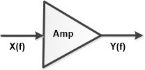

Y(f) = C(f) * S21(f) * X(f) + D(f)

[H(f) = C(f) * S21(f)]

where:

X(f) = Measured input signal

Y(f) = Measured output signal

C(f) = Compression

S21(f) =Linear flatness and gain

D(f) = Output modulation distortion

## Accessing the Distortion Measurement Parameters

#### How to select and configure Measurement Parameters  
  
---  
Using Hardkey/SoftTab/Softkey |  Using a mouse  
  
  1. Select a trace by pressing Trace > Trace N > Trace N.
  2. Press Trace > Trace Setup > Measure....
  3. Select a parameter.

|

  1. Right-click on a trace.
  2. Select a parameter

  
  
## Main, Distortion and External Tab Measurement Parameters

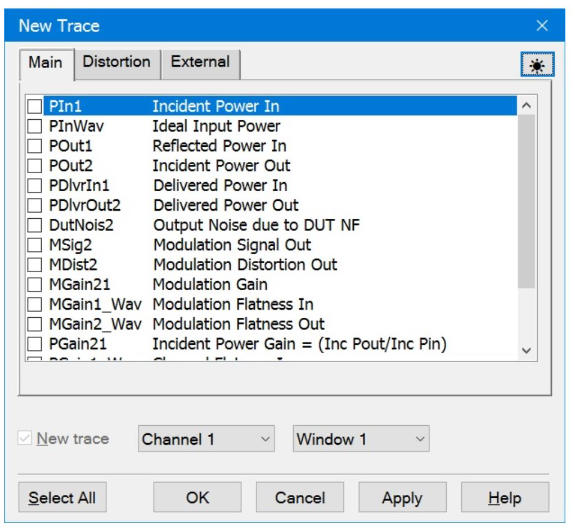

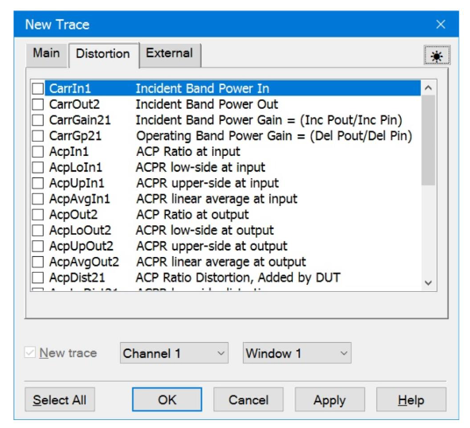

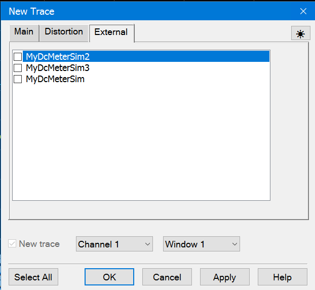

Select from the parameters to measure power, S-parameters, or distortion
characteristics.

New Trace \- Add a new trace.

Channel N \- Select a channel number for the new modulation distortion trace.

Window N \- Select to create the new trace in an existing window or new
window.

Select All \- Select all measurement parameters.

The following tables describe the available Distortion Measurement Parameters
for each DUT type and for the Main, Distortion and External tabs.

Note: The parameter names in the table assume we are testing a DUT with Port
1= input and Port 2 = output.

### Main Tab Measurement Parameters

DUT Type |  Description |  Default Format  
---|---|---  
Amplifier |  Mixer  
PIn1 |  PIn1 |  Incident Input power to the DUT |  dBm/Hz  
PInWav |  PInWav |  Power of the ideal modulation file loaded into the source. RMS power equals the power incident on the DUT. |  dBm/Hz  
POut1 |  POut1 |  Power reflected from the DUT input |  dBm/Hz  
POut2 |  POut2 |  Incident Output Power on the VNA test port at the DUT output. |  dBm/Hz  
PDlvrIn1 |  PDlvrIn1 |  Power delivered to the DUT input. This is calculated from incident power on the DUT (PIn1) and reflected power from the DUT (Pout1). |  dBm/Hz  
PDlvrOut2 |  PDlvrOut2 |  Power delivered to the receiver on at the DUT output. This is calculated from the incident power on the VNA port at the DUT output (POut2) and the reflected power from the VNA port at the DUT output (PIn2). |  dBm/Hz  
DutNois2 |  DutNois2 |  Noise power delivered to the receiver, calculated from DUT NF value and measured DUT gain. |  dBm/Hz  
MSig2 |  MSig2 |  Output modulation signal - C(f) * S21(f) * X(f) |  dBm/Hz  
MDist2 |  MDist2 |  Output modulation distortion - D(f) |  dBm/Hz  
MGain21 |  MGain21 |  DUT modulation gain - C(f) * S21(f) = H(f) This gain is a smooth complex function, with smooth referring to the mathematical property that it has continuous derivatives of infinite order |  dB  
MGain1_Wav |  MGain1_Wav |  Mod gain from Ideal Waveform to DUT Input, indicating modulation channel flatness of source. |  dB  
MGain2_Wav |  MGain2_Wav |  Mod gain from Ideal Waveform to DUT output, indicating modulation channel flatness of DUT. |  dB  
PGain21 |  PGain21 |  Incident Power Gain = Y(f) / X(f) = (Incident Pout)/(Incident Pin). |  dB  
PGain1_Wav |  PGain1_Wav |  Channel Flatness In = X(f) / (Ideal Waveform) = (Incident Pin)/(Ideal Waveform). This indicates channel flatness of source. |  dB  
PGain2_Wav |  PGain2_Wav |  Channel Flatness Out = Y(f) / (Ideal Waveform) = (Incident Pout)/(Ideal Waveform) at output. Indicates channel flatness of DUT. |  dB  
Gp21 |  Gp21 |  Operating Power Gain = (Delivered Pout) / (Delivered Pin). |  dB  
LMatch2 |  LMatch2 |  Load match of the VNA port. |  dB  
  
### Distortion Tab Measurement Parameters

Note: Single Port EVM Analysis is a Licensed Feature and is only available on
PNA/PNA-X instruments. Learn more about [Licensed
Features](../../Support/Software_Support.htm).

DUT Type |  Description |  Default Format  
---|---|---  
Amplifier |  Mixer  
CarrIn1 |  CarrIn1 |  Incident Band Power In on the DUT input. |  dBm/Hz  
CarrOut2 |  CarrOut2 |  Incident Band Power Out on the VNA test port at the DUT output. |  dBm/Hz  
CarrGain21 |  CarrGain21 |  Incident Band Power Gain = (Incident Pout)/(Incident Pin) |  dB  
CarrGp21 |  CarrGp21 |  Operating Band Power Gain = (Delivered Pout)/(Delivered Pin) |  dB  
AcpIn1 |  AcpIn1 |  Ratio of in-band channel power to channel power of the adjacent channel band at the input |  dBc  
AcpLoIn1 |  AcpLoIn1 |  ACPR low-side at the input |  dBc  
AcpUpIn1 |  AcpUpIn1 |  ACPR upper-side at the input |  dBc  
AcpAvgIn1 |  AcpAvgIn1 |  ACPR average at the input |  dBc  
AcpOut2 |  AcpOut2 |  Ratio of in-band channel power to channel power of the adjacent channel band at the output |  dBc  
AcploOut2 |  AcploOut2 |  ACPR low-side at the output |  dBc  
AcpUpOut2 |  AcpUpOut2 |  ACPR upper-side at the output |  dBc  
AcpAvgOut2 |  AcpAvgOut2 |  ACPR average at the output |  dBc  
AcpDist21 |  AcpDist21 |  ACP distortion added by DUT |  dBc  
AcpLoDist21 |  AcpLoDist21 |  ACPR low-side distortion |  dBc  
AcpUpDist21 |  AcpUpDist21 |  ACPR upper-side distortion |  dBc  
AcpAvgDist21 |  AcpAvgDist21 |  ACPR average distortion |  dBc  
AcpPwrIn1 |  AcpPwrIn1 |  ACP Input Band Power incident on the DUT input. |  dBm/Hz  
AcpPwrOut2 |  AcpPwrOut2 |  ACP Output Band Power incident on the VNA test port at the DUT output. |  dBm/Hz  
EvmInEq1 |  EvmInEq1 |  Equalized EVM at Input |  %  
EvmInUn1 |  EvmInUn1 |  Unequalized EVM at Input |  dBc  
EvmOutEq2 |  EvmOutEq2 |  Equalized EVM at Output |  %  
EvmOutUn2 |  EvmOutUn2 |  Unequalized EVM at Output |  dBc  
EvmDistEq21 |  EvmDistEq21 |  EVM equalized distortion added by DUT (non-linear contribution) |  %  
EvmDistUn21 |  EvmDistUn21 |  EVM unequalized distortion added by DUT (includes non-linear and linear distortion due to frequency dispersion) |  %  
EvmPwrIn1 |  EvmPwrIn1 |  EVM Input Band Power incident on the DUT input. |  dBm/Hz  
EvmPwrOut2 |  EvmPwrOut2 |  EVM Output Band Power incident on the VNA test port at the DUT output. |  dBm/Hz  
NprIn1 |  NprIn1 |  NPR at input |  dBc  
NprOut2 |  NprOut2 |  NPR at output |  dBc  
NprDist21 |  NprDist21 |  NPR distortion added by DUT |  dBc  
NprPwrIn1 |  NprPwrIn1 |  NPR Input Band Power Incident at the DUT input. |  dBm/Hz  
NprPwrOut2 |  NprPwrOut2 |  NPR Output Band Power incident on the VNA test port at the DUT output. |  dBm/Hz  
ModFilter |  ModFilter |  Modulation filter used during measurement |  dB  
  
### External Tab Measurement Parameters

  * List DC Meters and SMUs that are defined in [External Device Configuration](../../System/Configure_an_External_Device.md#ext_source_config).

  * Only list the receivers for which[ Active-Show in UI](../../System/Configure_an_External_Device.md#Active_Show_in_UI) is enabled.

  * For [Sweep type](Modulation_Distortion_Settings.md#Sweep_Type) set to Fixed, the trace will display a constant level.

  * For [Sweep type](Modulation_Distortion_Settings.md#Sweep_Type) set to Power, the trace will display multiple measurements versus an X-axis labeled as power.

Right-clicking on the dialog accesses a pop up menu. Select Show Expert Tabs
to display the Receivers tab for selecting one of the VNA receivers:

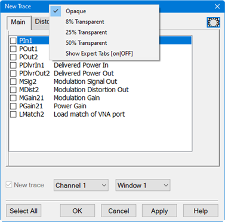

## Distortion Table

The Distortion Table is displayed below the measurement area. Each row
represents a measurement band. Each column represents a measurement parameter.

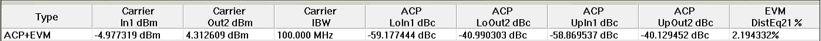

Total EVM

If there is more than one EVM band, then an extra band labeled Total EVM is
added at the bottom of the table. The band power column sums the band power.
The EVM and power density columns are a weighted average. The columns that do
not apply are blank (for example, Carrier Offset Frequency).

Saving the Distortion Table

The Distortion Table can be saved to a .csv file in one of three ways:

  1. Using a mouse, right-click in the Distortion Table area, select Save Table As..., then select Distortion Table (*.csv) from the Save as type pulldown menu in the Save Data As dialog.
  2. Press Save Recall > Save Other > Save Data..., then select Distortion Table (*.csv) from the Save as type pulldown menu in the Save Data As dialog.
  3. Using a mouse, select Utility, Save, Save Data, then select Distortion Table (*.csv) from the Save as type pulldown menu in the Save Data As dialog.

#### Accessing Distortion Table  
  
---  
Using Hardkey/SoftTab/Softkey |  Using a mouse  
  
  1. Press Meas > Main > click the small button to the left of the Distortion Table... button.

|

  1. Click Instrument.
  2. Select Display.
  3. Select Show Table....
  4. In the Customize Display dialog, select the Show Table pull-down.
  5. Select Distortion.
  6. Click OK.

  
  
Distortion Table help |    
---|---  
  
#### Save Table As...

#### Specifies the Modulation Distortion Table path and file name (*.csv).

#### 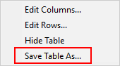

#### Editing Columns

The columns may be edited by clicking on Meas > Main > Distortion Table...
button or by right-clicking in the distortion table at the bottom of the
measurement area to access the pop up menu then selecting Edit Columns....
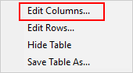 The
Distortion Table Setup dialog is displayed with tabs for adding/removing
measurement parameters for each measurement type. Show Table Check to display
the Distortion Table at the bottom of the VNA display area. Sort Table By
Select Band to sort the Distortion Table by band or Power to sort the
Distortion Table by power. Font Size Select Small or Medium font size for the
Distortion Table. Carrier tab 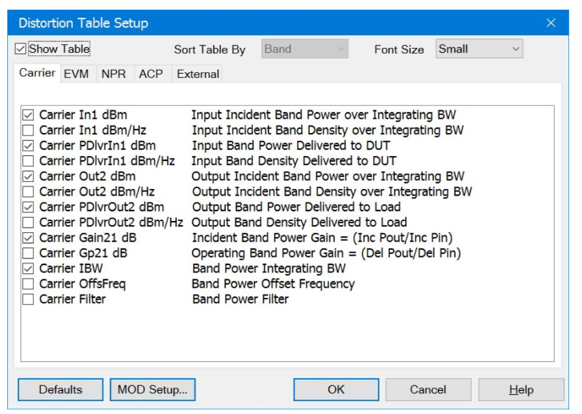 EVM tab
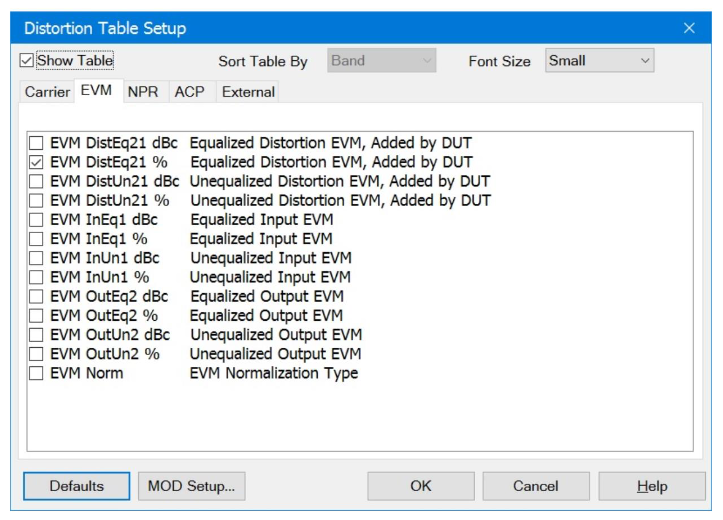 NPR tab
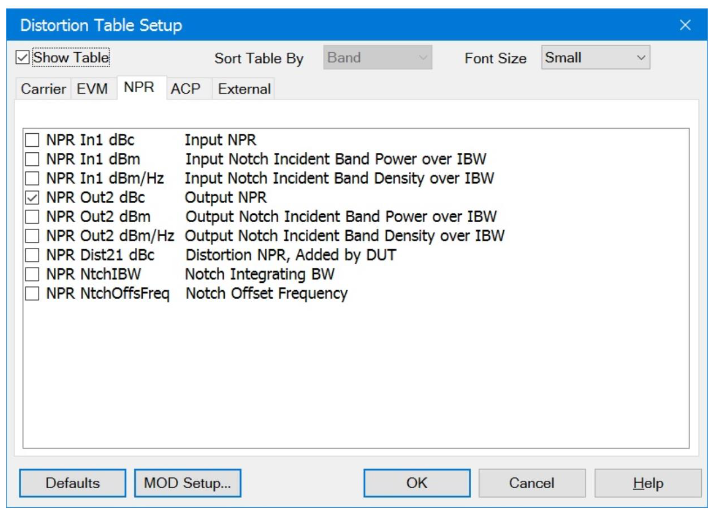 ACP tab
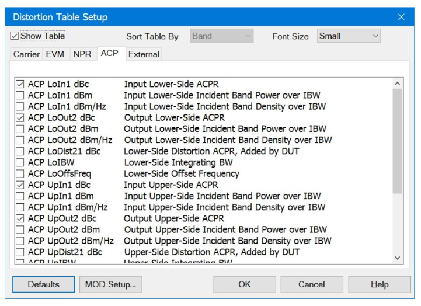 External tab
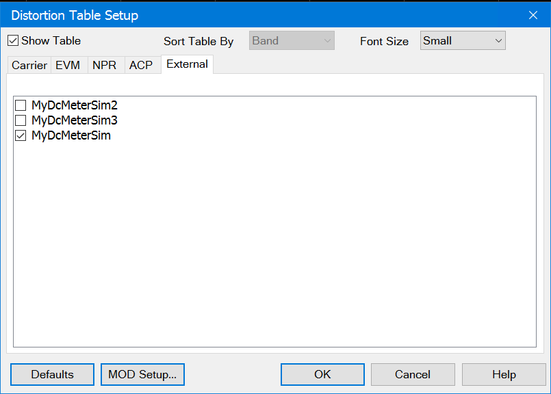

  * List DC Meters and SMUs that are defined in [External Device Configuration](../../System/Configure_an_External_Device.md#ext_source_config).
  * Only list the receivers for which[ Active-Show in UI](../../System/Configure_an_External_Device.md#Active_Show_in_UI) is enabled.
  * For [Sweep type](Modulation_Distortion_Settings.md#Sweep_Type) set to Fixed, the data will be a constant valuel.
  * For [Sweep type](Modulation_Distortion_Settings.md#Sweep_Type) set to Power, the data will be one value at each power level.
  * Data will be displayed in the Distortion Table using the following formats:
    * Current = Amps
    * Voltage = Volts
    * Power = dBm

#### Editing Rows

The rows may be edited by right-clicking in the distortion table at the bottom
of the measurement area to access the pop up menu then selecting Edit Rows....
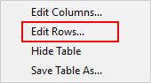 The Modulation
Distortion Setup Measure tab dialog is displayed. Click on the Measurement
Type pulldown menu then select Multi-Band to access the table for adding,
editing, and deleting band rows. [Learn
more](Modulation_Distortion_Settings.htm#Edit_Table). Buttons Defaults -
Resets the dialog to its default selections. MOD Setup... - Accesses the
Modulation Distortion Setup Measure tab dialog. [Learn
more](Modulation_Distortion_Settings.htm#Measure_settings_dialog_help).

