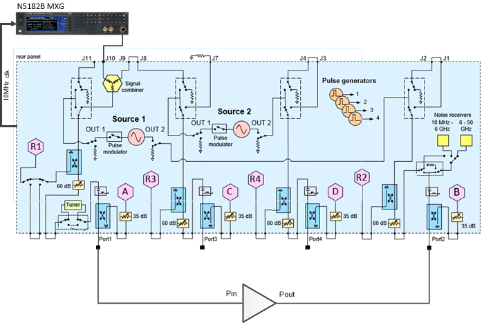
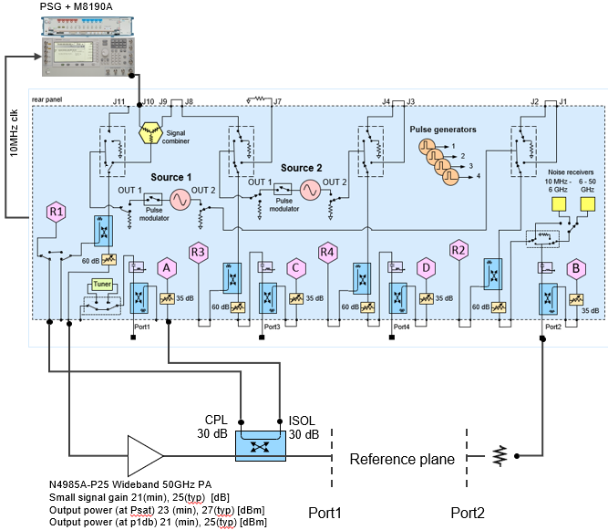

# Hardware Setup for Amplifiers

A Vector Signal Generator is used to generate a repetitive signal with a given
CCDF (Complementary-Cumulative-Distribution-Function) and PSD (Power Spectral
Density).

## Physical Setup - Typical

The following diagram shows a typical hardware setup using an N5182B MXG with
the signal connected to the VNA rear-panel Port 1 J10 input connector.

Note: Though the following setup example uses an N5182B MXG, an M8190A with
E8267D PSG, or an M9383A MCS can also be used as the external source.

## Physical Setup - High Power

The following diagram shows a typical high power hardware setup using an
M8190A with E8267D PSG with the signal connected to the VNA rear-panel Port 1
J10 input connector.

