# Link VNA to VSA 89600

Connecting the VNA to the VSA 89600 software allows for greater signal
evaluation and troubleshooting. Perform dynamic compression with modulated
signals, characterize linearization techniques of modulated signals on
amplifiers, verify modulated performance, and demodulate and analyze complex
signals.

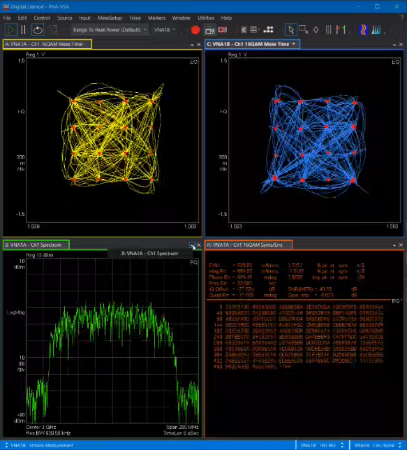

Note: IQ data output is a Licensed Feature. Learn more about [Licensed
Features](../../Support/Software_Support.htm).

In this topic:

  * Features, Requirements, and Limitations
  * Accessing VSA Settings
  * VSA Dialog Help 
    * VSA Setup Dialog Help
    * VSA Status Dialog Help
  * Example Using Spectrum Analyzer Application

## Features, Requirements, and Limitations

#### Features

  * Supports data transfers from SA, MOD, and MODX Measurement Classes
  * Multiple VNA channels allowed to transfer data to VSA
  * Continuous transfer
  * VNA starts the VSA automatically
  * VNA GUI for switching between VSA and VNA displays
  * Transfer up to 5 VNA calibrated wave measurements per VNA channel
  * Channel scoped (each VNA channel communicates with its own VSA Hardware Configuration virtual instrument)

#### Requirements

  * Minimum VSA license 89601200C, minimum VSA release 2022_Update_1.0, Build 26.20.233

  * VNA Option S93090x Spectrum Analyzer or Option S93070x Modulation Distortion

  * Up to date support contract on either the SA or MOD distortion license

  * VNA Option S93050B Vector Signal Analyzer (1.5 GHz span required if span exceeds 200 MHz)

  * 2-Port or 4-Port VNA

  * M983xA (PXIe VNA)- single module only

    * VNA Option S95050B Vector Signal Analyzer (1.5 GHz span required if span exceeds 200 MHz) or

    * VNA Option S95051B Vector Signal Analyzer (4 GHz span required if span exceeds 200 MHz)

  * E5081A (2-Port or 4-Port VNA) 

    * VNA Option S96050B Vector Signal Analyzer (1.5 GHz span required if span exceeds 200 MHz) or

    * VNA Option S96051B Vector Signal Analyzer (4 GHz span required if span exceeds 200 MHz)

  * Windows 10 (64 bit) operating system

  * Minimum system CPU version 6.0, but later versions are highly recommended

#### Limitations

  * Transfers only wave data (a1, b2, etc.) from VNA to VSA

  * Minimal control (VNA does not control the VSA and VSA does not control VNA)

  * SA must be in coherent mode (repetitive test signal)

  * PNA/E5081A configuration: VSA must be installed on the unit (will not work if VSA installed on an external PC)

  * PXI or Streamline VNA configuration: feature not available VSA and VNA applications must be installed on the same PC

## Accessing VSA Settings

#### Accessing VSA settings in SA channel  
  
---  
  
### Using Hardkey/SoftTab/Softkey

|  Using a mouse  
  
  1. Press Math > VSA > VSA Setup....

Or

  1. Press Setup > Main > SA Setup....
  2. Select Coherence tab.
  3. Click on the VSA Setup... button.

|

  1. Click Stimulus.
  2. Select SA Setup....
  3. Select Coherence tab.
  4. Click on the VSA Setup... button.

  
  
#### Accessing VSA settings in MOD or MODX channel  
  
---  
  
### Using Hardkey/SoftTab/Softkey

|  Using a mouse  
  
  1. Press Math > VSA > VSA Setup....

Or

  1. Press Setup > Main > MOD or MODX Setup....
  2. Select Measure tab.
  3. Click on the VSA Setup... button.

|

  1. Click Stimulus.
  2. Select MOD or MODX Setup....
  3. Select Measure tab.
  4. Click on the VSA Setup... button.

Or

  1. Click Response.
  2. Select Meas.
  3. Select MOD or MODX Setup....
  4. Select Measure tab.
  5. Click on the VSA Setup... button.

  
  
## VSA Dialog Help

VSA 89600 Link Setup Dialog Help |    
---|---  
Note: Settings in this dialog apply to the active channel only. VSA Setup
dialog for SA channel 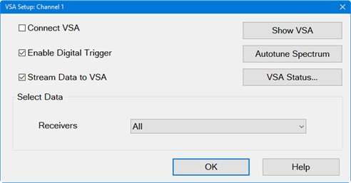 VSA Setup
dialog for MOD/MODX channel
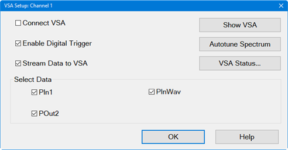 Connect VSA \- Check to
connect the VNA to the VSA and, if not currently running, start the VSA
application automatically. Un-checking this checkbox will not close the VSA
application but will disconnect the VSA from the VNA channel. Note: The
connection to the VSA will only occur when the VNA is sweeping. If the VNA is
on Hold mode, the VSA will not start or connect. Note: If the VSA was running
before the connection occurs, the VNA connects to the running occurrence, and
the VNA will not close VSA when quitting. If the VSA was not running before,
VNA starts it when connecting, and will close it when quitting. Enable Digital
Trigger \- Check to make the exported data more stable from sweep-to-sweep.
Un-checking this checbox makes the exported data less stable from sweep-to-
sweep (starting time of the IQ recording is random). Saved State Includes VSA
state ( all channels) \- Check to automatically save the VSA state file and
embed it into the VNA state file (.csa file). Stream Data to VSA \- Check to
stream data from the VNA to the VSA. Unchecking pauses data streaming but does
not disconnect. Show VSA button - Moves the VSA window in front of the VNA GUI
when the VSA-to-VNA connection is running. Autotune Spectrum button - Sets the
VSA spectrum settings to match the current SA coherent repetition rate. In
addition, it forces the VSA RBW to match the coherent tone spacing. VSA
Status... button - Check to open the VSA Status dialog. Learn more. Select
Data Receivers \- (SA channels only) Stream trace data to VSA from selected
receiver(s). PIn1 - Power In \- (MOD/MODX channels only) Check to stream input
power to a VSA measurement channel. VSA measurement channel numbers are
assigned automatically in sequential order. POut2 - Power Out \- (MOD/MODX
channels only) Check to stream output power to a VSA measurement channel. VSA
measurement channel numbers are assigned automatically in sequential order.
PInWav - Ideal Waveform \- (MOD/MODX channels only) Check to stream the Ideal
Waveform input power to the VSA measurement channel. VSA measurement channel
numbers are assigned automatically in sequential order.  
  
VSA Status Dialog Help |   
---|---  
Access the VSA LINK Status dialog by clicking on the VSA Status... button in
the VSA Setup dialog. If the connection has been established, then the VNA
LINK Status dialog displays a mapping between the VSA measurement channel and
corresponding VNA channel/VNA measurement. VSA measurement channel numbers are
assigned automatically in sequential order. Otherwise, it indicates “VSA not
attached”. Displayed information in this dialog cannot be edited.
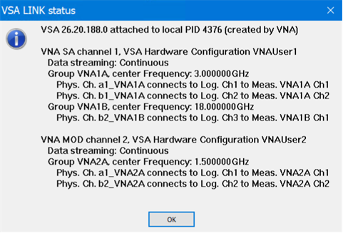 The text shown in the VSA Link
Status dialog above represents configuration information from the VSA Channel
Configuration pages (one page per VNA channel) in the VSA 89600 application.
The following are the VSA Channel Configuration pages corresponding to the
text above: Example of VSA Channel Configuration page for VNA channel 1
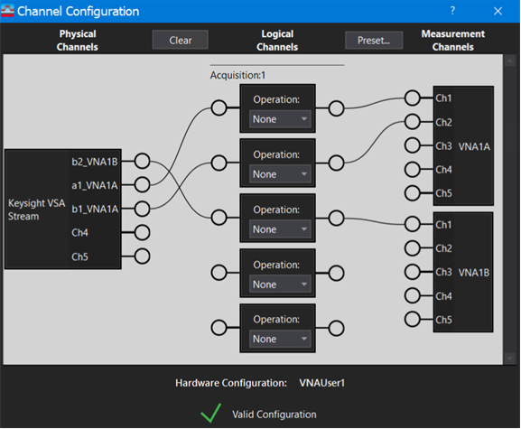 Example of
VSA Channel Configuration page for VNA channel 2
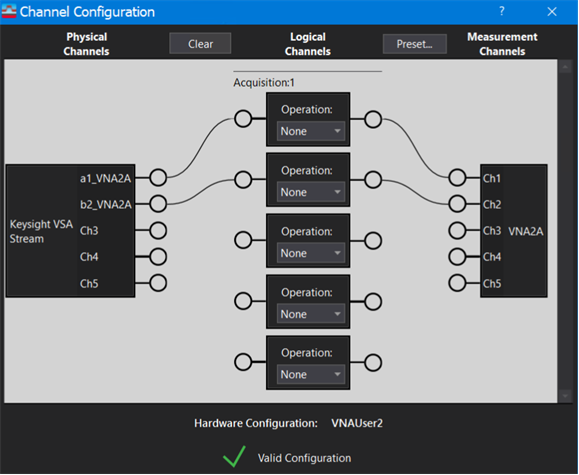  
  
## Example Using Spectrum Analyzer Application

The following shows the VNA displaying the input and output of a mixer.
Receiver a1 at Port 1 measures the input of the DUT and is a 3 GHz signal
modulated by a QAM16 I/Q signal at the mixer input from the MXG. The LO is a
15 GHz signal from the internal Source 1 and output through Port 2. Receiver
b4 at Port 4 is an 18 GHz signal at the mixer output. Using the VSA 89600
software, both the input and output signals of the mixer will be demodulated.

The following hardware setup was used in this example:  
  

Note: The following procedure assumes that the VSA 89600 application is
installed in the VNA.

  1. Create a [SA channel](../Spectrum_Analyzer.md#Create_a_Spectrum_Analysis_Channel).
  2. Set up the external source as follows: 
     1. 3 GHz Center Frequency.
     2. Generate a QAM16 I/Q modulation signal with 250 symbols, 100 MSamples/s clock, alpha=0.5 The signal duration is thus 2.5 us exactly. For modulated source setting details, refer to your vector source documentation.
     3. Connect 10 MHz reference signal between the external source and the VNA (either way). Note that latest PNAs allow 100 MHz reference signal too; this is another valid option.
     4. Applied external source output at PNA rear panel Port 1 jumper (J10 connector).
     5. Turn ON Port1 Combiner Path (press Setup > Internal Hardware > RF Path Config...).
  3. Set up the [a1 and b4 traces](../../S1_Settings/Measurement_Parameters.md#Waves). The a1 trace is the input and b4 trace is the output of the mixer.
  4. Set up the LO of the DUT using the Global Source feature: 
     1. Press Sweep > Source Control > Global Source....
     2. The Global Source Preferences dialog is displayed. [Learn more](../../S1_Settings/Global_Source.md).  
  
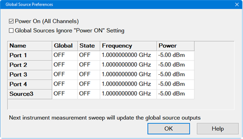

  5. For Port 2, which is the LO signal, set the following: 
     1. Global: Global
     2. State: ON
     3. Frequency: 15 GHz
     4. Power: 15 dBm
  6. The Global Source Preferences dialog should look similar to the following:  
  
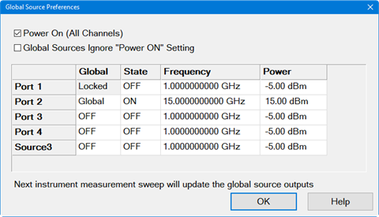

  7. Press Setup > Main > SA Setup... to access the SA Setup dialogs.
  8. Select the Source tab. The Source tab should look similar to the following:  
  
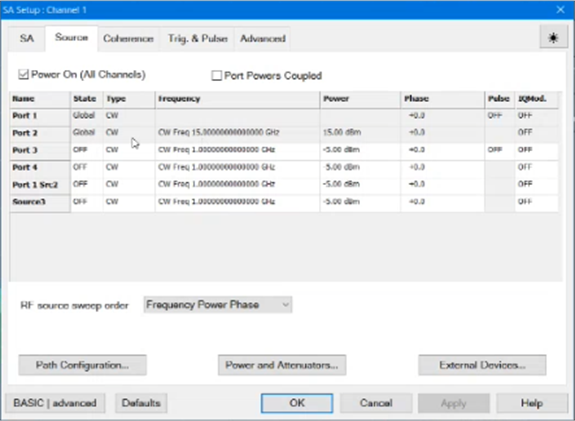

  9. Turn ON coherence mode: 
     1. Select the Coherence tab.
     2. Set the Waveform Period to 2.5 µs. The 2.5 µs value comes from the IQ signal parameters: 10 ns/symbol and 250 symbols gives a signal repetition rate of 2.5 µs. It is mandatory that the test signal is repetitive and the repetition rate is accurately known to enable the coherent mode. Note that there is no need for modulation trigger due to the repetitive and coherent VNA-SA acquisition approach.
     3. Select Discard the non-tones.
     4. Click the Apply button.
     5. Click the Auto Fill IQ settings button.
     6. Click the Apply button. Note that phase computation and phase stitching have been turned ON.
  10. Select the Processing tab then set it up as follows:  
  
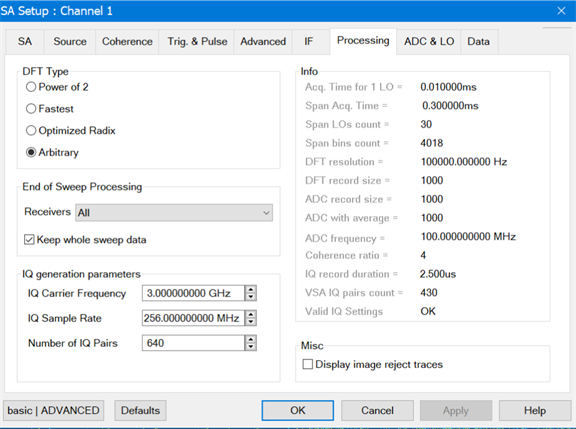  
The End of Sweep Processing Receivers selection determines which receiver data
will be kept in memory for further whole sweep processing. In this case, the
a1 and b4 receiver data will be kept in memory for later transfer to the VSA.
The "All" selection is the default and is also acceptable. Under Info, Valid
IQ Settings must display OK indicating that the IQ settings are set properly.
[Learn more about the Processing
functions](../Spectrum_Analyzer.htm#Processing_Dialog).

  11. Select the Advanced tab to set up the Dual-Band Configuration as follows, then click Apply. Note that the dual band configuration will override the IQ Carrier Frequency setting with the dual band Center values.  
  
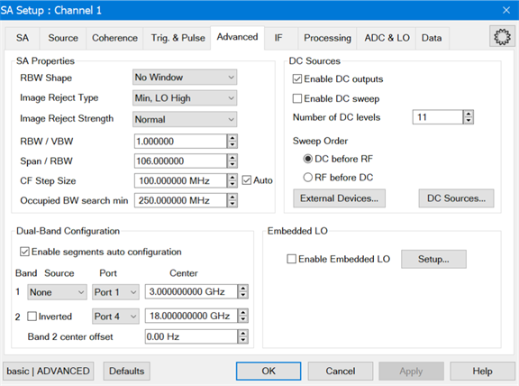

  12. Select the SA tab, then select X-Axis Point Spacing under Sweep Type to get a dual-band display similar to the following:  
  
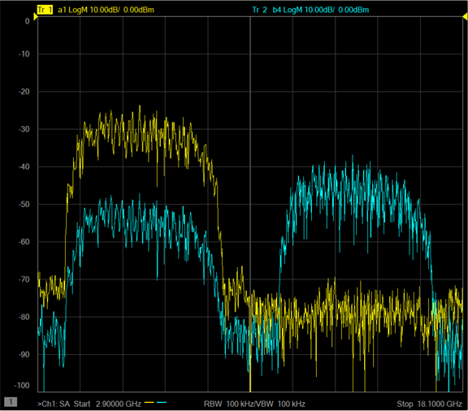

  13. Press Math > VSA > Connect VSA to connect the VNA to the VSA.
  14. The VSA 89600 application will open automatically (may take 25 seconds).

  15. When the link between the VNA and the VSA 89600 is established, the waveforms should be displayed in the VSA 89600 as follows:  
  
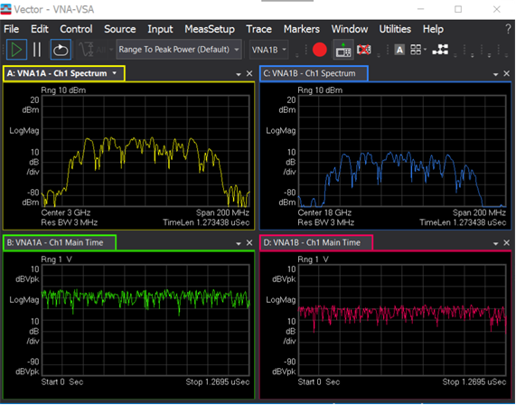

  16. If the VSA window is behind the VNA GUI, press Math > VSA > Show VSA to bring the VSA window to the front.

  17. In the VSA application, the ResBW at MeasSetup tab can be reduced to get identical frequency domain displays between the VNA and VSA. Also, the VNA vector averaging can be increased to improve the noise floor.
  18. In the VSA 89600 application, demodulate the input and output signals as follows: 
     1. Select the measurement window corresponding to the input or the output of the mixer.
     2. Select MeasSetup > Measurement Type > General Purpose > Digital Demod.
     3. Select MeasSetup > Digital Demod Properties....
     4. In the Digital Demod Properties dialog, select the down arrow under Format, then select 16 QAM.
     5. In the Digital Demod Properties dialog in the Format tab, make sure you adjust the Result Length to 250 symbols, as it is the test signal length used in this example, and the filter alpha in the Filter tab to 0.5 (as it is the example test signal setting).
     6. For further optimization, such as Equalization, refer to the VSA 89600 online help.
     7. The following is an example of the VSA setup for this mixer test with demodulation at the input and at the output of the DUT:  
  
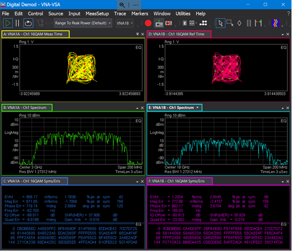

