# Configuring Distortion Measurements

The Modulation Distortion dialog settings are contained within four tabs:
Sweep, RF Path, Modulate, and Measure. A fifth tab called Mixer contains
settings for converter measurements (Option S93083A/B FCA required).

For convenience, the [Spectrum Analyzer](../Spectrum_Analyzer.md#SetupTab)
tabs can be displayed as follows:

  1. Right-click in a Modulation Distortion dialog.

  2. Select Show Expert Tabs (on|OFF).  
  
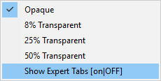

  3. The tabs are displayed next to the Modulation Distortion tabs:  
  
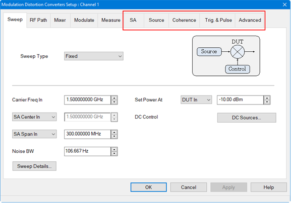

  4. To display the Spectrum Analyzer Advanced tabs, right-click again in a Modulation Distortion dialog then select Show SA Advanced (on|OFF):  
  
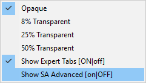

  5. The Spectrum Analyzer Advanced tabs are displayed:  
  
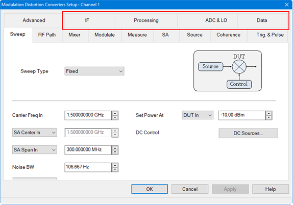

In this topic:

  * Create a Modulation Distortion Channel
  * Opening the Modulation Distortion Dialog
  * Create a Modulation Distortion Converter Channel

  * Opening the Modulation Distortion Mixer Setup Dialog

  * Sweep Tab in Dialog
  * RF Path Tab in Dialog
  * Mixer Tab in Dialog

  * Modulate Tab in Dialog
    * [Create Modulation Dialog](Create_Modulation_Files.md#Create_Modulation) (separate topic)
    * [LO Feedthu Monitor Dialog](Modulation_Distortion_Settings.md#LOFeedthuMonitordialog)

  * Measure Tab in Dialog
  * [Source Modulation Calibration](Modulation_Flatness_and_Power_Calibration.md) (separate topic)
  * X-axis Type (Modulation Distortion/Modulation Distortion Converters only)

#### See Also

  * [Displaying Distortion Parameters](Displaying_Distortion_Parameters.md)
  * [Modulation Distortion Measurement](Modulation_Distortion_Measurement.md)
  * Programming Examples: 
    * Measurement Setup
    * [Measurement Setup Converters](../../Programming/GPIB_Example_Programs/Measurement_Setup_Converters.md)

    * [Create Modulation File](../../Programming/GPIB_Example_Programs/Create_Modulation_File.md)
    * [Display Data Setup](../../Programming/GPIB_Example_Programs/Display_Data_Setup.md)
    * Source Modulation Calibration
  * [Spectrum Analyzer Settings](../Spectrum_Analyzer.md)

## Create a Modulation Distortion Channel

  1. On the VNA front panel, press Meas > S-Param > Meas Class....

  2. Select Modulation Distortion, then either:

     * OK delete the existing measurement, or

     * New Channel to create the measurement in a new channel.

  3. The Modulation Distortion dialog is displayed.

## Opening the Modulation Distortion Dialog

#### Accessing Modulation Distortion Settings  
  
---  
Using Hardkey/SoftTab/Softkey |  Using a mouse  
  
  1. Press Setup > Main > MOD Setup....

|

  1. Click Stimulus.
  2. Select MOD Setup....

  
  
## Create a Modulation Distortion Converter Channel

  1. On the VNA front panel, press Meas > S-Param > Meas Class....

  2. Select Modulation Distortion Converters, then either:

     * OK delete the existing measurement, or

     * New Channel to create the measurement in a new channel.

  3. The Modulation Distortion Mixer Setup dialog is displayed.

## Opening the Modulation Distortion Mixer Setup Dialog

#### Accessing Modulation Distortion Mixer Settings  
  
---  
Using Hardkey/SoftTab/Softkey |  Using a mouse  
  
  1. Press Setup > Main > MODX Setup....

|

  1. Click Stimulus.
  2. Select MODX Setup....

  
  
Sweep Tab in dialog help |    
---|---  
Fixed and Power Sweep Type Dialogs for Modulation Distortion Measurement Class
(MOD) 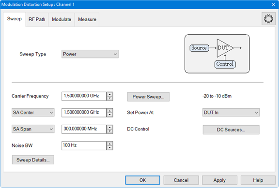 Fixed and
Power Sweep Type Dialogs for Modulation Distortion Converters Measurement
Class (MODX)
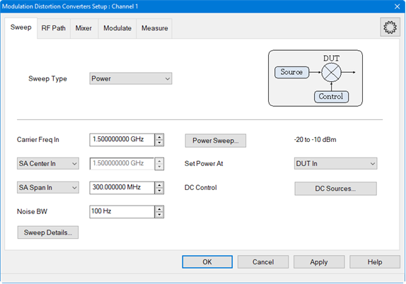 Sweep Type
Fixed - Fixed sweep measures a modulated signal with a fixed carrier LO
frequency and power level. Power \- Power sweep sweeps the total power of the
modulated signal at multiple power levels defined by a start/stop power level.
This power may be defined at the input or output of the DUT, depending on the
leveling defined in the RF Path tab. The current start/stop power settings are
displayed next to the Power Sweep button. Carrier Frequency - (Modulation
Distortion only) Sets the carrier LO frequency.  Carrier Freq In \-
(Modulation Distortion Converters only) Sets the carrier frequency at the
input of the mixer. SA Center/SA Start \- (Modulation Distortion only) Sets
the Spectrum Analyzer display center or start frequency. SA Center In/SA Start
In \- (Modulation Distortion Converters only) Displays the Spectrum Analyzer
center or start frequency at the input of the mixer. SA Span/SA Stop \-
(Modulation Distortion only) Sets the Spectrum Analyzer display span or stop
frequency. Note: The SA displayed frequency range is limited to the
measurement band frequencies  SA Span In \- (Modulation Distortion Converters
only) Sets the Spectrum Analyzer span or stop frequency at the input of the
mixer. SA Stop In \- (Modulation Distortion Converters only) Displays the
Spectrum Analyzer span or stop frequency at the input of the mixer. Noise BW
\- Noise BW is equal to the Resolution BW divided by the Vector Average
factor. If a Power Sweep Type of List is selected and Custom Noise BW values
are set, the word Swept is displayed in the Noise BW box. [Learn
more](../../S2_Opt/Trce_Noise.htm#Resolution_Bandwidth). Set Power At \- Sets
the power level used for the distortion test. The menu provides the following
selections: DUT In - Sets the nominal carrier power level at the input port.
DUT Out - Sets the nominal carrier power level such that source power +
nominal DUT Gain = requested power level. Receiver - a1 - Uses the input
port’s reference receiver to level the input power to the desired value. If
receiver power corrections are on, the input power will be set at the DUT
input reference plane. Rcvr Leveling... - Brings up the Receiver Leveling
dialog for more complex setups. Buttons Power Sweep... button - Accesses the
Power Sweep dialog. Power Sweep Type - Ramp Ramp \- Selects a ramp type power
sweep and displays the following information:
 Start Power At \-
Sets the start power value for the power sweep. Stop Power At \- Sets the stop
power value for the power sweep. Number of Powers \- Sets the number of power
points to measure. Noise BW \- This is the same value as shown in the Sweep
tab dialog. Auto-Increase NBW at High Powers \- The Noise BW setting will be
used for the minimum power level. As the power level increases, the Noise BW
will increase automatically. This results in faster measurements and ensures
that the noise error is approximately the same for each power level. Power
Sweep Type - List List \- Selects a list of power values to define a power
sweep and displays the following information:
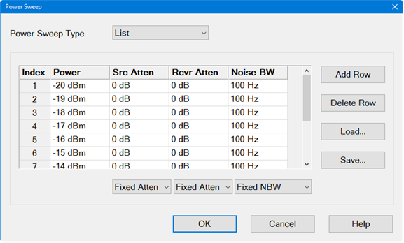 Index \- Each
index entry defines a power level, source and receiver attenuation, and noise
bandwidth for the power sweep. Power \- Sets the power level for the specific
index number. Src Atten - Fixed Atten \- Setting one attenuation value in the
column sets them all to the same value. Custom \- Settings for each index may
be different. Note that the Src Atten entry on the RF Path tab will indicate
Swept under this condition. Rcvr Atten - Fixed Atten \- Setting one
attenuation value in the column sets them all to the same value. Custom \-
Settings for each index may be different. Note that the Rcvr Atten entry on
the RF Path tab will indicate Swept under this condition. Noise BW \- This is
the same value as shown in the Sweep tab dialog if the Noise BW column is set
to One NBW or Auto-Increase. Fixed NBW \- Setting one noise bandwidth value in
the column sets them all to the same value. Custom \- Settings for each index
may be different. Note that the Noise BW entry on the Sweep tab will indicate
Swept under this condition and will be grayed-out. Auto-Increase \- The Noise
BW setting will be used for the minimum power level. As the power level
increases, the Noise BW will increase automatically. This results in faster
measurements and ensures that the noise error is approximately the same for
each power level. Add Row button - Adds a row after the currently selected row
in the table. Delete Row button - Deletes the currently selected row. Load...
button - Loads a .csv file into the table. Save... button - Saves the table to
a .csv file. DC Sources... button - Accesses the standard dialog for
controlling power supplies. [Learn more](../../S1_Settings/DC_Control.md).
Sweep Details... button - Accesses the following dialog: Dialog for Modulation
Distortion Converters Measurement Class
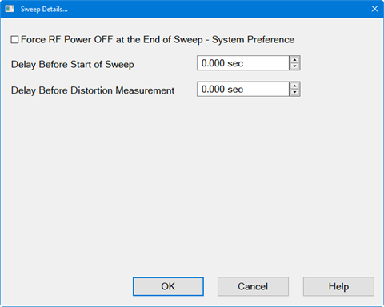 Force RF
Power OFF at the End of Sweep - System Preference \- If enabled, RF power is
turned off at the end of a sweep. Note: This setting is a system-wide
preference; the state of this setting will affect all measurement channels and
the state will not change if the VNA is preset or restarted. Delay Before
Start of Sweep \- Same as [Sweep
Delay](../../S1_Settings/Sweep.htm#SweepSetupDiag) in a standard channel.
Delay Before Distortion Measurement \- Adds delay after the linear S-parameter
sweep and before the distortion measurement to allow the RF source to settle.
Apply button - Applies any changes to the settings in this dialog.

####  
  
RF Path Tab in dialog help |    
---|---  
This dialog allows measurement set up on a 2-port DUT. Dialog for Modulation
Distortion Measurement Class (MOD)
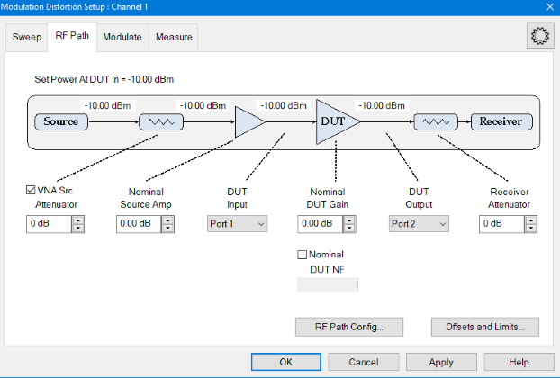 Dialog for Modulation
Distortion Converters Measurement Class (MODX)
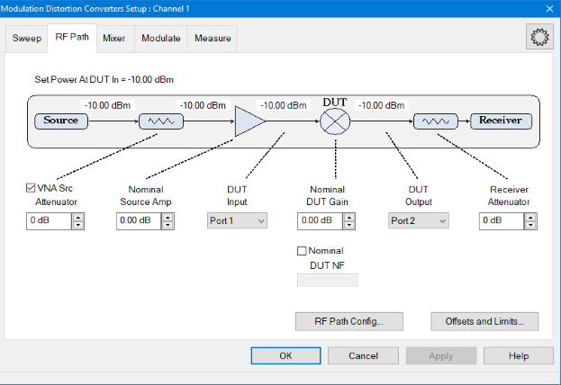 Set Power At DUT
In \- Displays the DUT power set in the Sweep tab. Include \- When selected
(default), the external modulated source passes through the attenuator of the
specified PNA source and the attenuator setting is used to calculate the power
levels. If a Power Sweep Type of List is selected and Custom Src Atten values
are set, the word Swept is displayed in the VNA Source Attenuator box. Nominal
Source Amp \- Sets the nominal gain (positive number) from an amplifier or
loss (negative number) due to an attenuation, cable loss, etc. This value is
used by the Set Power At function, receiver leveling, and calibration. This
value is equal to the [Power
Offset](../../System/Power_Limit_and_Power_Offset.htm#Offset) setting found on
the Offsets and Limits dialog. Correction ON/Src Amp = \- If Source Correction
in the Modulate tab is set to Power or Mod & Pwr, then the Correction ON and
corrected Src Amp = labels will be displayed below Nominal Source Amp. If
power is set at the DUT output, then (Corrected Power Offset) = (Corrected
Source Amp) + (Nominal DUT Gain). If power is set at the DUT input, then
(Corrected Power Offset) = (Corrected Source Amp). DUT Input \- Sets the VNA
port number that is connected to the DUT input. Nominal DUT Gain \- Sets the
nominal DUT gain. This value is used by Set Power At DUT Out, receiver
leveling, and calibration. This function is also displayed on the calibration
dialog. DUT Output \- Sets the VNA port number that is connected to the DUT
output. Nominal DUT NF \- Sets the nominal DUT noise figure. The default is 0
dB. If checked, the noise will be added back into all measured data after
averaging, so that the measured data includes the DUT noise. This value is
used by the EVM, ACP and NPR measurement. It will also affect the displayed
data and the IQ data which may be exported to the VSA application. Receiver
Attenuator \- Sets the VNA's internal receiver attenuator for the currently
selected output port. Buttons RF Path Config... button \- Accesses the [RF
Path Configuration](../../S1_Settings/Path_Configurator.htm) dialog. Offsets
and Limits... button - Accesses the [Offsets and
Limits](../../System/Power_Limit_and_Power_Offset.htm#GPLDiag) dialog. Apply
button - Applies any changes to the settings in this dialog.  
Mixer Tab in dialog help |    
---|---  
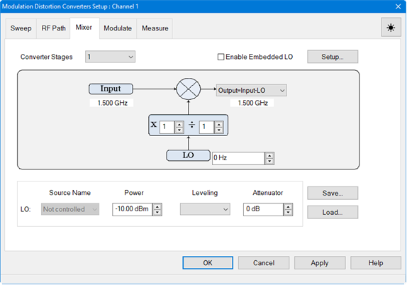 Converter Stages - Selects
between 1- or 2-stage mixer configuration. Enable Embedded LO \- Check to
enable measurements of mixers that have a fixed LO inside the DUT. Note:
Embedded LO does not support signals with a tone spacing of less than 1 kHz.
Setup... \- Opens the Embedded LO dialog.
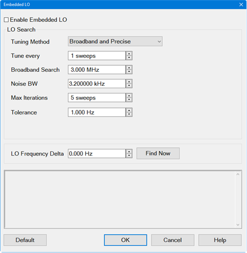 Enable Embedded
LO \- Check to enable measurements of mixers that have a fixed LO inside the
DUT. Tuning Method \- These settings determine the amount of time spent versus
the degree of accuracy to which the LO Frequency is measured. Accuracy is
compromised when noise starts to appear on the measurement trace. Broadband
and Precise Does the entire tuning process for each background sweep. Precise
Only Does NOT perform broadband tuning on each sweep. Use this setting when
the embedded LO is stable. The signal (after broadband) must be within ½ the
tuning IFBW. If the signal will always be within ½ the IFBW, broadband tuning
is not needed. Most satellite components are within 3 kHz absolute so might
not need broadband tuning. Disable Tuning Only the previously measured LO
Frequency Delta is applied to the reference mixer LO and VNA receivers. Tune
every \- Set the interval at which tuning is performed before a measurement
sweep. 'Tune every 3 sweeps' means that every third measurement sweep is
preceded by tuning sweeps. If the embedded LO drifts, or if regularly changing
DUTs, use 'Tune every 1 sweep'. Broadband Search \- Set the frequency span
over which to measure the embedded LO frequency. Noise BW \- Noise Bandwidth
used for Broadband and Precise tuning sweeps. This sets the resolution in the
Broadband sweeps. Max Iterations \- The maximum number of Precise sweeps to
make. When this number is reached, the final measurement is used. Tolerance \-
When two consecutive Precise measurements are made within this value, the
final measurement is used. If this is not achieved within the Max Iterations
value, then the last measurement is used. This is the best of the 'Tunings
settings' to change to improve accuracy. LO Frequency Delta \- The absolute
difference between the measured embedded LO frequency and the LO setting that
is entered in the Mixer Tab dialog. Find Now \- The VNA finds and measures the
actual LO frequency using the current dialog settings. This data is displayed
in the Status box. Default \- Resets the LO Frequency Delta and Tuning
parameters to their default settings. Input - Input frequency defined on the
Sweep tab. IF - Intermediate frequency between stage 1 and stage 2 for a
2-stage mixer configuration calculated from the mixer equation selection.
Choose from the following mixer equations: IF=Input+LO1 IF=Input-LO1
IF=LO1-Input Output - Mixer output frequency calculated from the mixer
equation selection. Choose from the following mixer equations for a 1-stage
mixer configuration: Output=Input+LO Output=Input-LO Output=LO-Input Choose
from the following mixer equations for a 2-stage mixer configuration:
Output=IF+LO2 Output=IF-LO2 Output=LO2-IF X \- The combination of numerator /
denominator forms a fractional value that is multiplied by the input and LO
frequency ranges. [Learn more](../MixerConverter_Setup.md#Multplier).
LO/LO1/LO2 \- Sets the LO frequency. Source Name - Select Not Controlled to
allow an external source to provide a Fixed LO Frequency at all times.
Otherwise, select an internal VNA source or External source to be used as the
LO. Learn how to [Configure an External
Device](../../System/Configure_an_External_Device.htm) (Source). Power - Sets
the LO power. Leveling Open Loop - No ALC or receiver leveling. No leveling is
used in setting the power. Internal - ALC leveling. Power level within an
attenuator setting is limited to the ALC range. Attenuator - Selects the
receiver attenuation. Save... button - Saves the mixer configuration to a .mxr
or .mxrx file. Load... button - Loads an existing mixer configuration file.
Apply button - Applies any changes to the settings in this dialog.  
  
Modulate Tab in dialog help |    
---|---  
Dialog for Modulation Distortion Measurement Class (MOD)
 Dialog for Modulation
Distortion Converters Measurement Class (MODX)
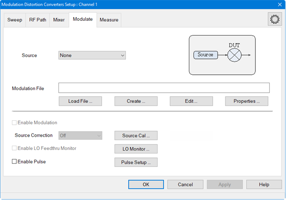 Source \-
Selects sources that have been defined in the [External Device
Configuration](../../System/Configure_an_External_Device.htm#ExtDevConfig)
dialog or selects Source3 (requires Option S93072B, Option XSB, Option
S93070xB or Sx090A/B, and either Option 422 or Option 423). Add Source... \-
Adds a new external source using the [External Device
Configuration](../../System/Configure_an_External_Device.htm#ExtDevConfig)
dialog.  Source3 \- With Option S93072B Arbitrary Waveform Generation on XSB
Port (requires Option S93072B, Option XSB, Option S93070xB or Sx090A/B, and
either Option 422 or Option 423), an internal third RF source can be selected
from the SRC3 connector on the rear panel. Refer to [Set Up Source3 Modulation
Source - Option S93072B](Source3_Modulation_Source_-_Option_S93072B.htm) for
important setup information. Note: If the source selection is changed, and if
a modulation file is selected and Enable Modulation is checked, then the
modulation file will be automatically loaded into the source. Modulation File
\- Displays the currently loaded modulation file. Supported file types include
*.mdx, *.csv, and *.wfm. After selecting a modulation file, the following
dialog is displayed to allow you to Autofill the measurement bands:
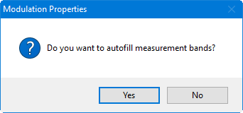 Note: Once
a source is selected and a file is selected, the file will be automatically
loaded into the source and the Enable Modulation box is checked, Enable
Modulation \- Check to enable modulation. Source Correction Off \- Do not
include power or modulation calibration in source correction. Modulation \-
Include modulation calibration in source correction. This includes the LO
Feedthru correction. Power \- Include power calibration in source correction.
Mod & Pwr \- Include power and modulation calibration in source correction.
This includes the LO Feedthru correction. Note: If no correction exists in the
modulation file, then the Source Correction selection is grayed-out and
disabled. Enable LO Feedthru Monitor \- Check to enable [LO Feedthru
monitor](Modulation_Distortion_Settings.htm#LOFeedthuMonitordialog). Enable
Pulse \- Check to enable standard pulse modulation. Buttons Load File...
button - Loads an existing modulation file. Supported file types include
*.mdx, *.csv, and *.wfm.  Create... button - Set up a modulation file. See
[Create Modulation](Create_Modulation_Files.md#Create_Modulation) dialog
description. Edit... button - Edit the currently loaded modulation file. See
[Create Modulation](Create_Modulation_Files.md#Create_Modulation) dialog
description. Properties... button Waveform Tab Displays the properties of the
currently active modulation file, which was selected in the Modulation
settings dialog. This information cannot be edited.
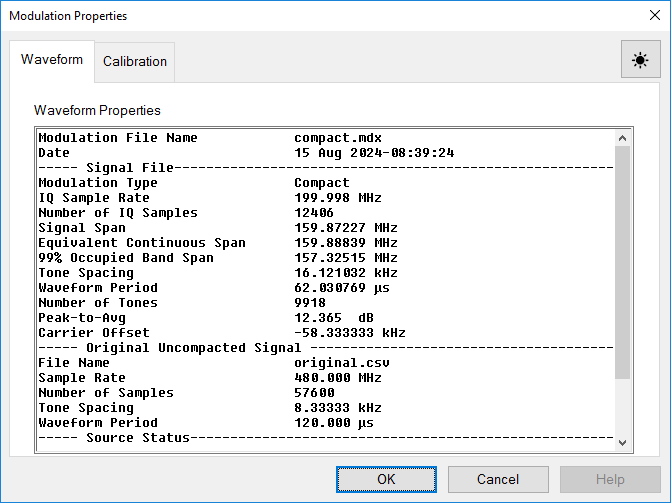
Calibration Tab The Calibration tab displays the calibration files and their
properties stored in the .mdx file. Each calibration displayed in the list is
for one power level. Calibrations may have been performed on multiple power
levels during a single calibration. In this case, multiple calibrations will
be saved in the .mdx file. Any of these calibrations can be deleted by
selecting the calibration name then clicking on the Delete Cal button.  Source
Cal... button \- Accesses the [Modulation Cal -
Setup](Modulation_Flatness_and_Power_Calibration.htm#Modulation_Cal_Settings_Dialogs)
dialog for performing source modulation calibration.
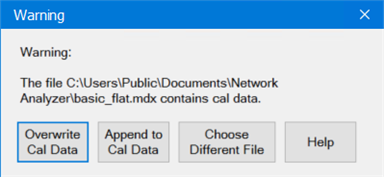 LO Monitor...
button - See LO Feedthru Monitor dialog help below. Pulse Setup... button -
Opens the Pulse Setup dialog to set up a pulse measurement. Create DPD...
-Opens the [DPD Wizard](Create_DPD.md) for setting up digital predistortion.
The DPD is now supported in Modulation Distortion Measurement Class (MOD) and
Modulation Distortion Converters Measurement Class (MODX). When the OK button
is clicked, the following warning is displayed if a source has not been added
or the Modulation file name has not been specified:
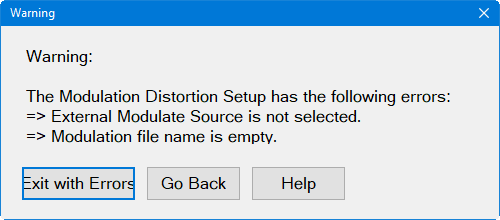 Click Exit with
Errors to exit the setup dialogs with the errors or click Go Back to return to
the setup dialogs to fix the error. Apply button - Applies any changes to the
settings in this dialog.  
  
LO Feedthu Monitor dialog help |   
---|---  
The SA multitone NPR and the Modulation Distortion measurement use a vector
signal source. It may have LO feedthrough leakage and the level may drift
after calibration due to hardware imperfection. The LO feedthru calibration,
as a part of source modulation calibration, reduces the LO feedthru by
adjusting I/Q offset voltage. The LO Feedthru Monitor feature notifies you
when you should take the calibration again. You need to setup them depends on
your measurement requirements.

  * Monitoring receiver: It’ll be a reference receiver in most cases.
  * Tolerance: Relative to Band Power (in dBc), Relative to Average Tone Power (in dBc) or Absolute level (dBm).

The firmware checks the LO feedthru level on every measurement. Exceeding the
tolerance make a warning message of "LO Feedthru is out of tolerance on
channel <n>. Perform Source Modulation Cal > LO Feedthru Calibration".
Supported measurements are Modulation Distortion measurements (MOD, MODX) and
SA multitone NPR measurement. Non-multitone SA is not supported.
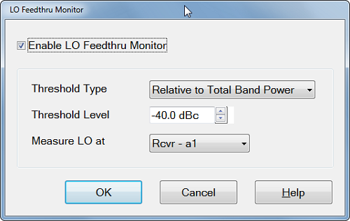 Enable LO Feedthru Monitor \-
Check to enable LO Feedthru Monitor. LO feedthru level is checked on every
measurement. Note: Enable LO Feedthru Monitor is grayed out for internal
sources. Threshold Type -

  * Relative to Band Power (in dBc): Compare with the band power.
  * Relative to Average Tone Power (in dBc): Compare with the average tone power.
  * Absolute level (dBm) - Check th LO feedthru absolute power level.

Threshold Level \- Set the threshold level. Measure LO at \- Select th port to
monitor th LO feedthu signal. Select the reference receiver in most cases.  
  
Measure Tab in dialog help |    
---|---  
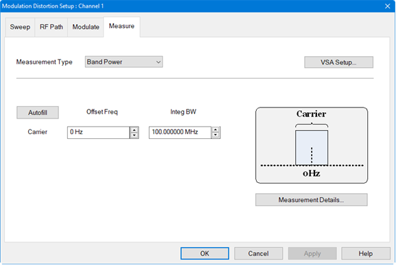 Measurement Type \- Selects the measurement type: ACP \- Performs ACP measurement. ACP+EVM \- Performs both ACP and EVM measurements. Band Power \- Measures total power within a specified frequency span. EVM \- Performs EVM measurement. NPR \- Performs NPR measurement. Multi-Band \- Displays the full Measurement Band Table. 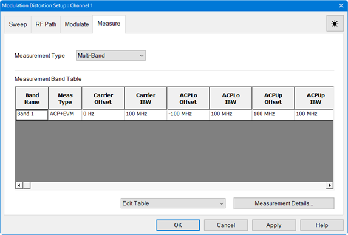 Edit Table Append Band \- Adds a new band after the row with a currently selected active cell. Each band is assigned to a measurement type. Distortion parameters are calculated over the measurement bands. Delete Band \- Deletes the row with a currently selected active cell. Edit Band Name \- Change the Band Name. Autofill Current Table from Mod File \- Automatically sets up appropriate bands from the currently active modulation file loaded in the source. Create New Table from Mod File \- Automatically deletes the current table, then sets up appropriate bands for making measurements with information from the currently active modulation file loaded in the source. Band Name -Right-click in the Band Name field to display a keyboard for editing the name. 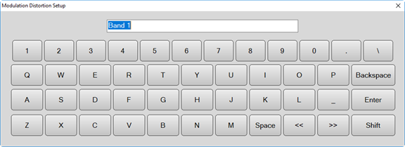 Carrier Offset Freq \- Offsets the Carrier integration bandwidth relative to the Carrier LO used to generate the modulation signal. Use the up/down arrows or double-click in the field to display the keypad for entering frequency. Carrier Integ BW \- Sets the Carrier integration bandwidth for the distortion measurement. The IBW is used to determine total signal power within a specified frequency span. For example, to calculate the total power of a signal composed of 100 tones spaced 1 MHz apart over a 100 MHz span, the signal power would be integrated over an IBW of 100 MHz. Notch Offset Freq \- (NPR measurement only) Sets the notch center relative to the carrier LO used to generate the modulation signal. Use the up/down arrows or double-click in the field to display the keypad for entering frequency. Notch Integ BW \- (NPR measurements only) Sets the integration bandwidth of the NPR notch measurement. The IBW is used to determine total signal power within a specified frequency span. For example, to calculate the total power of a notch composed of 100 tones spaced 1 MHz apart over a 100 MHz span, the notch power would be integrated over an IBW of 100 MHz. ACPLo Offset Freq \- (ACP measurements only) Offsets the lower ACP integration bandwidth relative to the LO used to generate the modulated signal. Use the up/down arrows or double-click in the field to display the keypad for entering frequency. ACPLo Integ BW \- (ACP measurements only) Sets the integration bandwidth of the lower ACP measurement. The IBW is used to determine total signal power within a specified frequency span. For example, to calculate the total power of a signal composed of 100 tones spaced 1 MHz apart over a 100 MHz span, the signal power would be integrated over an IBW of 100 MHz. ACPUp Offset Freq \- (ACP measurements only) Offsets the upper ACP integration bandwidth relative to the LO used to generate the modulated signal. Use the up/down arrows or double-click in the field to display the keypad for entering frequency. ACPUp Integ BW \- (ACP measurements only) Sets the integration bandwidth of the upper ACP measurement. The IBW is used to determine total signal power within a specified frequency span. For example, to calculate the total power of a signal composed of 100 tones spaced 1 MHz apart over a 100 MHz span, the signal power would be integrated over an IBW of 100 MHz. Buttons VSA Setup... button - Accesses the VSA 89600 Link Setup dialog for connecting the VNA to the VSA. Refer to the [Link VNA to 89600 VSA](Link_VNA_to_89600_VSA.md) topic for information. Autofill -Automatically fills in the measurement settings for all bands from the currently active modulation file loaded in the source: |  Modulation File Band(s) |  Currently Defined Measurement Band(s) |  Autofill Settings  
---|---|---  
Single-band |  Single-band |  Use single-band Modulation File  
Single-band |  Multi-band |  All bands set using single-band Modulation File  
Multi-band |  Multi-band but with fewer or same number of bands than Modulation File |  First band set using first Modulation File band Second band set using second Modulation File band, etc.  
Multi-band |  Multi-band but with more bands than Modulation File |  First band set using first Modulation File band Second band set using second Modulation File band, etc. When bands exceed number of bands in Modulation File, set them all to last Modulation File band settings  
  
Measurement Details... button - Accesses the Measurement Details dialog:

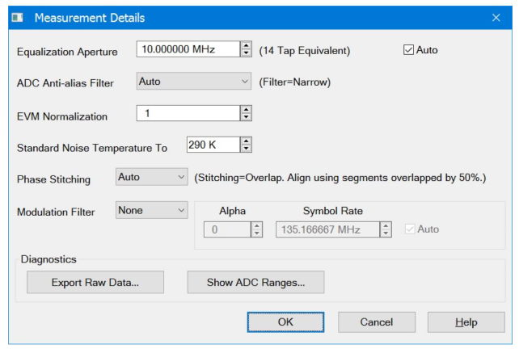

Equalization Aperture \- Sets the frequency span window used for modeling the
DUT's gain and distortion.

Auto \- Check to automatically set Distortion Aperture to window size.

ADC Anti-alias Filter \- Selects between auto and wide IF filter anti-aliasing
path.

Auto - Check to automatically set the ADC Filter setting based on the ADC
Sampling Frequency. If the currently selected modulation waveform was created
with Nyquist Rejection = OFF, then the VNA will measure the signal using the
Narrow anti-alias filter in the receiver.

Wide - Selects the ADC 38 MHz IF filter path.

Narrow - Selects the ADC 11 MHz IF filter path. A warning message will appear
if the Narrow IF filter path is selected and the Resolution Bandwidth is > 1
MHz.

EVM Normalization \- Identifies the scaling factor applied to the EVM
measurements. Enter a value between 0.1 and 1.0. The default is 1.0.

Standard Noise Temperature To - Standard noise temperature in Kelvin used to
compute Noise Figure. The default value is 290K.

Phase Stitching- Phase stiching is necessary for single-ended measurements and
mixer measurements. It is not required for non-converting DUTs where the
output is compared to the input at the same frequency (e.g. DistEVM21) The
combo-box defines how phase stitching is implemented. There are four choices
(Auto, None, Overlap, Timestamp)****

**Auto** \- Default mode. Automatically selects between None, Overlap and
Timestamp depending on the waveform and the ability of the VNA to perform
stitching. The algorithm is: If the VNA can Timestamp Stitch and the
OBW>=2GHz, then use "Timestamp", else if the VNA can Overlap Stitch then use
"Overlap" else use "None"

**None** \- In this mode there is amplitude stitching, but no phase stitching.
This works fine for relative measurements such as DistEVM21, which do not need
stitching to measure phase.

**Overlap** \- This measures 50% overlapping segments of frequency-domain data
to determine the phase between measured segments.

**Timestamp** \- This moves the LO coherently to determine the phase between
measured frequency segments. This method also overlaps segments by 75% to
improve overall results by averaging the noise.

Modulation Filter - (EVM and ACP measurements only) Sets the measurement
filter to either None (default) or RRC (root-raised-cosine filter).

Alpha \- Sets Alpha factor of the filter.

Symbol Rate \- Sets the Symbol Rate of the filter. If Auto is selected, the
symbol rate from the file is used. If no Symbol Rate is indicated in the file,
then the Symbol Rate will be approximated from the bandwidth of the signal.

**Diagnostics**

**Export Raw Data** button - Opens dialog similar to the[ "Data "
tab](../Spectrum_Analyzer.htm#Data_Dialog) displayed in the[ "SA Setup"
dialog](../Spectrum_Analyzer.htm#SetupTab).

**Show ADC Ranges** button - Opens dialog same as displayed in the ["SA Setup"
dialog](../Spectrum_Analyzer.htm#SetupTab), on the ["ADC & LO"
tab](../Spectrum_Analyzer.htm#ADC_LO_Dialog), from the ["Show ADC
Ranges..."](../Spectrum_Analyzer.htm#Show_ADC_ranges) button.

**OK** button - Applies any changes to the settings in this dialog.  
  
## X-axis Type (Modulation Distortion/Modulation Distortion Converters only)

#### AccessingX-axis Type Settings  
  
---  
Using Hardkey/SoftTab/Softkey |  Using a mouse  
  
  1. Set up a Modulation Distortion Fixed or Power sweep measurement (see above).
  2. Press Trace > Trace 1-7 > New Traces....
  3. Click on the Distortion tab then select a measurement parameter.
  4. Press Sweep > Main > X-axis Type....

|

  1. Set up a Modulation Distortion Fixed or Power sweep measurement (see above).
  2. Click Instrument.
  3. Select Trace.
  4. Select New Traces....
  5. Click on the Distortion tab then select a measurement parameter.
  6. Click Stimulus.
  7. Select Sweep.
  8. Select X-axis Type....

  
  
X-axis Type dialog help |    
---|---  
The X-axis Type dialog is used to set the displayed x-axis annotation for a
selected trace in Modulation Distortion or Modulation Distortion Converter
measurements. Dialog for Modulation Distortion Measurement Class (MOD)
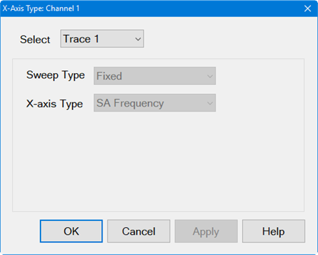
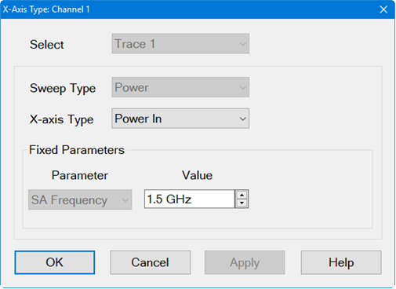 Dialog
for Modulation Distortion Converters Measurement Class (MODX)
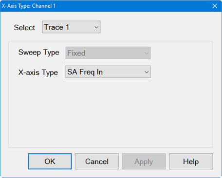
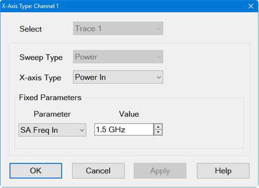 Select
Trace N \- Selects active trace. All Traces \- Selects all available traces.
Sweep Type - Based on the currently active sweep type for the selected
channel. Fixed - Fixed sweep measures a modulated signal with a fixed carrier
LO frequency and power level. The Sweep Type selection determines the
available X-axis Type. This selection can only be changed from the Sweep
dialog. Power \- Power sweep sweeps the total power of the modulated signal.
X-axis Type The X-axis Type setting defines the x-axis annotation for the
displayed spectrum analyzer data. For Modulation Distortion Converter
measurements, the x-axis annotation may be set to one of two frequency ranges:
mixer input range and mixer output range.  For example, if a mixer has an
input frequency of 1 GHz and an output frequency of 10 GHz, the X-axis Type is
set to SA Freq In, and PIn and POut are measured, PIn and POut will both
indicate they are measured at 1 GHz, even though POut is actually at 10 GHz.
If the X-axis Type is set to SA Freq Out, PIn and POut will both indicate they
are measured at 10 GHz, even though PIn is actually at 1 GHz. For Modulation
Distortion Channels (MOD) SA Frequency \- SA display showing the SA frequency
settings. Power In \- Displays input power sweep. Power Out \- Displays output
power sweep. Measured CarrIn1 \- Measured input band power. Measured CarrOut2
\- Measured output band power. For Modulation Distortion Converters Channels
(MODX) SA Freq In \- SA display showing mixer input range. SA Freq Out \- SA
display showing mixer output range. Power In \- Displays input power sweep.
Power Out \- Displays output power sweep. Measured CarrIn1 \- Measured input
band power. Measured CarrOut2 \- Measured output band power. Fixed Parameters
(Power Sweep Type only) Value - Displays the spectrum analyzer frequency set
in the Sweep dialog for a power sweep. Parameter \- (Modulation Distortion
Converters Channels only) Selects either SA Freq In to display mixer input
range or SA Freq Out to display mixer output range.

